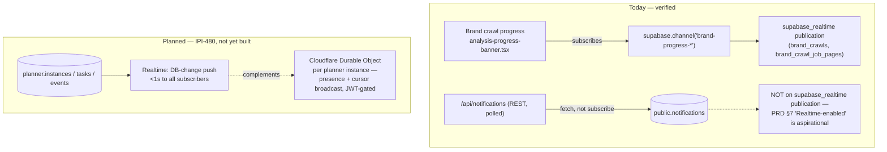

# Realtime Architecture

**Purpose:** Distinguish what Supabase Realtime actually pushes live today from the planned Planner real-time + presence layer (IPI-480), which adds Cloudflare Durable Objects alongside Realtime rather than replacing it.

## Explanation

Today, the only verified live Realtime subscription in the app is brand-crawl progress (`components/brand-hub/analysis-progress-banner.tsx` subscribes via `supabase.channel(...)`, backed by the `supabase_realtime` publication added in `20260626000003_brand_crawl_results.sql` / `20260627000000_brand_crawls_job_pages.sql`). `public.notifications` is **not** on the `supabase_realtime` publication and the app fetches it through a REST route (`/api/notifications`), not a channel — so PRD §7's "Realtime-enabled" label describes schema readiness, not a live subscription yet. IPI-480 (Planner, not yet built) is the concrete plan to add DB-change push for `planner.*` via Realtime, plus a Durable Object per planner instance for presence/cursor broadcast (sub-1s acceptance criterion, PRD §8) — Durable Objects are `⏳ Defer` platform-wide per `cf-000` but scoped in specifically for this feature.

## Diagram

## Related Linear issues

IPI-480 (Planner real-time + presence), IPI-307 (notifications table)

## Related PRD section

PRD §7 (notifications "Realtime-enabled" claim), §8 (Performance — IPI-480 <1s acceptance criterion); `roadmap.md` §5 line 96, 203 (Durable Objects)
