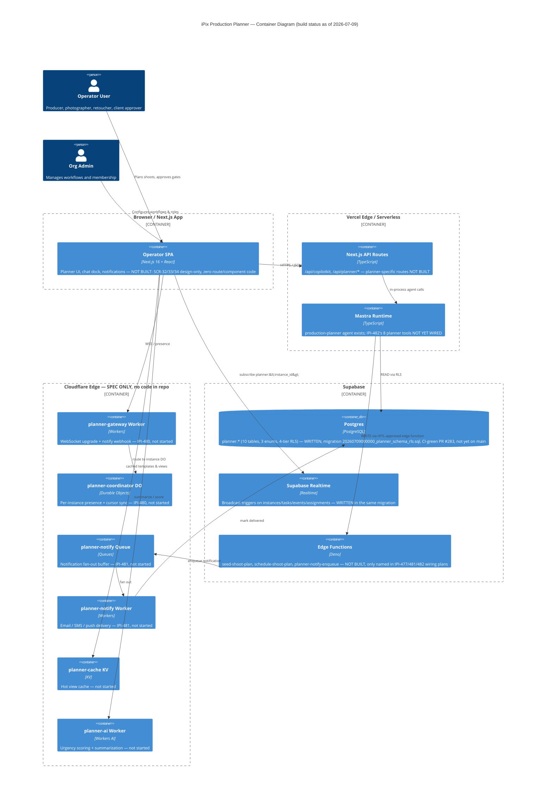

# Planner System Architecture

**Purpose:** Show every container that participates in the Planner subsystem — browser, Next.js/Mastra runtime, Cloudflare edge, and Supabase — and which of them exist today versus which are still spec-only.

## Explanation

Adapted from `Universal-design-prompt-new/plan/planner/mermaid-diagrams.md` §1 (C4 Container). The `planner.*` Postgres schema and the pure-TypeScript `PlannerEngine` (`app/src/lib/planner/engine.ts`, `types.ts`) are real, written, and CI-green in two open PRs (`IPI-476`, PRs #283/#284) — not yet merged to `main`. Every Cloudflare container in this diagram (`planner-gateway`, `planner-coordinator` DO, `planner-notify` Queue/Worker, `planner-cache` KV, `planner-ai` Worker) is `IPI-480`/`IPI-481` target-state spec only — no `cloudflare/planner-*` directory exists in the repo yet. The Operator SPA's Planner routes, and the `production-planner` Mastra agent's planner-specific tools, are also unbuilt: the agent itself exists (`id: "production-planner"`) but carries none of `IPI-482`'s 8 planner tools yet.

## Diagram

## Related Linear issues

- `IPI-476` (schema + engine — in PR, CI-green, not merged)
- `IPI-478` (Operator SPA planner routes — not started)
- `IPI-480` (planner-gateway Worker, planner-coordinator DO — not started)
- `IPI-481` (planner-notify Queue + Worker — not started)
- `IPI-482` (Mastra planner tools — not started)
- `IPI-484` (epic)

## Related PRD section

`prd.md` §6.7 (Planner target-state spec) and §7 (`planner.*` schema status)
