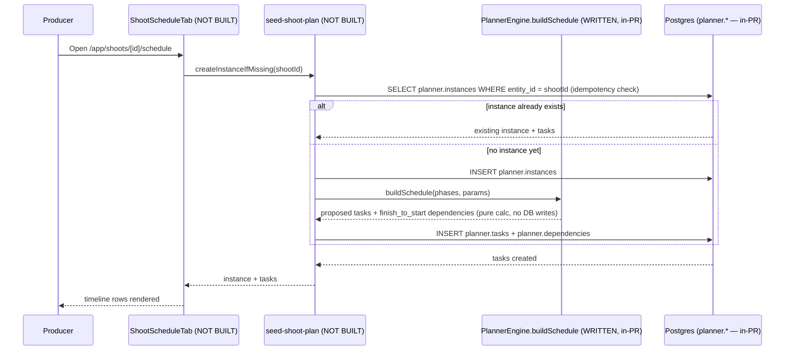
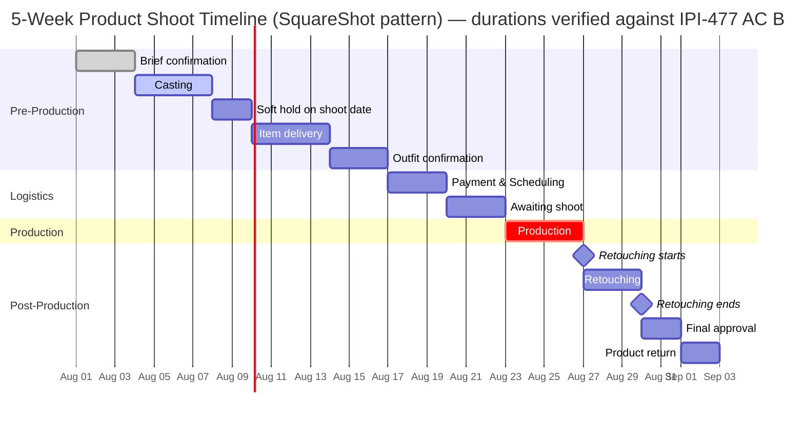
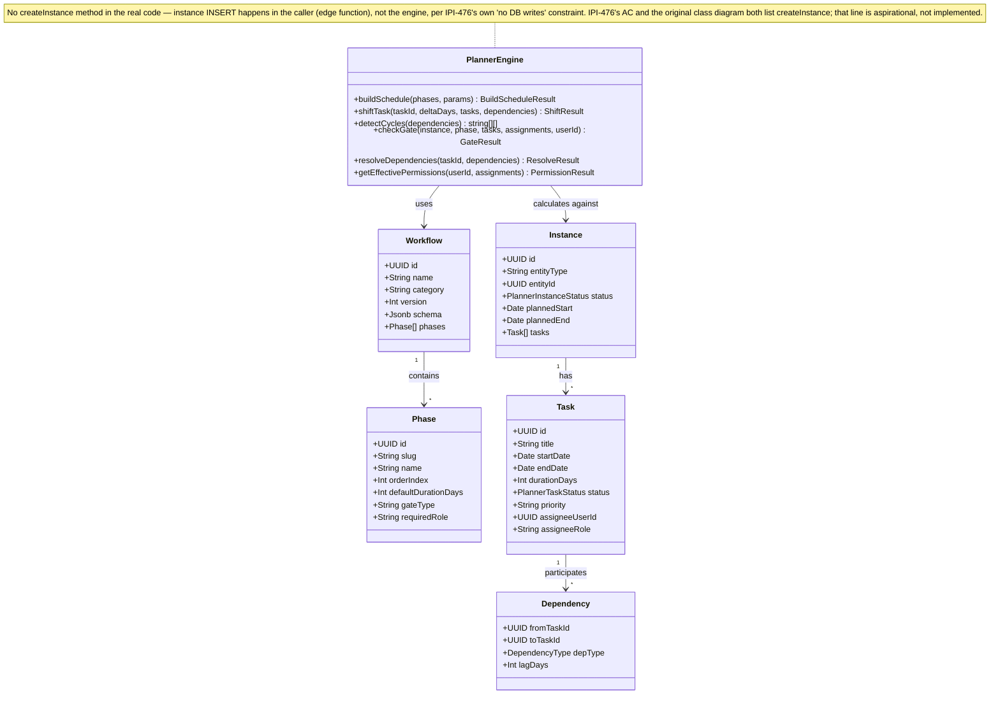

# Planner Template Engine — Workflow → Schedule Generation

**Purpose:** Show how a workflow template (e.g. "5-Week Product Shoot") turns into a concrete instance's phases/tasks, and the real shape of the `PlannerEngine` class that does the calculation.

## Explanation

Backend only — `app/src/lib/planner/engine.ts` and `types.ts` already exist in the working tree (matching `IPI-476`'s open PR #284) and were read directly to verify method signatures. The class diagram below is corrected against that real code, not just the design-time spec: `PlannerEngine` has no `createInstance` method — instance creation is a DB `INSERT` (out of scope for a pure, no-DB-write engine per `IPI-476`'s own constraint), so it must live in the caller (an edge function), not the engine. The Gantt chart's phase durations are verified against `IPI-477`'s acceptance criterion B and match exactly. No UI renders any of this yet (`IPI-478` not started).

## Diagram

## Related Linear issues

- `IPI-476` (engine core — in PR, verified against real `engine.ts`/`types.ts`)
- `IPI-477` (5-Week Product Shoot template — durations verified exact match)

## Related PRD section

`prd.md` §6.7 (acceptance criteria table, `IPI-476`/`IPI-477` rows) and §7 (`planner.*` schema)
