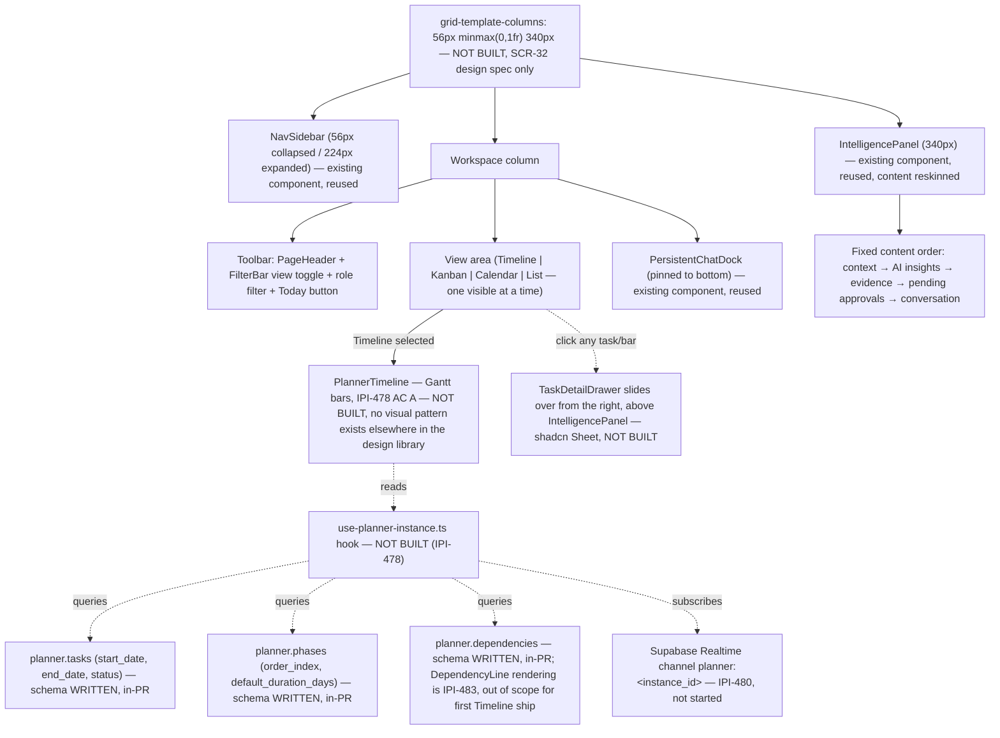

# Planner Timeline — Workspace Layout & Data Flow

**Purpose:** Show the Planner Workspace's 3-panel shell, where the Timeline view sits inside it, and which `planner.*` tables feed it.

## Explanation

Adapted from `Universal-design-prompt-new/plan/design-prompts/diagrams.md` §4 ("Planner Workspace layout"). This is **design-only** — `SCR-32-planner-workspace.md` is a Claude Design prompt; no route, component, or hook exists yet (`app/src/components/planner/`, `app/src/app/(operator)/app/planner/` are both absent from the repo, confirmed by directory search). `IPI-478`'s technical notes name the data source (`use-planner-instance.ts` hook reading `planner.tasks`, `planner.phases`, `planner.dependencies` with a Realtime subscription) even though that hook doesn't exist yet either — added here so the layout diagram also documents where its data will come from once built.

## Diagram

## Related Linear issues

- `IPI-478` (Hybrid timeline/kanban/calendar UI shell — not started; this diagram is its target-state layout)
- `IPI-480` (Realtime subscription the hook will use — not started)
- `IPI-483` (DependencyLine connectors on the Timeline — out of scope for the first ship)

## Related PRD section

`prd.md` §6.7 (target routes: `/app/planner/[instanceId]`, `SCR-32`)
