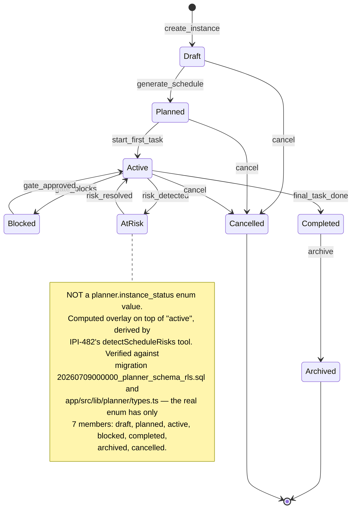

# Planner Instance State Machine

**Purpose:** Show the lifecycle states a `planner.instances` row moves through, and which of those states are real database values versus computed UI overlays.

## Explanation

Adapted from `Universal-design-prompt-new/plan/planner/mermaid-diagrams.md` §3. Backend schema is written and CI-green in an open PR (`IPI-476`); no UI renders any state yet. **Correction made here:** the source diagram's `AtRisk` state is **not** a value in `planner.instance_status`. The real enum (migration `20260709000000_planner_schema_rls.sql`, confirmed identical in `app/src/lib/planner/types.ts`'s `PlannerInstanceStatus`) has exactly 7 values — `draft, planned, active, blocked, completed, archived, cancelled` — with no `at_risk` member and no separate risk-flag column on `planner.instances`. `AtRisk` is a **computed UI overlay on top of `active`**, surfaced by `IPI-482`'s `detectScheduleRisks` tool and `IPI-479`'s dashboard "At Risk" stat card — it never gets persisted as the row's `status`. The diagram below keeps the same transitions (they're still the correct *behavioral* model) but marks `AtRisk` as derived, not stored.

## Diagram

## Related Linear issues

- `IPI-476` (`planner.instance_status` enum — written, in-PR)
- `IPI-482` (`detectScheduleRisks` tool that computes the AtRisk overlay — not started)
- `IPI-479` (dashboard "At Risk" stat card that surfaces it — not started)

## Related PRD section

`prd.md` §6.7 (acceptance criteria, `IPI-476` row) and §7 (`planner.*` schema, status column)
