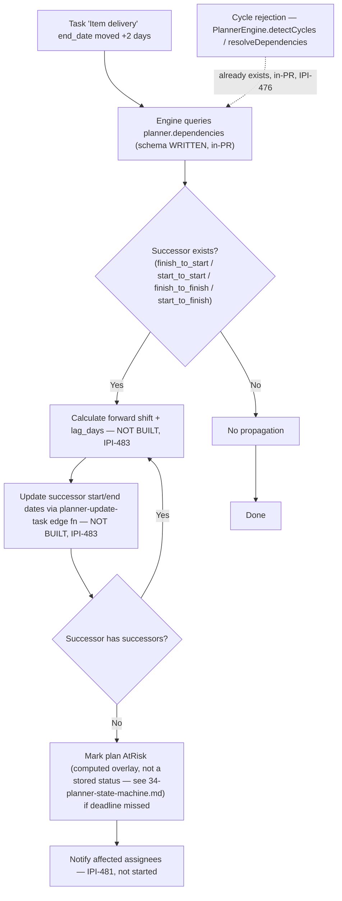

# Planner Dependency Auto-Shift

**Purpose:** Show how moving one task's dates is meant to propagate through the dependency graph to its successors, and how much of that actually exists today.

## Explanation

Adapted from `Universal-design-prompt-new/plan/planner/mermaid-diagrams.md` §8. This is `IPI-483` (roadmap.md Phase 4 — Advanced, "deferred" — not yet built). Only the **engine-level pieces** exist today, and only in-PR: `planner.dependencies` (schema, `IPI-476`, written) and `PlannerEngine.detectCycles`/`resolveDependencies` (cycle detection only, confirmed in `app/src/lib/planner/engine.ts`). The actual forward/backward **shift propagation**, the gate-condition blocking, and the `planner-update-task` edge function that IPI-483 specifies as the service-side source of truth are all unbuilt — `IPI-483` is blocked on `IPI-476, 477, 478, 479`, none of which are past the schema/engine stage yet. Minor naming note: `IPI-483`'s acceptance criterion A calls the four types `finish_start/start_start/finish_finish/start_finish`; the real migration enum (`planner.dependency_type`) spells them `finish_to_start/start_to_start/finish_to_finish/start_to_finish` — same four types, just the Linear issue's shorthand doesn't match the DB spelling. The diagram below uses the real enum names.

## Diagram

## Related Linear issues

- `IPI-483` (dependency auto-shift + gate approvals — Phase 4/Advanced, blocked by `IPI-476, 477, 478, 479`, not started)
- `IPI-476` (cycle detection only — written, in-PR, confirmed in `engine.ts`)
- `IPI-481` (notification fan-out on AtRisk/deadline-miss — not started)

## Related PRD section

`prd.md` §6.7 (acceptance criteria table, `IPI-483` row)
