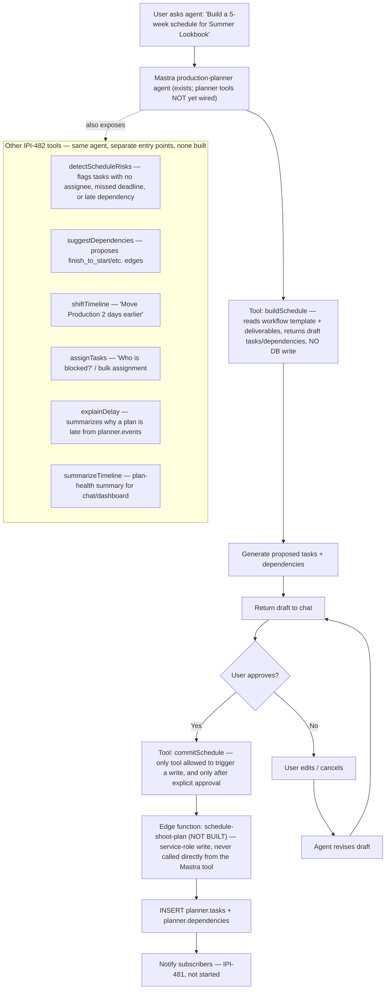

# Planner AI Schedule Generation — HITL Approval Flow

**Purpose:** Show the human-in-the-loop path from a chat request to a committed schedule, and which of `IPI-482`'s 8 planner tools that path actually touches.

## Explanation

Adapted from `Universal-design-prompt-new/plan/planner/mermaid-diagrams.md` §5. None of this is built: the `production-planner` Mastra agent exists (`app/src/mastra/agents/index.ts`, `id: "production-planner"`) but carries none of `IPI-482`'s planner tools yet, and no `schedule-shoot-plan` edge function exists in `supabase/functions/`. Per `roadmap.md` §2, `IPI-482` sits in **Phase 1 — Core Features (next)**, grouped with the rest of the Planner UI backlog (`IPI-477`–`483`) — not Phase 2 (AI Platform Hardening) or Phase 4 (Advanced), which cover different work (`IPI-483` specifically is the one in Phase 4). The source flowchart only walks 2 of the 8 tools (`buildSchedule` → `commitSchedule`) because it illustrates one example conversation ("build a 5-week schedule"); the other 6 tools are separate entry points into the same agent, added below rather than invented.

## Diagram

## Related Linear issues

- `IPI-482` (8 planner tools + 4-gate HITL workflow — Phase 1, not started)
- `IPI-476` (`production-planner` agent's read path depends on the in-PR schema/engine)
- `IPI-481` (notification fan-out after commit — not started)

## Related PRD section

`prd.md` §6.7 ("HITL" paragraph — `commitSchedule` only writes after explicit approval, reuses `ApprovalCard` full variant) and acceptance criteria table, `IPI-482` row
