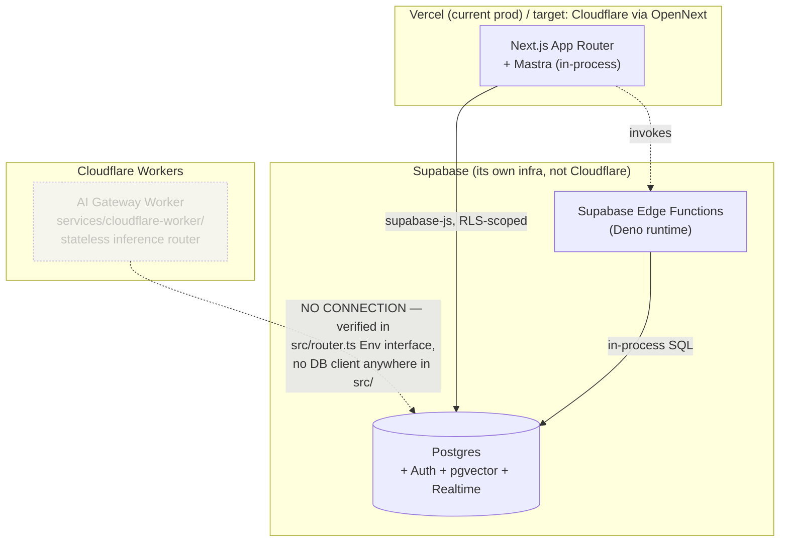

# 37 — Workers ↔ Supabase Integration

**Purpose:** Show which Cloudflare Workers, if any, talk to Supabase directly today, versus which paths only look connected on a whiteboard.

## Explanation

**The AI Gateway Worker (`services/cloudflare-worker/`) does not talk to Supabase at all.** Its `Env` interface (`services/cloudflare-worker/src/router.ts:13-20`) declares only `GEMINI_API_KEY`, `NVIDIA_API_KEY`, `CLOUDFLARE_API_TOKEN`, `CLOUDFLARE_ACCOUNT_ID`, `MODEL_REGISTRY_OVERRIDE`, `AI_GATEWAY_URL` — no `DATABASE_URL`, no Supabase client, no fetch to a Supabase host anywhere in `src/index.ts`, `src/router.ts`, or `src/providers/*.ts`. It is a stateless request-in/response-out inference router: `handleRequest` → `selectProvider` → `geminiProvider`/`workersAiProvider` → `Response.json`. Today, Supabase is reached only from two other places: the Next.js app (Vercel today, target Cloudflare Workers via OpenNext — see diagram `01`/`02`) calling Supabase directly with the JS client, and Supabase Edge Functions (Deno runtime **on Supabase's own infrastructure**, not a Cloudflare Worker) calling Postgres in-process. The planned Durable Objects/Queues Workers (`39`, `40`) would be the first Cloudflare Workers to touch Supabase data at all — and even those only read via Realtime/JWT, not direct Postgres connections.

## Diagram

## Related Linear issues

IPI-454 (AI Gateway Worker — real, deployed, no Supabase wiring), IPI-480 (would be the first Worker touching planner state via Realtime, not Postgres directly — see diagram `39`)

## Related PRD section

prd.md §4.2 (Runtime boundaries — "Cloudflare Workers: stateless AI inference... no persistent data"), §4.1 (Service Decision Table — Hyperdrive is Skip: "No direct Supabase connection needed from Workers")
