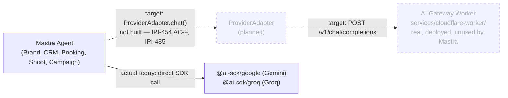

# 38 — Workers ↔ Mastra Integration (Target State)

**Purpose:** Show the planned wiring between Mastra agents and the AI Gateway Worker — a target state, not yet built.

## Explanation

**Not wired today.** Mastra agents resolve providers directly today — `app/src/lib/ai/provider.ts`'s `resolveModel(tier)` calls `@ai-sdk/google` or `@ai-sdk/groq` directly, with zero references to `AI_GATEWAY_URL` anywhere in `app/src/lib/ai/` or `app/src/mastra/` (grep-verified, matches diagram `10`'s finding). The target state — a `ProviderAdapter.chat()` layer between Mastra and the AI Gateway Worker — is Approved architecture (`prd.md` §4.4: "no agent imports a provider SDK directly... Current reality: this rule is not yet enforced in code") but has no code on `main` yet. **This diagram is intentionally thin** — the full current-vs-target flow, including the sequence diagram for a wired call, already lives in diagram `10-ai-gateway-routing.md`; do not re-derive it here.

## Diagram

## Related Linear issues

IPI-454 (AC-F: wire `resolveModel()` → gateway, open), IPI-457 (unified model registry, branch-only), IPI-461 (Worker built, unwired), IPI-485 (Mastra gateway cutover, blocked on 454 + 457) — see `docs/architecture/diagrams/10-ai-gateway-routing.md` for the full current/target/sequence breakdown.

## Related PRD section

prd.md §4.4 (Provider strategy, "Key rule" + "Current reality" note), §4.3 (migration status)
