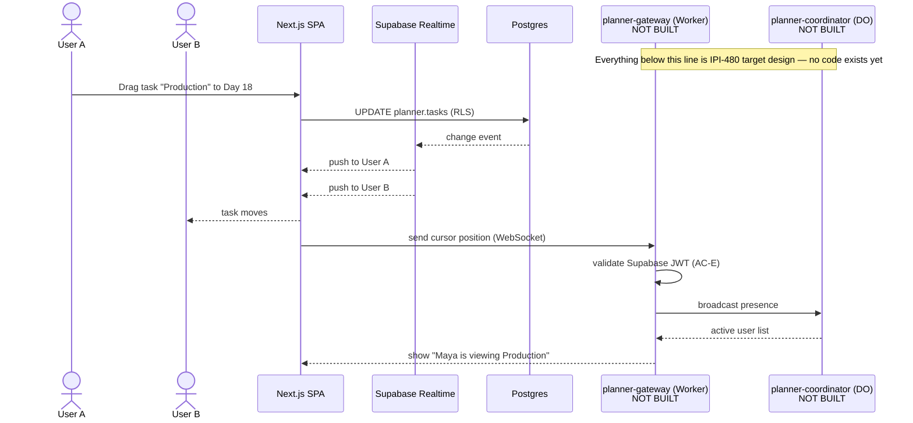

# 39 — Durable Objects Flow (Planned, Not Built)

**Purpose:** Show the target design for Planner presence/cursor sync via a Cloudflare Durable Object — IPI-480's own spec, not a live system.

## Explanation

**Not built.** `cloudflare/planner-gateway/` and `cloudflare/planner-coordinator/` do not exist anywhere on disk (verified: no `cloudflare/` directory at repo root; the only Cloudflare service that exists is `services/cloudflare-worker/`, which is the unrelated AI Gateway Worker). Durable Objects are listed "⏳ Defer" in `prd.md` §4.1. This diagram reproduces IPI-480's own sequence diagram (`linear/issues/IPI-480-PLN-005-real-time-sync-cloudflare-do.md`) verbatim in structure: Supabase Realtime handles durable DB-change fan-out (task moves, persisted in Postgres); a separate Durable Object (`planner-coordinator`, one instance per planner) handles ephemeral, non-persisted state — presence and cursor position — reached through a `planner-gateway` Worker that validates the Supabase JWT before the WebSocket upgrade.

## Diagram

## Related Linear issues

IPI-480 (PLN-005, blocked by IPI-476/IPI-478, unblocks IPI-481) — status: not started, no files created yet against its own wiring plan (`cloudflare/planner-gateway/src/index.ts`, `cloudflare/planner-coordinator/src/index.ts` both absent)

## Related PRD section

prd.md §4.1 (Durable Objects — Defer: "circuit breaker shared state, provider health tracking — and (new, from Planner spec) per-instance presence/cursor sync, IPI-480"), §6.7 (Planner — backend spec-complete, UI target-state spec)
