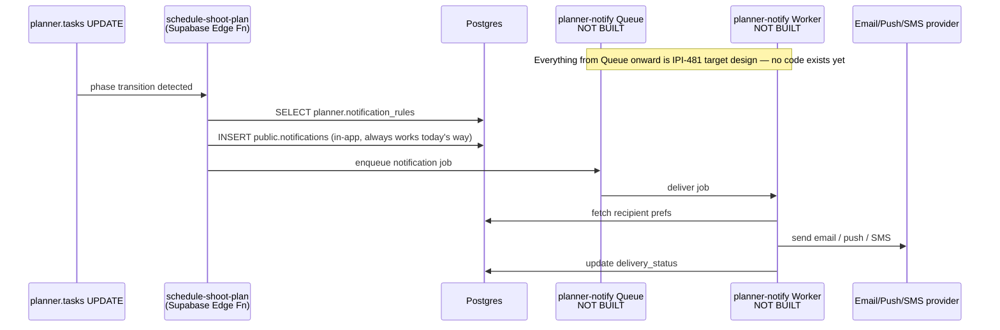

# 40 — Queues Flow (Planned, Not Built)

**Purpose:** Show the target design for notification fan-out via a Cloudflare Queue — IPI-481's own spec, not a live system.

## Explanation

**Not built.** `cloudflare/planner-notify-worker/` and the `cloudflare/planner-notify-queue` binding do not exist anywhere on disk or in `wrangler.jsonc` for any service in this repo. Queues are listed "⏳ Defer" in `prd.md` §4.1 ("Not MVP"). This diagram reproduces IPI-481's own sequence diagram (`linear/issues/IPI-481-PLN-006-notification-rules-cloudflare-queue.md`) verbatim in structure: a Supabase Edge Function (`planner-notify-enqueue`, Deno runtime — not a Cloudflare Worker) detects a phase transition, writes the in-app notification row directly to Postgres, and enqueues a job. The Cloudflare Queue and its consumer Worker (`planner-notify-worker`) are the only Cloudflare-hosted pieces of this flow, and neither exists yet.

## Diagram

## Related Linear issues

IPI-481 (PLN-006, blocked by IPI-476/IPI-480, unblocks IPI-482) — status: not started, no files created against its wiring plan (`supabase/functions/planner-notify-enqueue/index.ts`, `cloudflare/planner-notify-worker/src/index.ts` both absent)

## Related PRD section

prd.md §4.1 (Queues — Defer: "Needed for batch DNA scoring + cost log export. Not MVP"), §6.7 (Planner — backend spec-complete, UI target-state spec)
