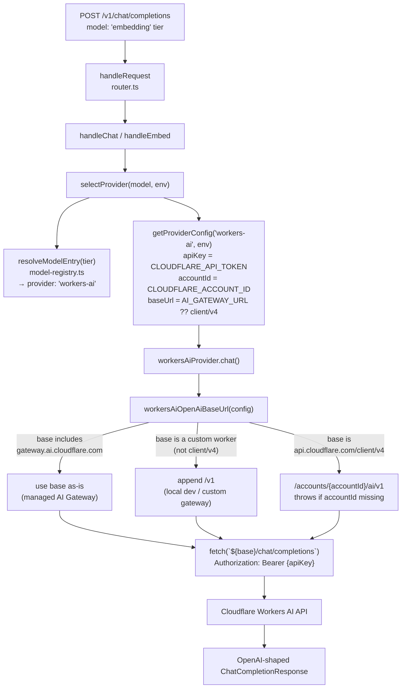

# 41 — Workers AI Provider Flow (Real, Code-Verified)

**Purpose:** Show the actual request path through the Workers AI provider inside the AI Gateway Worker, including the URL-construction logic and its account-ID history.

## Explanation

This is the highest-confidence diagram in this set — every step is read directly from `services/cloudflare-worker/src/router.ts` and `src/providers/workers-ai.ts` on `origin/main`. `handleRequest` (`router.ts:107`) dispatches `POST /v1/chat/completions` or `/v1/embeddings` to `handleChat`/`handleEmbed`, which call `selectProvider(model, env)` → `resolveModelEntry(tier)` (`model-registry.ts`) to pick a provider, then build `ProviderConfig` (`getProviderConfig`, `router.ts:33-45`) with `apiKey: env.CLOUDFLARE_API_TOKEN`, `accountId: env.CLOUDFLARE_ACCOUNT_ID`, `baseUrl: env.AI_GATEWAY_URL ?? "https://api.cloudflare.com/client/v4"`. `workersAiProvider.chat/chatStream/embed` all build their upstream URL through `workersAiOpenAiBaseUrl(config)`, which branches on the base URL shape: a managed Cloudflare AI Gateway URL (`gateway.ai.cloudflare.com`) is used as-is; any other non-`client/v4` base (custom gateway worker, local dev) gets `/v1` appended; only a direct `api.cloudflare.com/client/v4` base builds `/accounts/{accountId}/ai/v1`.

**Correction against the task's assumption:** this file-format ask says the account-ID bug "was fixed in PR #279" as settled fact. On disk in **this specific worktree** (`ipi/restore-universal-design-prompt`, 23 commits behind `origin/main`), the pre-fix code is still present — `getProviderConfig` returns a plain `{ apiKey, baseUrl }` (no `accountId` field), and `workers-ai.ts` builds the URL as `${config.baseUrl}/accounts/${config.apiKey}/ai/v1/...`, incorrectly using the **API token** as the account-ID path segment. `origin/main` (confirmed via `git show origin/main:...`, commits `65d674c5` "fix(ipi-454): use account ID in Workers AI OpenAI-compat URLs" and `503c47fb` "fix(pr-279): detect AI Gateway URL in Workers AI base path") already has the corrected version diagrammed below. The diagram reflects `origin/main` (the real, merged, canonical state); the stale worktree copy is flagged separately in the report.

## Diagram

## Related Linear issues

IPI-454 (CF-AI-001, AC-C — account-ID fix, ✅ merged to `origin/main` per `tasks/cloudflare/todo.md:22`), PR #279 (`fix(pr-279): detect AI Gateway URL in Workers AI base path`, commit `503c47fb`)

## Related PRD section

prd.md §4.1 (Workers AI — Use now, free-first inference), §4.4 (Provider strategy — Workers AI is MVP provider for default/fast/structured/embedding tiers)
