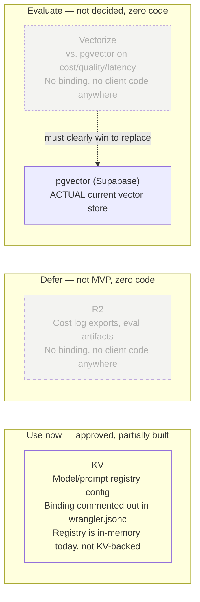

# 42 — R2 / KV / Vectorize Decision Status

**Purpose:** A decision-status snapshot, not a flow diagram — none of these three services has a working usage flow to draw yet.

## Explanation

**KV — "Use now" per `prd.md` §4.1, but not actually built as a registry.** `services/cloudflare-worker/wrangler.jsonc:14-16` has a `kv_namespaces` binding **commented out**, and `model-registry.ts` is a hardcoded in-memory `DEFAULT_REGISTRY` object — no `KVNamespace.get()`/`.put()` call exists anywhere in `services/cloudflare-worker/src/`. So "Use now" describes an approved direction, not shipped code. **R2 — "Defer," confirmed not built:** no `r2_buckets` binding in any `wrangler.jsonc` in the repo, no R2 client code. **Vectorize — "Evaluate," confirmed not decided:** no Vectorize binding or client code anywhere; pgvector (inside Supabase Postgres) is the only vector store actually in use today, matching `prd.md` §4.2's runtime boundary ("pgvector (default vector store — Vectorize must clearly win on cost+quality to replace it)"). This diagram intentionally does not invent a usage flow for R2 or Vectorize since neither is wired to any code path.

## Diagram

| Service | Decision | Built today? | Evidence |
|---|:---:|:---:|---|
| KV | ✅ Use now | ⚪ No — binding commented out, registry is in-memory | `services/cloudflare-worker/wrangler.jsonc:14-16`, `model-registry.ts` |
| R2 | ⏳ Defer | ⚪ No | No `r2_buckets` binding anywhere in repo |
| Vectorize | 🔬 Evaluate | ⚪ No | No binding/client code; pgvector is the live default |

## Related Linear issues

CF-AI-005 / IPI-457 (unified provider registry, would eventually back KV), SEARCH-001 (Vectorize vs. pgvector evaluation, not started), CF-AI-010 (R2 cost-log export, not MVP)

## Related PRD section

prd.md §4.1 (Service Decision Table), §4.2 (Runtime boundaries — pgvector as default vector store)
