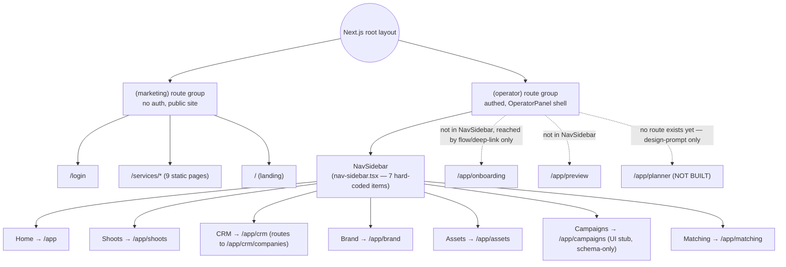

# Operator App Navigation

**Purpose:** Show the real left-nav rail items and the two top-level route groups they sit inside.

## Explanation

The app has exactly two Next.js route groups: `(marketing)` (public site, no auth) and `(operator)` (the authenticated 3-panel product, wrapped by `OperatorPanel`/`OperatorShell`). The nav rail itself is a single hard-coded array (`NAV` in `app/src/components/operator-panel/nav-sidebar.tsx:13-21`) with exactly 7 items. Three operator routes exist on disk (`onboarding`, `preview`, and brand's own list page) but are **not** in that array — they're reached by deep link/flow redirect, not the persistent nav. Planner has no nav entry because it has no route yet.

## Diagram

## Related Linear issues

`IPI-476`–`IPI-484` (Planner backend + UI epic — explains why Planner has no nav entry: no route exists yet, only Claude Design prompts `SCR-32`–`SCR-35`).

## Related PRD section

`prd.md` §6.7 (Planner — route not built), §3 (3-panel shell). Ground truth: `app/src/components/operator-panel/nav-sidebar.tsx:13-21`, `tasks/plan/audit/00-repo-ground-truth.md` §1.
