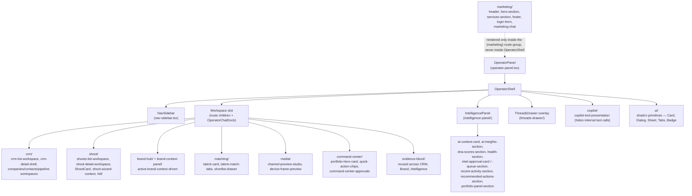

# Component Hierarchy

**Purpose:** Show the real shared component tree — the 3-panel operator shell and the per-feature component directories it wraps.

## Explanation

`OperatorPanel` (`app/src/components/operator-panel/operator-panel.tsx`) is the single wrapper every `(operator)` route renders inside — it owns the CopilotKit provider, `IntelligenceDetailProvider`, and route-derived `agentId`. Inside it, `OperatorShell` lays out the actual 3-panel grid: `NavSidebar` (left), route `children` + `OperatorChatDock` (center workspace), `IntelligencePanel` (right), plus a `ThreadsDrawer` overlay toggled from the nav. Per-feature component directories (crm, shoot, matching, etc.) only ever render inside the center workspace slot — none of them re-implement the shell.

## Diagram

## Related Linear issues

`IPI-85` / `IPI-110` (NavSidebar), `IPI-218` (brand switcher), `IPI-197` (contextual chat dock), `IPI-243` (IntelligencePanel briefing pattern) — all cited directly in code comments in `operator-panel.tsx` and `nav-sidebar.tsx`.

## Related PRD section

`prd.md` §3 (3-panel operator shell, HITL pattern). Ground truth: `app/src/components/operator-panel/operator-panel.tsx`, directory listing in `tasks/plan/audit/00-repo-ground-truth.md` §1.
