# Route Architecture

**Purpose:** Show the real Next.js route tree — route groups, dynamic segments, and API routes — as it exists on disk.

## Explanation

Two route groups sit under `app/src/app/`: `(marketing)` (public, static-ish) and `(operator)` (authenticated product, all under `/app`). Dynamic segments exist for brand (`[id]`), shoot (`[shootId]`), and each CRM entity (`[id]` under companies/contacts/pipeline). API routes are grouped by feature; several use Next.js catch-all optional segments (`[[...slug]]`) for CopilotKit/marketing-chat multiplexing. Campaign has a page route but no API route yet; Planner and standalone Intelligence have neither.

## Diagram

```mermaid
flowchart TD
    App["app/src/app/"]
    App --> Auth["auth/callback/ (OAuth callback route.ts)"]
    App --> Api["api/"]
    App --> MktGroup["(marketing)/"]
    App --> OpGroup["(operator)/app/"]

    MktGroup --> Login["login/"]
    MktGroup --> Services["services/{amazon,clothing,ecommerce-photography,\nfashion-photography,instagram,jewellery,location,shopify,video}/"]

    OpGroup --> Assets1["assets/"]
    OpGroup --> BrandR["brand/ + brand/[id]/"]
    OpGroup --> Campaigns1["campaigns/ (page only — UI stub)"]
    OpGroup --> CrmR["crm/ → companies/[id], contacts/[id], pipeline/[id]"]
    OpGroup --> Matching1["matching/"]
    OpGroup --> Onboarding1["onboarding/"]
    OpGroup --> Preview1["preview/"]
    OpGroup --> ShootsR["shoots/ → new/, [shootId]/"]

    Api --> ApiAssets["assets/, assets/upload-sign/,\nassets/cloudinary/webhook/"]
    Api --> ApiBookings["bookings/, bookings/[id]/,\nbookings/[id]/approve/"]
    Api --> ApiBrands["brands/, brands/[id]/,\nbrands/[id]/assets/"]
    Api --> ApiCopilot["copilotkit/[[...slug]]"]
    Api --> ApiIntel["intelligence/panel/"]
    Api --> ApiMktChat["marketing-chat/[[...slug]], marketing-lead/"]
    Api --> ApiMedia["media/specs/"]
    Api --> ApiNotif["notifications/, notifications/read/"]
    Api --> ApiOrg["org/current/"]
    Api --> ApiShoots["shoots/commit/, shoots/[shootId]/,\nshoots/suggest-brief/"]
    Api --> ApiWorkflows["workflows/brand-intelligence/{start,approve,resume}/,\nworkflows/resume/, workflows/shoot-wizard/"]

    Campaigns1 -.no /api/campaigns route exists.-> ApiMissingCampaigns["MISSING: api/campaigns/"]
    OpGroup -.no /app/planner route exists.-> PlannerMissing["MISSING: app/planner/"]
```

## Related Linear issues

`IPI-268` (campaigns schema, no API yet). `IPI-476`–`IPI-484` (Planner — no route, lib-only today).

## Related PRD section

`prd.md` §6.6 (Campaign — route stub, no API), §6.7 (Planner — no route). Ground truth: `tasks/plan/audit/00-repo-ground-truth.md` §1 and §11 (verified `find` output for both the route tree and the API route list).
