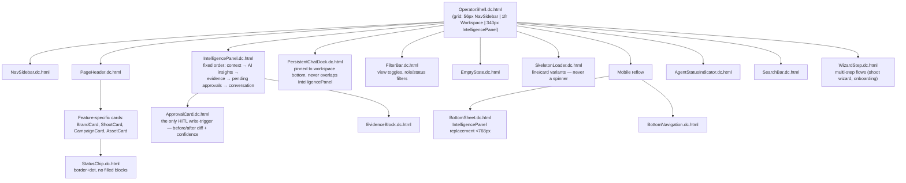

# Design System Component Relationships

**Purpose:** Show how the reusable Claude Design components (the `.dc.html` library) relate to each other and to the shell, per `DESIGN.md` and the design-prompt reuse conventions.

## Explanation

`OperatorShell.dc.html` is the root layout component every screen composes into: `NavSidebar` + a workspace slot (`PageHeader` + feature content + `PersistentChatDock`) + `IntelligencePanel`. A small set of shared primitives (`StatusChip`, `ApprovalCard`, `EmptyState`, `SkeletonLoader`, `FilterBar`, `BottomSheet`/`BottomNavigation` for mobile) are reused across nearly every feature screen rather than rebuilt per-feature — this is the explicit rule in `DESIGN.md` §8 ("new primitives require explicit justification, reuse first") and is echoed in the Planner design-prompt reuse table (`00-review-and-conventions.md` §2), which reuses 11 of these components as-is.

## Diagram

## Related Linear issues

none — reflects shipped design-system structure (`Universal-design-prompt-new/components/*.dc.html`, 19 files).

## Related PRD section

`prd.md` §3 (3-panel shell, HITL invariant — `ApprovalCard` is the only allowed write-trigger). Source: `Universal-design-prompt-new/DESIGN.md` §7 (Layout Architecture), §8 (Component Reuse Rules), and the reuse table in `Universal-design-prompt-new/plan/design-prompts/00-review-and-conventions.md` §2.
