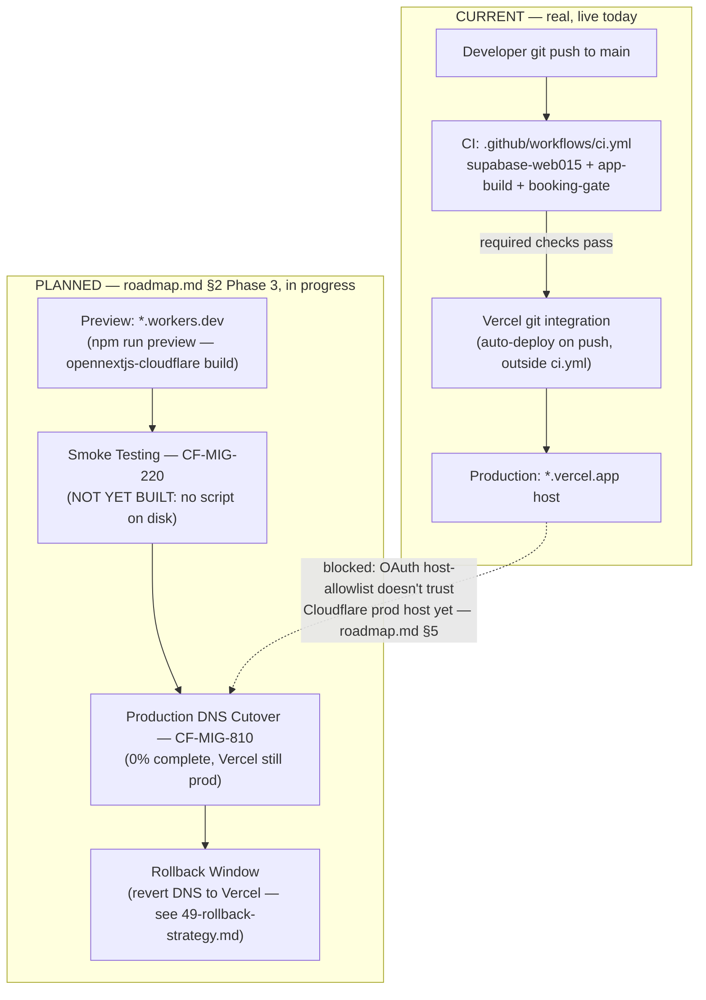

# Production Deployment Flow

**Purpose:** Show the real, current deployment path (git push → Vercel auto-deploy) alongside the planned Cloudflare cutover sequence — clearly separated, not blended into one fictional pipeline.

## Explanation

Today, production deploys are **Vercel's git integration**, not a step in `.github/workflows/ci.yml` — confirmed by `.vercel`/`app/.vercel` directories on disk and no `vercel` references anywhere in the CI workflow file. CI (`supabase-web015`, `app-build`, `booking-gate-check`/`booking-gate`) gates merges to `main` via required checks, but the actual deploy-to-production trigger is Vercel's own webhook on push to `main`, outside this repo's control plane. The planned Cloudflare path (`roadmap.md` §2 Phase 3, `CLOUDFLARE-EPIC.md` §12) is real infrastructure-in-progress (`app/wrangler.jsonc`, `app/open-next.config.ts`, `npm run preview` script exist) but **not live** — `CF-MIG-810` (DNS cutover) is still ⚪ 0% per `roadmap.md` §1, and no `CF-MIG-220` smoke-test script exists on disk yet (only an unrelated `groq:smoke` script). Vercel remains the sole production host until that gate passes.

## Diagram

## Related Linear issues

`CF-MIG-111` (OpenNext CI build step — not yet added), `CF-MIG-220` (preview smoke testing — not yet built), `CF-MIG-810` (production DNS cutover — 0%), `IPI-472` (deploy pipeline documentation).

## Related PRD section

`prd.md` §4.3 (Cloudflare migration status), §3 (Architecture Overview, ADR-001). `roadmap.md` §2 Phase 3, §3 MVP Release Gate items 1–2.
