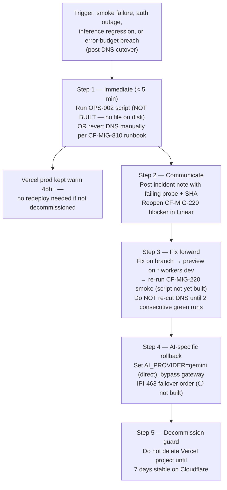

# Rollback Strategy

**Purpose:** Show the real, documented rollback mechanism for the Cloudflare DNS cutover — not an invented blue-green/canary scheme.

## Explanation

`CLOUDFLARE-EPIC.md` §13 documents one concrete rollback plan, triggered by "smoke failure, auth outage, inference regression, or error budget breach after DNS cutover." The core mechanism is **DNS revert to Vercel**, either via an `OPS-002` rollback script or a manual DNS change — but `OPS-002` ("Rollback Automation — DNS Revert Script") does not exist on disk today; a repo-wide search found no rollback script anywhere in this project. So the real current state is: **the rollback plan is a documented runbook, not yet an executable, tested artifact.** This matches `roadmap.md` §3 item 10 ("Rollback window confirmed runnable") being listed as an open MVP release-gate criterion, not a shipped capability. There is no blue-green or canary mechanism anywhere in this repo — the plan is literally "point DNS back at the still-warm Vercel deployment."

## Diagram

## Related Linear issues

`OPS-002` (Rollback Automation — DNS Revert Script, ⚪ not built), `CF-MIG-810` (DNS Cutover & Rollback, 🔴 0%), `CF-MIG-220` (preview smoke testing), `IPI-463` (AI Provider Failover & Rollback, ⚪ not built).

## Related PRD section

`roadmap.md` §3 item 10 (rollback window confirmed runnable — open gate), §8 Risk Register (OAuth host-allowlist blocks cutover). Source: `tasks/cloudflare/CLOUDFLARE-EPIC.md` §13 (Rollback plan), §12 checklist line "Rollback tested (§13)".
