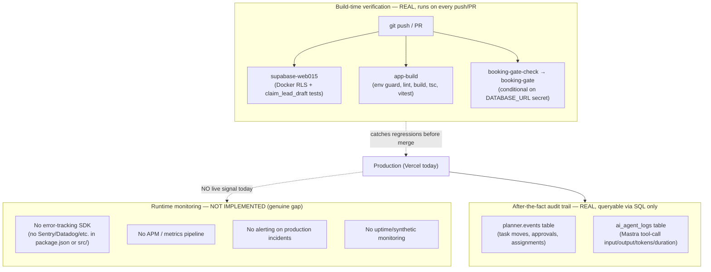

# Monitoring & Observability

**Purpose:** Show what verification actually exists today (CI build-time checks) and label runtime monitoring as a genuine, currently-unaddressed gap.

## Explanation

**This is a real gap, not a planned-vs-built split.** A repo-wide search for Sentry, Datadog, Grafana, and Cloudflare Analytics Engine references across `app/package.json` and `app/src/**` returned zero hits — no error-tracking or metrics SDK is installed or wired anywhere in the codebase. `roadmap.md` §4 confirms this: "Automated accessibility testing" and formal monitoring are listed as explicitly missing, and §2 Phase 4 lists Cloudflare Analytics Engine only under "🔬 Evaluate ... once Phase 0-3 traffic gives real usage data" — i.e. not even scheduled yet. What *does* exist today is build-time/CI verification: 4 real CI jobs (`supabase-web015`, `app-build`, `booking-gate-check`, `booking-gate`) that catch regressions before merge, plus `ai_agent_logs` and `planner.events` as after-the-fact audit tables queryable via SQL — but neither is a monitoring dashboard, alerting pipeline, or uptime check. There is no runtime error tracking, no APM, no alerting on production today.

## Diagram

## Related Linear issues

None open specifically for runtime monitoring/observability tooling — this gap has no tracking issue yet.

## Related PRD section

`roadmap.md` §4 (Testing & Validation — "Explicitly missing" list), §2 Phase 4 ("🔬 Evaluate" row: Analytics Engine deferred until real traffic exists), `prd.md` §8 (Non-Functional Requirements), §9 (Risks & Known Gaps).
