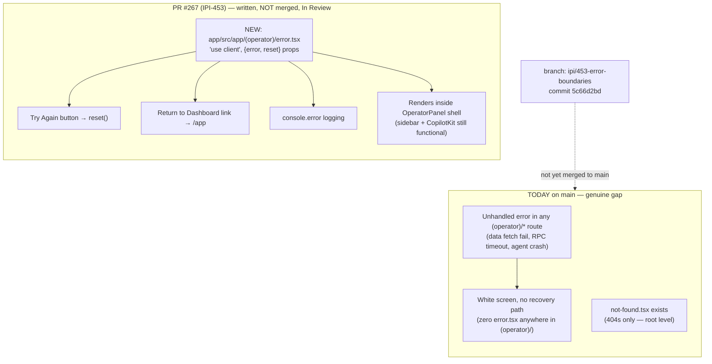

# Error Handling Flow

**Purpose:** Show the real state of error boundaries in the operator app today — and the fix that is written but not yet merged.

## Explanation

**Genuine gap, currently unaddressed on `main`.** A repo-wide search for `error.tsx` under `app/src/app/**` found zero files on `main` — only `app/src/app/not-found.tsx` exists (catches 404s, not runtime errors). IPI-453 ("FIX · Production Error Boundaries for Operator Routes") is real work: commit `5c66d2bd` adds `app/src/app/(operator)/error.tsx` (44 lines, client component, `error`/`reset` props, "Try Again" + "Return to Dashboard" buttons, per `linear/changelog.md`), but it lives only on branch `ipi/453-error-boundaries` (PR #267) — `git show main:app/src/app/(operator)/error.tsx` confirms the file does not exist on `main`. Linear status is "In Review," not Done. Until that PR merges, any unhandled error in any of the 17 operator routes (data fetch failure, Supabase RPC timeout, agent crash) renders a white screen with no recovery path — there is no error boundary at any level of the `(operator)` route group today.

## Diagram

## Related Linear issues

`IPI-453` (FIX · Production Error Boundaries for Operator Routes — Status: In Review, PR #267 open).

## Related PRD section

`prd.md` §8 (Non-Functional Requirements), §9 (Risks & Known Gaps). Ground truth: `linear/changelog.md` lines 194-201, `linear/all-issues.md` line 4, commit `5c66d2bd` on `ipi/453-error-boundaries` (not on `main`).
