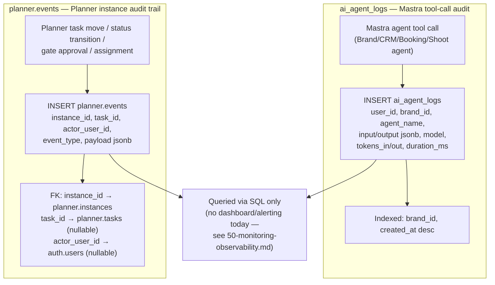

# Audit Logging Flow

**Purpose:** Show the real, shipped audit-trail tables and what each actually records — this is the fully-verified, highest-confidence diagram in this set.

## Explanation

Both tables are real and deployed. `ai_agent_logs` (`supabase/migrations/20260614000000_ipix_platform_mvp.sql:70-86`) logs every Mastra agent tool call: `user_id`, `brand_id`, `agent_name`, `input`/`output` (jsonb), `model`, `tokens_in`/`tokens_out`, `duration_ms`, `created_at` — indexed on `brand_id` and `created_at desc`. `planner.events` (`supabase/migrations/20260709000000_planner_schema_rls.sql:135-144`) logs Planner activity: `instance_id`, `task_id`, `actor_user_id`, `event_type`, `payload` (jsonb), `created_at` — the migration's own comment calls it "Audit/activity log for planner changes — task moves, status transitions, gate approvals, assignments." `roadmap.md` §5 lists Audit Logging as "Already satisfied" — the only Security Milestones row not gated as open. Both are pure database tables queried via SQL (see `50-monitoring-observability.md` for the caveat that this is not a live dashboard or alerting pipeline — it's an audit trail, not runtime monitoring).

## Diagram

## Related Linear issues

`IPI-476` (Planner schema + RLS — introduced `planner.events`), MVP-era platform schema (`ai_agent_logs`, no dedicated issue — shipped with initial platform migration).

## Related PRD section

`roadmap.md` §5 (Security Milestones — "Audit logging: already satisfied"). Ground truth: `supabase/migrations/20260614000000_ipix_platform_mvp.sql:70-86` (`ai_agent_logs`), `supabase/migrations/20260709000000_planner_schema_rls.sql:135-144` (`planner.events`).
