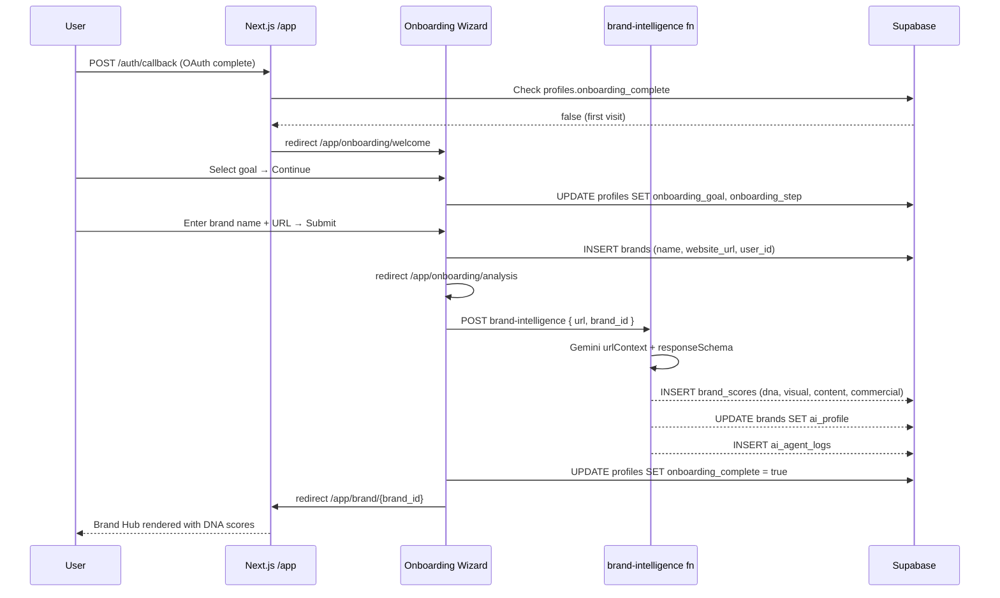
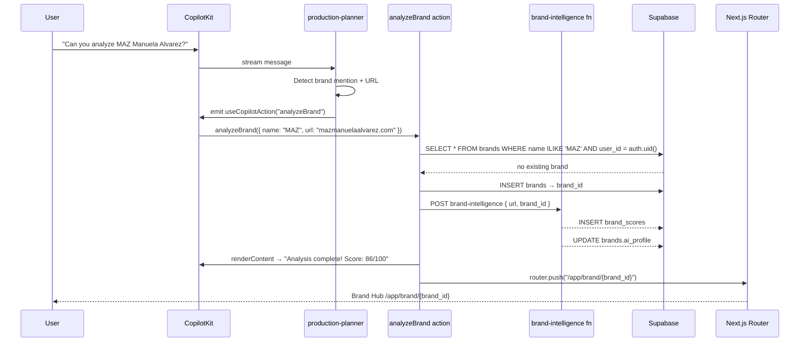

# FashionOS — AI-Native Sitemap & Architecture

> **Last updated:** 2026-06-24  
> **Status:** North-star spec — implementation in progress  
> **Scope:** www.ipix.co (Next.js `app/`) + Supabase backend + Mastra/CopilotKit AI layer

---

## 1. Current Sitemap (As-Built)

### 1a. Public Marketing Website (Next.js — `app/` via `(marketing)` group)

| Route | Page Component | Status | Purpose |
|-------|---------------|--------|---------|
| `/` | `(marketing)/page.tsx` | ✅ Live | Homepage — hero, services grid, CTA |
| `/login` | `(marketing)/login/page.tsx` | ✅ Live | Auth (Google OAuth + email/password) |
| `/services/fashion-photography` | `(marketing)/services/fashion-photography/page.tsx` | ✅ Live | Service page |
| `/services/ecommerce-photography` | `(marketing)/services/ecommerce-photography/page.tsx` | ✅ Live | Service page |
| `/services/clothing` | `(marketing)/services/clothing/page.tsx` | ✅ Live | Service page |
| `/services/amazon` | `(marketing)/services/amazon/page.tsx` | ✅ Live | Service page |
| `/services/location` | `(marketing)/services/location/page.tsx` | ✅ Live | Service page |
| `/services/jewellery` | `(marketing)/services/jewellery/page.tsx` | ✅ Live | Service page |
| `/services/instagram` | `(marketing)/services/instagram/page.tsx` | ✅ Live | Service page |
| `/services/video` | `(marketing)/services/video/page.tsx` | ✅ Live | Service page |
| `/services/shopify` | `(marketing)/services/shopify/page.tsx` | ✅ Live | Service page |
| `/auth/callback` | `auth/callback/route.ts` | ✅ Live | OAuth PKCE code exchange → `/app` |

**Also in Vite SPA (`src/`) — legacy, being retired:**

| Route | Status | Notes |
|-------|--------|-------|
| `/dashboard` | ⚠️ Legacy | Vite ProtectedRoute shell — superseded by Next.js `/app` |
| `/dashboard/brand` | ⚠️ Legacy | BrandHubPage (Vite) |
| `/dashboard/brand/intake` | ⚠️ Legacy | BrandIntakePage (Vite) |
| `/dashboard/assets` | ⚠️ Legacy | AssetsPage (Vite) |
| `/dashboard/products` | ⚠️ Legacy | ProductsPage (Vite) |
| `/dashboard/analytics` | ⚠️ Legacy | AnalyticsPage (Vite) |
| `/dashboard/settings` | ⚠️ Legacy | SettingsPage (Vite) |

### 1b. Operator App — Next.js (`app/` via `(operator)` group)

| Route | Page Component | Status | Auth Required | Notes |
|-------|---------------|--------|---------------|-------|
| `/app` | `(operator)/app/page.tsx` | ✅ Live | Yes | Command Center — CopilotKit AI shell + threads drawer |
| `/app/brand` | `(operator)/app/brand/page.tsx` | 🟡 Placeholder | Yes | `SectionPlaceholder` — IPI2-83 |
| `/app/shoots` | `(operator)/app/shoots/page.tsx` | 🟡 Placeholder | Yes | `SectionPlaceholder` — IPI2-116 |
| `/app/campaigns` | `(operator)/app/campaigns/page.tsx` | 🟡 Placeholder | Yes | `SectionPlaceholder` — IPI2-119 |
| `/app/assets` | `(operator)/app/assets/page.tsx` | 🟡 Placeholder | Yes | `SectionPlaceholder` — IPI2-72 |
| `/app/matching` | `(operator)/app/matching/page.tsx` | 🟡 Placeholder | Yes | `SectionPlaceholder` — IPI2-123 |
| `/app/analytics` | ❌ Missing | Yes | Not yet created |
| `/app/settings` | ❌ Missing | Yes | Not yet created |
| `/app/onboarding` | ❌ Missing | Yes | First-time wizard — not yet created |
| `/app/brand/[id]` | ❌ Missing | Yes | Dynamic Brand Hub — not yet created |

### 1c. API Routes

| Endpoint | Method | Purpose | Auth | Stack |
|----------|--------|---------|------|-------|
| `/api/copilotkit/[[...slug]]` | GET/POST | CopilotKit v2 runtime — routes to Mastra agents | Supabase session (OPERATOR_AUTH_ENABLED) | Next.js + Mastra `getLocalAgents` |
| `/api/marketing-chat/[[...slug]]` | GET/POST | Public website AI chat widget | None (public) | Next.js + `publicMarketingAgent` |
| `/api/marketing-lead` | POST | Capture lead from chat widget | None (public) | Next.js → Supabase `chatbot_leads` |
| `/auth/callback` | GET | Supabase PKCE OAuth code exchange | None (public) | Next.js Route Handler |

### 1d. Edge Functions (Supabase/Deno)

| Function | Purpose | Trigger | AI Model | Status |
|----------|---------|---------|----------|--------|
| `brand-intelligence` | URL → brand profile (DNA scores, competitors, pillars) | POST from `edgeFunctionService.ts` | Gemini 2.5 Flash (urlContext + responseSchema) | ✅ Deployed |
| `audit-asset-dna` | Image → DNA compliance score | POST with Cloudinary URL | Gemini 2.5 Flash | 🟡 Not shipped (DNA-001) |
| `capture-lead` | Save lead from marketing chat | POST | None | ✅ Deployed |
| `edge-test` | Authenticated Gemini smoke test | Manual | Gemini 2.5 Flash | ✅ Deployed |
| `health` | Liveness check | GET | None | ✅ Deployed |

### 1e. AI Agents (Mastra)

| Agent ID | Name | Role | Instructions Scope | CopilotKit Exposed | Memory |
|----------|------|------|-------------------|--------------------|--------|
| `production-planner` (alias: `default`) | Production Planner | Help operators plan shoots: deliverables, shot lists, budgets | Shoot planning + production | Yes — primary operator agent | LibSQL in-memory + WorkingMemory |
| `creative-director` | Creative Director | Turn brand DNA into creative briefs and moodboards | Brand → creative brief → shoot brief | Yes | LibSQL in-memory |
| `public-marketing-agent` | Marketing Agent | Answer website visitor questions, capture leads | Public FAQs, services, pricing | Via `/api/marketing-chat` only | None |

---

## 2. Gap Analysis

| Page / Feature | Exists? | Status | What's Missing |
|----------------|---------|--------|----------------|
| First-time onboarding wizard | ❌ | Not built | `/app/onboarding` — welcome, brand intake, analysis steps |
| Brand Hub (`/app/brand/[id]`) | ❌ | Not built | Dynamic route, DNA score display, sections, action buttons |
| Brand list (`/app/brand`) | 🟡 | Placeholder only | Real Supabase query, brand cards, "Add brand" CTA |
| Brand Intelligence → DB save | ❌ | Not wired | Edge fn called but result not persisted to `brands`/`brand_scores` |
| Post-analysis redirect | ❌ | Not wired | After analysis, stays on `/app` chat — never routes to Brand Hub |
| AI brand mention detection | ❌ | Not wired | Agent answers question, never triggers brand creation workflow |
| Onboarding state check on `/app` | ❌ | Not built | No check for first-time user, no wizard redirect |
| Shoot workspace | 🟡 | Placeholder | IPI2-116 — brief creator, shot list, crew, schedule |
| Campaign workspace | 🟡 | Placeholder | IPI2-119 — creative brief, moodboard, content calendar |
| Assets / Asset DNA | 🟡 | Placeholder | IPI2-72 — Cloudinary browser, DNA scoring UI |
| Matching | 🟡 | Placeholder | IPI2-123 — brand ↔ creator/vendor matching |
| Analytics — Executive | ❌ | Not built | Cross-brand performance summary |
| Analytics — Brand Intelligence | ❌ | Not built | Score trends, competitor deltas |
| Analytics — Marketing | ❌ | Not built | Lead volume, conversion, service page performance |
| Analytics — Campaign Performance | ❌ | Not built | Campaign metrics, content performance |
| Analytics — Content | ❌ | Not built | Asset DNA pass rate, content calendar adherence |
| Analytics — Revenue | ❌ | Not built | Shoot bookings, invoices, Stripe revenue |
| AI Agent Control Center | ❌ | Not built | Agent run logs, token usage, model config |
| Integrations page | ❌ | Not built | Cloudinary, Stripe, Instagram, Shopify connects |
| Settings | ❌ | Not built | Account, billing, team, notifications |
| Returning user state (`/app`) | 🟡 | Partial | Command Center exists but has no last-brand context or smart suggestions |

---

## 3. Future Sitemap (Target State)

```
FashionOS (www.ipix.co)
│
├── PUBLIC — (marketing) Next.js group
│   ├── /                           Homepage
│   ├── /login                      Auth: Google OAuth + email
│   ├── /services/fashion-photography
│   ├── /services/ecommerce-photography
│   ├── /services/clothing
│   ├── /services/amazon
│   ├── /services/location
│   ├── /services/jewellery
│   ├── /services/instagram
│   ├── /services/video
│   └── /services/shopify
│
├── AUTH
│   └── /auth/callback              PKCE exchange → /app
│
└── OPERATOR APP — (operator) Next.js group [auth required]
    │
    ├── /app/onboarding             First-time wizard (3 steps)
    │   ├── /app/onboarding/welcome        Step 1: Welcome + goal selection
    │   ├── /app/onboarding/brand-intake   Step 2: Brand name + URL + Instagram
    │   └── /app/onboarding/analysis       Step 3: AI analysis in progress → redirect
    │
    ├── /app                        Command Center (returning user)
    │
    ├── /app/brand                  Brand list + "Add brand" CTA
    │   └── /app/brand/[id]         Brand Hub (DNA, scores, actions)
    │       ├── /app/brand/[id]/dna          Brand DNA deep-dive
    │       ├── /app/brand/[id]/shoots       Shoots for this brand
    │       └── /app/brand/[id]/campaigns    Campaigns for this brand
    │
    ├── /app/shoots                 Shoot workspace list
    │   ├── /app/shoots/new         New shoot brief creator
    │   └── /app/shoots/[id]        Shoot detail: shot list, crew, schedule, assets
    │
    ├── /app/campaigns              Campaign workspace list
    │   ├── /app/campaigns/new      New campaign brief
    │   └── /app/campaigns/[id]     Campaign detail: brief, moodboard, content calendar
    │
    ├── /app/assets                 Asset library (Cloudinary browser)
    │   └── /app/assets/[id]        Asset detail: DNA score, compliance, history
    │
    ├── /app/analytics              Analytics hub
    │   ├── /app/analytics/executive        Cross-brand KPI overview
    │   ├── /app/analytics/brand            Brand Intelligence score trends
    │   ├── /app/analytics/content          Asset DNA pass rate, calendar
    │   ├── /app/analytics/campaigns        Campaign performance
    │   └── /app/analytics/revenue          Shoot bookings + Stripe revenue
    │
    ├── /app/matching               Brand ↔ creator/vendor matching
    │   └── /app/matching/[id]      Match detail + outreach
    │
    ├── /app/integrations           Connected services (Cloudinary, Stripe, Instagram)
    │
    └── /app/settings               Account, billing, team, notifications
        ├── /app/settings/account
        ├── /app/settings/billing
        ├── /app/settings/team
        └── /app/settings/notifications
```

---

## 4. Page Specifications

### `/app/onboarding/welcome` — Welcome

| Field | Value |
|-------|-------|
| **Purpose** | Orient first-time operator; set primary goal |
| **User** | Authenticated operator (first login) |
| **User actions** | Select primary goal (More sales / More content / Photoshoot / Launch collection / Other) → Continue |
| **AI actions** | None — static screen; store goal in `profiles.onboarding_goal` |
| **Data created** | `profiles.onboarding_step = "welcome_complete"`, `onboarding_goal` |
| **Supabase tables** | `profiles` |
| **Success criteria** | User clicks Continue within 60s; goal stored |

### `/app/onboarding/brand-intake` — Brand Intake

| Field | Value |
|-------|-------|
| **Purpose** | Collect brand details needed for AI analysis |
| **User** | Authenticated operator |
| **User actions** | Enter brand name, website URL, Instagram URL, industry → Submit |
| **AI actions** | Real-time URL validation; show preview of brand favicon/title via link preview |
| **Data created** | `brands` row (`name`, `website_url`, `instagram_url`, `industry`, `user_id`) |
| **Supabase tables** | `brands` |
| **Success criteria** | `brands` row created; routed to `/app/onboarding/analysis` |

### `/app/onboarding/analysis` — AI Analysis (in-progress)

| Field | Value |
|-------|-------|
| **Purpose** | Run Brand Intelligence edge function; show progress; redirect on completion |
| **User** | Passive — watching progress indicators |
| **User actions** | None (auto-proceeding); optional "Skip for now" bail-out |
| **AI actions** | Call `brand-intelligence` edge fn (Gemini urlContext + responseSchema) → save result to `brands.ai_profile` + `brand_scores` rows |
| **Data created** | `brands.ai_profile` (jsonb), `brand_scores` (dna, visual, content, commercial), `ai_agent_logs` |
| **Supabase tables** | `brands`, `brand_scores`, `ai_agent_logs` |
| **Success criteria** | Scores saved; user auto-redirected to `/app/brand/[id]` within 30s |

### `/app` — Command Center (returning user)

| Field | Value |
|-------|-------|
| **Purpose** | Personalized home for operators who have completed onboarding |
| **User** | Returning authenticated operator |
| **User actions** | Continue a thread; navigate to brand; launch shoot/campaign; chat with AI |
| **AI actions** | CopilotKit sidebar shows context-aware suggestions based on last brand's score and pending actions |
| **Data created** | `ai_agent_logs` per thread message |
| **Supabase tables** | `brands`, `shoots`, `ai_agent_logs` (read) |
| **Success criteria** | Last-used brand displayed; AI surfaces 1-3 recommended next actions |

### `/app/brand` — Brand List

| Field | Value |
|-------|-------|
| **Purpose** | Overview of all brands the operator manages |
| **User** | Operator with ≥1 brand |
| **User actions** | View brand cards (score badge, last analyzed); click → Brand Hub; "Add brand" → intake |
| **AI actions** | None on load; AI accessible in sidebar |
| **Data created** | None |
| **Supabase tables** | `brands`, `brand_scores` (read) |
| **Success criteria** | Brands listed with scores; < 500ms load |

### `/app/brand/[id]` — Brand Hub

| Field | Value |
|-------|-------|
| **Purpose** | Central command for a single brand — DNA, scores, actions, history |
| **User** | Operator |
| **User actions** | View DNA sections; click "Re-analyze"; launch Shoot; launch Campaign; view assets |
| **AI actions** | Creative Director agent provides brand-aware suggestions in sidebar; "Re-analyze" triggers brand-intelligence edge fn |
| **Data created** | New `brand_scores` row on re-analyze; `ai_agent_logs` |
| **Supabase tables** | `brands`, `brand_scores`, `assets`, `shoots`, `ai_agent_logs` |
| **Key actions** | Re-analyze brand; Create shoot brief; Start campaign; Audit assets; View analytics |
| **Success criteria** | User reaches Brand Hub within 3 steps of first login; all DNA sections populated |

### `/app/brand/[id]/dna` — Brand DNA Detail

| Field | Value |
|-------|-------|
| **Purpose** | Deep-dive into brand DNA pillars — visual identity, voice, audience, competitors |
| **User** | Operator |
| **User actions** | Read DNA sections; expand/collapse pillars; export PDF |
| **AI actions** | Creative Director can answer questions about the brand in context |
| **Data created** | None |
| **Supabase tables** | `brands`, `brand_scores` (read) |
| **Success criteria** | All 8 DNA sections rendered; competitor data shown |

### `/app/shoots` — Shoot Workspace

| Field | Value |
|-------|-------|
| **Purpose** | List and manage all shoots across all brands |
| **User** | Operator |
| **User actions** | View shoot cards (brand, date, status); filter by brand/status; "New shoot" CTA |
| **AI actions** | Production Planner proactively suggests shoots for brands with high readiness scores |
| **Data created** | None on list view |
| **Supabase tables** | `shoots`, `brands` (read) |
| **Success criteria** | Shoots listed with status badges; new shoot in < 3 clicks |

### `/app/shoots/new` — New Shoot Brief

| Field | Value |
|-------|-------|
| **Purpose** | AI-assisted shoot brief creation |
| **User** | Operator |
| **User actions** | Select brand; set shoot type, date, location; AI fills shot list + deliverables |
| **AI actions** | Production Planner generates shot list from brand DNA; suggests crew requirements; estimates budget |
| **Data created** | `shoots` row with brand_id, type, date, shot_list jsonb, budget |
| **Supabase tables** | `shoots`, `brands` |
| **Success criteria** | Brief generated and saved; shoot appears in list |

### `/app/campaigns/new` — New Campaign Brief

| Field | Value |
|-------|-------|
| **Purpose** | AI-generated campaign from brand DNA |
| **User** | Operator |
| **User actions** | Select brand; set campaign goal; AI generates brief, moodboard concept, content calendar |
| **AI actions** | Creative Director generates campaign brief from `brands.ai_profile`; suggests content pillars |
| **Data created** | Campaign row (not yet in schema — IPI2-119 scope) |
| **Supabase tables** | `brands`, `brand_scores` |
| **Success criteria** | Campaign brief generated; moodboard concepts visible |

### `/app/assets` — Asset Library

| Field | Value |
|-------|-------|
| **Purpose** | Browse and score shoot assets from Cloudinary |
| **User** | Operator |
| **User actions** | Browse assets by brand/shoot; trigger DNA score; filter by compliance status |
| **AI actions** | `audit-asset-dna` edge fn scores assets (Approved ≥80 / Review ≥50 / Blocked <50) |
| **Data created** | `assets` rows with `dna_score`, `dna_status`, `dna_pillars` |
| **Supabase tables** | `assets`, `brands` |
| **Success criteria** | Assets browsable; DNA score visible on each card; color-coded compliance |

### `/app/analytics/executive` — Executive Dashboard

| Field | Value |
|-------|-------|
| **Purpose** | Cross-brand KPI overview for operators managing multiple brands |
| **User** | Operator |
| **User actions** | Select date range; view summary cards; drill into brand |
| **AI actions** | AI summarizes trends ("Brand X improved 12 pts this month") |
| **Data created** | None |
| **Supabase tables** | `brands`, `brand_scores`, `shoots`, `ai_agent_logs` (read) |
| **Success metrics** | All active brands scored; top/bottom performers surfaced |

### `/app/matching` — Matching

| Field | Value |
|-------|-------|
| **Purpose** | Match brands with photographers, models, stylists, venues |
| **User** | Operator |
| **User actions** | Select brand; set match criteria (budget, style, location); review match cards |
| **AI actions** | Matching agent scores compatibility between brand DNA and creator profiles |
| **Data created** | Match records (IPI2-123 scope) |
| **Supabase tables** | `brands`, `brand_scores` (read) |
| **Success criteria** | Top 5 matches returned within 10s |

### `/app/integrations` — Integrations

| Field | Value |
|-------|-------|
| **Purpose** | Connect third-party services |
| **User** | Operator |
| **User actions** | Connect Cloudinary, Stripe, Instagram, Shopify; view connection status |
| **AI actions** | None |
| **Data created** | Integration tokens (encrypted in `profiles.integrations` jsonb) |
| **Supabase tables** | `profiles` |
| **Success criteria** | Each integration shows connected/disconnected status |

### `/app/settings` — Settings

| Field | Value |
|-------|-------|
| **Purpose** | Account, billing, team, notification preferences |
| **User** | Operator |
| **User actions** | Edit name/email; manage billing; invite team; configure alerts |
| **AI actions** | None |
| **Data created** | `profiles` updates |
| **Supabase tables** | `profiles` |
| **Success criteria** | Changes saved; Supabase auth email updated |

---

## 5. Dashboard Architecture

### Executive Dashboard (`/app/analytics/executive`)

| Section | Content | Data Source | Update Frequency |
|---------|---------|-------------|-----------------|
| Brand scorecard grid | All brands with current DNA score + delta | `brands`, `brand_scores` | On-demand (re-analyze) |
| Shoot pipeline | Upcoming shoots by status | `shoots` | Real-time |
| Campaign status | Active campaigns | campaigns table (IPI2-119) | Real-time |
| AI activity | Agent runs, tokens, cost | `ai_agent_logs` | Real-time |
| Revenue summary | Shoot bookings value | Stripe / shoots | Daily |

### Brand Intelligence Dashboard (`/app/analytics/brand`)

| Section | Content | Data Source | Update Frequency |
|---------|---------|-------------|-----------------|
| Score history chart | DNA score over time per brand | `brand_scores` (timestamped rows) | Per analysis run |
| Pillar breakdown | Radar chart: visual, voice, audience, commercial | `brand_scores.details` jsonb | Per analysis run |
| Competitor delta | Score vs competitors | `brands.ai_profile.competitors` | Per analysis run |
| Analysis log | History of runs with Gemini model + cost | `ai_agent_logs` | Per run |

### Marketing Dashboard (`/app/analytics/marketing` — future)

| Section | Content | Data Source | Update Frequency |
|---------|---------|-------------|-----------------|
| Lead volume | Chatbot leads by day | `chatbot_leads` | Real-time |
| Lead source | Service page breakdown | `chatbot_leads.page_context` | Daily |
| Conversion funnel | Visitor → Lead → Booking | Chatbot + shoots | Daily |
| Top service pages | Page views + lead rate | Vercel Analytics | Daily |

### Shoot Operations Dashboard (`/app/analytics/shoots` — future)

| Section | Content | Data Source | Update Frequency |
|---------|---------|-------------|-----------------|
| Active shoots | Status board (Kanban) | `shoots` | Real-time |
| Upcoming shoots calendar | Timeline view | `shoots.date` | Real-time |
| Asset upload rate | Assets per shoot | `assets` | Real-time |
| DNA pass rate | % assets scoring ≥80 | `assets.dna_status` | Per score run |

### Asset DNA Dashboard (`/app/analytics/content`)

| Section | Content | Data Source | Update Frequency |
|---------|---------|-------------|-----------------|
| Compliance overview | Approved / Review / Blocked counts | `assets.dna_status` | Per score run |
| Score distribution | Histogram of DNA scores | `assets.dna_score` | Per score run |
| Brand compliance by pillar | Which pillars fail most | `assets.dna_pillars` | Per score run |
| Recent scores | Last 20 scored assets | `assets` | Per score run |

### AI Agent Control Center (`/app/analytics/agents` — future)

| Section | Content | Data Source | Update Frequency |
|---------|---------|-------------|-----------------|
| Agent run log | All runs with prompt hash, model, tokens, duration | `ai_agent_logs` | Real-time |
| Token usage chart | Tokens per day by agent | `ai_agent_logs` | Daily |
| Error rate | Failed runs / total | `ai_agent_logs` | Real-time |
| Active threads | Open CopilotKit threads | LibSQL memory | Real-time |

---

## 6. AI Agent Architecture

### Current Agents

| Agent | ID | Model | Current System Prompt Scope | Gap |
|-------|----|-------|----------------------------|-----|
| Production Planner | `production-planner` | Gemini 2.5 Flash | "Help operators plan shoots: deliverables, shot lists, and budgets" | Doesn't know about brands in DB; no CopilotKit actions; doesn't route to Brand Hub |
| Creative Director | `creative-director` | Gemini 2.5 Flash | "Turn brand DNA and campaigns into creative briefs and moodboards" | No access to `brands` table; no save capability |
| Public Marketing | `public-marketing-agent` | Gemini 2.5 Flash | Marketing FAQs + lead capture | Separate channel — correct |

### Root Cause of "AI as Consultant" Problem

The agents have **no CopilotKit actions** registered. They can only generate text. When a user says "analyze MAZ", the agent:
1. Has no `useCopilotAction` to call the brand-intelligence edge function
2. Has no access to `brands` table (no Supabase tool)
3. Has no `router.push()` capability to navigate to Brand Hub
4. Has no knowledge of whether the brand exists in the DB

Fix: register `useCopilotAction` hooks client-side that the agents can invoke.

### Proposed Agent Expansion

#### `brand-intelligence-agent` (new)

| Field | Value |
|-------|-------|
| **ID** | `brand-intelligence` |
| **Role** | Detect brand mentions → trigger analysis → save → navigate |
| **Trigger** | User mentions a brand name or URL in any agent conversation |
| **CopilotKit actions** | `analyzeBrand(url, name)`, `createBrandProfile(data)`, `navigateToBrandHub(brandId)` |
| **Supabase writes** | `brands`, `brand_scores`, `ai_agent_logs` |
| **Supabase reads** | `brands` (check if already exists) |
| **Implementation** | Wrap existing `brand-intelligence` edge fn; add save step; emit navigation action |

#### `shoot-planning-agent` (enhance existing `production-planner`)

| Field | Value |
|-------|-------|
| **CopilotKit actions** | `createShootBrief(brandId, type, date)`, `generateShotList(brandDna)`, `saveShootBrief(data)` |
| **Supabase writes** | `shoots` |
| **Supabase reads** | `brands`, `brand_scores` |
| **Trigger** | User selects "Create Shoot" from Brand Hub action buttons |

#### `campaign-agent` (enhance existing `creative-director`)

| Field | Value |
|-------|-------|
| **CopilotKit actions** | `createCampaignBrief(brandId, goal)`, `generateMoodboard(brandDna)`, `generateContentCalendar(brief)` |
| **Supabase writes** | campaigns table (IPI2-119) |
| **Supabase reads** | `brands`, `brand_scores` |
| **Trigger** | User selects "Create Campaign" from Brand Hub |

#### `asset-dna-agent` (new)

| Field | Value |
|-------|-------|
| **CopilotKit actions** | `scoreAsset(cloudinaryUrl, brandId)`, `bulkScore(shootId)` |
| **Supabase writes** | `assets.dna_score`, `assets.dna_status`, `assets.dna_pillars` |
| **Supabase reads** | `assets`, `brands` |
| **Trigger** | User uploads assets or views asset detail |

#### `matching-agent` (new — IPI2-123)

| Field | Value |
|-------|-------|
| **CopilotKit actions** | `findMatches(brandId, criteria)`, `scoreCompatibility(brandDna, creatorProfile)` |
| **Supabase writes** | match records |
| **Supabase reads** | `brands`, `brand_scores` |
| **Trigger** | User navigates to `/app/matching` with a brand selected |

---

## 7. User Journey Flows (Mermaid)

### 7a. Visitor → Lead Capture

```mermaid
flowchart TD
    A[Visitor lands on ipix.co] --> B[Browses marketing pages]
    B --> C[AI chat widget opens]
    C --> D{Interested in service?}
    D -- Yes --> E[publicMarketingAgent responds]
    E --> F[Asks for contact info]
    F --> G[POST /api/marketing-lead]
    G --> H[(chatbot_leads table)]
    H --> I[Email notification to team]
    D -- No --> J[Continue browsing]
    B --> K[Clicks 'Get a Quote']
    K --> L[/login — Operator signup]
    L --> M[/app/onboarding]
```

### 7b. First-Time Operator Onboarding



### 7c. AI Brand Mention → Brand Hub (in-session fix)



### 7d. Returning User Experience

```mermaid
flowchart TD
    A[User logs in] --> B{onboarding_complete?}
    B -- No --> C[/app/onboarding/welcome]
    B -- Yes --> D{has brands?}
    D -- No --> E[/app/onboarding/brand-intake]
    D -- Yes, 1 brand --> F[/app/brand/last_brand_id]
    D -- Yes, multiple --> G[/app Command Center]
    G --> H[AI suggests: 'Your shoot for MAZ is in 3 days']
    G --> I[AI suggests: 'Brand score dropped 8pts — re-analyze?']
    F --> J[Brand Hub: last active brand]
    J --> K[AI sidebar: next recommended actions]
```

### 7e. Brand Hub → Shoot → Campaign Workflow

```mermaid
flowchart LR
    A[Brand Hub /app/brand/id] --> B{User action}
    B --> C[Create Shoot]
    B --> D[Create Campaign]
    B --> E[Audit Assets]
    C --> F[/app/shoots/new pre-filled with brand]
    F --> G[Production Planner generates brief]
    G --> H[INSERT shoots]
    H --> I[/app/shoots/id]
    D --> J[/app/campaigns/new pre-filled]
    J --> K[Creative Director generates brief]
    K --> L[INSERT campaign]
    L --> M[/app/campaigns/id]
    E --> N[/app/assets filtered by brand]
    N --> O[Trigger audit-asset-dna]
    O --> P[UPDATE assets.dna_score]
```

---

## 8. Navigation Architecture

### Operator App Layout

```
┌─────────────────────────────────────────────────────────┐
│ TOPBAR                                                   │
│ [ipix.] [brand selector ▼] [search]  [notifications] [👤]│
├──────────┬──────────────────────────────────┬───────────┤
│ SIDEBAR  │ MAIN CONTENT AREA                │ AI PANEL  │
│          │                                  │ (CopilotKit│
│ ● Home   │                                  │  sidebar) │
│ ○ Brands │                                  │           │
│ ○ Shoots │   [page content]                 │ Thread    │
│ ○ Camps  │                                  │ history   │
│ ○ Assets │                                  │           │
│ ○ Match  │                                  │ Suggested │
│ ─────── │                                  │ actions   │
│ ○ Analytics                                │           │
│ ○ Integr │                                  │ [input]   │
│ ○ Settings                                 │           │
│          │                                  │           │
└──────────┴──────────────────────────────────┴───────────┘
```

**Sidebar items (collapsed = icon only, expanded = icon + label):**

| Icon | Label | Route | Badge |
|------|-------|-------|-------|
| 🏠 | Home | `/app` | — |
| 🎯 | Brands | `/app/brand` | Count |
| 📸 | Shoots | `/app/shoots` | Upcoming count |
| 🎬 | Campaigns | `/app/campaigns` | Active count |
| 🖼️ | Assets | `/app/assets` | Pending review |
| 🤝 | Matching | `/app/matching` | — |
| 📊 | Analytics | `/app/analytics` | — |
| 🔌 | Integrations | `/app/integrations` | Disconnected count |
| ⚙️ | Settings | `/app/settings` | — |

**Breadcrumb pattern:**
```
Home > Brands > MAZ Manuela Alvarez > DNA
```

**AI Panel (always visible right sidebar):**
- Persists across routes — context updates per page
- Brand Hub page: Creative Director agent loaded, brand DNA as context
- Shoots page: Production Planner loaded, shoot data as context
- Home: Last active agent + recommended actions

**Mobile nav:** Bottom tab bar with 5 primary items (Home, Brands, Shoots, Assets, AI).

---

## 9. Routing Rules & Middleware

| Path pattern | Auth required | Unauthenticated redirect | First-visit redirect | Notes |
|-------------|---------------|-------------------------|---------------------|-------|
| `/` | No | — | — | Public marketing |
| `/services/*` | No | — | — | Public marketing |
| `/login` | No (redirect if authed) | — | — | Already-authed → `/app` |
| `/auth/callback` | No | — | — | OAuth handler |
| `/app` | Yes | `/login?redirect=/app` | `/app/onboarding/welcome` | Check `profiles.onboarding_complete` |
| `/app/onboarding/*` | Yes | `/login` | — | Allow even if onboarding incomplete |
| `/app/brand` | Yes | `/login` | `/app/onboarding` | Redirect if no brands exist |
| `/app/brand/[id]` | Yes + owns brand | `/login` | — | 404 if brand not owned by user |
| `/app/shoots/*` | Yes | `/login` | — | |
| `/app/campaigns/*` | Yes | `/login` | — | |
| `/app/assets/*` | Yes | `/login` | — | |
| `/app/analytics/*` | Yes | `/login` | — | |
| `/app/matching/*` | Yes | `/login` | — | |
| `/app/integrations` | Yes | `/login` | — | |
| `/app/settings/*` | Yes | `/login` | — | |
| `/api/copilotkit/*` | Yes (OPERATOR_AUTH_ENABLED) | 401 | — | Server-side auth |
| `/api/marketing-chat/*` | No | — | — | Public AI chat |
| `/api/marketing-lead` | No | — | — | Public lead capture |

**Onboarding check logic** (Next.js middleware):
```
1. User hits /app
2. Fetch profiles row for auth.uid()
3. if profiles.onboarding_complete = false → redirect /app/onboarding/welcome
4. if profiles.onboarding_complete = true AND no brands → redirect /app/onboarding/brand-intake
5. else → render /app
```

---

## 10. Implementation Roadmap

### P0 — Launch blockers (ship before first external user onboards)

| # | Task | Effort | Depends on | IPI2 |
|---|------|--------|-----------|------|
| 1 | Onboarding wizard: welcome + brand intake + analysis steps | L | auth complete | IPI2-176 |
| 2 | Brand Intelligence edge fn → auto-save to `brands` + `brand_scores` | M | brand-intelligence deployed | IPI2-177 |
| 3 | Dynamic `/app/brand/[id]` Brand Hub route | L | IPI2-177 | IPI2-178 |
| 4 | Post-analysis redirect: analysis page → `/app/brand/[id]` | S | IPI2-177, IPI2-178 | IPI2-177 |
| 5 | Onboarding state check in `/app` middleware | S | `profiles.onboarding_complete` col | IPI2-176 |
| 6 | CopilotKit `analyzeBrand` action — brand mention detection + edge fn call | M | IPI2-177, IPI2-178 | IPI2-179 |

### P1 — Core product (ship within 30 days of P0)

| # | Task | Effort | Depends on | IPI2 |
|---|------|--------|-----------|------|
| 7 | Brand Hub: DNA sections display (visual, voice, audience, competitors) | M | IPI2-178 | IPI2-178 |
| 8 | Brand Hub: AI-recommended next actions panel | M | IPI2-179 | IPI2-179 |
| 9 | `/app/shoots/new` — AI-assisted brief creator (Production Planner action) | L | Shoots DB schema | IPI2-116 |
| 10 | `/app/campaigns/new` — AI campaign brief (Creative Director action) | L | Brand Hub | IPI2-119 |
| 11 | Returning user Command Center: last-brand widget + AI suggestions | M | IPI2-178 | IPI2-180 |
| 12 | Brand list (`/app/brand`) — real Supabase query + brand cards | S | IPI2-177 | IPI2-83 |
| 13 | Asset DNA scoring UI (`/app/assets`) | M | audit-asset-dna edge fn | IPI2-72 |
| 14 | `/app/settings` — account + billing basics | M | — | IPI2-181 |

### P2 — Growth features (60–90 days)

| # | Task | Effort | Depends on | IPI2 |
|---|------|--------|-----------|------|
| 15 | Analytics: Executive Dashboard | L | shoots + campaigns in DB | IPI2-182 |
| 16 | Analytics: Brand Intelligence (score trends) | M | brand_scores history | IPI2-183 |
| 17 | Matching engine (`/app/matching`) | XL | brand DNA + creator profiles | IPI2-123 |
| 18 | Integrations page (Cloudinary, Instagram, Shopify) | M | OAuth for each | IPI2-184 |
| 19 | AI Agent Control Center | M | ai_agent_logs | IPI2-185 |
| 20 | Mobile nav (responsive operator app) | M | P1 complete | IPI2-186 |
| 21 | Analytics: Content / Asset DNA dashboard | M | IPI2-72 complete | IPI2-187 |
| 22 | Analytics: Revenue (Stripe integration) | L | Stripe Connect | IPI2-188 |

---

## 11. Edge Cases

| Scenario | Detection | Handling |
|----------|-----------|---------|
| URL analysis fails (unreachable site) | Edge fn returns `error` field | Show error on analysis step; offer retry or manual entry; do not create partial `brand_scores` |
| User skips onboarding | "Skip for now" on welcome screen | Set `profiles.onboarding_skipped = true`; route to `/app`; show "Complete setup" banner |
| Brand already exists in DB | Check `brands` by `name + user_id` before INSERT | Show "You've already analyzed this brand" + link to existing Brand Hub |
| Multiple brands (>1) | `SELECT COUNT(*) FROM brands WHERE user_id = auth.uid()` | Show brand selector in Command Center; no auto-redirect to single brand |
| Partial analysis (Gemini timeout) | Edge fn returns partial data | Save what exists; mark `brand_scores.status = 'partial'`; show "Analysis incomplete — retry" |
| Network error during Gemini call | HTTP 5xx from edge fn | Optimistic UI rollback; retain brand row; show toast with retry CTA |
| Brand URL redirects (e.g. http→https) | Gemini urlContext handles this | Pass raw URL; log actual resolved URL in `ai_agent_logs` |
| First-time user with no URL | Brand intake: URL is optional | Allow skip; run name-only search via `googleSearch` tool in Gemini; mark `brands.analysis_type = 'name_only'` |
| Session expires during analysis | Supabase token refresh | `createSupabaseBrowserClient` auto-refreshes; if fails, persist `brand_id` to localStorage, prompt re-login |
| Operator owns no brands (post-onboarding skip) | Check on `/app/brand` load | Show empty state with "Add your first brand" CTA → `/app/onboarding/brand-intake` |

---

## 12. CopilotKit Agent Prompt Changes Required

### `production-planner` — additions needed

```
CURRENT: "You are the iPix production planner. Help operators plan shoots: deliverables, shot lists, and budgets."

ADD:
You have access to the operator's brand database. When a user mentions a brand name or website URL:
1. ALWAYS check if it exists in their account first (use the checkBrand action)
2. If not found: use analyzeBrand to run Brand Intelligence and create a profile
3. After analysis: navigate to the Brand Hub (use navigateToBrandHub)
4. NEVER just answer questions about a brand — ALWAYS trigger the workflow

When planning shoots: ALWAYS call createShootBrief with the brand_id so the brief is saved.
When generating creative: ALWAYS call saveCampaignBrief so work is persisted.

You are an OPERATOR of FashionOS — you don't give advice, you take action.
```

### `creative-director` — additions needed

```
CURRENT: "You are the iPix creative director. Turn brand DNA and campaigns into creative briefs and moodboards that feed the shoot brief."

ADD:
You have access to the brand's DNA profile from the database. When generating briefs:
1. Call getBrandDNA(brandId) to get the latest brand scores and profile
2. Generate the brief using brand pillars, voice, and visual identity from the DNA
3. Call saveCampaignBrief(data) to persist the output — never just display it
4. Suggest 3 concrete next actions after every brief generation

Current brand context is provided by the page you're on — use it automatically.
```

### New `useCopilotAction` hooks to register (client-side)

```typescript
// In /app/src/app/(operator)/app/layout.tsx or a provider

useCopilotAction({
  name: "analyzeBrand",
  description: "Run Brand Intelligence analysis for a brand URL and save results",
  parameters: [
    { name: "url", type: "string", required: true },
    { name: "name", type: "string", required: false }
  ],
  handler: async ({ url, name }) => {
    // 1. Check existing brand
    // 2. Create brands row if needed
    // 3. Call brand-intelligence edge fn
    // 4. Save brand_scores
    // 5. router.push(`/app/brand/${brandId}`)
  },
  render: ({ status, result }) => <BrandAnalysisProgress status={status} result={result} />
})

useCopilotAction({
  name: "navigateToBrandHub",
  description: "Navigate to the Brand Hub for a specific brand",
  parameters: [{ name: "brandId", type: "string", required: true }],
  handler: async ({ brandId }) => { router.push(`/app/brand/${brandId}`) }
})

useCopilotAction({
  name: "createShootBrief",
  description: "Create and save a shoot brief for a brand",
  parameters: [
    { name: "brandId", type: "string", required: true },
    { name: "shootType", type: "string", required: true }
  ],
  handler: async (data) => { /* INSERT shoots + navigate */ }
})
```

---

## Vision

FashionOS is not a chat interface that happens to know about fashion — it is an AI-native operating system where every conversation triggers a workflow, every workflow creates a record, and every record powers the next decision. When an operator types "analyze my brand," the platform does not answer: it acts — creating a brand profile, scoring DNA across eight pillars with Gemini, building a Brand Hub, and surfacing the three most valuable next steps with one-click execution. The AI is the UX layer; Supabase is the memory; Mastra and CopilotKit are the execution engine. Operators never manage data — they manage outcomes.
