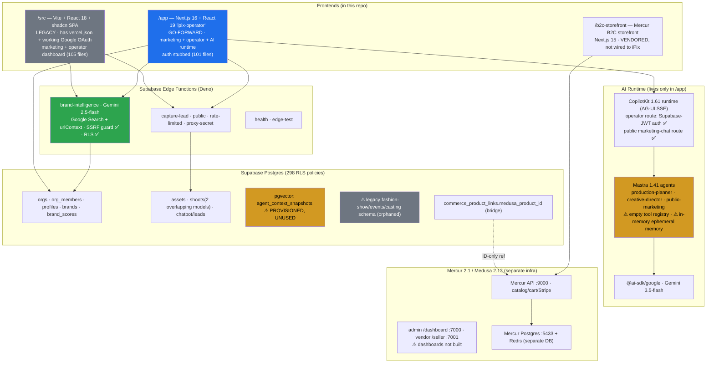

# iPix / Lumina Studio — Comprehensive Audit & Roadmap

**Date:** 2026-06-25
**Auditor:** Claude Code (read-only audit, no application code modified)
**Scope:** Architecture · codebase · Supabase · AI stack (Mastra/CopilotKit/Gemini/Graphify) · Mercur/Medusa commerce · Linear (IPI2 + iPix teams) · GitHub org · website · security · performance
**Method:** Five parallel evidence-grounded exploration streams across the repo, live Linear MCP, and GitHub MCP. Recommendations are based on the actual project state and official framework conventions. No issues or code were mutated.

> **Honesty caveats up front**
> 1. **Live website could not be fetched.** The remote environment's network policy denies outbound to `ipix.co`, `www.ipix.co`, `fashionos.co`, `www.fashionos.co` (proxy returned `403 CONNECT … policy denial`). The website audit below is therefore **source- and docs-based** (the marketing pages live in-repo) — not a live crawl. A live crawl should be re-run from an unrestricted environment.
> 2. **MVP readiness is contested.** The operator UI claims "6/8 proofs green"; the in-repo forensic audit (`todo.md`) verifies "1/8". This audit treats unverified claims as unverified.

---

## 1. Executive Summary

iPix / Lumina Studio is an **AI-native brand-intelligence + photography-production platform for fashion / eCommerce brands**. The core loop is: *operator pastes a brand URL → Gemini analyzes it → produces a Brand DNA profile + readiness scores → drives shoots/campaigns → scores asset DNA compliance → links assets to commerce products.* A separate Mercur/Medusa marketplace provides the commerce layer.

**What is genuinely working today:**
- A real **Gemini brand-intelligence edge function** (`gemini-2.5-flash`, Google Search + URL-context grounding, SSRF-guarded, RLS-scoped) that produces a brand profile and 4 readiness scores. This is the product's beating heart and it is solid.
- A **public marketing site** (home + 9 service pages + login + 404), fully ported to Next.js.
- A **public homepage AI chatbot** (capture-lead edge fn + `public-marketing-agent` + chat widget) shipped end-to-end with a 243-test suite.
- A **mature Supabase data layer** — ~100 migrations, 298 RLS policies, a 2026-01 hardening wave, org/multi-brand layer (orgs + members + auto-owner).
- A **standalone Mercur 2.1 / Medusa 2.13 marketplace** with a seeded 10-SKU fashion catalog and a proven Stripe test-mode paid order.

**The central structural problems:**
1. **Two competing frontends with no cutover plan.** A legacy Vite SPA (`/src`, 105 files, the *only* one with `vercel.json` and working Google OAuth) and a Next.js rewrite (`/app`, 101 files, where all the AI lives, but auth is stubbed). They re-implement the **same** marketing site and operator dashboard against the same backend. This is the #1 source of drift and wasted effort.
2. **The "AI-native" engine is scaffolding, not a feature.** Mastra agents exist (`production-planner`, `creative-director`, `public-marketing-agent`) but the **tool registry is empty** (`agentTools = {}`), memory is **in-memory/ephemeral** (no Supabase persistence), and **no CopilotKit actions are registered** — so agents "act as consultants" (generate text) rather than executing workflows or writing to the DB. The product vision depends on exactly this layer.
3. **An exposed secret is live and unowned.** `VITE_GEMINI_API_KEY` was shipped to Vercel client-side; remediation (IPI2-134) is **Urgent but sits unstarted in Backlog**.
4. **Process/identity sprawl.** Three product names (iPix / FashionOS / Lumina Studio), two domains (`ipix.co` / `fashionos.co`), **two near-identical Linear teams** (`IPix`/`IPI2-*` 175 issues vs `iPix`/`IPI-*` 22 issues) with broken cross-links and phantom IDs, **98 GitHub repos** (mostly disposable Lovable/v0 experiments), and `docs/index-docs.md` referencing hundreds of files that don't exist.

**Strategic read:** The hard parts that usually kill these products (grounded brand intelligence, RLS, commerce proof, a marketing funnel) are **done or de-risked**. The remaining work is **consolidation and execution discipline**, not invention: pick one frontend, make the agents actually *do* things (CopilotKit actions + Mastra tools + persistent memory), close the security gaps, and collapse the duplicate teams/repos. With focus, an honest **8/8-proof MVP is ~30 days out**; an agentic "operator OS" is the 90-day prize.

**Overall completion (corroborated by in-repo `changelog.md`):** Product ~42% · Brand Intelligence ~90% · AI Agent Runtime ~20% · Commerce ~45% · Analytics ~10% · Messaging 0%.

---

## 2. Current Architecture

**Deployment:** Root Vite SPA → Vercel (`vercel.json` SPA rewrite). `/app` Next.js → would be a separate Vercel project (no root config points at it). Marketplace → its own Docker/infra (Postgres :5433 + Redis). **CI** (`.github/workflows/ci.yml`) covers the root Vite app + the `/app` Next app + a WEB-015 Supabase RLS test job. **The marketplace and b2c-storefront have zero CI coverage.**

**Frontend count: 3 (+ marketplace).** Headline duplication: the marketing site and operator dashboard exist **twice** (Vite vs Next), and there are **two shoot data models** (`public.shoots` legacy vs `shoot.*` schema).

---

## 3. Gap Analysis (designed vs built)

| Capability | Designed (docs/Linear) | Built (code) | Gap |
|---|---|---|---|
| Brand intelligence (URL → DNA + scores) | ✅ | ✅ edge fn, Gemini 2.5, grounded | **Closed.** Strongest area. |
| Marketing site (10 pages) | ✅ | ✅ in both Vite & Next | Duplicated; cutover (WEB-014/PLT-015) outstanding |
| Public AI chatbot + lead capture | ✅ | ✅ end-to-end | Intent/recommend/claim/analytics children still open |
| Operator shell / Command Center | ✅ | 🟡 shell only (In Review) | Most dashboards are placeholders |
| **Agent execution (CopilotKit actions)** | ✅ (vision core) | ❌ none registered | **Biggest gap.** Agents can't act/write/navigate |
| **Mastra tools** | ✅ (registry designed) | ❌ `agentTools = {}` | Empty — only a sample `weatherTool` referenced |
| **Mastra memory / persistence** | ✅ (AIOR-005) | ❌ in-memory `:memory:` | Ephemeral; no Supabase-backed memory |
| **pgvector / embeddings / RAG** | ✅ (context-engineering migration) | ❌ zero consumers | Dead SQL — provision exists, no code reads/writes it |
| Asset DNA scoring | ✅ (DNA-001) | 🟡 `audit-asset-dna` reportedly shipped (IPI-903) | DNA-001 itself **Canceled** but still a blocker for 3 issues |
| Cloudinary/DAM pipeline | ✅ (CLD-001…012) | ❌ Todo/Urgent, not started | Gates the entire asset theme (biggest unblock lever) |
| Commerce product links (Supabase↔Mercur) | ✅ (COM-030/031) | 🟡 table + RLS exist, no UI/hydrate/live row | Schema-ready, not wired e2e (proof #8 outstanding) |
| Analytics / growth | ✅ (ANA-001…005) | ❌ all Backlog | Untouched island; blocks dashboards/cost guardrails |
| AI cost/observability | ✅ (AI-004/008, AIOR-010) | ❌ Backlog | **Live Gemini in prod with no spend ceiling/logging** |
| Auth (Google OAuth) | ✅ | ✅ in Vite; 🟡 stubbed in Next | Must land in the go-forward (Next) app |
| Ops: backup/PITR, runbook, incident | ✅ (OPS/PLT-008) | ❌ Backlog | Commerce + site effectively live without these |

---

## 4. Linear Task Review

**Two teams (the marquee inconsistency):**

| Team | ID | Prefix | Issues | Role |
|---|---|---|---|---|
| **IPix** (audit target) | `f262105b…` | `IPI2-NNN` | **175** | Main backlog |
| **iPix** (lookalike, created 6 days later) | `27520111…` | `IPI-NN` | **22** | Parallel onboarding/brand-hub/org track + audit stubs |

The names differ only by capitalization. Cross-references are tangled: IPI2-100/101/102 link to `linear.app/ipix/IPI-22/47/88/94`, but those IPI-NN numbers are *onboarding* issues, not the intended DASH/ANA tasks. iPix issue titles embed phantom codes ("IPI-11 → IPI2-176", "IPI-16 → IPI2-189") that **don't exist** (IPI2 stops at 175).

**IPI2 status (175):** Backlog 79 · Done 44 · Canceled 31 · Todo 12 · In Progress 5 · In Review 4. → **43% already resolved or abandoned**; live working set ≈ 21 issues.
**IPI2 priority:** Urgent 26 · High 41 · Medium 90 · Low 14 · None 4.

**By project:** INTELLIGENCE 75 (24 Canceled — 32% noise) · IPIX-PLATFORM 36 · WEBSITE 29 · IPIX-COMMERCE 15 (13 Done) · IPIX-GROWTH 5 (all Backlog) · IPIX-AI 4 (vestigial) · IPIX-MVP 3 · shoot 2.

**Epics / themes:** Commerce-Mercur (INIT-002, proofs shipped) · Marketing site WEB-001…014 (~95% done) · Public chatbot WEB-015 (backend done) · Brand intelligence (AI-001/015.1, done) · **Agent runtime AIOR-001…010 (foundation done, memory/workflows/supervisor/observability Backlog)** · Shoot SHOOT-UX (schema done, UX Backlog, many dup-Canceled) · Asset/DAM CLD + DNA (not started) · Operator dashboards DASH/UI (shell only, most DASH Canceled) · Platform/Security PLT/SEC/OPS (DB done, security/ops Backlog) · Growth/Analytics ANA (untouched).

**Recently shipped (mostly 2026-06-24):** brand-intelligence v2 (IPI2-174), Brand Hub page (IPI2-175), WEB-015 chatbot stack (IPI2-160–167), real CopilotKit auth (IPI2-127), full marketing port (IPI2-145–157), org layer (IPI-16, commit 782ada7). IPI-11 onboarding is **In Progress, not Done** (PR #67 open) despite the brief implying it shipped.

**Dependency/blocker hotspots:**
- **CLD-001/002/003 (IPI2-59/60/61, Todo/Urgent)** gate the entire asset/DAM fan-out — the **single biggest unblock lever**.
- **DNA-001 (IPI2-19) is Canceled but still listed as blocker** for DNA-002 / AIOR-006 / AI-016 → dangling deps; no replacement deliverable tracked.
- **IPI2-116 SHOOT-UX-007** blocked by cross-team IPI-11/IPI-13 (onboarding/brand hub).
- ANA-001 (Backlog) gates dashboard analytics, revenue analytics, and cost guardrails — none scheduled.

**Duplicate codes across active issues:** SEC-001 (IPI2-52 & IPI2-134), AIOR-005 (IPI2-85 & IPI2-173), UI-002 (IPI2-23 & IPI2-175). SHOOT-UX-005…009 each exist twice (old Canceled / new live).

---

## 5. Website Audit (source- & docs-based — live crawl blocked)

**Marketing pages (10 + 2 utility, live in Next `(marketing)` and mirrored in Vite `/src/pages`):** `/` · `/login` · `/services/{fashion-photography, ecommerce-photography, clothing, amazon, location, jewellery, instagram, video, shopify}` · `*` (404). Shared template: Header → Hero → Feature grid → FAQ → Portfolio → CTA → Footer; fonts Cormorant Garamond + Outfit; DNA badge palette `#059669` / `#D97706` / `#DC2626`.

**Identity/domain unresolved:** docs reference `www.ipix.co` (sitemap) **and** `fashionos.co` (the actual marketing cutover target per `todo.md`), with brand candidates iPix vs FashionOS vs Lumina Studio still open. The repo README is an **untouched Lovable scaffold** (`URL: REPLACE_WITH_PROJECT_ID`).

**Competitor reference:** `docs/website/01/13-links.md` is a full ~115-URL sitemap of **blendstudios.com** (a London commercial photo studio) used as the structural/competitive model — useful input, not iPix's own site.

**Findings (from source + design docs):**
- **Missing pages/flows:** no `/pricing`, `/about`, `/contact`, `/blog`, `/case-studies`, `/portfolio` index, or legal (`/privacy`, `/terms`) routes present — all are standard conversion/SEO/trust pages the competitor has. The funnel currently dead-ends at service pages → login.
- **SEO:** marketing pages exist but there is no evidence of per-route metadata strategy, `sitemap.xml`/`robots.txt` generation, structured data (LocalBusiness/Service schema), or OG images in the audited source. WEB-014 (SEO/responsive/parity) is still **In Progress**.
- **UX:** two implementations risk visual drift between Vite and Next; the public chatbot is live (good lead-capture UX); onboarding (PR #67) improves first-run.
- **Accessibility:** not yet audited in-repo; no a11y test/CI gate found. Recommend axe/Lighthouse CI.
- **Performance:** Vite SPA = client-rendered (weaker SEO/LCP); the Next app gives SSR/ISR — another reason to make Next canonical.
- **AI opportunity:** the homepage chatbot can be extended to a brand-URL "instant DNA preview" (paste URL → teaser score) as a top-of-funnel hook directly reusing `brand-intelligence`.

> **Action:** re-run a live crawl (Lighthouse + axe + broken-link + meta extraction) from an unrestricted environment against the production domain once chosen.

---

## 6. GitHub Repository Audit

**`amo-tech-ai` org holds 98 repositories.** The vast majority are **disposable Lovable/v0/bolt experiments** with throwaway names — e.g. `sunaiv8`…`sunaiv18`, `startupaiv5/10/14`, `fashionos100/1000/-2000/-2025/co/v5/v7`, `andrew`/`andrewm`/`andrewmajtenyi`, `medellinaiv4`. These create real noise, dilute search, and are archival candidates.

**Repositories that matter:**

| Repo | Stack | Relevance | Recommendation |
|---|---|---|---|
| **`lumina-studio`** | TS · Vite+Next+Supabase+Mercur | **THE active iPix product** | Keep; make canonical |
| **`mdeapp`** | TS · **CopilotKit 1.55 + Mastra + Next 16 + Supabase + Gemini 3.5** | **Sister project, same exact AI stack, more mature agent runtime** (the "mde" Linear team) | **Mine for reusable agent/tool/memory patterns** — highest-value reuse in the org |
| `mdeai`, `mde` | TS / Python | Older Medellín concierge iterations | Reference/archive |
| `Designsystemforfashionos`, `Luxuryfashiontechdashboard`, `Fashionoswebsitehomepage` | TS | Early FashionOS design/UI explorations | Harvest design tokens then archive |
| ~85 others (`sunai*`, `startupai*`, `fashionos*`, named-person repos) | TS | Disposable scaffolds | **Archive in bulk** |

**Overlap/consolidation:** The org is a graveyard of restarts. The reusable signal is concentrated in **`mdeapp`** (proven Mastra+CopilotKit+Gemini wiring with persistent memory) — adopt its patterns into `lumina-studio` rather than re-deriving them. Everything FashionOS-prefixed predates the iPix pivot and should be archived to remove ambiguity around the "FashionOS" identity.

**This repo's PRs (4 open):**
- **#67** — IPI-11 onboarding wizard / brand intake (ready, not draft) — review & merge candidate.
- **#22** — IPI-23 Brand Intake screen (**draft**, states it supersedes #18) — likely superseded by #67's flow; reconcile/close.
- **#17** — IPI-12 COM-010D commerce dev scripts — stale (2026-06-18), rebase or close.
- **#7** — IPI-12 COM-010A commerce docs (XXL, 73 files) — stale (2026-06-14), likely already merged-equivalent; close.

**Repo hygiene:** README is the Lovable boilerplate; `.env.template` files carry upstream "Fleek Marketplace" cruft. No real secrets committed (placeholders only).

---

## 7. AI Agent Review

**Agents present (`app/src/mastra/`):**
- `production-planner` (alias `default` via a compat shim + `REQUIRED_AGENT_IDS` startup guard)
- `creative-director`
- `public-marketing-agent` (isolated instance on the public chat route)

**Reality check:**
- ✅ Agents are **registered and reachable** via CopilotKit AG-UI; operator route enforces Supabase-JWT auth at the HTTP boundary (fail-closed in prod). Public chat route is correctly unauthenticated + rate-limited.
- ⚠ **Instructions are one-liners**; agents have **no tools** (`agentTools = {}`), **no persistent memory** (LibSQL `:memory:`, two `@ts-expect-error` against the memory beta), and **no CopilotKit actions** — so they generate advice but cannot create brands, schedule shoots, write to Supabase, or navigate the app. The product's "every conversation triggers a workflow" thesis is therefore **not yet realized** (the docs themselves name this the root-cause gap).
- **Model drift:** edge fn pins `gemini-2.5-flash`; `/app` defaults `gemini-3.5-flash`. AI-018 (model registry/`_shared/gemini.ts`) is meant to unify this — still In Review.

**Designed-but-unbuilt agents:** `brand-intelligence` (as a Mastra agent vs the current edge fn), `asset-dna`, `product-linking`, `matching-agent`, `analytics`, and an `ipix-supervisor` orchestrator.

**Recommendation:** Treat "make agents act" as the #1 product investment: register CopilotKit actions for the operator's real verbs, populate the Mastra tool registry (brand CRUD, shoot brief, asset score, product link — each calling existing Supabase RPC/edge fns), add Supabase-backed Mastra memory, and gate all writes behind HITL approval cards (the 5-layer pattern in `docs/intelligence/ai/02-ai-native-dashboards-plan.md`).

---

## 8. MCP Review

**No `.mcp.json` is committed to the repo** — MCP servers are configured at the session/workspace level, not in-repo. The Mercur skill references the external **Mercur docs MCP** (`docs.mercurjs.com/mcp`) with an offline `llms.txt` fallback.

**MCP servers available to this audit session** (a good model for what the team's agent tooling should standardize on): **Linear, Supabase, GitHub, CopilotKit (docs/code search), Mercur (docs), Gmail, Mermaid Chart.**

**Findings & recommendations:**
- **Commit a `.mcp.json`** to `lumina-studio` so every contributor/agent gets the same server set (at minimum Supabase + Linear + GitHub + Mercur docs). Today this is implicit.
- **Supabase MCP** should be scoped to a least-privilege role for agent use (avoid service-role in interactive contexts).
- The **CopilotKit MCP** (docs/code search) is directly useful for building the agent actions in §7 — wire it into the dev workflow.
- No evidence of an MCP server exposed *by* iPix (e.g. a brand-intelligence MCP) — a future opportunity to let external agents query brand DNA.

---

## 9. Skills Review

**In-repo skills (`.claude/skills/`):** a single, well-built, iPix-customized **`mercur`** skill (v2.0.0) with 7 references (`cli`, `blocks`, `dashboard-page/form/tab-ui`, `medusa-ui-conformance`, `migration`). It enforces registry-first workflow, hard route/secret contracts, and an explicit **"Mercur ≠ Supabase"** boundary. Mirrored to `.cursor/`, `.codex/`, and `my-marketplace/`. This is the strongest piece of agent-governance in the repo.

**Gaps:** there is **no equivalent skill for the core iPix surfaces** — no skill for the Supabase/RLS conventions, the brand-intelligence edge-fn patterns, the CopilotKit/Mastra agent conventions, or the marketing-site component system. The one mature skill covers the *parallel* commerce track, while the *core* product (where most new work happens) has none.

**Recommendation:** author `supabase-rls`, `ai-runtime` (Mastra+CopilotKit conventions, the 5-layer dashboard pattern), and `marketing-site` skills so agent contributions to the core product are as governed as the Mercur track. Reuse `mdeapp`'s patterns as source material for the `ai-runtime` skill.

---

## 10. Graphify Review

**Graphify is developer tooling, not a runtime feature.** It appears only in `app/AGENTS.md`, which documents a `src/graphify-out/` knowledge-graph used for **code navigation** by the dev agents. There is **no product-facing knowledge graph** (the brand "knowledge graph"/"brand memory" concepts in the brief and in some Linear tasks are **aspirational**, not implemented).

**Where a real graph would live:** the closest provisioned substrate is the **pgvector context-engineering migration** (`agent_context_snapshots` + HNSW + `search_context_snapshots()` RPC) — which has **zero code consumers** today. The "brand knowledge graph / relationship builder / brand memory / context retrieval" items (INT-070…073 in the brief) map onto: (a) Supabase relational tables (brand → shoots → assets → products already modeled), plus (b) the unused pgvector layer for semantic retrieval.

**Recommendation:** Do **not** introduce a separate graph database. Realize "brand memory" as **Mastra memory persisted to Supabase + pgvector retrieval over `agent_context_snapshots`** (i.e. *use* the migration that already exists). Either build the pgvector consumer or drop the dead migration — don't leave it half-provisioned.

---

## 11. Security Review

| # | Severity | Finding | Evidence | Recommendation |
|---|---|---|---|---|
| S1 | **High** | **Exposed `VITE_GEMINI_API_KEY`** shipped client-side to Vercel; remediation Urgent but unstarted | IPI2-134 (Backlog, unassigned) | Rotate key now; move all Gemini calls server-side (edge fn already does this); delete the `VITE_`-prefixed key. Assign + close today. |
| S2 | **Medium** | **Shipped-before-security-reviewed**: public chatbot backend is Done but its security review (WEB-015.11 / IPI2-170) is Backlog | Linear | Do the review before further rollout; it's public + writes to DB. |
| S3 | **Medium** | **CORS `Access-Control-Allow-Origin: *`** on all edge functions | `supabase/functions/_shared/cors.ts` | Restrict to known origins (marketing + app domains); the SSRF/origin allowlist in capture-lead is good — extend that discipline to CORS. |
| S4 | Low/Med | **In-memory rate limiting** in capture-lead doesn't hold across edge replicas | `capture-lead/index.ts` | Move to a durable store (Postgres/Upstash) for real abuse resistance. |
| S5 | Low | capture-lead trust hinges on a single shared `CAPTURE_LEAD_PROXY_SECRET` | `capture-lead` | Acceptable short-term; rotate regularly, consider per-request signing. |
| S6 | Low | SEC-001 RLS audit, SEC-003/004, PLT-008 backup/PITR all Backlog | Linear | Schedule before public launch. |
| ✅ | — | **Strengths:** SSRF guard (blocks localhost/RFC1918/link-local/metadata), Gemini timeouts, payload caps, `sourceUrl` forced server-side, fail-closed config, RLS-scoped user clients, 298 RLS policies + 2026-01 hardening wave, no secrets committed | brand-intelligence + migrations | Maintain. |

---

## 12. Performance Review

- **Rendering:** Legacy Vite SPA is fully client-rendered → weaker LCP/SEO. The Next app provides SSR/ISR — **a concrete perf reason to make Next canonical** and retire the SPA.
- **Bundle/toolchain sprawl:** 3+ separate JS toolchains (root Vite/shadcn, `/app` Next, marketplace Turborepo, b2c Next), each with its own lockfile — higher install/build time and maintenance surface.
- **AI latency/cost:** brand-intelligence makes 2 sequential Gemini passes with 30s/20s timeouts — fine for an operator action, but **no cost tracking or spend ceiling exists** while Gemini runs in prod (AI-004/008, OPS-003 all Backlog). This is a financial-risk gap as much as a perf one.
- **DB:** RLS is extensive and FK indexes were added in the 2026-01 wave — healthy. Watch RLS policy complexity on hot paths (the optimization-guide migration suggests this was already a concern).
- **Edge rate limiting** is per-instance (see S4) — not a throughput limiter, an abuse gap.
- **Lint/quality debt:** `todo.md` reports a large lint backlog (cited ~8040 problems across the workspace); root `eslint.config.js` disables `no-unused-vars`. A clean lint gate per package would catch drift between the two frontends.
- **CI gap:** marketplace + b2c have **no CI** — commerce regressions (like the COM-012 shipping/Stripe break) are only caught manually.

---

## 13. Top 20 Recommendations

**P0 — do this week**
1. **Rotate & remove the exposed Gemini key** (S1 / IPI2-134); assign an owner, close today.
2. **Pick ONE frontend.** Declare Next.js `/app` canonical; freeze new feature work on the Vite SPA; write a cutover plan (auth, OAuth, Vercel project, DNS).
3. **Land Google OAuth in the Next app** (it works in Vite, is stubbed in Next) — prerequisite to retiring the SPA.
4. **Security-review the public chatbot** before further rollout (S2 / IPI2-170); restrict CORS (S3).
5. **Decide the name & domain** once: iPix vs FashionOS vs Lumina Studio; `ipix.co` vs `fashionos.co`. Everything downstream (SEO, README, branding) is blocked on this.

**P1 — the next 30 days**
6. **Make agents act:** register CopilotKit actions + populate the Mastra tool registry (brand CRUD, shoot brief, asset score, product link) wired to existing Supabase RPC/edge fns.
7. **Persist Mastra memory to Supabase** (replace `:memory:`); realize "brand memory" via the existing pgvector layer (AIOR-005).
8. **Unblock the asset/DAM spine:** ship CLD-001/002/003 (Cloudinary foundation) — it gates the largest fan-out.
9. **Re-issue DNA scoring** (DNA-001 is Canceled-but-blocking) or formally close its 3 dependents.
10. **Add AI cost tracking + spend ceiling** (AI-004/008, OPS-003) — Gemini is live with no guardrail.
11. **Add CI for marketplace + b2c-storefront** (build + the existing checkout smoke test).
12. **Complete proof #8** (one live Supabase↔Mercur product-link row + UI) to honestly hit MVP.
13. **Unify the Gemini model registry** (AI-018, `_shared/gemini.ts`) — kill the 2.5/3.5 drift.

**P1/P2 — process & hygiene**
14. **Collapse the two Linear teams** (or alias them); fix broken `linear.app/ipix/IPI-NN` cross-links and the phantom IPI2-176…189 codes; consolidate shoot work into one project.
15. **Archive the GitHub graveyard:** bulk-archive the ~85 disposable `sunai*/startupai*/fashionos*` repos; keep `lumina-studio` + `mdeapp` + a couple of design references.
16. **Mine `mdeapp`** for proven agent/tool/memory patterns instead of re-deriving them.
17. **Reconcile open PRs:** merge #67, close/rebase #22/#17/#7.
18. **Author core-product skills** (`supabase-rls`, `ai-runtime`, `marketing-site`) and commit a `.mcp.json`.
19. **Fix doc drift:** make `docs/index-docs.md` reflect reality (or delete it); write the missing PRD/MVP source-of-truth; replace the Lovable README.
20. **Add the missing marketing pages** (pricing, about, contact, legal, portfolio/case-studies) + SEO baseline (metadata, sitemap, robots, schema, a11y CI).

---

## 14. Proposed Linear Epics & Tasks

Format: `TASK-ID — Name` (to be created as new `IPI2-NNN` issues, since IPI2 currently ends at 175). Grouped into 6 proposed epics that map to the existing initiatives.

### EPIC A — `CONSOLIDATE-000` Frontend & Identity Consolidation *(P0, INIT-001)*
- `CONS-001 — Declare Next.js /app canonical; freeze Vite SPA feature work`
- `CONS-002 — Port Google OAuth + AuthContext from Vite to Next /app`
- `CONS-003 — Vite→Next route/feature parity matrix + cutover checklist`
- `CONS-004 — Single Vercel project + domain decision (ipix.co vs fashionos.co)`
- `CONS-005 — Decommission /src Vite SPA after parity sign-off`
- `CONS-006 — Replace Lovable README; write real PRD + MVP source-of-truth`

### EPIC B — `SECURE-000` Security & Secrets Hardening *(P0, INIT-001)*
- `SEC-010 — Rotate + remove exposed VITE_GEMINI_API_KEY (closes IPI2-134)`
- `SEC-011 — Restrict edge-function CORS to known origins`
- `SEC-012 — Durable rate limiting for capture-lead (replace in-memory)`
- `SEC-013 — Security review of public chatbot (promotes IPI2-170)`
- `SEC-014 — RLS audit pass (promotes SEC-001/IPI2-52) + backup/PITR (PLT-008)`

### EPIC C — `AGENT-000` Make Agents Act (Agentic Operator) *(P1, INIT-003)*
- `AGENT-010 — CopilotKit action registry for operator verbs (brand/shoot/asset/link)`
- `AGENT-011 — Populate Mastra tool registry wired to Supabase RPC/edge fns`
- `AGENT-012 — Supabase-backed Mastra memory (replace :memory:) — AIOR-005`
- `AGENT-013 — pgvector context retrieval consumer (use the existing migration)`
- `AGENT-014 — HITL approval cards before any DB write (5-layer pattern)`
- `AGENT-015 — Unify Gemini model registry _shared/gemini.ts (promotes AI-018)`
- `AGENT-016 — AI cost tracking + spend ceiling + agent logging (AI-004/008, OPS-003)`
- `AGENT-017 — ipix-supervisor orchestrator agent`

### EPIC D — `ASSET-000` Asset / DAM Pipeline *(P1, INIT-003)*
- `ASSET-010 — Cloudinary foundation (promotes CLD-001/002/003)`
- `ASSET-011 — Re-issue Asset DNA scoring engine (replaces Canceled DNA-001)`
- `ASSET-012 — Asset→Product mapping UI (COM-033/CLD-007)`

### EPIC E — `COMMERCE-000` Commerce Integration Completion *(P1, INIT-002)*
- `COMM-010 — Live Supabase↔Mercur product-link row + UI (proof #8, COM-030)`
- `COMM-011 — Mercur product webhooks → read-only hydrate (COM-031)`
- `COMM-012 — CI for my-marketplace + b2c-storefront (build + checkout smoke)`
- `COMM-013 — Product performance + revenue analytics foundation (COM-032/034)`

### EPIC F — `WEBSITE-000` Marketing Funnel & SEO *(P1, INIT-004)*
- `WEB-020 — Add pricing/about/contact/legal/portfolio pages`
- `WEB-021 — SEO baseline: metadata, sitemap.xml, robots.txt, schema.org, OG images`
- `WEB-022 — Accessibility + Lighthouse CI gate`
- `WEB-023 — Homepage "instant Brand DNA preview" funnel hook (reuse brand-intelligence)`
- `WEB-024 — Complete WEB-014 cutover + retire Vite marketing (PLT-015)`

### EPIC G — `OPS-000` Process Hygiene *(P2)*
- `OPS-010 — Merge/alias the IPix & iPix Linear teams; fix cross-links & phantom IDs`
- `OPS-011 — Consolidate shoot work into one project; close vestigial IPIX-AI`
- `OPS-012 — Bulk-archive ~85 disposable GitHub repos; document the canonical set`
- `OPS-013 — Commit .mcp.json + author core-product skills (supabase-rls, ai-runtime, marketing-site)`
- `OPS-014 — Reconcile open PRs (#67 merge; #22/#17/#7 close/rebase)`

---

## 15. Recommended Implementation Order

1. **Stop the bleeding (P0):** SEC-010 key rotation → CONS-001 declare canonical → SEC-011/013 chatbot+CORS → CONS-004 name/domain decision.
2. **Make the go-forward app whole:** CONS-002 OAuth in Next → CONS-003 parity matrix.
3. **Make agents real (the differentiator):** AGENT-010 actions → AGENT-011 tools → AGENT-012 memory → AGENT-014 HITL.
4. **Unblock assets:** ASSET-010 Cloudinary → ASSET-011 DNA scoring.
5. **Close the MVP proof:** COMM-010 live product link (proof #8) → AGENT-016 cost guardrail.
6. **Funnel & trust:** WEB-020/021/022 pages+SEO+a11y → WEB-023 DNA hook.
7. **Retire & consolidate:** CONS-005 kill Vite → OPS-010/012 teams+repos → COMM-012 marketplace CI.
8. **Hygiene continuously:** OPS-013/014, docs, skills.

---

## 16. Risks & Blockers

| Risk | Likelihood | Impact | Mitigation |
|---|---|---|---|
| Exposed Gemini key abused / billing spike | Med | High | SEC-010 now + AGENT-016 spend ceiling |
| Two frontends drift; double maintenance forever | High | High | CONS-001…005 cutover; freeze Vite |
| Agentic vision never ships (agents stay "consultants") | Med | High | EPIC C as the top product bet; reuse mdeapp |
| MVP declared done on unverified proofs (1/8 vs 6/8) | Med | Med | Honest proof ledger; COMM-010 closes #8 |
| Asset/DAM stalls everything downstream | High | Med | Prioritize CLD-001/002/003 |
| Linear/repo sprawl causes lost work & confusion | High | Med | OPS-010/012 consolidation |
| Commerce regressions invisible (no CI) | Med | Med | COMM-012 marketplace CI |
| Dangling Canceled-but-blocking deps (DNA-001) | High | Low | ASSET-011 re-issue / close dependents |
| Live website unaudited (env-blocked here) | High | Med | Re-run Lighthouse/axe/crawl from open env |

---

## 17. 30-Day Execution Roadmap (MVP-honest)

**Week 1 — Stop the bleeding & decide**
- SEC-010 rotate/remove Gemini key; SEC-011 CORS; SEC-013 chatbot review.
- CONS-001 declare Next canonical; CONS-004 name+domain decision.
- OPS-014 merge PR #67, close #22/#17/#7.

**Week 2 — Make the go-forward app whole**
- CONS-002 Google OAuth in Next; CONS-003 parity matrix.
- AGENT-015 unify Gemini model registry; AGENT-016 cost tracking/ceiling.
- COMM-012 add marketplace + b2c CI.

**Week 3 — Make agents act (MVP differentiator)**
- AGENT-010 CopilotKit actions; AGENT-011 Mastra tools (brand/shoot/asset/link).
- AGENT-012 Supabase-backed memory; AGENT-014 HITL approval cards.
- ASSET-010 Cloudinary foundation (CLD-001/002/003).

**Week 4 — Close the MVP & clean up**
- COMM-010 live Supabase↔Mercur product link (proof #8) → honest 8/8.
- ASSET-011 re-issue DNA scoring; WEB-024 marketing cutover; CONS-005 retire Vite.
- OPS-010 collapse Linear teams; OPS-012 archive dead repos.
- **Exit gate:** one operator can paste a URL → get DNA → create a brand → plan a shoot → score an asset → link a live product, *via agent actions with HITL*, on one canonical app, with no exposed secrets and CI green.

---

## 18. 90-Day Strategic Roadmap (MVP → Advanced → Enterprise)

**Days 0–30 — MVP (honest 8/8):** as above. One canonical app, agents that act, asset pipeline live, commerce link proven, secrets clean, identity decided.

**Days 31–60 — Advanced (the agentic operator OS):**
- `ipix-supervisor` orchestration across brand → shoot → asset → commerce.
- Generative dashboards (CopilotKit `useCoAgent`/`renderAndWaitForResponse`): brand intelligence report view, shot-list canvas, campaign planner — patterns harvested from `mdeapp` and the named CopilotKit examples.
- pgvector-backed brand memory + semantic retrieval (real "brand knowledge graph").
- Asset DNA compliance scoring at scale + auto product-linking agent.
- Full marketing funnel + SEO/a11y; "instant DNA preview" top-of-funnel; analytics funnel live (ANA-001…005).
- Read-only Mercur hydrate; revenue analytics; vendor/admin dashboards built.

**Days 61–90 — Enterprise:**
- Multi-brand / multi-org at scale on the existing org layer (RBAC, seats, approvals workflow).
- Observability + cost governance (per-org AI budgets, AIOR-010), audit logs, SLAs.
- Backup/PITR, incident runbook, production hardening (SEC/OPS epics).
- Optional: expose an **iPix brand-intelligence MCP server** so external agents/partners can query brand DNA; scheduled re-analysis / brand-history versioning; approval workflows.
- Durable rate limiting, durable queues for crawl/refresh, SOC2-track hygiene.

---

## Appendix — Evidence Index
- Codebase architecture: `src/`, `app/` (esp. `app/src/mastra/index.ts`, `tools/index.ts` empty registry, `app/AGENTS.md`), `vercel.json`, `.github/workflows/ci.yml`.
- Supabase: `supabase/functions/{brand-intelligence,capture-lead,_shared}`, `supabase/migrations/*` (esp. `20260621000000_context_engineering.sql`, `20260624000000_ipi16_org_layer.sql`).
- Commerce: `my-marketplace/` (Mercur 2.1.6 / Medusa 2.13.4), `b2c-storefront/`, `commerce_product_links` bridge.
- Docs: `docs/architecture/sitemap-ai-native.md`, `docs/intelligence/ai/02-ai-native-dashboards-plan.md`, `todo.md`, `changelog.md`, `docs/website/`.
- Linear: IPI2 team (175 issues) + iPix team (22), full dump captured during audit.
- GitHub: `amo-tech-ai` org (98 repos), `lumina-studio` PRs #7/#17/#22/#67, sibling `mdeapp`.
- Limitation: live site fetch blocked by environment network policy (`ipix.co`/`fashionos.co` → 403 policy denial).
