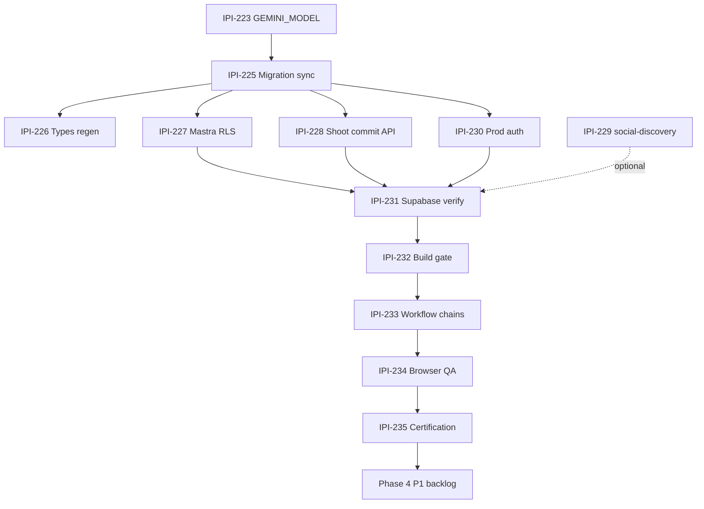
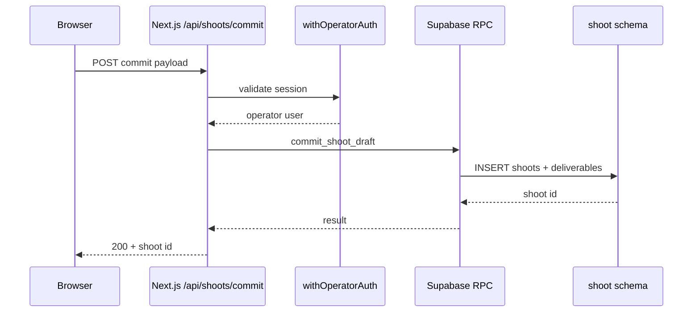
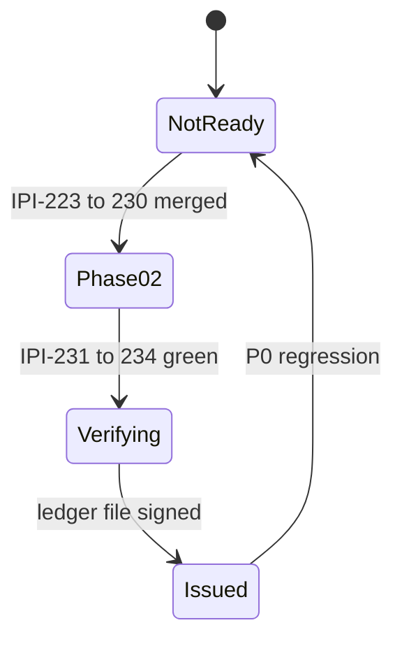

# Audit Fix Plan — Correct Execution Order

## Progress tracker — [IPI-222 epic](https://linear.app/amo100/issue/IPI-222)

**Updated:** 2026-06-28 (rev 4) · **Plan score:** 96% 🟢 · **Certification:** ❌ NOT ISSUED · **Progress:** 5 / 19 · Team [IPI](https://linear.app/amo100/team/IPI/all)

**Legend:** 🟢 Done · 🟡 In Progress / In Review · ⚪ Todo / Backlog · 🔴 Blocked

| # | Phase | Linear | Task | Audit | Labels | Status | Blocked by | Branch |
| ---: | --- | --- | --- | --- | --- | --- | --- | --- |
| — | Epic | [IPI-222](https://linear.app/amo100/issue/IPI-222) | Production certification epic | — | FIX | ⚪ Todo | — | — |
| 1 | 0.1 | [IPI-223](https://linear.app/amo100/issue/IPI-223) | GEMINI_MODEL env + registry | F-001 | GEMINI, MASTRA | 🟢 Done | — | [#129](https://github.com/amo-tech-ai/lumina-studio/pull/129) |
| 2 | 1.1 | [IPI-225](https://linear.app/amo100/issue/IPI-225) | Migration drift sync | F-004 | SUPA | 🟢 Done | — | [#130](https://github.com/amo-tech-ai/lumina-studio/pull/130) |
| 3 | 1.2 | [IPI-226](https://linear.app/amo100/issue/IPI-226) | Supabase types regen (V-003) | V-003 | SUPA | 🟢 Done | IPI-225 | [#133](https://github.com/amo-tech-ai/lumina-studio/pull/133) |
| 4 | 2.1 | [IPI-227](https://linear.app/amo100/issue/IPI-227) | Mastra RLS hardening + rollback doc | F-002 | SUPA, MASTRA | 🟢 Done | IPI-225 | [#134](https://github.com/amo-tech-ai/lumina-studio/pull/134) |
| 5 | 2.2 | [IPI-228](https://linear.app/amo100/issue/IPI-228) | Shoot commit via `/api/shoots/commit` → RPC | F-003 | SUPA, SHOOT | 🟢 Done | IPI-225 | [#136](https://github.com/amo-tech-ai/lumina-studio/pull/136) |
| 6 | 2.3 | [IPI-229](https://linear.app/amo100/issue/IPI-229) | social-discovery edge retire/deploy | — | SUPA, MASTRA | ⚪ Todo | — | `ipi/social-discovery-edge-or-retire` |
| 7 | 2.4 | [IPI-230](https://linear.app/amo100/issue/IPI-230) | Prod auth + CopilotKit | F-006 | SUPA, COPILOTKIT | ⚪ Todo | — | `ipi/ops-auth-prod-config` |
| 8 | 3.1 | [IPI-231](https://linear.app/amo100/issue/IPI-231) | Supabase verify + edge inventory | V-003/V-004 | SUPA | ⚪ Todo | IPI-230 | — |
| 9 | 3.2 | [IPI-232](https://linear.app/amo100/issue/IPI-232) | App + **Vercel** build gate | — | type:test | 🟡 Partial | — | CI exists (`.github/workflows/ci.yml`); ledger pending |
| 10 | 3.3 | [IPI-233](https://linear.app/amo100/issue/IPI-233) | Workflow chains API→DB | V-005 | SUPA, MASTRA, SHOOT, COPILOTKIT | ⚪ Todo | IPI-227,228 | — |
| 11 | 3.4 | [IPI-234](https://linear.app/amo100/issue/IPI-234) | Browser E2E + DevTools QA | V-001/V-002 | COPILOTKIT | ⚪ Todo | IPI-230 | — |
| 12 | 3.5 | [IPI-235](https://linear.app/amo100/issue/IPI-235) | Certification sign-off | Gate | FIX | ⚪ Todo | IPI-231–234 | `verification-ledger-YYYY-MM-DD.md` |
| 13 | 4 | [IPI-224](https://linear.app/amo100/issue/IPI-224) | Playwright bootstrap (dev docs) | F-014 | type:test | ⚪ Backlog | post-cert | `ipi/dev-playwright-setup` |
| 14 | 4 | [IPI-238](https://linear.app/amo100/issue/IPI-238) | Playwright in CI | F-014 | type:test | ⚪ Backlog | IPI-224 | `ipi/ci-playwright-e2e` |
| 15 | 4 | [IPI-237](https://linear.app/amo100/issue/IPI-237) | Rate limit AI API routes | F-011 | COPILOTKIT, SUPA | ⚪ Backlog | launch-scope | `ipi/api-rate-limit` |
| 16 | 4 | [IPI-236](https://linear.app/amo100/issue/IPI-236) | loading.tsx + error.tsx | F-005 | DESIGN, COPILOTKIT | ⚪ Backlog | post-cert | `ipi/operator-loading-error` |
| 17 | 4 | [IPI-239](https://linear.app/amo100/issue/IPI-239) | Legacy edge fn audit | Supa P1 | SUPA | ⚪ Backlog | post-cert | — |
| 18 | 4 | [IPI-240](https://linear.app/amo100/issue/IPI-240) | Gemini thinkingLevel | AI P1 | GEMINI, MASTRA | ⚪ Backlog | post-cert | `ipi/gemini-thinking-level` |
| 19 | 4 | [IPI-241](https://linear.app/amo100/issue/IPI-241) | Document chatbot RLS | Supa F-006 | SUPA | ⚪ Backlog | post-cert | docs-only |

**Related (existing):** [IPI-126](https://linear.app/amo100/issue/IPI-126) migration · [IPI-125](https://linear.app/amo100/issue/IPI-125) OAuth · [IPI-107](https://linear.app/amo100/issue/IPI-107) model registry

**Start:** #1 → #2 unblocks #3–7 → #8–12 verification gate → #13–19 post-cert P1 (Playwright CI / rate limits per launch scope).

### Architecture — epic execution order



### Shoot commit — locked path (IPI-228)



### Certification gate (IPI-235)



### Plan review (rev 3)

| Area | Status | Notes |
| --- | ---: | --- |
| Execution order | 🟢 | Build/env → migrations → RLS → commit path → verification |
| One concern per PR | 🟢 | Unchanged |
| Migration sync before DB changes | 🟢 | + CI drift gate (1.1) |
| Mastra RLS as P0 | 🟢 | + rollback plan (2.1) |
| Phase 3 verification ledger | 🟢 | Evidence → `docs/audit/verification-ledger-YYYY-MM-DD.md` |
| Shoot commit | 🟢 | **Path B only** — retire `save-approved-shoot-draft` edge fn |
| Playwright bootstrap | 🟡 | Moved from Phase 0 → Phase 4 (#13); manual QA in 3.4 uses local install |
| Rate limits / loading UX | 🟡 | Post-cert default; **pre-prod if public launch** |

---

Consolidated from [`2026-06-28-audit.md`](2026-06-28-audit.md) (app) and [`june-28-supa-audit.md`](june-28-supa-audit.md) (Supabase).

**Certification rule:** Production is **not certifiable** until rows **#1–#12** are 🟢 **and** [`docs/audit/verification-ledger-YYYY-MM-DD.md`](verification-ledger-YYYY-MM-DD.md) is filled with evidence.

---

## Execution principles (from skills + repo rules)

| Rule | Source |
| --- | --- |
| **One concern per PR / commit** — never mix migration + app + docs | `pr-workflow.mdc` |
| **Worktree branch** before any code: `ipi/<id>-short-name` | `CLAUDE.md` |
| **Migration sync before new RLS migrations** — repo must match remote history | `ipix-supabase` |
| **RLS migration → migration-reviewer → push → `verify-rls`** | `ipix-supabase` + subagent |
| **Never enable RLS without policies** (blocks all access) | Supabase advisor |
| **Service role / `GEMINI_API_KEY` never in client** | `ipix-supabase`, `gemini` |
| **Edge fn: `_shared/auth.ts`, CORS, deploy, update inventory, `verify-edge`** | `ipix-supabase` |
| **Mastra: `getMastra()` in handler only; `DATABASE_URL` pooler :6543 in prod** | `mastra` skill |
| **CopilotKit v2 `/v2` imports; prod needs `OPERATOR_AUTH_ENABLED` + `COPILOTKIT_LICENSE_TOKEN`** | `copilotkit` |
| **Gemini default `gemini-3.5-flash`; registry in `models.ts`; `thinkingLevel` on 3.5+** | `gemini` skill |
| **Storage MVP = Cloudinary metadata in Supabase — do not add buckets unless re-approved** | `ipix-supabase` |

### ID map (app audit ↔ supabase audit)

| App audit | Supabase audit | Topic |
| --- | --- | --- |
| F-001 | — | `GEMINI_MODEL` build |
| F-002 | F-001 (supa) | Mastra RLS |
| F-003 | F-003 (supa) | Shoot commit — `/api/shoots/commit` → RPC |
| F-004 | F-002 (supa) | Migration drift |

---

## Phase 0 — Unblock deploy (no DB writes)

> **Goal:** Green `npm run build` on prod-like env. **No migration risk.** Playwright bootstrap moved to Phase 4 (#13) — not a P0 gate.

### 0.1 — Fix `GEMINI_MODEL` env + registry

- [x] **App F-001** · PR: [#129](https://github.com/amo-tech-ai/lumina-studio/pull/129) · **code-only** · merged 2026-06-28

**Skill check (`gemini`):**
- **Default:** `gemini-3.1-flash-lite` (stable GA — [docs](https://ai.google.dev/gemini-api/docs/models/gemini-3.1-flash-lite))
- **Pro override:** `GEMINI_MODEL=gemini-3.5-flash` for heavy reasoning (paid keys)
- **Legacy:** `gemini-2.5-flash` in registry for edge parity
- Do **not** use `NEXT_PUBLIC_GEMINI_*`
- Prefer `thinkingConfig.thinkingLevel` over legacy `thinkingBudget` (lite supports thinking)

**Steps:**
1. Set `GEMINI_MODELS.default = gemini-3.1-flash-lite` in `app/src/mastra/models.ts`
2. Registry: default + pro (`3.5-flash`) + legacy (`2.5-flash`)
3. Update `models.test.ts` — default + override paths
4. Infisical/Vercel: unset `GEMINI_MODEL` (use default) or explicit `gemini-3.1-flash-lite`
5. Live smoke: `suggest-brief` or `models.test.ts` + one agent turn
6. Edge default alignment → separate PR / IPI-107 (app-only this PR)

**Verify:**
```bash
cd app && npm run build                    # with prod env snapshot
cd app && npm run typecheck && npm test
node scripts/check-client-env.mjs          # no AI keys in client
# Vercel: confirm preview/prod deploy build green (same env vars)
```

**Effort:** S · **Blocks:** nothing · **Blocked by:** nothing

---

## Phase 1 — Database source of truth (migrations only)

> **Goal:** Repo migration history matches remote. **No app code in this PR.**

### 1.1 — Reconcile migration drift

- [x] **App F-004 / Supa F-002** · PR: [#130](https://github.com/amo-tech-ai/lumina-studio/pull/130) · **migration-only** · merged 2026-06-28

**Skill check (`ipix-supabase`):**
- Remote-only policy — do not `supabase start`
- Do **not** rewrite applied remote history
- Fix duplicate timestamp: `20260626000001_brand_social_channels.sql` (remote) vs `20260626000001_shoot_portfolio_view.sql` (local) — **renumber** local-only file to new timestamp
- Pull remote-only SQL into repo:
  - `20260628105303` (`add_commit_shoot_draft_rpc`)
  - `20260628105606` (`fix_commit_shoot_draft_channel_cast`)
- Review then apply pending local migrations (one batch or ordered PRs):
  - `20260625000001_add_ai_profile_draft.sql`
  - `20260626000001_shoot_portfolio_view.sql` (after renumber)
  - `20260627170000_brands_rls_null_org_backfill.sql`
  - `20260627200000_shot_type_references.sql`

**Steps:**
1. `npm run supabase:migrations` vs MCP `list_migrations` — diff inventory
2. Export remote-only migration bodies into new repo files (match exact version names)
3. Renumber conflicting local migration
4. `migration-reviewer` on every new/edited SQL file
5. `infisical run -- npm run supabase:push` (or `db query --linked` + `migration repair` per README if blocked)
6. Confirm remote `schema_migrations` matches repo file list
7. **CI drift gate (follow-up PR, CI-only):** fail if MCP/CLI migration list ≠ `supabase/migrations/` count (prevents recurrence)

**Verify:**
```bash
infisical run -- npm run supabase:verify
infisical run -- npm run supabase:migrations   # parity with MCP list_migrations
```

**Effort:** M · **Blocks:** 1.2, 2.1, V-003 · **Blocked by:** nothing

---

### 1.2 — Regenerate TypeScript types (post-migration)

- [x] **V-003** · PR: [#133](https://github.com/amo-tech-ai/lumina-studio/pull/133) · **types-only** · merged 2026-06-28

**Skill check (`ipix-supabase`):** `npm run supabase:types` → commit `src/types/supabase.ts` (and `app/src/types/supabase.ts` if used)

**Steps:**
1. MCP `generate_typescript_types` OR `npm run supabase:types`
2. Diff against committed types — fix app compile errors in **separate** PR if needed

**Verify:**
```bash
npm run supabase:types
cd app && npm run typecheck
# diff: generated vs app/src/types/supabase.ts — expect empty or documented deltas
```

**Effort:** S · **Blocked by:** 1.1

---

## Phase 2 — Security & integration fixes

> **Goal:** Close Critical security + shoot commit path. **Separate PR per concern.**

### 2.1 — Mastra `public.mastra_*` RLS hardening

- [x] **App F-002 / Supa F-001** · PR: [#134](https://github.com/amo-tech-ai/lumina-studio/pull/134) · **migration-only** · merged 2026-06-28

**Skill check (`ipix-supabase` + `mastra`):**
- Principle: **every new iPix table in `public` has RLS** — no exceptions
- `@mastra/pg` PostgresStore creates 33 tables without RLS — Mastra uses **direct Postgres** via `DATABASE_URL` (not PostgREST)
- **RLS applies to direct connections** when the session role is not superuser — verify which DB role Mastra uses after migration
- Preferred fix:
  - **Option A (recommended):** `ENABLE ROW LEVEL SECURITY` on all `mastra_*` + policies allowing **service_role / Mastra DB role only** (deny anon/authenticated via PostgREST)
  - **Option B:** Move Mastra to schema excluded from PostgREST `db_schemas` (defer unless A insufficient)
- Use `(SELECT auth.uid())` pattern if any authenticated read needed later
- **Do not** enable RLS without policies

**Rollback plan (required in PR body):**
1. Keep forward migration idempotent where possible
2. Document reverse SQL in PR: `ALTER TABLE … DISABLE ROW LEVEL SECURITY` + drop policies (one file per table group)
3. If Mastra read/write breaks post-push: apply reverse migration via `supabase db query --linked` within 15 min
4. Smoke after rollback: `cd app && npm test` (mastra/durable, memory) + one CopilotKit chat turn

**Steps:**
1. List tables: `SELECT tablename FROM pg_tables WHERE schemaname='public' AND tablename LIKE 'mastra_%'`
2. Confirm Mastra connection role: `\du` / pooler user from `DATABASE_URL`
3. Write forward migration: enable RLS + policies for PostgREST roles; **explicit GRANT** for Mastra DB role if needed
4. `migration-reviewer` **mandatory**
5. Push to remote
6. **Verify Mastra still read/write** — not just “bypasses RLS” assumption

**Verify:**
```bash
infisical run -- npm run supabase:verify-rls   # 19 checks — must pass
# MCP get_advisors type=security — mastra RLS CRITICAL cleared
# Anon key SELECT on mastra_threads must fail:
# curl -H "apikey: $ANON" .../rest/v1/mastra_threads → 401 or empty denied
cd app && npm test   # mastra/durable, memory tests
# Runtime: CopilotKit chat persists thread (mastra_threads row created)
```

**Effort:** M · **Blocks:** certification · **Blocked by:** 1.1 (clean migration line)

---

### 2.2 — Shoot commit via Next.js API + RPC (**Path B only**)

- [x] **App F-003 / Supa F-003** · PR: [#136](https://github.com/amo-tech-ai/lumina-studio/pull/136) · **app-only** · merged 2026-06-28

**Decision (locked):** Do **not** deploy `save-approved-shoot-draft` edge fn. Use server route only:

```text
Browser → POST /api/shoots/commit → withOperatorAuth → RPC commit_shoot_draft → shoot.*
```

**Skill check (`ipix-supabase` + `mastra`):**
- Client today: `shoots/new/page.tsx:389` → `/functions/v1/save-approved-shoot-draft` — **replace**
- Remote already has RPC `commit_shoot_draft` (migration from Phase 1.1)
- Retire repo edge fn `supabase/functions/save-approved-shoot-draft/` + remove from inventory (separate edge/docs PR or same PR if edge-only delete)

**Steps:**
1. Add `app/src/app/api/shoots/commit/route.ts` with `withOperatorAuth`
2. Call `commit_shoot_draft` RPC with user-scoped Supabase client (RLS-safe)
3. Update wizard to POST `/api/shoots/commit` instead of edge URL
4. Delete or archive `save-approved-shoot-draft` edge fn from repo; update edge inventory
5. Unit test route + RPC error paths

**Verify:**
```bash
# Manual: complete shoot wizard → step 5 → row in shoot.shoots
# V-005 chain: Frontend → /api/shoots/commit → RPC → DB row
cd app && npm test   # route test if added
```

**Effort:** S–M · **Blocked by:** 1.1 (RPC on remote)

---

### 2.3 — Deploy or retire `social-discovery` edge fn

- [ ] **Supa inventory gap** · PR: separate from 2.2 · **edge-only OR docs-only retire**

**Skill check (`ipix-supabase`):**
- Repo has `supabase/functions/social-discovery/index.ts` — not on remote
- Mastra also has `social-discovery` **agent** in app — not the same as edge fn
- Either deploy edge fn **or** delete repo stub + document that social discovery runs via Mastra agent only

**Verify:** `npm run supabase:verify-edge` inventory match

**Effort:** S

---

### 2.4 — Production auth + CopilotKit config

- [ ] **App F-006** · PR: `ipi/ops-auth-prod-config` · **config-only** (Infisical/Vercel, no secrets in repo)

**Skill check (`copilotkit` + `ipix-supabase`):**
- Set `OPERATOR_AUTH_ENABLED=true` in production
- Set `COPILOTKIT_LICENSE_TOKEN` when auth enabled (thread persistence — see `route.ts:48-53`)
- Without auth flag, CopilotKit cloud rejects `UNKNOWN_USER`
- Confirm prod redirect URLs (IPI-125) for OAuth

**Verify:**
```bash
# Unauthenticated GET /app → redirect /login
# Authenticated /api/copilotkit/info → 200
# No 401 console spam on operator layout
```

**Effort:** S · **Enables:** Phase 3 CopilotKit browser test

---

## Phase 3 — Verification & certification (no new features)

> **Goal:** Fill verification ledger. Mark ✅ only with command output or screenshot path.

### 3.1 — Supabase verification suite

- [ ] **V-003 (confirm)** · **V-004** · Run after Phase 1–2

```bash
infisical run -- npm run supabase:verify
infisical run -- npm run supabase:verify-rls
infisical run -- npm run supabase:verify-edge
infisical run -- npm run supabase:verify-brand-intelligence   # if BI touched
node scripts/check-client-env.mjs
```

- [ ] **V-004** Edge inventory: every `supabase/functions/*/index.ts` → deployed **or** deleted + inventory updated

| Repo function | Remote | Action |
| --- | --- | --- |
| `save-approved-shoot-draft` | ❌ | **Retire** — replaced by `/api/shoots/commit` (2.2) |
| `social-discovery` | ❌ | Deploy or retire (2.3) |
| `health`, `edge-test`, `brand-intelligence`, … | ✅ | Keep |
| Legacy FashionOS fns | ✅ deployed | P1 retire audit (IPI-239) |

---

### 3.2 — App build, Vercel env & unit gate

- [ ] Run on `main` after all Phase 2 merges
- [ ] **Vercel env parity:** `GEMINI_MODEL`, `DATABASE_URL`, `OPERATOR_AUTH_ENABLED`, `COPILOTKIT_LICENSE_TOKEN` match Infisical snapshot

```bash
cd app && npm run lint && npm run typecheck && npm test && npm run build
# Vercel: trigger prod/preview deploy — build must pass (not just local)
```

Record local + CI + Vercel deploy URL in verification ledger.

---

### 3.3 — API ↔ RPC ↔ DB runtime chains (**V-005**)

Execute each workflow; confirm DB rows + audit logs.

- [ ] **Brand intake:** onboarding → `brands` + `organizations` row
- [ ] **Brand intelligence:** crawl → `brand_crawls` → `brand_agent_results`
- [ ] **HITL approval:** approve → `brand_scores` / draft status change
- [ ] **Shoot wizard:** steps 1–4 → workflow snapshot (no commit yet)
- [ ] **Shoot commit:** step 5 → `shoot.shoots` + deliverables + shot_list
- [ ] **CopilotKit chat:** message → `mastra_messages` or stream (no cross-tenant leak post-2.1)

Document failure at exact chain link if any step fails.

---

### 3.4 — Browser QA (**V-001**, **V-002**)

**Skill check (`copilotkit`):** load `references/ipix-production.md` for prod smoke patterns.

**Test user matrix (required):**

| Persona | Account | Expect |
| --- | --- | --- |
| Operator (happy path) | `qa@ipix.test` | Full journeys succeed |
| Wrong tenant | second QA user or foreign `brand_id` | 403 / empty data — no cross-tenant leak |
| Unauthenticated | no session | `/app/*` → `/login`; API 401 |

- [ ] `npx playwright install` (local — bootstrap; formalized in Phase 4 IPI-224)
- [ ] Run full `e2e/` suite against `cd app && npm run dev` (:3002)
- [ ] Manual QA — journeys:

| Journey | Happy | Validation | Auth deny | Failure recovery |
| --- | --- | --- | --- | --- |
| Login | [ ] | [ ] | [ ] | [ ] |
| Brand creation | [ ] | [ ] | [ ] | [ ] |
| Brand AI | [ ] | [ ] | [ ] | [ ] |
| Brand HITL | [ ] | [ ] | [ ] | [ ] |
| Shoot wizard | [ ] | [ ] | [ ] | [ ] |
| Shoot commit | [ ] | [ ] | [ ] | [ ] |
| Shoot detail | [ ] | [ ] | [ ] | [ ] |
| Dashboard | [ ] | — | [ ] | — |
| AI chat | [ ] | — | [ ] | [ ] |

- [ ] Chrome DevTools: zero unexpected 4xx/5xx on operator routes
- [ ] Lighthouse (operator shell): record scores — **informational**, not blocking

---

### 3.5 — Certification sign-off

- [ ] All Phase 0–2 PRs merged to `main`
- [ ] All Phase 3 checks ✅ with evidence links
- [ ] Create **`docs/audit/verification-ledger-YYYY-MM-DD.md`** — copy table below + paste command output / screenshot paths
- [ ] Update audit docs: set `certification: issued` + date
- [ ] Linear: close IPI-222 sub-issues

**Verdict template:**
```
✅ Production certification ISSUED — YYYY-MM-DD
Evidence: docs/audit/verification-ledger-YYYY-MM-DD.md
```

Until then:
```
❌ NOT PRODUCTION-READY — certification NOT ISSUED
```

---

## Phase 4 — P1 (post-certification default; some pre-prod if public launch)

> **Launch scope:** Rate limits (F-011) and prod auth (2.4) may be **pre-prod requirements** for a public launch — track in IPI-237 / IPI-230. Playwright CI + loading UX are post-cert unless team wants earlier.

| ID | Task | PR type | When | Verify |
| --- | --- | --- | --- | --- |
| F-014 | Playwright bootstrap (dev docs) · IPI-224 | CI/config | Post-cert | `npx playwright test e2e/` |
| F-014 | Playwright in CI · IPI-238 | CI-only | After IPI-224 | Green on PR |
| F-011 | Rate limit `/api/copilotkit`, `/api/workflows/*` · IPI-237 | app-only | **Pre-prod if public launch** | Load test |
| F-005 | `loading.tsx` / `error.tsx` · IPI-236 | app-only | Post-cert | Slow AI route UX |
| Supa P1 | Legacy edge fn audit · IPI-239 | edge/docs | Post-cert | Unauthenticated invoke blocked |
| Supa P1 | Document chatbot default-deny RLS · IPI-241 | docs-only | Post-cert | Policy comment in migration |
| AI P1 | Align `thinkingLevel` · IPI-240 | app-only | Post-cert | Remove lone `thinkingBudget:0` |
| AI P1 | Token usage → `ai_agent_logs` | app-only | Post-cert | Logged per agent turn |

---

## Phase 5 — P2 / P3 (roadmap — not deploy gates)

| ID | Task | Notes |
| --- | --- | --- |
| F-007 | Placeholder nav UX (Assets/Campaigns/Matching) | Roadmap IPI2-72/119/123 — hide or label |
| F-010 | Operator sign-out | Only if MVP requires |
| F-008 | Document Stripe ↔ `my-marketplace/` boundary | Out of `app/` scope |
| F-009 | Cloudinary upload pipeline | PLT-011 — **not** Supabase buckets per skill |
| F-012 | Refresh `app/AGENTS.md` | Match live agent registry |
| F-013 | OpenTelemetry | P3 |
| — | Performance audit (bundle, SQL advisors, N+1) | P3 |
| — | Dependency audit (`npm audit`, unused deps) | P3 |
| — | AI prompt quality review | P3 |

---

## PR queue (recommended merge order)

| Order | Branch | Concern | Phase |
| ---: | --- | --- | --- |
| 1 | [#129](https://github.com/amo-tech-ai/lumina-studio/pull/129) | GEMINI_MODEL / registry | 0.1 | ✅ merged |
| 2 | [#130](https://github.com/amo-tech-ai/lumina-studio/pull/130) | Migration drift + CI drift gate | 1.1 | ✅ merged |
| 3 | [#133](https://github.com/amo-tech-ai/lumina-studio/pull/133) | Generated types | 1.2 | ✅ merged |
| 4 | [#134](https://github.com/amo-tech-ai/lumina-studio/pull/134) | Mastra RLS + rollback doc | 2.1 | ✅ merged |
| 5 | [#136](https://github.com/amo-tech-ai/lumina-studio/pull/136) | Shoot commit API → RPC | 2.2 | ✅ merged |
| 6 | `ipi/social-discovery-edge-or-retire` | Edge inventory | 2.3 |
| 7 | `ipi/ops-auth-prod-config` | Prod auth + CopilotKit | 2.4 |
| — | Phase 3 verification | Evidence → `verification-ledger-YYYY-MM-DD.md` | 3.x |
| 8+ | `ipi/dev-playwright-setup`, `ipi/ci-playwright-e2e`, … | Post-cert P1 | 4 |

**Never combine:** migration + app code · docs + production files · two Linear issues in one PR.

---

## Verification ledger (fill during Phase 3)

**Output file:** create `docs/audit/verification-ledger-YYYY-MM-DD.md` at sign-off (3.5) — do not leave evidence only in this plan.

| Step | Command / action | Pass | Date | Evidence |
| --- | --- | --- | --- | --- |
| 0.1 | `cd app && npm run build` (prod env) | | | |
| 0.1 | Vercel preview/prod deploy build | | | |
| 1.1 | Migration parity | | | |
| 1.1 | CI migration drift gate (if shipped) | | | |
| 1.2 | Type drift diff empty | | | |
| 2.1 | `supabase:verify-rls` | | | |
| 2.1 | MCP security advisor clear (mastra) | | | |
| 2.1 | Mastra chat thread persist (runtime) | | | |
| 2.2 | Shoot commit E2E via `/api/shoots/commit` | | | |
| 2.4 | Prod auth redirect | | | |
| 3.2 | lint/typecheck/test/build (local + CI) | | | |
| 3.3 | V-005 workflow chains | | | |
| 3.3 | Test user matrix (operator / wrong tenant / anon) | | | |
| 3.4 | V-001 Playwright + manual QA | | | |
| 3.4 | V-002 DevTools / Lighthouse | | | |

---

## Quick reference — skills per task

| Task | Read first |
| --- | --- |
| Migrations, RLS, edge deploy | `.claude/skills/ipix-supabase/SKILL.md` → `references/project-rules/` |
| Mastra storage, agents, workflows | `.claude/skills/mastra/SKILL.md` |
| CopilotKit prod, 401 debug | `.claude/skills/copilotkit/SKILL.md` → `references/ipix-production.md` |
| Model registry, thinking levels | `.claude/skills/gemini/SKILL.md` |

---

*Created from June 28 forensic audits · Rev 4 progress sync (5/19 merged) · Update tracker + `verification-ledger-YYYY-MM-DD.md` as PRs merge.*
