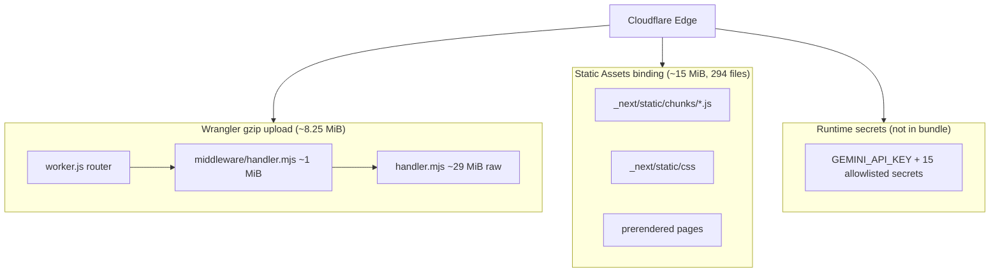

# OpenNext Worker Bundle Forensic Audit

**Repository:** `amo-tech-ai/lumina-studio` (`/home/sk/ipix`)  
**Audit date:** 2026-07-18  
**Auditor role:** Senior Cloudflare/OpenNext forensic auditor  
**Scope:** Inspect exactly what Wrangler uploads for `env.preview` — **no deploy performed**

---

## Executive Summary

| Metric | Value |
|--------|-------|
| **Commit SHA** | `6c97caaabba1508585aa4656ece132e51441f510` |
| **Uncompressed upload** | **42,464.83 KiB** (~41.47 MiB) |
| **Gzip upload (authoritative gate)** | **8,451.53 KiB** (~8.253 MiB) |
| **Paid limit headroom (10 MiB)** | **~1,788 KiB** (~1.75 MiB) |
| **Free tier (3 MiB)** | **FAIL** — would hit error 10027 |
| **iPix warn/fail gates** | WARN ≥ 8.5 MiB · FAIL ≥ 9.0 MiB → **OK (below warn)** |
| **Static assets (separate)** | 294 files · ~15 MiB in `.open-next/assets` |
| **Wrangler bundled inputs** | 249 modules (post-esbuild) |
| **OpenNext handler pre-bundle** | 1,805 inputs · ~31.94 MiB raw · `handler.mjs` 29 MiB |
| **Overall readiness score** | **72 / 100** |

Prior session bootstrap (`ipix-operator-preview` version `a3fd7130-6d63-41df-ae3b-e2d29da34816`) reported gzip ~8,454 KiB. This clean rebuild confirms **stable ~8.25 MiB** — reproducible, not a one-off measurement.

---

## Step 1 — Configuration Review

### `app/wrangler.jsonc`

| Setting | Value | Audit note |
|---------|-------|------------|
| Entrypoint | `.open-next/worker.js` | OpenNext-generated fetch router |
| Worker name (preview) | `ipix-operator-preview` | Matches IPI-472 SSOT |
| `compatibility_date` | `2026-07-08` | Current |
| `compatibility_flags` | `nodejs_compat` | Required for OpenNext ([CF Next.js guide](https://developers.cloudflare.com/workers/framework-guides/web-apps/nextjs/)) |
| Static assets | `.open-next/assets` → `ASSETS` binding | Uploaded separately from Worker script ([Static Assets](https://developers.cloudflare.com/workers/static-assets/)) |
| Service binding | `WORKER_SELF_REFERENCE` → self | OpenNext ISR/queue pattern — required |
| Images binding | `IMAGES` | next/image on Workers |
| Runtime vars | `MASTRA_STORAGE_MODE=noop`, `OPERATOR_AUTH_ENABLED=true` | Correct until Hyperdrive (IPI-619) |
| Wrangler aliases | shiki, `@shikijs/*`, `@mastra/pg`, `pg`, `@ast-grep/napi*` stubs | IPI-490 trim — **must pair with Turbopack aliases at build time** |
| Preview secrets.required | `GEMINI_API_KEY` only | Runtime secrets via Infisical sync workflow |

### `app/open-next.config.ts`

- Uses `defineCloudflareConfig({})` — no R2 incremental cache yet.
- Overrides `buildCommand` to `IPIX_CF_BUNDLE_STUBS=1 MASTRA_STORAGE_MODE=noop npm run build` so Turbopack aliases apply **before** OpenNext bundles `handler.mjs`.
- Critical: Wrangler `alias` alone is insufficient — OpenNext pre-bundles into `handler.mjs` first.

### `app/package.json`

| Package | Version |
|---------|---------|
| Node engine | `>=22` |
| `next` | `16.2.10` |
| `@opennextjs/cloudflare` | `^1.20.1` (resolved 1.20.1) |
| `wrangler` (devDep) | `^4.107.1` (resolved **4.110.0** at audit) |

Key scripts:

- `build:cf` → `opennextjs-cloudflare build && npm run check:worker-bundle`
- `check:worker-bundle` → `wrangler deploy --dry-run` with 8.5/9.0 MiB gates

Heavy runtime dependencies in Worker graph: `@mastra/core`, `@copilotkit/runtime`, `@ai-sdk/*`, `@supabase/*`, `cloudinary`, `@sentry/nextjs`.

### `.github/workflows/cloudflare-secrets-sync.yml`

Manual bootstrap workflow (IPI-472 + IPI-606):

1. Validate Infisical ↔ wrangler env pairing
2. `npm run cf-typegen` (live only)
3. `npm run build:cf` with real `NEXT_PUBLIC_SUPABASE_*` (live only)
4. `upload-opennext-with-secrets.mjs` → `opennextjs-cloudflare upload -- --secrets-file`

`dry_run=true` (default): secret name allowlist only — no build/upload.

### `app/scripts/upload-opennext-with-secrets.mjs`

- Writes ephemeral chmod-600 JSON → `--secrets-file` passthrough to OpenNext/Wrangler.
- Greenfield fallback: `deploy` if Worker script missing.
- Parses `worker_version_id` and `preview_url` from wrangler output for IPI-632 handoff.

### `app/scripts/check-worker-bundle-size.mjs`

- Runs `wrangler deploy --dry-run` (default env, not `--env preview` — sizes identical in this audit).
- Parses `Total Upload: X KiB / gzip: Y KiB`.
- Local `wrangler check startup` is diagnostic only — not authoritative remote `startup_time_ms`.

### `app/docs/opennext-ci.md`

Documents build-time vs runtime secret contract, CI placeholder Supabase vars, bundle gates, and manual preview upload steps. Aligns with observed pipeline.

---

## Step 2 — Official Documentation Verification

### Workers bundle limits

Source: [Workers platform limits — Worker size](https://developers.cloudflare.com/workers/platform/limits/)

| Limit | Free | Paid |
|-------|------|------|
| After gzip compression | **3 MiB** | **10 MiB** |
| Before compression | 64 MiB | 64 MiB |

Check size:

```bash
wrangler deploy --dry-run
# Total Upload: 42464.83 KiB / gzip: 8451.53 KiB
```

Official recommendation to reduce size: remove deps, store data in KV/R2/D1/Static Assets, **split across Workers via Service Bindings**.

### Wrangler `--dry-run` and `--metafile`

Source: [Wrangler deploy command](https://developers.cloudflare.com/workers/wrangler/commands/#deploy)

- `--dry-run`: compile without deploying — used for bundle gate.
- `--metafile`: esbuild build metadata for bundle analysis.

This audit used:

```bash
npx wrangler deploy --dry-run --env preview --metafile=.open-next/metafile.json
```

Also verified `wrangler versions upload --dry-run --env preview` — **identical sizes** (42,464.83 / 8,451.53 KiB).

### OpenNext on Cloudflare

Source: [OpenNext Cloudflare get-started](https://opennext.js.org/cloudflare/get-started) · [CF Next.js framework guide](https://developers.cloudflare.com/workers/framework-guides/web-apps/nextjs/)

- Requires `nodejs_compat` + `compatibility_date >= 2024-09-23`.
- `[assets]` binding serves static files; Worker handles dynamic routes.
- `WORKER_SELF_REFERENCE` service binding is standard for OpenNext queue/ISR.

### Service Bindings & Static Assets

- [Service bindings](https://developers.cloudflare.com/workers/runtime-apis/bindings/service-bindings/) — HTTP/RPC to another Worker without internet egress; no extra request fee on Standard pricing.
- [Static Assets](https://developers.cloudflare.com/workers/static-assets/) — deployed in same operation; assets **not counted** toward Worker gzip limit (separate 20k/100k file limits).

---

## Step 3 — Clean Build Evidence

### Environment recorded

| Tool | Version |
|------|---------|
| Node | **v22.23.1** |
| Wrangler | **4.110.0** |
| `@opennextjs/cloudflare` | **1.20.1** |
| `next` | **16.2.10** |
| Git HEAD | **6c97caaabba1508585aa4656ece132e51441f510** |

### Commands executed

```bash
cd /home/sk/ipix/app
npm ci
npm run cf-typegen
NEXT_PUBLIC_SUPABASE_URL=https://example.supabase.co \
NEXT_PUBLIC_SUPABASE_ANON_KEY=placeholder \
npm run build:cf
```

### Build output notes

- OpenNext build completed; `handler.mjs` saved at `.open-next/server-functions/default/handler.mjs`.
- Copy warnings for `@sindresorhus/slugify`, `@sindresorhus/transliterate`, `escape-string-regexp` — non-fatal.
- Bundle gate: **8.253 MiB gzip — OK** (below 8.5 MiB warn).

---

## Step 4 — Upload Inspection (Dry-Run Only)

### Wrangler dry-run output (preview env)

```
✨ Read 294 files from the assets directory .open-next/assets
Total Upload: 42464.83 KiB / gzip: 8451.53 KiB

Bindings:
  env.WORKER_SELF_REFERENCE (ipix-operator-preview)  Worker
  env.IMAGES                                         Images
  env.ASSETS                                         Assets
  env.MASTRA_STORAGE_MODE ("noop")                   Environment Variable
  env.OPERATOR_AUTH_ENABLED ("true")                 Environment Variable

--dry-run: exiting now.
```

### Size breakdown

| Artifact | Uncompressed | In gzip upload? |
|----------|-------------|-----------------|
| `.open-next/server-functions/default/handler.mjs` | ~29 MiB | **Yes** (dominant) |
| `.open-next/middleware/handler.mjs` | ~1.0 MiB | **Yes** |
| `.open-next/worker.js` + cloudflare glue | ~50 KiB | **Yes** |
| `.open-next/assets/` (288–294 files) | ~15 MiB | **No** (Static Assets binding) |
| `.open-next/cache/` | ~3.6 MiB | **No** (not uploaded) |

### Entrypoint chain

```
.open-next/worker.js
  → middleware/handler.mjs (edge middleware)
  → dynamic import("./server-functions/default/handler.mjs")
       → Next.js server + API routes + Mastra + CopilotKit
```

### Metafile analysis

**Wrangler post-bundle metafile** (`.open-next/metafile.json`): 249 inputs, 30.66 MiB input sum.

**Top post-Wrangler inputs:**

| Rank | Size (raw) | Module |
|------|-----------|--------|
| 1 | 29,500 KiB | `.open-next/server-functions/default/handler.mjs` |
| 2 | 1,017 KiB | `.open-next/middleware/handler.mjs` |
| 3 | 140 KiB | `node_modules/chat/dist/index.js` |
| 4–30 | <40 KiB each | micromark/remend/unified (markdown pipeline) |

**OpenNext pre-bundle metafile** (`handler.mjs.meta.json`): 1,805 inputs, 31.94 MiB.

**Top 20 pre-bundle modules (by raw bytes):**

| Rank | Raw KiB | Module |
|------|---------|--------|
| 1 | 1,400 | `.next/server/chunks/node_modules_13kxi4s._.js` (**Sentry**) |
| 2 | 1,399 | `.next/server/chunks/ssr/node_modules_16cl3nq._.js` (**Sentry instrumentation**) |
| 3 | 1,303 | `@mastra/core/chunk-XX3R7XDX.js` |
| 4 | 1,262 | `.next/server/chunks/ssr/_0p2a9nk._.js` (app + Mastra routes) |
| 5 | 818 | `@mastra/core/chunk-NT7SXV2D.js` |
| 6 | 687 | `[root-of-the-server]__1_ax7eb._.js` |
| 7 | 682 | `_0ayids4._.js` |
| 8 | 594 | `next/dist/.../app-page-turbo.runtime.prod.js` |
| 9 | 579 | `@copilotkit/web-inspector` |
| 10 | 572 | `@mermaid-js/parser` (mermaid core chunk) |
| 11 | 502 | `[root-of-the-server]__0lj7yl8._.js` |
| 12 | 493 | `next/dist/.../load-manifest.external.js` |
| 13 | 461 | `[root-of-the-server]__0ez-ja6._.js` |
| 14–15 | 435 | duplicate route chunks |
| 16 | 428 | `@mastra/core/chunk-DLQVS3UJ.js` |
| 17 | 420 | `cytoscape/dist/cytoscape.esm.mjs` |
| 18 | 404 | `node_modules_0rm71z1._.js` |
| 19 | 388 | `@mastra/core/chunk-TOBPSKTN.js` |
| 20 | 361 | `@mastra/core/chunk-TKDJVCV4.js` |

---

## Step 5 — Bundle Analysis

### What gets uploaded vs served separately



### Import chains — why each major dependency is included

| Dependency | Est. raw in handler | Why included | Import chain |
|------------|--------------------:|--------------|--------------|
| **@mastra/core** | 6.38 MiB | Agent runtime for CopilotKit + workflows | `/api/copilotkit` → `@ag-ui/mastra` → `getMastra()` → `@mastra/core` + all registered agents/tools at module load |
| **next runtime** | 2.63 MiB | OpenNext adapter requirement | OpenNext bundles Next 16 Turbopack server chunks |
| **Sentry (@sentry/nextjs)** | ~2.8 MiB | `withSentryConfig()` wraps entire Next config | `next.config.ts` → `@sentry/nextjs` → auto-instrumentation for 30+ frameworks (langchain, prisma, redis, etc.) |
| **mermaid + parser** | 1.97 MiB | Markdown rendering in chat UI pulled SSR | CopilotKit → `streamdown` → `mermaid` (SSR chunk despite `"use client"` boundary leakage) |
| **cytoscape** | 0.41 MiB | mermaid diagram layout dependency | mermaid → cytoscape |
| **katex** | 0.25 MiB | Math rendering in streamdown | streamdown → katex |
| **graphql** | 0.82 MiB | CopilotKit runtime protocol | `@copilotkit/runtime` → GraphQL Yoga stack |
| **@copilotkit/web-inspector** | 0.57 MiB | CopilotKit dev tooling bundled SSR | CopilotKit v2 react-core dependency graph |
| **@supabase/ssr + supabase-js** | 0.59 MiB | Auth middleware + API routes | Middleware auth + server Supabase clients |
| **@ai-sdk/** | 0.08 MiB | LLM provider adapters | Mastra agents + CopilotKit runtime peer deps |
| **@segment + posthog** | 0.55 MiB | Mastra default telemetry/analytics | `@mastra/core` observability hooks |
| **zod** | 1.17 MiB | Schema validation everywhere | Mastra tools, CopilotKit, API routes (some duplication via `zod-from-json-schema`) |
| **tr46** | 0.26 MiB | WHATWG URL IDNA tables | fetch/URL polyfill chain |
| **cloudinary** | ~0 MiB in handler | Tree-shaken or edge-only signing | Server routes import signing helpers only |
| **shiki/@shikijs** | **Stubbed** | IPI-490 Turbopack + Wrangler aliases | CopilotKit/streamdown → stub (~7.6 MiB saved) |
| **@mastra/pg / pg** | **Stubbed** | noop storage mode | Wrangler alias + Turbopack stub |

### Duplicates and concerns

1. **Sentry instrumentation bloat** — `node_modules_16cl3nq._.js` references langchain, prisma, redis, firebase, hapi, etc. that the app does not use. Sentry's default server bundle pulls all instrumentation plugins.
2. **SSR leakage of client-only viz** — mermaid/cytoscape/katex appear in server chunks despite shiki stub success; streamdown markdown pipeline is not server-stubbed.
3. **Duplicate route chunks** — `_20nzr92._.js` and `_0pkhx9l._.js` identical size (435 KiB) suggest Turbopack duplication.
4. **Direct eval warning** — esbuild warns on `eval()` in handler.mjs (env-var parsing) — startup risk.
5. **Static assets also contain large client chunks** (576 KiB, 572 KiB, 544 KiB) — separate from Worker limit but affects total deploy size and cold-cache performance.

---

## Step 6 — Large Dependency Recommendations

Est. savings use observed compression ratio **0.199** (8451.53 / 42464.83).

| Dependency | Verdict | Action | Est. gzip savings |
|------------|---------|--------|-------------------|
| **@mastra/core** (6.38 MiB) | **Required** (current arch) | **Separate Worker** via Service Binding for agent RPC; main Worker proxies `/api/copilotkit` | ~800–1,300 KiB |
| **Sentry** (~2.8 MiB) | **Optional** on Worker | Disable server SDK on CF build (`SENTRY_UPLOAD=0`, conditional `withSentryConfig`); use CF Observability + tunnel from browser only | ~400–570 KiB |
| **mermaid+cytoscape+katex** (~2.63 MiB) | **Optional** on server | Turbopack stub (mirror shiki pattern) or dynamic `import()` client-only | ~400–530 KiB |
| **@copilotkit/web-inspector** (0.57 MiB) | **Remove** from prod | Alias to empty module when `NODE_ENV=production` or CF build flag | ~110–120 KiB |
| **graphql** (0.82 MiB) | **Required** (CopilotKit) | Keep unless CopilotKit runtime replaced | — |
| **@segment/posthog** (0.55 MiB) | **Remove** on Worker | Mastra telemetry env flag / stub analytics providers | ~80–110 KiB |
| **next runtime** (2.63 MiB) | **Required** | OpenNext baseline — not trimmable | — |
| **@supabase/** (0.59 MiB) | **Required** | Auth — keep; Hyperdrive later for DB not bundle | — |
| **@ai-sdk/** (0.08 MiB) | **Required** | Agent inference — keep | — |
| **cloudinary** (~0) | **Required** | Already minimal — signing routes only | — |
| **shiki** (was ~7.6 MiB) | **Done** | IPI-490 stub + CDN bridge | Already saved ~1,500 KiB gzip |
| **zod duplication** (1.17 MiB) | **Lazy load** | Dedupe `zod-from-json-schema` nested zod | ~50–100 KiB |

**Combined realistic trim (without splitting Workers):** ~600–900 KiB gzip → would bring bundle to **~7.4–7.7 MiB**, adding **~2.5–2.8 MiB headroom**.

**With Mastra split Worker:** additional ~800 KiB → **~6.6–7.0 MiB** gzip.

---

## Step 7 — Linear Task Audit

### IPI-472 · INFRA-001 — OpenNext CI and Deployment Pipeline

| Field | Assessment |
|-------|------------|
| **Purpose** | CI + first preview upload path for `ipix-operator-preview` |
| **Status** | **Done** (2026-07-18) — reopened/closed cycle resolved |
| **Evidence this audit** | CI `.github/workflows/ci.yml` runs `build:cf` with placeholder Supabase vars; secrets-sync workflow implements build→upload→secrets-file; preview version `a3fd7130` from prior bootstrap |
| **Errors** | None in dry-run; prior free-tier deploy failed 10027 (expected) |
| **Blockers** | Remote `startup_time_ms` not recorded in this audit; rollback runbook untested |
| **Missing work** | Authoritative startup timing post-upload; production upload; observability verification on prod Worker |
| **Score** | **85 / 100** |

### IPI-490 · CF-MIG-210 — Worker Bundle Compatibility and Size Gate

| Field | Assessment |
|-------|------------|
| **Purpose** | Local dry-run gzip gate + supported bundle reductions before remote upload |
| **Status** | **Done** (2026-07-16) — PR #410 merged |
| **Evidence this audit** | **Second clean baseline recorded:** 8.253 MiB gzip (prior single-run 8.223 MiB); gate passes (< 9.0 MiB fail, < 8.5 MiB warn) |
| **Errors** | None |
| **Blockers** | Bundle still ~84% of paid limit — little margin for feature growth |
| **Missing work** | Acceptance criterion "contributors proven from generated bundle" — **now evidenced** in this audit; mermaid/Sentry/streamdown still untrimmed |
| **Score** | **82 / 100** |

### IPI-632 · CF-MIG-220 — Protected Preview Runtime Smoke Validation

| Field | Assessment |
|-------|------------|
| **Purpose** | Remote SSE/auth/agent-turn smoke on Cloudflare preview URL |
| **Status** | **Backlog** — local smoke ✅, remote blocked until preview URL live |
| **Evidence** | Preview Worker exists (version `a3fd7130`); this audit confirms upload payload ready for re-upload |
| **Errors** | Remote smoke not executed |
| **Blockers** | Needs stable preview URL + runtime secrets; thread restore gap (IPI-634) noted as non-blocking |
| **Missing work** | All remote acceptance criteria: login, `/api/copilotkit/info` 200, SSE streams, agent turn, OAuth callback, startup_time_ms |
| **Score** | **30 / 100** |

---

## Step 8 — Critical Blockers, Risks, Missing Tasks

### Critical blockers

| # | Blocker | Severity | Evidence |
|---|---------|----------|----------|
| 1 | **Free tier incompatible** | High for dev accounts | 8.45 MiB gzip >> 3 MiB limit (error 10027) |
| 2 | **Low paid-tier headroom (~1.75 MiB)** | High | Any Mastra agent, CopilotKit upgrade, or Sentry widen could breach 9.0 MiB iPix gate |
| 3 | **IPI-632 remote smoke not executed** | High | M1 Preview Live gate incomplete |
| 4 | **Sentry auto-instrumentation dead weight** | Medium | ~2.8 MiB raw for unused framework hooks |

### Risks

- **Startup time** — 29 MiB `handler.mjs` global scope parse; CF hard limit 1s ([limits doc](https://developers.cloudflare.com/workers/platform/limits/#worker-startup-time)). Local `wrangler check startup` did not parse ms.
- **Feature growth ceiling** — ~2 MiB effective budget before iPix fail gate at current architecture.
- **streamdown SSR leakage** — mermaid/cytoscape may execute on server paths where only plain text needed.
- **Re-upload drift** — Wrangler 4.110.0 vs lockfile 4.107.1; pin in CI for reproducibility.

### Missing tasks

1. Record authoritative remote `startup_time_ms` from preview upload (IPI-472 AC)
2. Execute IPI-632 remote smoke on `ipix-operator-preview` URL
3. Second-pass bundle trim: Sentry CF profile + streamdown/mermaid server stub
4. Hyperdrive binding (IPI-619) — removes need for pg stubs long-term
5. Rollback runbook test (IPI-472 AC)

---

## Step 9 — Architecture Recommendation

### Recommendation: **Staged split — trim first, split if needed**

**Evidence for keeping single Worker (near-term):**

- Current gzip **8.253 MiB < 9.0 MiB iPix gate** — preview re-upload can proceed.
- OpenNext `WORKER_SELF_REFERENCE` already uses service bindings for ISR — adding another binding is proven pattern.
- Static assets (15 MiB, 294 files) already correctly separated via `ASSETS` binding.

**Evidence for eventual split:**

- `@mastra/core` alone is **6.38 MiB raw (~1.3 MiB gzip)** — largest intentional dependency.
- CopilotKit route (`/api/copilotkit`) is the sole consumer — clean Service Binding boundary.
- [CF docs explicitly recommend](https://developers.cloudflare.com/workers/platform/limits/) splitting across Workers to reduce size.

### Proposed architecture (Phase 2)

```
                    ┌─────────────────────────────┐
  Browser ─────────►│ ipix-operator-preview       │
                    │ (OpenNext Worker ~6-7 MiB)  │
                    │  - Next pages/API (non-AI)  │
                    │  - Auth middleware          │
                    │  - ASSETS binding           │
                    └──────────┬──────────────────┘
                               │ Service Binding
                               ▼
                    ┌─────────────────────────────┐
                    │ ipix-agent-worker (~2 MiB)  │
                    │  - @mastra/core + agents    │
                    │  - CopilotKit runtime       │
                    │  - @ai-sdk providers        │
                    └─────────────────────────────┘
```

### Prioritized fixes (before preview re-upload)

1. **Proceed with re-upload** — bundle passes gate; headroom acceptable for smoke test.
2. **Record startup_time_ms** from upload output — gate IPI-472 completion.
3. **Run IPI-632 remote smoke** immediately after upload.
4. **Plan IPI-490 follow-up** — Sentry CF conditional + streamdown server stub (~600 KiB gzip).
5. **Evaluate Mastra Worker split** if post-smoke bundle growth or startup > 750 ms.

### Dependencies to remove (not lazy-load)

| Package | Rationale |
|---------|-----------|
| `@copilotkit/web-inspector` | Dev-only; 579 KiB raw in SSR |
| Sentry server instrumentation for unused frameworks | Conditional import / `withSentryConfig` guard on CF |
| `@segment/analytics-node` / posthog in Worker | Already in `serverExternalPackages` — stub at Turbopack layer |

---

## Appendix A — `.open-next/` Directory Inventory

| Path | Size | Uploaded? |
|------|------|-----------|
| `worker.js` | 2.3 KiB | Yes (entry) |
| `server-functions/default/handler.mjs` | 29 MiB | Yes |
| `middleware/handler.mjs` | 1.0 MiB | Yes |
| `assets/` | 15 MiB (294 files) | Static Assets |
| `cache/` | 3.6 MiB | No |
| `.build/durable-objects/` | ~50 KiB | Yes (DO exports) |
| `cloudflare/` | 48 KiB | Yes |
| `metafile.json` | 268 KiB | Local analysis only |

## Appendix B — Commands Reference

```bash
# Clean build (CI-equivalent)
cd app
npm ci && npm run cf-typegen
NEXT_PUBLIC_SUPABASE_URL=https://example.supabase.co \
NEXT_PUBLIC_SUPABASE_ANON_KEY=placeholder \
npm run build:cf

# Dry-run with metafile (preview env)
npx wrangler deploy --dry-run --env preview \
  --metafile=.open-next/metafile.json

# Versions upload dry-run (same sizes)
npx wrangler versions upload --dry-run --env preview
```

## Appendix C — Official Documentation Links

- [Workers platform limits](https://developers.cloudflare.com/workers/platform/limits/)
- [Wrangler deploy command (`--dry-run`, `--metafile`)](https://developers.cloudflare.com/workers/wrangler/commands/#deploy)
- [Static Assets](https://developers.cloudflare.com/workers/static-assets/)
- [Service bindings](https://developers.cloudflare.com/workers/runtime-apis/bindings/service-bindings/)
- [OpenNext Cloudflare adapter](https://opennext.js.org/cloudflare/get-started)
- [Cloudflare Next.js framework guide](https://developers.cloudflare.com/workers/framework-guides/web-apps/nextjs/)
- [Preview URLs / versions](https://developers.cloudflare.com/workers/versions-and-deployments/preview-urls/)

---

*Audit performed without Cloudflare deploy. No git commits made.*
