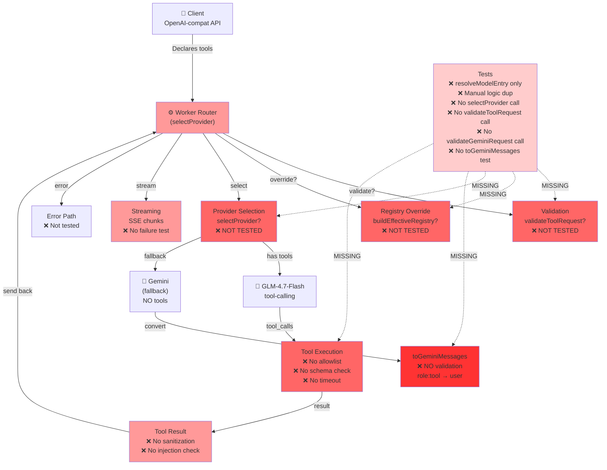
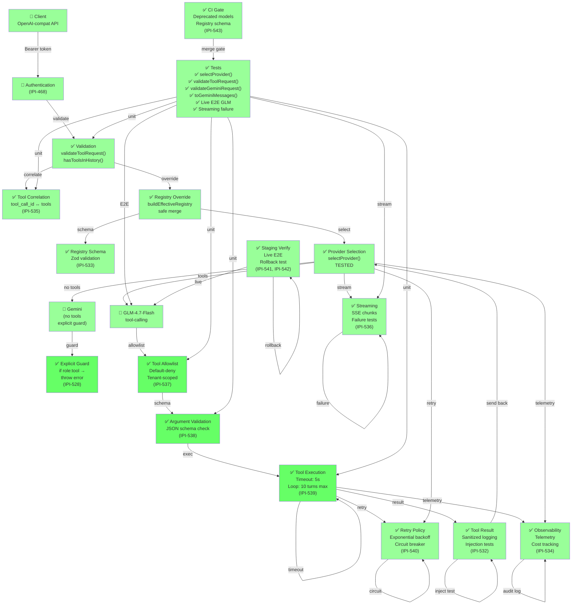
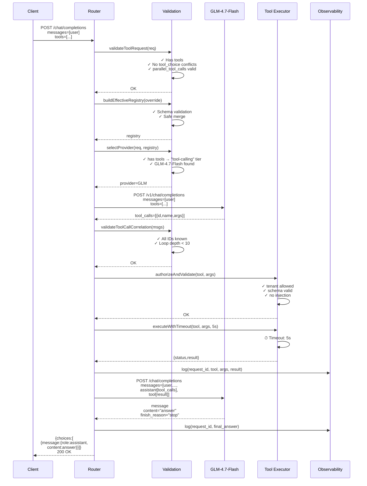
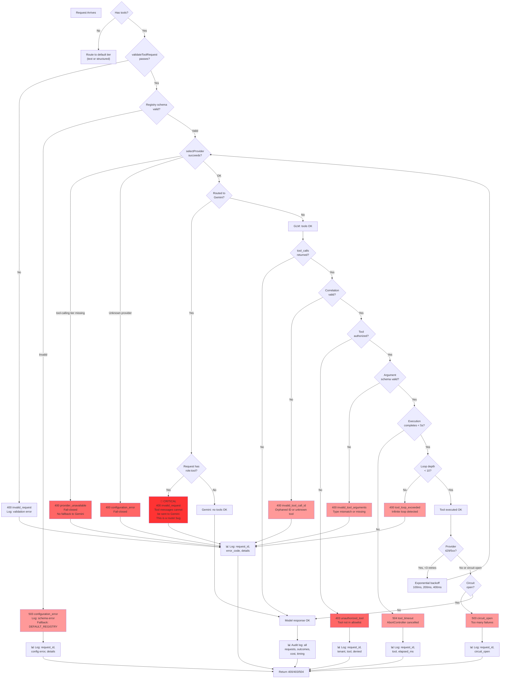

# PR #342 Architecture — Current vs Target State

## A. Current State Architecture (GAP ANALYSIS)

**Red flags:**
- ✗ `selectProvider()` never called in tests — only `resolveModelEntry()`
- ✗ `validateToolRequest()` not imported or called in tests
- ✗ `validateGeminiRequest()` guards entry but **not** `toGeminiMessages()`
- ✗ `toGeminiMessages()` silently converts role: "tool" → role: "user" (line 22–30)
- ✗ Tool execution: no authorization, schema validation, timeout, or loop limits
- ✗ Streaming: chunks can fail silently
- ✗ No live GLM E2E test
- ✗ Scoring 92/100 despite critical untested production paths

---

## B. Target State Architecture (PRODUCTION READY)

**Green lights:**
- ✓ Every production function directly tested
- ✓ Explicit Gemini rejection guard
- ✓ Tool allowlist with default-deny
- ✓ Argument schema validation before execution
- ✓ Execution timeout + loop bounds
- ✓ Streaming failure tests
- ✓ Live E2E GLM test
- ✓ Staging deployment + rollback verified
- ✓ CI gates for deprecated models and schema
- ✓ Observability: cost, error tracking, audit logs

---

## C. Multi-Turn Sequence (Correct Flow)

---

## D. Failure Decision Tree

---

## E. CI and Deployment Flow

```mermaid
graph LR
    PR["💬 PR #342<br/>Workers AI Tools"]
    
    Lint["🔍 Lint<br/>ESLint"]
    Type["🔍 Typecheck<br/>tsc --noEmit"]
    Unit["🧪 Unit Tests<br/>Vitest"]
    Build["🏗️ Build<br/>next build +<br/>opennextjs-build"]
    
    Lint -->|PASS| Type
    Type -->|PASS| Unit
    Unit -->|PASS| Build
    Build -->|PASS| BundleAudit["📦 Bundle Audit<br/>No secrets<br/>Size < 1MB<br/>No eval"]
    
    BundleAudit -->|PASS| IntegTest["🧪 Integration<br/>selectProvider()<br/>real route functions"]
    IntegTest -->|PASS| Security["🔐 Security Tests<br/>Injection<br/>Authorization<br/>Streaming"]
    Security -->|PASS| Deprecated["⚠️ CI Gate<br/>No deprecated models<br/>Registry schema valid"]
    
    Deprecated -->|PASS| Ready["✅ Ready for<br/>Staging"]
    
    Ready -->|Manual Approval| Staging["📤 Deploy Staging<br/>npm run deploy:staging"]
    Staging -->|SUCCESS| SmokeStaging["🧪 Smoke Test<br/>Basic tool-calling"]
    SmokeStaging -->|PASS| E2ELive["🧪 Live E2E<br/>Real GLM<br/>Multi-turn"]
    E2ELive -->|PASS| Rollback["🔄 Rollback Test<br/>Revert to prior<br/>Verify still works"]
    Rollback -->|PASS| ProdReady["✅ Ready for<br/>Production"]
    
    ProdReady -->|Manual Approval| Prod["📤 Deploy Production<br/>Gradual rollout<br/>0% → 10% → 50% →<br/>100%"]
    Prod -->|SUCCESS| Monitor["📊 Production<br/>Monitoring<br/>Error rate<br/>Cost tracking<br/>Tool usage"]
    Monitor -->|Green| Done["✅ Production<br/>Verified"]
    
    Lint -->|FAIL| Reject["❌ CI Failed"]
    Type -->|FAIL| Reject
    Unit -->|FAIL| Reject
    Build -->|FAIL| Reject
    BundleAudit -->|FAIL| Reject
    IntegTest -->|FAIL| Reject
    Security -->|FAIL| Reject
    Deprecated -->|FAIL| Reject
    SmokeStaging -->|FAIL| Reject
    E2ELive -->|FAIL| Reject
    Rollback -->|FAIL| Reject
    
    Reject -->|Fix + Retry| PR
    
    style PR fill:#ffff99
    style Ready fill:#99ff99
    style ProdReady fill:#99ff99
    style Done fill:#99ff99
    style Reject fill:#ff9999
```

---

## Diagram-to-Task Mapping

| Diagram Node | Linear Task | Why |
|--------------|-------------|-----|
| `validateToolRequest()` | IPI-527 | Integration test of router function |
| `validateGeminiRequest()` + `toGeminiMessages()` guard | IPI-528 | Explicit rejection of tool messages in Gemini path |
| `buildEffectiveRegistry()` + schema validation | IPI-533 | Runtime validation of registry entries |
| `selectProvider()` tests | IPI-527, IPI-530 | Core routing logic; all tiers and errors tested |
| Tool correlation (tool_call_id ↔ tools) | IPI-535 | Validation of multi-turn message coherence |
| Streaming chunk failures | IPI-536 | Robustness of SSE reconstruction |
| Tool allowlist + authorization | IPI-537 | Security: default-deny, tenant-scoped |
| Argument schema validation | IPI-538 | Security: reject invalid/malicious args |
| Execution timeout + loop limits | IPI-539 | Reliability: prevent hangs and infinite loops |
| Retry + circuit breaker | IPI-540 | Reliability: transient error handling |
| Live GLM E2E | IPI-541 | Verification: real model behavior |
| Staging deployment + rollback | IPI-542 | Operational: deployment safety |
| CI deprecated models + schema gate | IPI-543 | Configuration safety: merge-time checks |
| Error paths (all 400/403/504 codes) | IPI-531 | Comprehensive error scenario coverage |
| Observability + cost telemetry | IPI-534 | Production visibility |
| Audit log sanitization + injection tests | IPI-532 | Security: tool results as untrusted data |
| Correct evidence + scores | IPI-529 | Documentation: accurate audit report |

