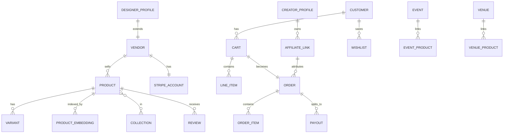
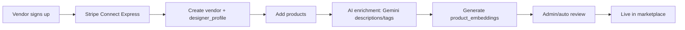
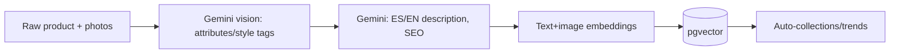
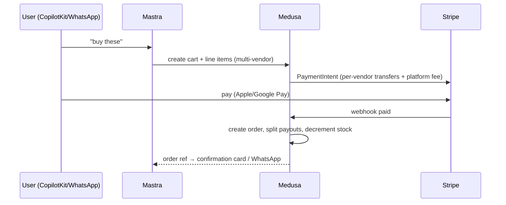

# mdeai Commerce Marketplace — Master Plan (MedusaJS)

> **Production-ready master plan** for an AI-powered Medellín lifestyle marketplace built by **adapting MedusaJS into the existing mdeai architecture** — not standing up a separate ecommerce app. Medusa is a **bounded commerce context** behind the mdeai brain (CopilotKit + Mastra + Gemini); Supabase stays the system of record for concierge/leads/events/trips; Stripe is the shared till.
> **Pairs with:** [`revenue-engine-prd.md`](revenue-engine-prd.md), [`chatwoot-integration-plan.md`](chatwoot-integration-plan.md), [`strategic-audit.md`](strategic-audit.md), [`task-backlog.md`](task-backlog.md).
> **Currency:** USD (FX 4,000 COP/USD). Numbers are benchmark/modeled estimates.

## Contents
1. [Executive Summary](#1-executive-summary) · 2. [Architecture](#2-architecture) · 3. [Marketplace Phases](#3-marketplace-phases) · 4. [Marketplace Features (100+)](#4-marketplace-features-100) · 5. [AI Features](#5-ai-features) · 6. [Revenue](#6-revenue-generation) · 7. [GitHub Repos](#7-github-repositories) · 8. [Database Design](#8-database-design) · 9. [Workflows](#9-workflow-architecture) · 10. [Roadmap](#10-roadmap) · 11. [Critical Recommendations](#11-critical-recommendations)

---

## 1. Executive Summary

| Question | Answer |
|---|---|
| **What are we building?** | An **AI-powered Medellín lifestyle marketplace** — fashion designers (Colombiamoda), boutiques, restaurants/cafes/nightlife products, tourism experiences, event/runway commerce, creator/influencer storefronts — all discoverable, stylable, and buyable through one Spanish-first AI concierge across web + WhatsApp. |
| **Why Medusa?** | Open-source, **headless, modular (v2 modules + workflows + Remote Link)**, self-hostable, API-first. It gives production-grade commerce primitives (products, variants, carts, orders, fulfillment, **multi-vendor via custom module**, Stripe payments) **without owning the frontend** — so it slots behind CopilotKit/Mastra instead of replacing them. |
| **Why not Shopify?** | Shopify owns the storefront + checkout + data and rents it back; multi-vendor needs costly apps; you can't embed an AI concierge as the primary buying surface; per-transaction lock-in; not WhatsApp-native; weak as a *headless commerce engine behind an AI*. We need an **engine, not a store**. |
| **Long-term vision** | The "lifestyle OS" of Medellín: ask the concierge anything, get recommended + booked + shipped across every vertical. Fashion graph + creator economy + experiences in one cart. |
| **Competitive advantage** | AI-concierge-first (not search-box-first) + WhatsApp commerce + real local supply + multi-vertical single cart + Spanish-first. No incumbent combines these. |
| **Revenue opportunities** | Product commissions, vendor subscriptions, featured/sponsored, event+runway commerce, creator/affiliate commissions, premium concierge, marketplace SaaS tools (see §6). |

**One-line thesis:** *Medusa is the commerce engine; mdeai is the brain and the storefront. Buy the engine, keep the brain.*

---

## 2. Architecture

### 2.1 System diagram

```mermaid
flowchart TB
    subgraph Front["Storefront = mdeai (no separate app)"]
        CK[CopilotKit web concierge + cards]
        WA[WhatsApp / Chatwoot commerce]
    end
    subgraph Brain["AI brain"]
        Mastra[Mastra agents + commerce tools]
        ADK[ADK grounding :8000]
        Gem[Gemini 3.5]
    end
    subgraph Commerce["MedusaJS (bounded context)"]
        MStore[Store API]
        MAdmin[Admin API + Vendor panel]
        MMod[Modules: products·cart·order·fulfillment·marketplace·payment]
        MPG[(Medusa Postgres)]
    end
    subgraph Shared
        SB[(Supabase + pgvector<br/>concierge·leads·events·trips·embeddings)]
        ST[Stripe Connect]
        CLD[Cloudinary]
        MAPS[Google Maps/Places]
    end
    CK --> Mastra
    WA --> Mastra
    Mastra -->|product search / cart / checkout| MStore
    Mastra --> ADK & Gem & MAPS
    Mastra -->|recommendations / memory| SB
    MMod --> MPG
    MStore & MAdmin --> MMod
    MMod -->|payments| ST
    MMod -->|media| CLD
    MMod -.->|product.created/updated events| SB
    SB -->|product_embeddings (pgvector)| Mastra
    ST -->|webhook| MMod
```

### 2.2 Data ownership & source of truth

| Domain | Source of truth | Notes |
|---|---|---|
| Products, variants, inventory, carts, orders, fulfillment, vendors | **Medusa Postgres** | Commerce bounded context — do **not** duplicate in Supabase |
| Concierge convos, leads, events grounding, trips, neighborhoods, venue signals | **Supabase** | Existing system of record |
| **Product embeddings** (semantic/visual search) | **Supabase pgvector** | Synced from Medusa via `product.created/updated` events → Mastra reads here |
| Payments | **Stripe** (Medusa payment module + Connect) | Single Stripe org; Medusa handles commerce charges, existing edges handle tickets/concierge |
| Media | **Cloudinary** | Medusa file module → Cloudinary |
| Identity | **Supabase Auth** | Medusa customer linked via `external_id = supabase user id` |

> **Golden rule:** Medusa owns *commerce objects*; Supabase owns *everything else + the vector index*. They integrate via **API + events**, never shared tables. This prevents the #1 marketplace-monolith mistake (two sources of truth for products).

### 2.3 Key flows (high level)

| Flow | Path |
|---|---|
| **Product search** | User → Mastra → pgvector semantic match (Supabase) → fetch live product/price/stock from Medusa Store API → CopilotKit cards |
| **Checkout** | Mastra `create_cart`/`add_line_item` → Medusa cart → Stripe payment (Connect, vendor payout + platform fee) → order → fulfillment |
| **Recommendation** | Mastra reads `agent_memory` + `product_embeddings` (Supabase) → ranks → Medusa for live data |
| **Vendor onboarding** | Vendor → Medusa Admin/vendor panel → Stripe Connect Express → products → AI enrichment (Gemini) → publish |

---

## 3. Marketplace Phases

### 3.1 Core Foundation

| Dimension | Detail |
|---|---|
| **Goals** | Medusa live behind mdeai; single-vendor → multi-vendor; AI product search + cart + checkout |
| **Features** | Product catalog, variants, cart, Stripe checkout, basic vendor accounts, Cloudinary media, semantic search |
| **DB schema** | Medusa core + `marketplace` module (`vendors`, `vendor_admins`, product↔vendor link); Supabase `product_embeddings` |
| **Workflows** | Vendor onboarding, product creation, AI enrichment, checkout |
| **Vendor mgmt** | Medusa Admin + custom vendor panel; Connect Express onboarding |
| **Product mgmt** | Medusa products + AI-assisted descriptions/tags (Gemini) |
| **Checkout** | Medusa cart → Stripe (destination charge, platform fee) |
| **AI integration** | Mastra `product_search`/`cart` tools; CopilotKit shopping cards |

### 3.2 MVP

| Dimension | Detail |
|---|---|
| **Goals** | Real multi-vendor commerce + AI shopping + cross-vertical (events/trips/maps) |
| **Features** | Designer storefronts, wishlists, reviews, AI stylist, WhatsApp commerce, boutique map |
| **User flows** | Discover → style → cart → pay → track; WhatsApp "buy this" |
| **Commerce flows** | Multi-vendor cart, split payouts, fulfillment, returns |
| **AI flows** | AI shopping assistant + stylist + recommendations |
| **Maps** | Boutique/venue product pins (single-pin-writer invariant) |
| **Trips** | Add buyable items to itineraries (bundle cart) |
| **Events** | Runway/event-linked products + ticket+merch bundles |

### 3.3 Advanced

| Dimension | Detail |
|---|---|
| **Goals** | Creator economy + social/influencer commerce + marketplace intelligence |
| **AI agents** | Stylist, Merchandiser, Vendor Assistant, Trend agent |
| **Automation** | AI enrichment, dynamic merchandising, restock/price suggestions |
| **Intelligence** | Fashion graph, trend analysis, demand signals |
| **Creator economy** | Creator storefronts, affiliate links, commission payouts |
| **Social commerce** | Shoppable content, IG/WhatsApp drops |
| **AI recommendations** | Personalized + visual (image embeddings) |

---

## 4. Marketplace Features (100+)

> Difficulty: S/M/L/XL · Priority: P0–P3 · Phase: C(ore)/M(VP)/A(dvanced). Compact for scanning.

### Vendor & storefront
| # | Feature | Description | User value | Revenue | Diff | Pri | Phase |
|--|--|--|--|--|--|--|--|
|1|Multi-vendor marketplace|Custom Medusa marketplace module|Selection|Commission|L|P0|C|
|2|Designer storefronts|Branded vendor pages|Brand|Sub+comm|M|P0|C|
|3|Vendor onboarding (Connect)|Self-serve KYC|Supply|Enabler|M|P0|C|
|4|Vendor dashboard|Orders/payouts/analytics|Retention|Sub|M|P1|C|
|5|Vendor subscription tiers|Starter/Growth/Pro|—|Sub|M|P1|M|
|6|Vendor AI assistant|Gemini drafts listings|Speed|Retention|M|P2|M|
|7|Vendor messaging (Chatwoot)|Buyer↔vendor chat|Trust|—|M|P2|M|
|8|Vendor verification badges|Trust signals|Trust|—|S|P2|M|
|9|Boutique map pins|Physical store discovery|Discovery|Featured|M|P1|M|
|10|Vendor payouts/statements|Connect transfers|Trust|Enabler|M|P0|C|

### Catalog & merchandising
| # | Feature | Description | User value | Revenue | Diff | Pri | Phase |
|--|--|--|--|--|--|--|--|
|11|Product catalog + variants|Sizes/colors|Core|Comm|M|P0|C|
|12|Collections|Curated groupings|Discovery|Featured|S|P1|C|
|13|AI product enrichment|Auto descriptions/tags|Quality|Conversion|M|P1|C|
|14|Cloudinary media pipeline|Optimized images|UX|—|S|P0|C|
|15|Inventory/stock sync|Real-time availability|Trust|—|M|P0|C|
|16|Visual/image search|Embedding-based|Discovery|Conversion|L|P2|A|
|17|Semantic search|pgvector NL search|Discovery|Conversion|M|P1|M|
|18|Faceted filters|Size/price/area/brand|UX|—|S|P1|M|
|19|Lookbooks|Editorial sets|Inspiration|Affiliate|M|P2|A|
|20|Fashion graph|Style/brand relationships|Personalization|Conversion|XL|P3|A|
|21|Trend boards|Trending styles|Discovery|Featured|M|P2|A|
|22|Dynamic merchandising|AI-ranked listings|Conversion|Featured|L|P2|A|
|23|Size/fit guidance|AI fit advice|Lower returns|—|M|P2|A|
|24|Bundles|Outfit/experience bundles|AOV|Comm|M|P1|M|
|25|Drops/limited releases|Timed launches|Urgency|Comm|M|P2|A|

### AI shopping
| # | Feature | Description | User value | Revenue | Diff | Pri | Phase |
|--|--|--|--|--|--|--|--|
|26|AI shopping assistant|Conversational buying|Ease|Conversion|M|P0|C|
|27|AI stylist|Outfit recommendations|Personalization|AOV|L|P1|M|
|28|AI concierge commerce|Cross-vertical buying|Convenience|Comm|M|P1|M|
|29|AI recommendations|Personalized feed|Engagement|Conversion|L|P1|M|
|30|AI bundles|Auto outfit/trip bundles|AOV|Comm|M|P2|A|
|31|AI gift finder|Occasion-based|Conversion|Comm|S|P2|A|
|32|Visual try-on (later)|AR/image|Engagement|Conversion|XL|P3|A|
|33|AI price/deal alerts|Wishlist drops|Retention|Conversion|M|P2|A|
|34|AI merchandiser (vendor)|Pricing/restock advice|Vendor value|Sub|L|P2|A|
|35|AI customer support|Order/returns bot|CSAT|Cost save|M|P1|M|

### Cart, checkout, payments
| # | Feature | Description | User value | Revenue | Diff | Pri | Phase |
|--|--|--|--|--|--|--|--|
|36|Cart (multi-vendor)|One cart many vendors|Convenience|AOV|L|P0|C|
|37|Stripe checkout|Cards + wallets|Conversion|Enabler|M|P0|C|
|38|Apple/Google Pay|One-tap|+20–50% mobile|Conversion|S|P0|C|
|39|Split payouts (Connect)|Vendor + platform fee|Enabler|Comm|L|P0|C|
|40|WhatsApp checkout|Payment link in chat|Reach|Comm|M|P1|M|
|41|Wishlists|Save items|Retention|Conversion|S|P1|C|
|42|Guest checkout|No-friction|Conversion|—|S|P1|C|
|43|Promo/discount codes|Campaigns|Conversion|Marketing|S|P1|M|
|44|Gift cards|Prepaid|Cash flow|Float|M|P2|A|
|45|Installments (later)|BNPL Colombia|Conversion|Fee|L|P3|A|
|46|Returns/refunds|RMA flow|Trust|—|M|P1|M|
|47|Order tracking|Status + notifications|Trust|—|M|P1|M|
|48|Tax/fees engine|Colombian tax|Compliance|—|M|P1|M|

### Cross-vertical commerce
| # | Feature | Description | User value | Revenue | Diff | Pri | Phase |
|--|--|--|--|--|--|--|--|
|49|Event commerce|Runway/event products|Discovery|Comm|M|P1|M|
|50|Ticket+merch bundles|Combined cart|AOV|Comm|M|P2|A|
|51|Trip commerce|Buyable itinerary items|Convenience|Comm|L|P2|A|
|52|Restaurant products|Vouchers/menus/merch|New rev|Comm|M|P2|A|
|53|Nightlife products|VIP packages/bottle pre-order|AOV|Comm|M|P2|A|
|54|Tourism experience products|Bookable + add-ons|Discovery|Comm|M|P1|M|
|55|Cafe loyalty/products|Beans/merch|Retention|Comm|S|P3|A|
|56|Local brand marketplace|Artisan goods|Discovery|Comm|M|P2|A|
|57|Fashion-week passes+commerce|Colombiamoda|Prestige|Comm+sponsor|L|P2|A|
|58|Boutique map commerce|Buy from map pin|Discovery|Featured|M|P2|A|

### Creator & social commerce
| # | Feature | Description | User value | Revenue | Diff | Pri | Phase |
|--|--|--|--|--|--|--|--|
|59|Creator profiles|Influencer pages|Discovery|Comm|M|P2|A|
|60|Creator storefronts|Curated shops|Discovery|Comm|M|P2|A|
|61|Affiliate links|Trackable referrals|Reach|Comm|M|P2|A|
|62|Creator commissions|Payout engine|Incentive|Comm|M|P2|A|
|63|Shoppable content|Tag products in posts|Conversion|Comm|L|P3|A|
|64|IG/WhatsApp drops|Social launches|Reach|Comm|M|P2|A|
|65|UGC reviews/photos|Social proof|Trust|Conversion|M|P2|A|
|66|Influencer campaigns|Brokered promos|Reach|Brokerage|M|P3|A|
|67|Live shopping (later)|Live commerce|Engagement|Comm|XL|P3|A|

### Trust, reviews, community
| # | Feature | Description | User value | Revenue | Diff | Pri | Phase |
|--|--|--|--|--|--|--|--|
|68|Reviews & ratings|Product/vendor|Trust|Conversion|M|P1|M|
|69|Verified purchase badges|Authenticity|Trust|—|S|P2|M|
|70|Wishlible sharing|Social shares|Reach|—|S|P3|A|
|71|Q&A on products|Buyer questions|Conversion|—|M|P2|A|
|72|Dispute resolution|Buyer protection|Trust|—|M|P2|A|
|73|Authenticity verification|Anti-counterfeit (fashion)|Trust|Premium|L|P3|A|

### Search, discovery, personalization
| # | Feature | Description | User value | Revenue | Diff | Pri | Phase |
|--|--|--|--|--|--|--|--|
|74|Personalized home|Per-user feed|Engagement|Conversion|L|P2|A|
|75|Recently viewed|Re-engagement|Conversion|—|S|P2|M|
|76|Trending now|Social proof|Discovery|Featured|S|P2|M|
|77|Near-me commerce|Geo (Maps)|Local discovery|Featured|M|P1|M|
|78|Multilingual (ES/EN)|Spanish-first|Reach|Conversion|M|P0|C|
|79|Saved searches/alerts|Notify on match|Retention|Conversion|M|P2|A|
|80|Cross-sell/upsell|At cart|AOV|Comm|M|P1|M|

### Vendor tools / marketplace SaaS
| # | Feature | Description | User value | Revenue | Diff | Pri | Phase |
|--|--|--|--|--|--|--|--|
|81|Vendor analytics|Sales/traffic|Retention|Sub|M|P1|M|
|82|AI listing optimizer|SEO/tags|Vendor value|Sub|M|P2|A|
|83|Inventory mgmt|Stock tools|Vendor value|Sub|M|P2|M|
|84|Promotions manager|Vendor-run sales|Vendor value|Sub|M|P2|A|
|85|Bulk import|CSV/feed|Onboarding|—|M|P2|M|
|86|Multi-location|Store + warehouse|Vendor value|Sub|M|P3|A|
|87|Marketing console|Campaigns/audiences|Vendor value|Sub|L|P3|A|
|88|Payout scheduling|Statements|Trust|—|M|P2|M|
|89|Tax reporting|Compliance docs|Vendor value|Sub|M|P3|A|
|90|API access (Enterprise)|Vendor integrations|Enterprise|Sub|M|P3|A|

### Monetization surfaces
| # | Feature | Description | User value | Revenue | Diff | Pri | Phase |
|--|--|--|--|--|--|--|--|
|91|Product commissions|Take-rate per sale|—|Comm|M|P0|C|
|92|Featured listings|Paid placement|Discovery|Featured|S|P1|M|
|93|Sponsored placement|Promoted products|Discovery|Ads|M|P2|A|
|94|Premium memberships|Buyer perks (MDE+)|Perks|Sub|M|P2|A|
|95|AI concierge subscription|Premium shopping AI|Convenience|Sub|M|P2|A|
|96|Affiliate/creator program|Commission network|Reach|Comm|M|P2|A|
|97|Vendor onboarding fee/setup|One-off|—|Setup|S|P2|M|
|98|Banner/category sponsorship|Brand placement|—|Ads|S|P2|A|
|99|Data/insights products|Trend reports|Vendor value|SaaS|L|P3|A|
|100|Marketplace SaaS tools|Standalone vendor tools|Vendor value|Sub|L|P3|A|
|101|Event/runway sponsorship|Reuse `sponsor.*`|Prestige|Sponsor|M|P2|A|
|102|WhatsApp commerce broadcasts|Opt-in drops|Reach|Comm|M|P2|A|

---

## 5. AI Features

> CopilotKit = the buying UI (cards, generative); Mastra = orchestration/tools; Gemini = reasoning/vision/copy; Supabase = memory + pgvector + business data; Medusa = live commerce.

| Feature | CopilotKit | Mastra | Gemini | Supabase |
|---|---|---|---|---|
| **AI shopping assistant** | Renders product cards + cart actions in chat | `product_search`, `add_to_cart` tools → Medusa | NL→intent, query rewrite | pgvector match, `agent_memory` |
| **AI stylist** | Outfit boards, swap UI | Compose outfit from catalog; bundle tool | Style reasoning, image understanding | image+text embeddings |
| **AI concierge (cross-vertical)** | One chat for shop+book | Routes shop/event/trip; multi-tool | Orchestration | leads/trips/events |
| **AI recommendations** | Personalized card feed | Ranking workflow | Preference inference | `recommendations`, embeddings |
| **AI trip planner** | Itinerary + buyable items | Bundle builder → Medusa cart | Plan reasoning | trips, itineraries |
| **AI bundles** | Bundle card + one-tap buy | `bundle_builder` | Pairing logic | embeddings, order history |
| **AI event assistant** | Ticket+merch cards | Event+commerce tools | NL | events, products |
| **AI vendor assistant** | Admin copilot | Draft listings, pricing | Copy + vision tagging | Medusa via API |
| **AI merchandising assistant** | Vendor dashboard insights | Demand/price workflow | Trend analysis | analytics, signals |
| **AI customer support** | In-chat order help | Order/return tools → Medusa | NL | orders, Chatwoot |

> **Shared-brain principle (again):** these are the *same* Mastra agents/tools serving web (CopilotKit) and WhatsApp (Chatwoot). Commerce tools (`product_search`, `cart`, `checkout`) are new Mastra tools that call the Medusa Store API.

---

## 6. Revenue Generation

| Stream | Model | Margin | Scalability | MVP/Adv |
|---|---|---|---|---|
| Product commissions | 8–20% take-rate (Connect app fee) | 85% on take | High | **MVP** |
| Vendor subscriptions | $29–$299/mo tiers | 90% | High | **MVP** |
| Featured listings | $29–$199/mo | 95% | High | **MVP** |
| Sponsored placement | CPM/flat | 90%+ | High | Adv |
| Event/runway commerce | 5–15% + sponsorship | 60–90% | Med | MVP+ |
| Ticket commissions | 5%+$0.40 (reuse G1) | 35% net | High | MVP |
| Affiliate/creator program | platform cut of creator comm. | 90% | High | Adv |
| Creator commissions | 10–20% creator take, MDE cut | 90% | High | Adv |
| Premium memberships (MDE+) | $5–$29/mo | 90% | High | Adv |
| AI concierge subscription | $9–$29/mo | 90% | High | Adv |
| Marketplace SaaS tools | vendor add-ons | 90% | High | Adv |

**Recommended take-rate ladder:** fashion goods **12–18%**, local brands **15–20%**, experiences **15%**, event merch **10–15%**, creator **platform cut of the creator's commission**. Lead with **vendor subscriptions + featured** (revenue before GMV liquidity), layer **commissions** as orders grow — same services-led-then-take-rate sequencing as the broader strategy.

---

## 7. GitHub Repositories

> Scores reflect fit for *headless Medusa-behind-AI marketplace*, not general popularity.

### Medusa
| Repo | Why | Copy | Don't copy | Score |
|---|---|---|---|---|
| `medusajs/medusa` (v2) | Core engine: modules, workflows, Remote Link | Module + workflow patterns, Stripe module | Don't fork core — extend via modules | **95** |
| Medusa **Marketplace recipe** (docs/examples) | Official multi-vendor blueprint (custom `marketplace` module, vendor↔product links, split orders) | The module/link/order-split approach | — | **93** |
| `medusajs/nextjs-starter-medusa` | Reference storefront | API usage patterns, cart/checkout calls | **Don't adopt its UI** — mdeai UI is CopilotKit | **70** (reference only) |
| Medusa **Stripe Connect**/payment examples | Vendor payouts | Connect destination-charge wiring | — | **85** |

### CopilotKit
| Repo | Why | Copy | Don't copy | Score |
|---|---|---|---|---|
| `CopilotKit/CopilotKit` examples | Generative UI + actions | Tool-render + `useCopilotAction` patterns (already on 1.55.2) | Version drift — stay pinned | **88** |
| CopilotKit commerce/agent demos | Shopping UI patterns | Card + cart-in-chat UX | — | **78** |

### Mastra
| Repo | Why | Copy | Don't copy | Score |
|---|---|---|---|---|
| `mastra-ai/mastra` examples | Agents/tools/workflows | Tool + workflow orchestration | — | **88** |
| Mastra RAG/pgvector examples | Semantic product search | Embedding + retrieval patterns | — | **82** |

### Marketplace references (study, don't adopt)
| Repo | Why | Copy | Don't copy | Score |
|---|---|---|---|---|
| `vendure-ecommerce/vendure` | Headless alt; good admin patterns | Multi-vendor concepts | Don't switch off Medusa | **72** |
| `saleor/saleor` | GraphQL commerce | API design ideas | Heavier stack | **68** |
| `bagisto/bagisto` | Laravel marketplace | Vendor UX ideas | Wrong stack | **55** |
| `medusajs/awesome-medusa` | Plugin/recipe index | Find vetted plugins | Quality varies | **75** |

> **Verdict:** build on **Medusa v2 core + the official marketplace recipe (custom module) + Stripe Connect**. Use the Next.js starter as an **API reference only** — the storefront is mdeai/CopilotKit. Treat community multi-vendor plugins as inspiration, not dependencies (v2 plugin ecosystem is young).

---

## 8. Database Design

> Commerce tables live in **Medusa Postgres** (managed by Medusa modules/migrations). Supabase adds the **vector index + cross-vertical links**. Below: logical model + which store owns each.



| Table | Owner | Key columns | Vector |
|---|---|---|---|
| `vendors` | Medusa (marketplace module) | id, name, stripe_account_id, status, commission_rate | — |
| `designer_profiles` | Supabase (extends vendor) | vendor_id, bio, colombiamoda, social | — |
| `creator_profiles` | Supabase | id, handle, vendor_id?, payout_account | — |
| `products` | Medusa | id, vendor_id, title, status, price | — |
| `variants` | Medusa | id, product_id, size, color, sku, inventory | — |
| `collections` | Medusa | id, title, vendor_id? | — |
| `carts` | Medusa | id, customer_id, items, totals | — |
| `wishlists` | Supabase | id, customer_id, product_ids[] | — |
| `orders` | Medusa | id, customer_id, total, status, payment_intent | — |
| `order_items` | Medusa | order_id, product_id, vendor_id, qty, price | — |
| `payouts` | Medusa | order_id, vendor_id, amount, transfer_id, fee | — |
| `reviews` | Supabase | id, product_id, customer_id, rating, body | — |
| `recommendations` | Supabase | customer_id, product_ids[], reason | — |
| `affiliates` | Supabase | id, creator_id, code, rate | — |
| `event_products` | Supabase (link) | event_id, product_id | — |
| `venue_products` | Supabase (link) | venue_id, product_id | — |
| `product_embeddings` | **Supabase pgvector** | product_id, text_embedding, image_embedding | **✅** |

**Sync:** Medusa emits `product.created/updated/deleted` → subscriber → upsert `product_embeddings` (Gemini embeddings) in Supabase. Mastra search hits pgvector then hydrates live data from Medusa.

---

## 9. Workflow Architecture

### 9.1 Vendor onboarding


### 9.2 AI product enrichment


### 9.3 Checkout (multi-vendor, split payout)


### 9.4 Other workflows (summary)
| Workflow | Path |
|---|---|
| Order fulfillment | order → vendor notified (Chatwoot) → ship/handoff → tracking → delivered → payout released |
| Event commerce | event → linked products → ticket+merch bundle cart → G1/Medusa checkout |
| Fashion commerce | runway/collection → drop → AI stylist → cart |
| Creator commerce | creator storefront → affiliate link → attributed order → creator payout |
| WhatsApp commerce | Chatwoot → Mastra product_search → payment link in chat → Medusa order |
| Recommendation engine | memory + embeddings → rank → Medusa hydrate → CopilotKit feed |

---

## 10. Roadmap

| Horizon | Goals | Deliverables | Dependencies | Risks | Revenue impact | Success metric |
|---|---|---|---|---|---|---|
| **30-day** | Medusa live behind mdeai (single-vendor) | Deploy Medusa (Hetzner/Coolify), Stripe module, 1 vendor, `product_search` Mastra tool, CopilotKit shopping cards, pgvector sync | Stripe, Cloudinary | Medusa v2 learning curve | First test sales | Checkout works E2E |
| **90-day** | Multi-vendor MVP + AI shopping | Marketplace module, Connect Express, vendor dashboard, AI stylist v1, WhatsApp commerce, reviews/wishlists | 30-day | Vendor onboarding friction | Commissions + vendor subs | 10 vendors, first $ GMV |
| **6-month** | Cross-vertical + creator economy | Event/trip/venue commerce, creator storefronts/affiliates, semantic+visual search, featured listings | 90-day, Connect | Scope creep | Take-rate + featured + creator | 50 vendors, GMV ramp |
| **12-month** | Intelligence + social commerce | Fashion graph, trend analysis, AI merchandiser, shoppable content, Colombiamoda activation, marketplace SaaS tools | 6-month | Marketplace complexity | Multi-stream | 150+ vendors, $50k+/mo |

---

## 11. Critical Recommendations

### Biggest opportunities
1. **AI-concierge-first buying** (not search-box) — the genuine differentiator.
2. **WhatsApp commerce** — buy via chat link in a market where WhatsApp is default.
3. **Cross-vertical single cart** — fashion + experience + event in one checkout.
4. **Colombiamoda/creator economy** — credibility + supply flywheel.

### Biggest risks
1. **Two sources of truth for products** (Medusa vs Supabase) → drift/bugs. **Mitigation: Medusa owns commerce, Supabase owns vector + links only.**
2. **Building a separate storefront app** → splits the brain, duplicates auth/UX. **Mitigation: storefront = mdeai/CopilotKit; Medusa is headless API only.**
3. **Liquidity (no vendors/buyers)** → **lead with vendor subscriptions + featured** (revenue before GMV).
4. **Medusa v2 maturity / plugin gaps** → extend via custom modules, avoid fragile community plugins.
5. **Operational load of fulfillment/returns** → start with digital/experience/pickup products before heavy logistics.

### Build first / defer
| Build first (Core/MVP) | Defer (Advanced) |
|---|---|
| Medusa headless + Stripe Connect + `product_search`/`cart` Mastra tools + CopilotKit cards | Live shopping, AR try-on, fashion graph, full social commerce |
| Multi-vendor + vendor subs + featured + AI stylist v1 + WhatsApp commerce | Creator economy at scale, marketplace SaaS tools, trend intelligence |

### Technical-debt & architecture mistakes to avoid
- ❌ Forking Medusa core (extend via modules/workflows).
- ❌ Adopting the Next.js starter UI (use CopilotKit; starter is API reference only).
- ❌ Duplicating product data in Supabase (only embeddings + cross-links).
- ❌ A second Stripe integration (one org; Medusa payment module + existing edges).
- ❌ A separate auth (link Medusa customer to Supabase user via `external_id`).
- ❌ Logistics-heavy launch (start asset-light).

### Marketplace launch strategy
1. **Supply first, niche first:** 10–20 Medellín fashion designers/boutiques (Colombiamoda network) — concentrated, credible.
2. **Lead with vendor subscriptions + featured** (cash before GMV liquidity).
3. **AI stylist + WhatsApp commerce** as the demand wedge.
4. **Expand verticals** (events/experiences/creators) once the fashion core has liquidity.

### Final prioritized implementation order (Core → MVP → Advanced)
```text
CORE      1 Deploy Medusa headless (Hetzner/Coolify) + own Postgres
          2 Stripe payment module; reuse Stripe org
          3 Mastra commerce tools (product_search, cart, checkout) → Store API
          4 CopilotKit shopping cards + cart-in-chat
          5 Cloudinary media; pgvector product_embeddings sync
          6 Single-vendor end-to-end checkout
MVP       7 Marketplace module (multi-vendor) + Connect Express payouts
          8 Vendor dashboard + subscription tiers + featured listings
          9 AI stylist v1 + recommendations + semantic search
          10 WhatsApp commerce (Chatwoot payment links) + reviews/wishlists
          11 Event/experience commerce (reuse G1 + Medusa)
ADVANCED  12 Creator storefronts + affiliates + creator payouts
          13 Visual search + fashion graph + trend intelligence
          14 Social/shoppable commerce + Colombiamoda activation
          15 Marketplace SaaS tools + data/insights products
```

### Scores
| Dimension | Score /10 |
|---|---|
| Architecture fit (Medusa-behind-mdeai) | 9 |
| Scalability | 8 |
| Complexity | 6 (Medusa v2 + multi-vendor is real work) |
| Implementation risk | 6 |
| Revenue potential | 9 |

> **Bottom line:** *Adopt Medusa as a headless commerce engine behind the mdeai brain — one storefront (CopilotKit + WhatsApp), one Stripe org, one auth, one vector index. Own commerce in Medusa, everything else in Supabase. Launch supply-first with fashion + vendor subscriptions, wedge demand with the AI stylist and WhatsApp commerce, and layer commissions as GMV grows.*

> _Commerce Marketplace Master Plan v1 — pairs with the revenue + Chatwoot PRDs. Build headless; never a separate store._
