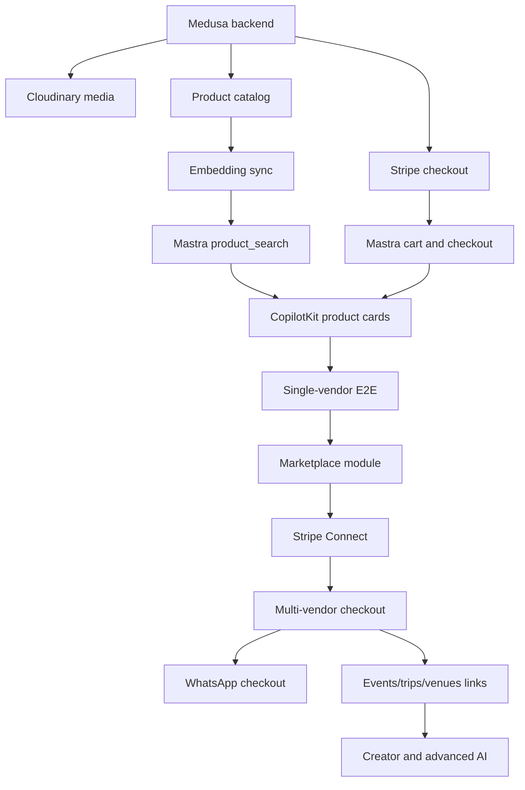

# mdeai Commerce Marketplace Roadmap

Last updated: 2026-06-04

## Strategy Context

mdeai Commerce should launch as a headless Medusa-powered marketplace inside the existing mdeai product, not as a standalone store.

Business outcomes:

- Prove checkout revenue from local lifestyle products.
- Build vendor supply without requiring each seller to build ecommerce.
- Make AI and WhatsApp the demand wedge.
- Reuse existing mdeai platforms: Events, Trips, Venues, AI Concierge, Chatwoot, Maps, Supabase, Stripe.
- Keep the architecture simple enough to ship in weeks, not quarters.

Customer problems:

- Shoppers do not know which local designers, boutiques, events, venues, and experiences fit their intent.
- Tourists need local context and easy purchase paths.
- Vendors need sales, visibility, and payments without technical overhead.
- The mdeai concierge needs live products, carts, and checkout links.

Technical constraints:

- Medusa owns commerce objects.
- Supabase owns identity, cross-vertical links, recommendations, and vectors.
- Stripe is the single payment/payout layer.
- CopilotKit remains the web agent UI.
- Mastra remains the agent/workflow layer.
- Do not create a separate ecommerce frontend unless there is a proven need later.

## Roadmap Principles

1. Ship a working checkout before advanced AI.
2. Use official Medusa recipes and examples before custom infrastructure.
3. Start with manual operations where automation would slow launch.
4. Treat vendor liquidity as the main product risk.
5. Build one vertical wedge first: fashion/designers plus event commerce.
6. Expand to trips, venues, creators, and intelligence only after the foundation works.

## Now / Next / Later

| Stage | Initiative | Outcome | Metric | Notes |
|---|---|---|---|---|
| Now | Medusa commerce foundation | Products can be searched and purchased through mdeai | 1 successful test order | Single-vendor is enough for proof. |
| Now | AI product search tool | Concierge can retrieve live catalog items | Search returns live price/stock | pgvector candidates, Medusa hydration. |
| Now | CopilotKit shopping cards | Users can act on AI results | Add-to-cart from card | Keep UI minimal. |
| Next | Marketplace module | Vendors can sell and receive orders | 10 vendors onboarded | Based on Medusa marketplace recipe. |
| Next | Stripe Connect payouts | mdeai can take fees and pay vendors | First vendor payout | Use Express onboarding. |
| Next | WhatsApp payment links | Concierge can close purchases in chat | First paid WhatsApp order | Use Chatwoot plus Mastra tool. |
| Later | Creator storefronts | Creators drive demand | First attributed creator sale | Only after catalog quality exists. |
| Later | Fashion graph and trend intelligence | Marketplace gets smarter over time | Recommendation CTR and repeat orders | Requires behavioral data. |
| Later | Marketplace SaaS tools | Vendors pay for insights and automation | Paid vendor add-on revenue | Advanced monetization. |

## 30-Day Roadmap: Core Foundation

### Goal

Get commerce running behind mdeai with the smallest useful production path: catalog, search, cart, checkout, and order confirmation.

### Deliverables

| Workstream | Deliverable | Owner Type | Definition of Done |
|---|---|---|---|
| Commerce backend | Medusa service deployed | Engineering | Health check passes, Admin API and Store API reachable. |
| Payments | Stripe payment module configured | Engineering/ops | Test payment creates Medusa order. |
| Media | Cloudinary configured | Engineering | Product images upload and render from Cloudinary. |
| Catalog | Demo vendor and 20-50 products | Product/ops | Products have title, price, variant, image, vendor, status. |
| AI search | Mastra `product_search` tool | AI engineering | Query returns ranked product ids and hydrated Medusa data. |
| Cart | Mastra cart tools | Engineering | Create cart, add item, remove item, retrieve totals. |
| Checkout | Mastra checkout link/action | Engineering | User can pay through Stripe and receive confirmation. |
| UI | CopilotKit product cards | Frontend | Product card supports view, save, add to cart. |
| Vectors | Supabase `commerce_product_embeddings` | Data/AI | Product update syncs embeddings. |
| Ops | Manual support/refund playbook | Product/ops | Team can resolve first test orders manually. |

### Dependencies

- Stripe test and live configuration.
- Cloudinary account and env vars.
- Medusa deployment target and Postgres.
- Supabase pgvector enabled.
- Existing CopilotKit/Mastra integration path.

### Risks

| Risk | Mitigation |
|---|---|
| Medusa setup takes longer than expected | Start from official Medusa app and examples; avoid multi-vendor until checkout works. |
| Product sync creates duplicate sources of truth | Sync only embeddings and references into Supabase. |
| AI search returns stale data | Always hydrate results from Medusa before showing price/stock. |
| UI scope creeps into full storefront | Only build product cards, product detail, cart, and checkout entry. |

### Revenue Impact

- Enables first real test sales.
- Provides demo proof for vendor acquisition.
- Creates foundation for commission revenue.

### Success Metrics

- 1 complete paid test order.
- 20-50 live products.
- Product search p95 below acceptable user wait threshold.
- 0 duplicated mutable product records in Supabase.
- Checkout can be initiated from CopilotKit.

### 30-Day Implementation Order

1. Create/deploy Medusa backend.
2. Configure Stripe and Cloudinary.
3. Create demo vendor/catalog.
4. Build Medusa client wrapper in mdeai.
5. Build Mastra product search and cart tools.
6. Build CopilotKit product cards.
7. Add product embedding sync.
8. Run end-to-end checkout.
9. Document manual ops.

## 90-Day Roadmap: Marketplace MVP

### Goal

Launch a real multi-vendor MVP for Medellin fashion/lifestyle commerce with AI discovery and WhatsApp-assisted checkout.

### Deliverables

| Workstream | Deliverable | Definition of Done |
|---|---|---|
| Marketplace | Custom Medusa marketplace module | Vendors and vendor admins exist; products link to vendor. |
| Vendor onboarding | Vendor application and approval flow | 10 vendors onboarded with basic profiles. |
| Payouts | Stripe Connect Express | Vendor can onboard and receive payout. |
| Orders | Multi-vendor order splitting | One cart can create vendor-specific child orders. |
| Vendor dashboard | Vendor dashboard v1 | Vendor can see products, orders, and payout status. |
| AI shopping | Shopping assistant v1 | User can ask for products by style, budget, event, or location. |
| AI stylist | Outfit recommendation v1 | Assistant can propose 2-4 item looks from live catalog. |
| WhatsApp | Payment links in Chatwoot/WhatsApp | User can receive and complete checkout from chat. |
| Trust | Wishlists and reviews | Users can save products and leave verified reviews. |
| Maps | Boutique map links | Vendor/boutique products can appear from map context. |
| Events | Event product links | Event page can show linked products. |
| Trips | Trip product links | Itinerary can include buyable products/experiences. |

### Dependencies

- 30-day checkout foundation.
- Stripe Connect platform setup.
- Vendor legal/commercial terms.
- Product quality standards.
- Existing Events/Trips/Venues IDs for linking.

### Risks

| Risk | Mitigation |
|---|---|
| Vendor onboarding is operationally heavy | Start concierge-led and manual; automate after patterns repeat. |
| Multi-vendor order splitting gets complex | Follow official Medusa marketplace recipe first. |
| Payout disputes or unclear terms | Define commission, refund, and fulfillment rules before launch. |
| AI stylist recommends unavailable products | Hydrate inventory from Medusa immediately before card rendering. |
| WhatsApp flow becomes support-heavy | Keep first version to search, recommend, payment link, order status, human handoff. |

### Revenue Impact

- Product commissions begin.
- Vendor subscription pilots begin.
- Featured listing pilots begin.
- Event commerce attach revenue begins.

### Success Metrics

- 10 active vendors.
- 200 live products.
- First paid customer GMV.
- First vendor payout.
- 25%+ of AI product searches produce a save, cart add, or checkout click.
- First WhatsApp-assisted order.
- 5 event/trip/venue commerce links live.

### 90-Day Implementation Order

1. Build marketplace module from Medusa recipe.
2. Add vendor application, approval, and admin invite.
3. Add Stripe Connect Express onboarding.
4. Add multi-vendor order split.
5. Add vendor dashboard v1.
6. Launch vendor subscriptions and featured listing pilot.
7. Add AI stylist v1.
8. Add WhatsApp payment link workflow.
9. Add wishlists and reviews.
10. Add event/trip/venue links.

## 6-Month Roadmap: Cross-Vertical Commerce

### Goal

Turn the marketplace from product commerce into lifestyle commerce across fashion, events, experiences, trips, venues, and creator pilots.

### Deliverables

| Workstream | Deliverable | Definition of Done |
|---|---|---|
| Event commerce | Runway/event product hubs | Events can sell linked products and bundles. |
| Trip commerce | Buyable itinerary items | Trip plans include purchasable products and experiences. |
| Venue commerce | Venue-linked products/offers | Venue pages can show buyable products or packages. |
| Semantic search | Mature search quality | Query logs improve ranking and tagging. |
| Bundles | Outfit/trip/event bundles | Users can add multiple related items to cart. |
| Creator pilot | 5-10 creator storefronts | Creator links attribute sales or leads. |
| Featured listings | Paid placement v1 | Vendors can buy placement manually or through dashboard. |
| Analytics | Vendor analytics v1.5 | Vendors see sales, traffic, search, and conversion. |
| Support | Order support automation | AI can answer status/refund basics with human handoff. |

### Dependencies

- MVP vendor and catalog liquidity.
- Reliable order lifecycle.
- Event/trip/venue data quality.
- Creator agreements.
- Attribution tables and reporting.

### Risks

| Risk | Mitigation |
|---|---|
| Too many verticals dilute the marketplace | Keep fashion as the core wedge; use events/trips/venues as context. |
| Creator commerce launches before catalog quality | Only launch creators who can curate existing products well. |
| Featured listings harm trust | Label sponsored/featured placements clearly. |
| Bundles create fulfillment confusion | Start with simple bundle cart actions, not custom bundle fulfillment. |

### Revenue Impact

- Higher average order value through bundles.
- More vendor subscription value through analytics and featured listings.
- Creator and event commerce starts to add demand-side distribution.

### Success Metrics

- 50 active vendors.
- 1,000+ live products.
- Repeat purchase rate begins tracking.
- 10+ paid featured placements.
- 5 creator storefront pilots.
- 20+ event/trip/venue commerce links.
- AI search to add-to-cart rate improving month over month.

### 6-Month Implementation Order

1. Improve semantic search from real query logs.
2. Add event product hubs.
3. Add trip and venue product modules.
4. Add bundle builder v1.
5. Add featured listings billing/ops.
6. Add vendor analytics v1.5.
7. Launch creator pilot.
8. Improve AI support.

## 12-Month Roadmap: Marketplace Intelligence

### Goal

Build the defensible intelligence layer: creator-driven commerce, trend analysis, visual discovery, vendor SaaS tools, and premium AI concierge.

### Deliverables

| Workstream | Deliverable | Definition of Done |
|---|---|---|
| Creator network | Creator storefronts and affiliate payouts | Creators can attribute sales and receive commission reporting. |
| Visual search | Image-based product discovery | User can upload/reference an image and get live products. |
| Fashion graph | Product-style-event-venue graph | Recommendations use relationships beyond text similarity. |
| Trend intelligence | Vendor trend reports | Vendors receive actionable demand insights. |
| AI merchandiser | Vendor assistant for pricing/restock/listings | Vendors get useful automated suggestions. |
| Premium concierge | Paid AI planning/shopping tier | Users pay for higher-touch concierge workflows. |
| Social commerce | WhatsApp/creator drops | Timed campaigns generate tracked sales. |
| Marketplace SaaS | Paid vendor tools | Vendors pay for analytics, campaigns, and optimization. |

### Dependencies

- Meaningful product, order, search, and behavior data.
- Reliable attribution.
- Payment and payout reporting.
- Mature vendor support workflows.
- Clear privacy and data-use policy.

### Risks

| Risk | Mitigation |
|---|---|
| Intelligence layer has too little data | Wait for enough searches, saves, orders, and creator clicks. |
| AI merchandiser gives bad advice | Keep recommendations explainable and advisory, not automatic. |
| Creator payouts add accounting complexity | Start with monthly manual review, then automate. |
| Premium concierge overpromises | Sell premium only around proven workflows. |

### Revenue Impact

- Sponsored placements and campaigns scale.
- Creator-driven GMV adds distribution.
- Vendor SaaS tools become high-margin recurring revenue.
- Premium concierge creates direct buyer revenue.

### Success Metrics

- 150 active vendors.
- 5,000+ live products.
- Meaningful monthly GMV target set after MVP baseline.
- 25+ active creators.
- Paid vendor SaaS attach rate above 10%.
- Premium concierge conversion rate validated.
- Recommendations contribute measurable GMV.

### 12-Month Implementation Order

1. Build attribution and creator commission reporting.
2. Add visual search.
3. Build early fashion graph from products, tags, events, venues, and behavior.
4. Add trend intelligence dashboards.
5. Add AI merchandiser.
6. Add premium concierge.
7. Add social commerce drops.
8. Package vendor SaaS tools.

## Epic Backlog

| Epic | Phase | Outcome | Effort | Priority |
|---|---|---|---|---|
| Medusa backend deployment | 30-day | Commerce service exists | M | P0 |
| Stripe checkout | 30-day | Users can pay | M | P0 |
| Cloudinary media | 30-day | Product media works | S | P0 |
| Product catalog pilot | 30-day | Live products exist | S | P0 |
| Mastra commerce tools | 30-day | Agents can search/cart/checkout | M | P0 |
| CopilotKit cards | 30-day | Users can act on recommendations | M | P0 |
| Product embedding sync | 30-day | AI search works | M | P1 |
| Marketplace module | 90-day | Vendors can sell | L | P0 |
| Stripe Connect | 90-day | Vendors can be paid | L | P0 |
| Vendor dashboard v1 | 90-day | Vendors can self-serve basics | M | P1 |
| WhatsApp checkout | 90-day | Chat commerce converts | M | P1 |
| AI stylist v1 | 90-day | AI differentiator is visible | L | P1 |
| Wishlists/reviews | 90-day | Trust and retention improve | M | P1 |
| Event/trip/venue links | 90-day/6-month | Existing platforms create commerce context | M | P1 |
| Featured listings | 6-month | Paid placement revenue | M | P1 |
| Creator pilot | 6-month | Creator distribution begins | M | P2 |
| Visual search | 12-month | Better inspiration shopping | L | P2 |
| Fashion graph | 12-month | Defensible personalization | XL | P3 |
| AI merchandiser | 12-month | Vendor SaaS value | L | P2 |
| Premium concierge | 12-month | Buyer subscription revenue | M | P2 |

## Launch Plan

### Supply First

Target first supply:

- 10-20 Medellin fashion designers and boutiques.
- 1-3 event partners.
- 3-5 tourism/experience partners.
- 5 creator candidates for later pilot.

Vendor pitch:

- "mdeai gives you AI discovery, WhatsApp checkout, payments, and local distribution without building your own store."

### Demand Wedge

Launch with questions users naturally ask:

- "What should I wear to dinner in Provenza?"
- "Find me local designer outfits under $150."
- "What should I buy for Colombiamoda?"
- "Build my Medellin weekend and include things I can book or buy."

### Initial Categories

Build first:

- Fashion goods.
- Local designer collections.
- Event merch and runway-linked products.
- Tourism experiences that are simple to fulfill.
- Venue-linked packages only where operations are clear.

Defer:

- Heavy shipping categories.
- Complex rentals.
- Installments/BNPL.
- Live shopping.
- AR try-on.

## Operating Model

### Core Roles Needed

| Role | Responsibility |
|---|---|
| Product lead | Scope, priorities, vendor value, launch sequencing |
| Commerce engineer | Medusa, Stripe, marketplace module |
| AI engineer | Mastra tools, Gemini prompts, embedding sync |
| Frontend engineer | CopilotKit product cards and cart UX |
| Ops/vendor lead | Vendor onboarding, catalog quality, fulfillment playbook |
| Support lead | WhatsApp/Chatwoot flows, refund process |

### Manual First, Automate Later

Keep manual in MVP:

- Vendor approval.
- Catalog QA.
- Featured listing sales.
- Refund/dispute handling.
- Creator payout review.

Automate later:

- Vendor onboarding scoring.
- AI listing QA.
- Sponsored placement bidding.
- Creator payouts.
- Trend reports.

## Technical Sequencing



## Architecture Gates

Do not advance to the next phase until these are true:

| Gate | Required Before |
|---|---|
| Single-vendor checkout works end to end | Marketplace module |
| Product data ownership is clean | AI recommendations |
| Vendor terms and commission rules are approved | Stripe Connect launch |
| Manual refund/support process exists | Public MVP |
| Search hydrates live Medusa data | AI stylist launch |
| Event/trip/venue links use product ids only | Cross-vertical rollout |
| Attribution works | Creator commissions |

## Metrics

### Product Metrics

- Search to product click rate.
- Product click to add-to-cart rate.
- Add-to-cart to checkout conversion.
- Checkout completion rate.
- Repeat purchase rate.
- Wishlist save rate.
- WhatsApp assisted conversion rate.
- AI recommendation acceptance rate.

### Marketplace Metrics

- Active vendors.
- Live products.
- GMV.
- Net revenue.
- Average order value.
- Orders per vendor.
- Vendor activation time.
- Vendor churn.
- Featured listing revenue.

### Operational Metrics

- Order support tickets per 100 orders.
- Refund rate.
- Fulfillment time.
- Product QA rejection rate.
- Embedding sync latency.
- Search stale-result rate.

## Critical Path

The fastest path to revenue is:

```text
Medusa live -> Stripe checkout -> product cards -> AI search -> one vendor -> paid order -> vendor onboarding -> Connect -> 10 vendors -> WhatsApp payment links -> featured listings
```

The fastest path to overbuilding is:

```text
Fashion graph -> creator network -> SaaS dashboards -> dynamic ads -> live shopping before checkout liquidity
```

Avoid the second path until the first path proves demand.

## Final Recommendation

Build Core in 30 days, MVP in 90 days, and keep Advanced intentionally parked until the marketplace has vendors, products, orders, and behavior data.

The first version does not need to be the best marketplace in Colombia. It needs to be the fastest credible proof that mdeai can turn local lifestyle intent into checkout.
