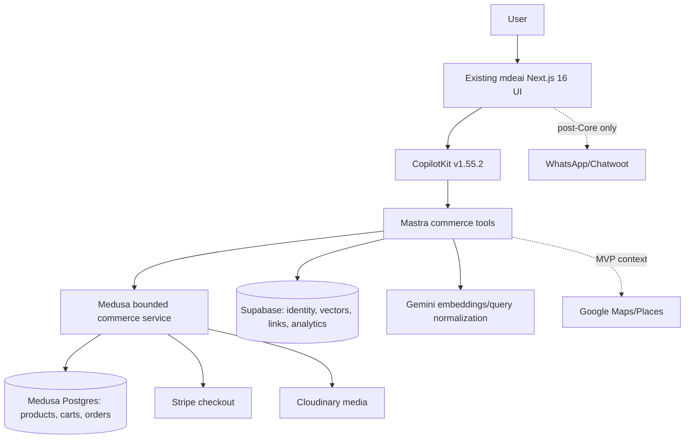
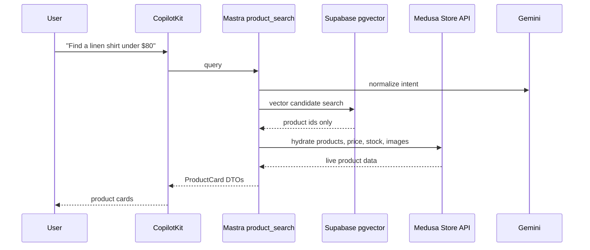
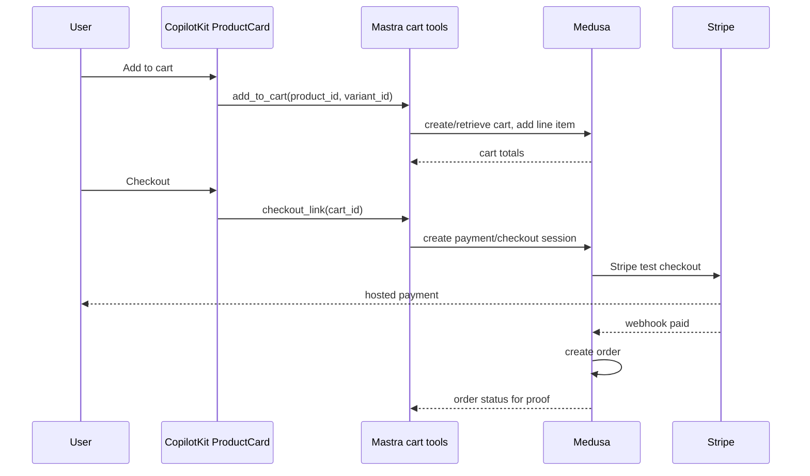
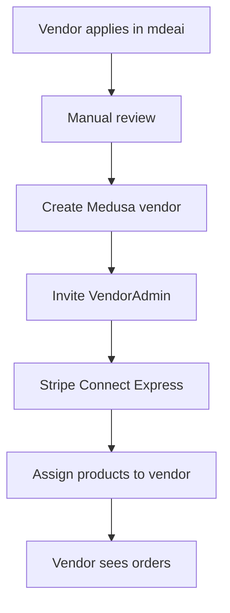
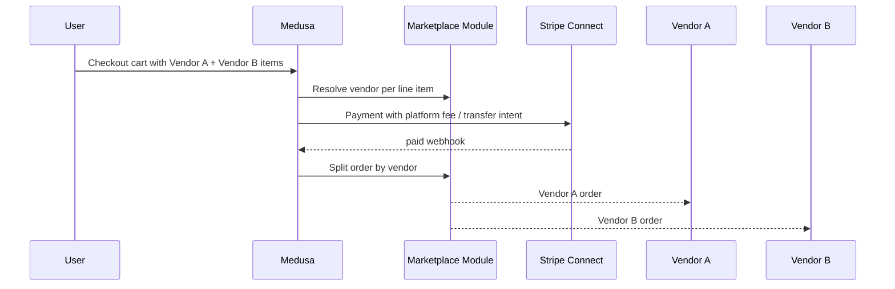

# mdeai Commerce Implementation Task Plan

Last updated: 2026-06-04

Purpose: executable Core/MVP task backlog for adding Medusa-powered commerce to the existing mdeai stack without building a separate ecommerce frontend.

First milestone:

```text
A user asks the AI for a product, sees a product card, adds it to cart, pays with Stripe, and creates a Medusa order.
```

## 1. Executive Verdict

### Verdict

Feasible, but only if "marketplace" is treated as a second milestone. The first shippable product is an AI-powered single-seller commerce proof.

### Safest Implementation Path

1. Deploy Medusa as a bounded backend service.
2. Configure Stripe test checkout and Cloudinary media.
3. Seed 1 internal/demo seller and 20 products in Medusa.
4. Add a Medusa client wrapper in `mdeapp`.
5. Add Mastra commerce tools for product search, product detail, cart, add-to-cart, and checkout link.
6. Render CopilotKit product cards inside existing mdeai UI.
7. Store only embeddings and cross-domain links in Supabase.
8. Prove one paid test order creates a Medusa order.
9. Only then add vendor onboarding, Stripe Connect, multi-vendor splitting, dashboard, WhatsApp, and event/trip/venue links.

### Build First

- Core ADR and data ownership guardrails.
- Medusa backend service.
- Stripe test checkout.
- Cloudinary media.
- Demo catalog.
- Medusa client wrapper.
- Mastra commerce tools.
- CopilotKit product cards and cart state.
- Product embedding sync into Supabase pgvector.
- End-to-end paid test order.
- Manual ops/refund playbook.

### Defer

- Stripe Connect until single-vendor checkout works.
- Multi-vendor order splitting until Connect is ready.
- Vendor dashboard until manual admin is painful.
- WhatsApp payment flow until web checkout is stable.
- AI stylist until product catalog quality and stock accuracy are proven.
- Reviews until verified paid orders exist.
- Creator storefronts, fashion graph, visual search, AR try-on, live shopping, dynamic pricing, and SaaS tools until marketplace liquidity exists.

### Biggest Failure Risks

| Risk | Why It Fails | Control |
|---|---|---|
| Two product sources of truth | Prices/stock drift between Medusa and Supabase | Medusa owns products, variants, carts, orders, inventory. Supabase stores embeddings and links only. |
| Starting with multi-vendor | Connect, payouts, legal, and order splitting delay proof | Single-vendor Core first. |
| Separate ecommerce frontend | Duplicates mdeai UI, auth, and agent context | Use existing Next.js/CopilotKit surfaces. |
| AI overreach | Stylist and recommendations need data quality | Start with deterministic search, hydrate from Medusa before display. |
| Stripe webhook confusion | Existing ticket Stripe flows already exist | Use commerce-specific env names and webhook route; never reuse ticket/sponsor webhook secrets. |
| Vendor ops unknowns | Fulfillment/refund/support are not solved by code | Manual playbook before public orders. |
| Supabase schema sprawl | Commerce data leaks into Supabase tables | Schema review gate before every Supabase migration. |

Supabase MCP observation: the active Supabase project already has events, restaurants, rentals, trips, venue, WhatsApp, Mastra, and embedding tables, but no commerce product/order/cart tables. That supports the plan to add only commerce extension tables. Supabase also reported `public.spatial_ref_sys` with RLS disabled; that is unrelated to commerce but should be handled in a separate security task before relying on broad public schema exposure.

## 2. Repo and Template Research Table

Use official docs first. GitHub MCP was used to inspect the official Medusa examples, Medusa marketplace example, Medusa agentic-commerce example, Medusa Next.js starter README, and CopilotKit Mastra example README.

| Source | URL | Use Level | What To Copy | What Not To Copy | Risk | Score |
|---|---|---|---|---|---|---:|
| Medusa docs | https://docs.medusajs.com | FOUNDATION | Installation, modules, Store API, Admin API, workflows, payment config | Do not infer marketplace behavior beyond documented recipes | Version drift; verify against installed Medusa version | 96 |
| Medusa marketplace recipe | https://docs.medusajs.com/resources/recipes/marketplace | MVP REFERENCE | Custom marketplace module, links, vendor routes, order splitting concepts | Do not use for Core; it is marketplace phase | Complexity if pulled too early | 90 |
| Medusa vendors recipe | https://docs.medusajs.com/resources/recipes/marketplace/examples/vendors | MVP FOUNDATION | `Vendor`, `VendorAdmin`, module service, links, split-order workflow | Do not copy before single-vendor checkout | Requires careful auth and route protection | 92 |
| Medusa examples | https://github.com/medusajs/examples | REFERENCE | Marketplace, agentic-commerce, ticket-booking, wishlist, reviews, bundled-products examples | Do not install all examples or mix features in Core | Example code may need adaptation | 88 |
| Medusa marketplace example | https://github.com/medusajs/examples/tree/main/marketplace | MVP FOUNDATION | `src/modules/marketplace`, `src/links`, `src/workflows`, `src/api` pattern | Do not paste without pruning to mdeai needs | Can become too large | 90 |
| Medusa agentic-commerce example | https://github.com/medusajs/examples/tree/main/agentic-commerce | REFERENCE | Agent-facing API patterns and Stripe provider wiring | Do not use ChatGPT Instant Checkout as Core requirement | Not the same as mdeai CopilotKit/Mastra flow | 74 |
| Medusa core | https://github.com/medusajs/medusa | FOUNDATION | Public APIs, config conventions, upgrade notes | Do not fork core | Direct core dependency churn | 95 |
| Medusa Next.js starter | https://github.com/medusajs/nextjs-starter-medusa | REFERENCE | API usage ideas for product/cart/checkout | Do not adopt UI; README now marks repo deprecated | Deprecated starter; use sparingly | 55 |
| CopilotKit docs | https://docs.copilotkit.ai | FOUNDATION | Generative UI/actions for product cards; Mastra integration docs | Do not migrate to v2 APIs unless project upgrades from 1.55.2 | Docs may default to newer APIs | 88 |
| CopilotKit repo | https://github.com/CopilotKit/CopilotKit | REFERENCE | Examples and integration patterns | Do not vendor code | Version mismatch with pinned 1.55.2 | 82 |
| CopilotKit Mastra example | https://github.com/CopilotKit/CopilotKit/tree/main/examples/integrations/mastra | REFERENCE | Split `dev:ui`/`dev:agent` pattern and agent integration shape | Do not replace current app shell | Starter is generic | 78 |
| Mastra docs | https://mastra.ai/docs | FOUNDATION | Tools, agents, workflows, production patterns | Do not turn simple API calls into workflows | Beta dependencies in local app need tests | 88 |
| Mastra workflows | https://mastra.ai/docs/workflows/overview | REFERENCE | Use workflows for repeatable enrichment/sync, not every user action | Do not over-orchestrate `product_detail` | Workflow state adds complexity | 80 |
| Stripe checkout docs | https://docs.stripe.com/payments/checkout | FOUNDATION | Test-mode checkout proof and webhook handling | Do not bypass Medusa payment lifecycle for commerce | Must isolate from tickets/sponsors | 90 |
| Stripe Connect docs | https://docs.stripe.com/connect | MVP FOUNDATION | Platform fees, transfers, connected account model | Do not use in Core | Legal/accounting/support complexity | 86 |
| Stripe Express accounts | https://docs.stripe.com/connect/express-accounts | MVP FOUNDATION | Vendor onboarding flow | Do not custom-build KYC | Country/capability constraints | 86 |
| Supabase docs | https://supabase.com/docs | FOUNDATION | RLS, migrations, pgvector, service role boundaries | Do not store product truth | RLS mistakes expose data | 90 |
| Supabase pgvector docs | https://supabase.com/docs/guides/database/extensions/pgvector | FOUNDATION | Product embeddings table and vector indexes | Do not use vectors as product truth | Embedding dimension/model drift | 88 |
| Google Maps docs | https://developers.google.com/maps/documentation | MVP REFERENCE | Event/trip/venue location links post-Core | Do not add Maps to Core checkout | Quota and Places costs | 75 |
| Cloudinary docs | https://cloudinary.com/documentation | FOUNDATION | Image upload/delivery setup | Do not build custom image pipeline | Transform/security config | 84 |

## 3. Core Task Plan

All Core tasks must fit in one PR each. No Stripe Connect, WhatsApp automation, reviews, AI stylist, creator storefronts, marketplace vendor module, trips/events links, or multi-vendor work is allowed in Core.

### C-001 - Commerce Architecture Decision Record

| Field | Detail |
|---|---|
| Goal | Document the bounded-context decision: Medusa owns commerce, mdeai owns UI/AI, Supabase owns vectors/links only. |
| Files likely touched | `tasks/ecommerce/docs/ADR-commerce-bounded-context.md`, `tasks/ecommerce/docs/ecommerce-implementation-task-plan.md` |
| Official references | Medusa docs, Medusa marketplace recipe, Supabase docs, Stripe docs |
| Implementation notes | Include hard rules, data ownership, env naming, webhook isolation, and "no separate frontend." |
| Acceptance criteria | ADR exists; explicitly defers Connect/multi-vendor/WhatsApp/stylist; names Core milestone. |
| Proof commands | `rg -n "Medusa owns|Supabase owns|Stripe Connect.*defer|separate ecommerce frontend" tasks/ecommerce/docs/ADR-commerce-bounded-context.md` |
| Playwright/Vitest checks | Docs-only; no runtime checks. |
| Rollback plan | Revert ADR file only. |
| Risk | Low |
| Size | S |

### C-002 - Medusa Service Setup

| Field | Detail |
|---|---|
| Goal | Add a Medusa backend service as a bounded app/service, not a storefront. |
| Files likely touched | `commerce/medusa/` or `apps/commerce/`, root/package workspace config if needed, service README |
| Official references | Medusa docs, Medusa core repo |
| Implementation notes | Use current Medusa installer or minimal backend setup; do not install starter storefront. Default local port should avoid `3001` and `4111`, preferably `9000`. |
| Acceptance criteria | Medusa backend starts locally; Admin API and Store API health endpoints respond; no Next storefront added. |
| Proof commands | `cd commerce/medusa && npm run dev`; `curl -fsS http://localhost:9000/health`; `find . -maxdepth 3 -iname '*storefront*'` returns no new storefront app. |
| Playwright/Vitest checks | None yet; add smoke script in later task. |
| Rollback plan | Remove Medusa service directory and workspace/package entry. |
| Risk | Medium |
| Size | M |

### C-003 - Commerce Environment Variables

| Field | Detail |
|---|---|
| Goal | Add explicit commerce env contract without colliding with existing ticket/sponsor Stripe env. |
| Files likely touched | `mdeapp/.env.example`, `commerce/medusa/.env.template`, `tasks/ecommerce/docs/env-commerce.md`, verification script |
| Official references | Medusa Stripe provider docs, Stripe docs, Cloudinary docs, Supabase docs |
| Implementation notes | Use names such as `MEDUSA_BACKEND_URL`, `MEDUSA_PUBLISHABLE_KEY`, `COMMERCE_STRIPE_SECRET_KEY`, `COMMERCE_STRIPE_WEBHOOK_SECRET`, `COMMERCE_STRIPE_PUBLISHABLE_KEY`, `CLOUDINARY_CLOUD_NAME`, `CLOUDINARY_API_KEY`, `CLOUDINARY_API_SECRET`. Never reuse ticket or sponsor webhook secrets. |
| Acceptance criteria | Env example documents all required vars; verifier fails if commerce Stripe secret equals ticket/sponsor webhook secret names or if required vars are missing. |
| Proof commands | `cd mdeapp && node --env-file=.env.local scripts/verify-commerce-env.mjs` |
| Playwright/Vitest checks | `npm test -- src/lib/commerce/__tests__/commerce-env.test.ts` |
| Rollback plan | Remove env verifier, docs, and env example entries. |
| Risk | Medium |
| Size | S |

### C-004 - Stripe Test Checkout in Medusa

| Field | Detail |
|---|---|
| Goal | Configure Stripe test payments through Medusa payment lifecycle. |
| Files likely touched | `commerce/medusa/medusa-config.ts`, `commerce/medusa/src/subscribers/*`, env docs |
| Official references | Medusa Stripe provider docs, Stripe checkout docs |
| Implementation notes | Configure Stripe provider in Medusa; create commerce-specific webhook route/secret; keep existing event ticket Stripe code untouched. |
| Acceptance criteria | Test payment can complete and create a Medusa order; webhook signature verification uses commerce-specific secret. |
| Proof commands | `cd commerce/medusa && npm run test:stripe-smoke`; `stripe listen --forward-to localhost:9000/hooks/stripe` for local webhook proof. |
| Playwright/Vitest checks | Medusa integration test or smoke script asserts order exists after checkout. |
| Rollback plan | Disable Stripe provider config and remove webhook subscriber/route additions. |
| Risk | High |
| Size | M |

### C-005 - Cloudinary Media Provider

| Field | Detail |
|---|---|
| Goal | Store product media in Cloudinary through Medusa-compatible file/media configuration. |
| Files likely touched | `commerce/medusa/medusa-config.ts`, seed files, env docs |
| Official references | Cloudinary docs, Medusa docs |
| Implementation notes | Prefer official/community-compatible Medusa file module/provider if current version supports it; otherwise document a narrow adapter. |
| Acceptance criteria | Product image upload/reference renders in Store API responses; no images are committed to repo except small seed references. |
| Proof commands | `cd commerce/medusa && npm run smoke:media`; `curl -fsS "$MEDUSA_BACKEND_URL/store/products" | jq` |
| Playwright/Vitest checks | Unit test media URL mapper; optional Playwright image render after ProductCard exists. |
| Rollback plan | Revert media provider config and seed media references. |
| Risk | Medium |
| Size | S |

### C-006 - Demo Catalog Seed

| Field | Detail |
|---|---|
| Goal | Seed 1 internal/demo seller and 20 real/demo products with variants, prices, media, and stock. |
| Files likely touched | `commerce/medusa/src/scripts/seed-demo-catalog.ts`, `commerce/medusa/package.json`, catalog fixture |
| Official references | Medusa docs, Medusa examples seed patterns |
| Implementation notes | Treat the seller as internal/demo metadata only; do not add marketplace vendor module. Products must be Colombian/Medellin lifestyle realistic. |
| Acceptance criteria | 20 active products; each has title, description, price, variant, image, inventory/stock signal; Store API returns products. |
| Proof commands | `cd commerce/medusa && npm run seed:demo-catalog`; `curl -fsS http://localhost:9000/store/products | jq '.products | length'` |
| Playwright/Vitest checks | Seed script unit test validates fixture shape. |
| Rollback plan | Run seed cleanup script or reset Medusa dev DB. |
| Risk | Low |
| Size | S |

### C-007 - Medusa Client Wrapper in mdeapp

| Field | Detail |
|---|---|
| Goal | Add a typed server-side Medusa client wrapper used by Mastra tools and API routes. |
| Files likely touched | `mdeapp/src/lib/commerce/medusa-client.ts`, `mdeapp/src/lib/commerce/types.ts`, tests |
| Official references | Medusa Store API docs, Medusa Next.js starter as reference only |
| Implementation notes | Server-first wrapper. Do not expose admin token to client. Include timeout, error normalization, and live hydration helpers. |
| Acceptance criteria | Wrapper can list products, fetch product detail, create cart, add line item, and create checkout session/link in test mode. |
| Proof commands | `cd mdeapp && npm test -- src/lib/commerce`; `node --env-file=.env.local scripts/smoke-commerce-client.mjs` |
| Playwright/Vitest checks | Vitest with mocked Medusa API plus optional live smoke when env exists. |
| Rollback plan | Remove wrapper and tests; no schema changes. |
| Risk | Medium |
| Size | M |

### C-008 - Supabase Commerce Extension Tables

| Field | Detail |
|---|---|
| Goal | Add Supabase tables for embeddings and cross-domain links only. |
| Files likely touched | `supabase/migrations/*commerce_extensions.sql` or repo migration path, `mdeapp/src/lib/commerce/supabase-types.ts`, docs |
| Official references | Supabase docs, Supabase pgvector docs |
| Implementation notes | Add `commerce_product_embeddings`, optional `commerce_product_sync_log`, and later-ready link tables with product id references only. Do not add `products`, `orders`, `carts`, `inventory`, or mutable price fields. Enable RLS. |
| Acceptance criteria | Migration creates only extension/link/vector tables; RLS enabled; no mutable commerce truth columns. |
| Proof commands | `rg -n "create table .*commerce_.*(products|orders|carts|inventory)" supabase/migrations && exit 1 || echo OK`; Supabase MCP list tables after migration. |
| Playwright/Vitest checks | RLS/unit tests for inserts only via service role where needed. |
| Rollback plan | Down migration drops only commerce extension tables. |
| Risk | Medium |
| Size | M |

### C-009 - Product Embedding Sync

| Field | Detail |
|---|---|
| Goal | Sync Medusa product updates into Supabase `commerce_product_embeddings` using Gemini embeddings. |
| Files likely touched | `commerce/medusa/src/subscribers/product-embedding-sync.ts` or `mdeapp/scripts/sync-commerce-embeddings.ts`, `mdeapp/src/lib/commerce/embedding-text.ts`, tests |
| Official references | Medusa events/subscribers docs, Supabase pgvector docs, Gemini SDK docs if implementation uses Gemini |
| Implementation notes | Store `product_id`, `variant_ids` if needed, title/summary/tags, embedding, `synced_at`, and source checksum. Do not store price/stock as truth. |
| Acceptance criteria | Updating product triggers or allows explicit sync; stale products can be detected; failed sync is logged and retryable. |
| Proof commands | `cd mdeapp && node --env-file=.env.local scripts/sync-commerce-embeddings.mjs --dry-run`; `npm test -- src/lib/commerce/embedding-text.test.ts` |
| Playwright/Vitest checks | Vitest for text builder and stale-data detector. |
| Rollback plan | Disable subscriber/job; retain table but stop writes; safe to truncate embeddings. |
| Risk | Medium |
| Size | M |

### C-010 - Mastra `product_search` Tool

| Field | Detail |
|---|---|
| Goal | Add AI product search that queries embeddings, then hydrates current product data from Medusa before returning cards. |
| Files likely touched | `mdeapp/src/mastra/tools/commerce/product-search.ts`, `mdeapp/src/mastra/tools/index.ts`, tests |
| Official references | Mastra tools docs, Supabase pgvector docs, Medusa Store API docs |
| Implementation notes | Deterministic pipeline: normalize query, vector search candidate ids, hydrate from Medusa, filter unavailable, return compact card DTOs. |
| Acceptance criteria | Tool never returns price/stock from Supabase; unavailable products are excluded or marked unavailable from Medusa data. |
| Proof commands | `cd mdeapp && npm test -- src/mastra/tools/__tests__/commerce-product-search.test.ts`; `npm run dev:agent` then call tool smoke. |
| Playwright/Vitest checks | Vitest mocked Supabase + Medusa; live smoke optional. |
| Rollback plan | Remove tool registration and file. |
| Risk | Medium |
| Size | M |

### C-011 - Mastra `product_detail` Tool

| Field | Detail |
|---|---|
| Goal | Fetch one live product detail from Medusa for product cards and detail panels. |
| Files likely touched | `mdeapp/src/mastra/tools/commerce/product-detail.ts`, tests |
| Official references | Mastra tools docs, Medusa Store API docs |
| Implementation notes | Validate product id; fetch live Medusa detail; normalize to ProductCard/ProductDetail DTO. |
| Acceptance criteria | Detail includes live title, media, variant, price, stock/availability, vendor/demo seller label. |
| Proof commands | `cd mdeapp && npm test -- src/mastra/tools/__tests__/commerce-product-detail.test.ts` |
| Playwright/Vitest checks | Vitest only for this PR. |
| Rollback plan | Remove tool registration and file. |
| Risk | Low |
| Size | S |

### C-012 - Mastra Cart Tools

| Field | Detail |
|---|---|
| Goal | Add `create_cart` and `add_to_cart` tools backed by Medusa carts. |
| Files likely touched | `mdeapp/src/mastra/tools/commerce/cart.ts`, `mdeapp/src/lib/commerce/cart-state.ts`, tests |
| Official references | Mastra tools docs, Medusa Store API docs |
| Implementation notes | Persist cart id in existing session/client state pattern; validate variant id and quantity; return totals from Medusa. |
| Acceptance criteria | User can create cart and add a variant; totals and currency come from Medusa. |
| Proof commands | `cd mdeapp && npm test -- src/mastra/tools/__tests__/commerce-cart.test.ts`; `node --env-file=.env.local scripts/smoke-commerce-cart.mjs` |
| Playwright/Vitest checks | Vitest with mocked Medusa; live smoke optional. |
| Rollback plan | Remove cart tools and any session state additions. |
| Risk | Medium |
| Size | M |

### C-013 - Mastra `checkout_link` Tool

| Field | Detail |
|---|---|
| Goal | Create checkout/payment link/session for the current Medusa cart. |
| Files likely touched | `mdeapp/src/mastra/tools/commerce/checkout-link.ts`, `mdeapp/src/app/api/commerce/checkout/route.ts`, tests |
| Official references | Medusa Stripe provider docs, Stripe checkout docs, Mastra tools docs |
| Implementation notes | Keep checkout server-side. Return URL and cart/order context only. Use commerce-specific env and routes. |
| Acceptance criteria | Tool returns a test checkout URL for a valid cart; invalid cart fails safely. |
| Proof commands | `cd mdeapp && npm test -- src/mastra/tools/__tests__/commerce-checkout-link.test.ts`; `node --env-file=.env.local scripts/smoke-commerce-checkout-link.mjs` |
| Playwright/Vitest checks | Vitest plus smoke script. |
| Rollback plan | Remove route/tool; Stripe config remains unused. |
| Risk | High |
| Size | M |

### C-014 - CopilotKit ProductCard Render

| Field | Detail |
|---|---|
| Goal | Render product search results as product cards in the existing CopilotKit/mdeai UI. |
| Files likely touched | `mdeapp/src/components/commerce/ProductCard.tsx`, `mdeapp/src/components/copilot/*`, `mdeapp/src/platform/copilot/*`, tests |
| Official references | CopilotKit docs, CopilotKit Mastra example, Medusa Store API docs |
| Implementation notes | Use existing CopilotKit v1.55.2 patterns in repo. Include image, title, price, availability, view detail, add to cart. Keep card compact and mobile-safe. |
| Acceptance criteria | Product cards render from tool result; price/stock displayed only from Medusa-hydrated DTO. |
| Proof commands | `cd mdeapp && npm test -- src/components/commerce`; `npm run test:e2e -- e2e/commerce-product-card.spec.ts --project=chromium --workers=1` |
| Playwright/Vitest checks | Vitest component test and Playwright render check. |
| Rollback plan | Remove ProductCard registration/components. |
| Risk | Medium |
| Size | M |

### C-015 - Cart State UI

| Field | Detail |
|---|---|
| Goal | Add minimal cart state UI inside existing mdeai experience. |
| Files likely touched | `mdeapp/src/components/commerce/CommerceCartSummary.tsx`, `mdeapp/src/hooks/use-commerce-cart.ts`, tests |
| Official references | CopilotKit docs, Medusa Store API docs, Medusa starter as reference only |
| Implementation notes | Small summary only: item count, subtotal, remove/quantity if simple, checkout button. No full storefront cart page unless needed for checkout. |
| Acceptance criteria | Cart updates after add-to-cart; checkout button uses `checkout_link`; UI works mobile/desktop. |
| Proof commands | `cd mdeapp && npm test -- src/components/commerce`; `npm run test:e2e -- e2e/commerce-cart-state.spec.ts --project=chromium --workers=1` |
| Playwright/Vitest checks | Vitest and Playwright. |
| Rollback plan | Remove cart summary and hook. |
| Risk | Medium |
| Size | M |

### C-016 - End-to-End Checkout Proof

| Field | Detail |
|---|---|
| Goal | Prove the Core milestone end to end with one paid test order. |
| Files likely touched | `mdeapp/e2e/commerce-checkout.spec.ts`, `mdeapp/scripts/smoke-commerce-paid-proof.mjs`, docs/evidence |
| Official references | Stripe checkout docs, Medusa payment docs, Playwright docs |
| Implementation notes | Use Stripe test card flow. Verify final Medusa order via API. Keep proof independent from existing event ticket smoke scripts. |
| Acceptance criteria | Playwright or smoke script proves AI/card/cart/checkout path; Medusa order id recorded in evidence doc. |
| Proof commands | `cd mdeapp && npm run test:e2e -- e2e/commerce-checkout.spec.ts --project=chromium --workers=1`; `node --env-file=.env.local scripts/smoke-commerce-paid-proof.mjs` |
| Playwright/Vitest checks | Required Playwright checkout proof; skip only if Stripe test env unavailable and document blocker. |
| Rollback plan | Revert tests/evidence only; code rollback comes from preceding tasks if failure is product-side. |
| Risk | High |
| Size | M |

### C-017 - Manual Ops and Refund Playbook

| Field | Detail |
|---|---|
| Goal | Document how mdeai manually fulfills, supports, refunds, and audits Core orders. |
| Files likely touched | `tasks/ecommerce/docs/commerce-ops-playbook.md`, `tasks/ecommerce/docs/commerce-refund-playbook.md` |
| Official references | Stripe refund docs, Medusa order/admin docs |
| Implementation notes | Include order lookup, customer support path, refund path, failed webhook path, stock correction, test/live mode separation. |
| Acceptance criteria | A non-author engineer/operator can follow the playbook to find order, refund test order, and reconcile status. |
| Proof commands | `rg -n "refund|webhook|order lookup|test mode|live mode|support" tasks/ecommerce/docs/commerce-*playbook.md` |
| Playwright/Vitest checks | Docs-only. |
| Rollback plan | Revert playbook docs. |
| Risk | Low |
| Size | S |

### C-018 - Production Readiness Checklist

| Field | Detail |
|---|---|
| Goal | Add deploy gates so Core can ship without breaking existing mdeai MVP. |
| Files likely touched | `tasks/ecommerce/docs/commerce-production-readiness.md`, `mdeapp/scripts/verify-commerce-readiness.mjs`, package script |
| Official references | Medusa docs, Stripe docs, Supabase RLS docs, Cloudinary docs |
| Implementation notes | Checklist covers env, health, Store API, Stripe webhook, product hydration, RLS, logs, rollback, feature flag. |
| Acceptance criteria | Checklist exists; script verifies local env shape and smoke endpoints; feature flag can disable commerce UI. |
| Proof commands | `cd mdeapp && node --env-file=.env.local scripts/verify-commerce-readiness.mjs`; `npm run lint && npm run typecheck && npm test` |
| Playwright/Vitest checks | Add readiness unit tests if script has logic. |
| Rollback plan | Disable feature flag; remove script/docs if necessary. |
| Risk | Medium |
| Size | S |

## 4. MVP Task Plan

MVP starts only after Core gates are green and there is proof of one paid Medusa order.

### M-001 - Marketplace Module From Official Recipe

| Field | Detail |
|---|---|
| Goal | Add custom Medusa marketplace module with vendor and vendor admin models. |
| Files likely touched | `commerce/medusa/src/modules/marketplace/*`, `commerce/medusa/src/links/*`, migrations |
| Official refs | Medusa marketplace recipe, vendors recipe, examples marketplace README |
| Notes | Copy the recipe structure, prune unused fields, keep auth explicit. |
| Acceptance | `Vendor` and `VendorAdmin` models migrate; products can link to vendor. |
| Proof | `cd commerce/medusa && npx medusa db:migrate && npm test -- marketplace` |
| Checks | Medusa module unit/integration tests. |
| Rollback | Disable module config and rollback migration. |
| Risk/Size | High / L |

### M-002 - Vendor Application Flow

| Field | Detail |
|---|---|
| Goal | Let prospective vendors apply through mdeai without granting immediate commerce access. |
| Files likely touched | `mdeapp/src/app/commerce/vendors/apply/*`, `mdeapp/src/lib/commerce/vendor-applications.ts`, Supabase migration |
| Official refs | Supabase docs, Medusa marketplace recipe |
| Notes | Store applications in Supabase because they are pre-commerce leads, not Medusa vendors yet. |
| Acceptance | Application can be submitted and reviewed manually; no Medusa vendor created until approval. |
| Proof | `npm test -- src/lib/commerce/vendor-applications.test.ts`; Playwright application form spec. |
| Checks | Vitest + Playwright. |
| Rollback | Disable route/feature flag and drop application table if unused. |
| Risk/Size | Medium / M |

### M-003 - Vendor Admin Invite

| Field | Detail |
|---|---|
| Goal | Invite approved vendor admin into marketplace module. |
| Files likely touched | `commerce/medusa/src/api/vendors/*`, `mdeapp/src/lib/commerce/vendor-admin.ts`, email/outbox integration |
| Official refs | Medusa vendors recipe, Medusa API routes/auth docs |
| Notes | Protect routes; only internal admin can invite. |
| Acceptance | Approved vendor has at least one admin; admin can authenticate to vendor route. |
| Proof | API route integration test; `curl` vendor admin auth smoke. |
| Checks | Medusa route tests. |
| Rollback | Revoke vendor admin, disable route. |
| Risk/Size | High / M |

### M-004 - Vendor Dashboard v1

| Field | Detail |
|---|---|
| Goal | Minimal vendor dashboard for products, orders, and payout status. |
| Files likely touched | `mdeapp/src/app/commerce/vendor/*`, `mdeapp/src/components/commerce/vendor/*` |
| Official refs | Medusa Admin API docs, Medusa marketplace recipe |
| Notes | Read-heavy first. Product editing can remain Medusa Admin/manual if needed. |
| Acceptance | Vendor sees own products/orders only. |
| Proof | Playwright auth isolation spec; API tests for vendor scoping. |
| Checks | Vitest + Playwright. |
| Rollback | Feature flag dashboard route off. |
| Risk/Size | High / L |

### M-005 - Stripe Connect Express Onboarding

| Field | Detail |
|---|---|
| Goal | Add connected account onboarding for approved vendors. |
| Files likely touched | `commerce/medusa/src/modules/marketplace/models/vendor.ts`, `mdeapp/src/app/api/commerce/connect/*`, vendor dashboard |
| Official refs | Stripe Connect docs, Stripe Express accounts docs |
| Notes | Store Stripe account id in Medusa vendor module or secure mapped extension; do not store KYC data. |
| Acceptance | Vendor can create/complete Express onboarding in test mode. |
| Proof | Stripe test account onboarding smoke; dashboard shows onboarding status. |
| Checks | API unit tests, Playwright onboarding handoff if feasible. |
| Rollback | Disable Connect feature flag; leave existing vendors single-seller only. |
| Risk/Size | High / M |

### M-006 - Multi-Vendor Cart and Order Split

| Field | Detail |
|---|---|
| Goal | Allow one cart to contain products from multiple vendors and split order after payment. |
| Files likely touched | `commerce/medusa/src/workflows/*`, `commerce/medusa/src/api/store/carts/*`, marketplace module |
| Official refs | Medusa marketplace recipe, vendors recipe |
| Notes | Follow recipe guidance to replicate/extend complete-cart route. Include retry/rollback behavior. |
| Acceptance | One checkout creates vendor-scoped order records and preserves platform order traceability. |
| Proof | Integration test with 2 vendors, 2 products, 1 cart, paid test order. |
| Checks | Medusa workflow tests. |
| Rollback | Disable multi-vendor cart validation: one vendor per cart until fixed. |
| Risk/Size | High / L |

### M-007 - Vendor Payout Visibility

| Field | Detail |
|---|---|
| Goal | Show vendors payout and transfer status without exposing full Stripe dashboard data. |
| Files likely touched | Vendor dashboard, marketplace vendor model, Stripe integration helper |
| Official refs | Stripe Connect docs |
| Notes | Read from Stripe/Medusa payment state; do not compute payout truth manually. |
| Acceptance | Vendor sees order amount, platform fee, payout status in test mode. |
| Proof | Stripe test transfer/payout smoke. |
| Checks | Unit tests for money formatting/status mapping. |
| Rollback | Hide payout panel. |
| Risk/Size | Medium / M |

### M-008 - WhatsApp Payment Link

| Field | Detail |
|---|---|
| Goal | Let support/concierge send existing web checkout link through WhatsApp/Chatwoot. |
| Files likely touched | `mdeapp/src/mastra/tools/commerce/whatsapp-payment-link.ts`, Chatwoot/WhatsApp integration files |
| Official refs | Mastra docs, Chatwoot/WhatsApp existing project docs, Stripe checkout docs |
| Notes | No autonomous campaigns. Human/user-requested only. Reuse `checkout_link`. |
| Acceptance | User can request a link; message includes checkout URL; order still completes through web checkout. |
| Proof | WhatsApp sandbox/manual smoke or mocked Chatwoot API test. |
| Checks | Vitest mocked Chatwoot + optional manual smoke. |
| Rollback | Disable tool; web checkout remains. |
| Risk/Size | Medium / M |

### M-009 - Event Product Links

| Field | Detail |
|---|---|
| Goal | Link existing events to Medusa product ids for contextual commerce. |
| Files likely touched | Supabase migration `commerce_event_products`, event page components, commerce hydration helper |
| Official refs | Supabase docs, Medusa Store API docs |
| Notes | Links only: `event_id`, `product_id`, label/sort. Product truth remains Medusa. |
| Acceptance | Event page can show linked live product cards hydrated from Medusa. |
| Proof | `rg` schema guard; Playwright event page product card spec. |
| Checks | Vitest link fetcher + Playwright. |
| Rollback | Hide event commerce module; leave link table inert. |
| Risk/Size | Medium / M |

### M-010 - Trip Product Links

| Field | Detail |
|---|---|
| Goal | Link trips/itinerary items to Medusa products. |
| Files likely touched | Supabase migration `commerce_trip_products`, trips UI, hydration helper |
| Official refs | Supabase docs, Medusa Store API docs |
| Notes | Links only; no price/stock copied. |
| Acceptance | Trip page can show current product cards for linked products. |
| Proof | Playwright trip product link spec. |
| Checks | Vitest + Playwright. |
| Rollback | Hide trip commerce module. |
| Risk/Size | Medium / M |

### M-011 - Venue Product Links

| Field | Detail |
|---|---|
| Goal | Link venues or venue anchors to Medusa products/packages. |
| Files likely touched | Supabase migration `commerce_venue_products`, venue components, map card integration |
| Official refs | Supabase docs, Google Maps docs, Medusa Store API docs |
| Notes | Keep Maps as context only; no Maps dependency in Core checkout. |
| Acceptance | Venue context can show live linked products without duplicating commerce facts. |
| Proof | Playwright venue product link spec. |
| Checks | Vitest + Playwright. |
| Rollback | Hide venue commerce module. |
| Risk/Size | Medium / M |

### M-012 - Basic Commerce Analytics

| Field | Detail |
|---|---|
| Goal | Track search, card click, add-to-cart, checkout-start, checkout-complete events. |
| Files likely touched | `mdeapp/src/lib/commerce/analytics.ts`, Supabase `commerce_analytics_events`, UI/tool instrumentation |
| Official refs | Supabase docs, existing mdeai analytics patterns |
| Notes | Store analytics, not commerce truth. Include product id and event metadata only. |
| Acceptance | Events recorded for key funnel steps; no PII beyond existing user/session id policy. |
| Proof | Vitest analytics test; SQL row count smoke in test env. |
| Checks | Unit tests and RLS checks. |
| Rollback | Disable analytics writes. |
| Risk/Size | Medium / M |

### M-013 - Featured Listings Pilot

| Field | Detail |
|---|---|
| Goal | Pilot manual featured placement for vendors after catalog and checkout work. |
| Files likely touched | Supabase `commerce_featured_placements`, product ranking helper, admin docs |
| Official refs | Supabase docs, Stripe docs if billing included later |
| Notes | Manual billing first; no ad auction. Clearly label featured placements. |
| Acceptance | Admin can mark product/vendor featured; product search can optionally boost with label. |
| Proof | Unit test rank boost and label; Playwright card label check. |
| Checks | Vitest + Playwright. |
| Rollback | Disable ranking boost; leave table inert. |
| Risk/Size | Medium / M |

## 5. Deferred Advanced Backlog

| Item | Do Not Build Yet Because | Trigger Required |
|---|---|---|
| AI stylist | Needs enough products, good tags, stock accuracy, and returns feedback | 500+ quality products, add-to-cart conversion baseline, low stale-result rate |
| Creator storefronts | Needs attribution, catalog quality, payout rules | 10+ vendors, repeat orders, creator pilot contracts |
| Fashion graph | Needs real behavioral/product/event data | 1,000+ products and meaningful search/save/order graph |
| Visual search | Adds model and UX complexity | Semantic search is stable and users ask for image-based shopping |
| AR try-on | High cost and accuracy risk | Strong fashion GMV and vendor demand |
| Live shopping | Ops-heavy and creator-heavy | Creator network and event commerce already producing GMV |
| Dynamic pricing | Trust and vendor conflict risk | Vendor analytics mature and pricing rules are explicit |
| Full marketplace SaaS suite | Premature before vendors pay for basics | Vendor subscriptions validated and dashboard used weekly |
| Automated vendor approval | Risky compliance/quality shortcut | 50+ applications with repeatable review patterns |
| Autonomous WhatsApp campaigns | Consent/compliance/support risk | Opt-in list, unsubscribe, rate limits, and human-approved campaign workflow |
| Reviews | Needs verified orders and moderation | 100+ paid orders and moderation workflow |
| Stripe Connect advanced payouts | Accounting/support complexity | Single-vendor checkout proven and vendor terms approved |

## 6. Architecture Diagrams

### System Architecture



### Product Search Flow



### Checkout Flow



### Embedding Sync Flow


### Vendor Onboarding Flow



### MVP Multi-Vendor Flow



## 7. Data Ownership Plan

### Medusa-Owned Data

- Products.
- Variants.
- Prices.
- Inventory/stock.
- Carts.
- Line items.
- Orders.
- Fulfillment state.
- Refund state.
- Payment lifecycle references.
- Core vendor models after MVP marketplace module.

### Supabase-Owned Data

- Supabase Auth users/profiles.
- User preferences.
- AI memory and Mastra observability where already used.
- Product embeddings: product id, embedding text, vector, sync metadata.
- Cross-domain link tables: event/trip/venue to Medusa product id.
- Vendor applications before approval.
- Analytics events.
- Featured placement metadata.

### Stripe-Owned Data

- Payment methods.
- Payment intents/checkout sessions.
- Charges.
- Refunds.
- Connected accounts after MVP.
- Transfers and payout status.

### Cloudinary-Owned Data

- Product images.
- Transformations.
- Media delivery URLs/assets.

### Google Maps-Owned Data

- Places ids.
- Map/venue context.
- Location search metadata.

### Duplication Red Flags

Reject any PR that adds these to Supabase:

- `commerce_products` with mutable price/stock/title as source of truth.
- `commerce_orders` as order source of truth.
- `commerce_carts`.
- `commerce_inventory`.
- Product price copied into embeddings table.
- Stripe KYC fields.
- Cloudinary binary/image blobs.

Allowed Supabase commerce columns:

- `product_id` reference.
- `vendor_id` reference.
- `event_id`, `trip_id`, `venue_id` references.
- Embedding vector.
- Non-authoritative search text.
- Sync checksum/timestamps.
- Analytics event metadata.

## 8. Testing Plan

### Unit Tests

- Medusa client wrapper request/response normalization.
- Env verifier.
- Product DTO mapping.
- Embedding text builder.
- Stale-data detector.
- Mastra tool input validation.
- Cart state reducer/hook.
- Money/currency formatting.

Commands:

```bash
cd /home/sk/mdeai/mdeapp
npm test -- src/lib/commerce src/mastra/tools/__tests__ src/components/commerce
```

### Integration Tests

- Medusa Store API list/detail/cart/checkout smoke.
- Supabase embeddings read/write with service role.
- Product search: Supabase candidate ids -> Medusa hydration.
- Stripe test checkout creates Medusa order.

Commands:

```bash
cd /home/sk/mdeai/mdeapp
node --env-file=.env.local scripts/smoke-commerce-client.mjs
node --env-file=.env.local scripts/smoke-commerce-cart.mjs
node --env-file=.env.local scripts/smoke-commerce-checkout-link.mjs
```

### Playwright E2E Tests

- Product cards render in existing mdeai UI.
- Add-to-cart updates cart summary.
- Checkout link opens Stripe test checkout.
- Paid checkout returns and Medusa order exists.
- Feature flag disabled hides commerce UI.

Commands:

```bash
cd /home/sk/mdeai/mdeapp
npm run dev:ui
npm run dev:agent
npm run test:e2e -- e2e/commerce-product-card.spec.ts --project=chromium --workers=1
npm run test:e2e -- e2e/commerce-cart-state.spec.ts --project=chromium --workers=1
npm run test:e2e -- e2e/commerce-checkout.spec.ts --project=chromium --workers=1
```

### Stripe Webhook Tests

- Commerce webhook signature validates with `COMMERCE_STRIPE_WEBHOOK_SECRET`.
- Ticket/sponsor webhook secrets are not referenced by commerce code.
- Duplicate webhook is idempotent.
- Failed webhook logs actionable error.

Commands:

```bash
cd /home/sk/mdeai/mdeapp
rg -n "STRIPE_WEBHOOK_SECRET|STRIPE_SPONSOR_WEBHOOK_SECRET" src scripts commerce && echo "review any hits"
node --env-file=.env.local scripts/smoke-commerce-paid-proof.mjs
```

### Medusa API Smoke Tests

- `/health` responds.
- Store products returns 20 seeded products.
- Product detail returns current price/availability.
- Cart create/add works.
- Checkout session/link works.

Commands:

```bash
curl -fsS http://localhost:9000/health
curl -fsS http://localhost:9000/store/products
```

### Supabase RLS Checks

- Commerce extension tables have RLS enabled.
- Client anon cannot write embeddings.
- Service role can upsert embeddings.
- Event/trip/venue link read policy matches existing app access rules.
- No commerce source-of-truth tables were added.

Proof:

```bash
rg -n "create table .*commerce_.*(products|orders|carts|inventory)" supabase/migrations && exit 1 || echo "OK: no commerce truth tables"
```

### Product Stale-Data Checks

- Embedding sync stores checksum and `synced_at`.
- Search hydrates live Medusa product before display.
- Test forces stale embedding price text and verifies UI still shows Medusa price.

### Checkout Proof Checklist

- Product was returned by AI search.
- Product card displayed live Medusa data.
- Item added to Medusa cart.
- Checkout link/session created.
- Stripe test payment completed.
- Medusa order created.
- Order id captured in evidence doc.
- Manual refund path tested in test mode.

## 9. Production Readiness Gates

| Gate | Requirement | Proof |
|---|---|---|
| Gate 1: Medusa health + APIs | Medusa starts and Store/Admin APIs respond | `curl -fsS http://localhost:9000/health`; Store API smoke |
| Gate 2: Stripe test order | Test payment creates Medusa order | `scripts/smoke-commerce-paid-proof.mjs` |
| Gate 3: Live product cards | Cards show live Medusa price/stock | ProductCard test with mocked stale Supabase data |
| Gate 4: Hydrated AI search | `product_search` hydrates from Medusa before display | Tool test asserts Supabase result lacks price/stock |
| Gate 5: CopilotKit checkout | Existing UI can add to cart and checkout | Playwright commerce checkout spec |
| Gate 6: Supabase only extensions | No product/order/cart/inventory truth in Supabase | Migration grep plus Supabase MCP list tables |
| Gate 7: Ops/refund playbook | Manual support/refund flow exists | `commerce-ops-playbook.md` and test refund evidence |
| Gate 8: No mdeai regression | Commerce deploy can be disabled and existing MVP still passes | Feature flag off; `npm run floor` or scoped floor |

## 10. Final Implementation Order

Each line is one PR.

1. C-001 - Commerce architecture decision record.
2. C-002 - Medusa backend service setup.
3. C-003 - Commerce env contract and verifier.
4. C-004 - Stripe test checkout in Medusa.
5. C-005 - Cloudinary media provider.
6. C-006 - Demo catalog seed: 1 seller, 20 products.
7. C-007 - Medusa client wrapper in `mdeapp`.
8. C-008 - Supabase commerce extension tables for embeddings/links only.
9. C-009 - Product embedding sync.
10. C-010 - Mastra `product_search`.
11. C-011 - Mastra `product_detail`.
12. C-012 - Mastra `create_cart` and `add_to_cart`.
13. C-013 - Mastra `checkout_link`.
14. C-014 - CopilotKit ProductCard render.
15. C-015 - Minimal cart state UI.
16. C-016 - End-to-end checkout proof.
17. C-017 - Manual ops/refund playbook.
18. C-018 - Production readiness checklist.
19. M-001 - Marketplace module from official recipe.
20. M-002 - Vendor application flow.
21. M-003 - Vendor admin invite.
22. M-004 - Vendor dashboard v1.
23. M-005 - Stripe Connect Express onboarding.
24. M-006 - Multi-vendor cart/order split.
25. M-007 - Vendor payout visibility.
26. M-008 - WhatsApp payment link.
27. M-009 - Event product links.
28. M-010 - Trip product links.
29. M-011 - Venue product links.
30. M-012 - Basic commerce analytics.
31. M-013 - Featured listings pilot.

Stop after PR 18 until the Core milestone is proven with one paid test order.

## Unknowns To Resolve Before C-002/C-004

- Exact Medusa version to install and pin.
- Whether Medusa service should live in `commerce/medusa`, `apps/commerce`, or another workspace path.
- Production deployment target for Medusa service.
- Commerce Stripe test webhook endpoint and env naming policy.
- Cloudinary Medusa provider choice for the installed Medusa version.
- Whether product embeddings run inside Medusa subscriber, mdeapp script, or separate worker.
- Whether existing Supabase migration tooling lives in this repo or another deployment repo.

