# mdeai Commerce Marketplace PRD

Last updated: 2026-06-04

## 1. Executive Summary

### What We Are Building

mdeai Commerce is an AI-powered Medellin lifestyle marketplace, not a Shopify clone. It connects fashion designers, Colombiamoda and fashion events, event ticketing, restaurants, cafes, nightlife, tourism experiences, trips, influencers, local brands, WhatsApp commerce, and the existing mdeai AI Concierge.

The product should feel like asking a local expert what to wear, where to go, what to book, and what to buy. Commerce is one vertical inside the existing mdeai ecosystem, not a separate ecommerce application.

### Product Thesis

Medusa is the commerce engine. mdeai is the marketplace brain, storefront, concierge, and distribution layer.

The first release should prove one thing:

> A user can discover Medellin products through AI, add them to a cart, pay through Stripe, and get support through the existing mdeai surfaces.

### Why Medusa

Medusa is the right commerce backend because it is open source, headless, modular, and API-first. Its current docs include an official marketplace recipe that builds vendor management, vendor admins, and multi-vendor order splitting through a custom marketplace module rather than a core fork: https://docs.medusajs.com/resources/recipes/marketplace/examples/vendors.

Medusa gives mdeai:

- Product, variant, cart, order, fulfillment, pricing, promotion, and payment primitives.
- A modular framework for custom marketplace behavior.
- A Store API that Mastra agents can call.
- An Admin API that can power vendor tools.
- Stripe payment module compatibility.
- A strong example ecosystem, including marketplace, agentic commerce, ticket booking, bundled products, subscriptions, reviews, and wishlist examples: https://github.com/medusajs/examples.

### Why Not Shopify

Shopify is optimized for stores. mdeai needs an AI-native local marketplace.

Shopify would create the wrong center of gravity:

- Storefront-first instead of concierge-first.
- App/plugin dependency for multi-vendor behavior.
- Less control over data, workflows, and AI orchestration.
- Harder to unify events, trips, venues, maps, WhatsApp, and creator commerce.
- Higher long-term lock-in if the marketplace becomes the core business.

Use Shopify-style thinking only where it helps conversion. Do not use Shopify as the platform.

### Long-Term Vision

mdeai becomes the lifestyle commerce OS for Medellin:

- "What should I wear tonight?" leads to outfits, venues, tickets, and transport.
- "Build my weekend" leads to trip plans, experiences, restaurants, and products.
- "Shop Colombiamoda" leads to runway looks, designer storefronts, tickets, creator picks, and WhatsApp follow-up.
- Local brands and creators get a practical sales channel without building their own ecommerce stack.

### Competitive Advantage

| Advantage | Why It Matters |
|---|---|
| AI concierge as primary UX | Users ask for outcomes, not SKU names. |
| WhatsApp commerce | Fits local buying behavior and support expectations. |
| Cross-vertical marketplace | Fashion, events, trips, venues, and experiences compound each other. |
| Local supply graph | Designers, boutiques, creators, and venues become a differentiated catalog. |
| Existing mdeai platforms | Events, Trips, Real Estate, Venues, Maps, Chatwoot, and AI Concierge already exist. |
| Own the data | Product embeddings, preferences, leads, and purchase context improve over time. |

### Revenue Opportunities

| Revenue Stream | MVP | Advanced |
|---|---:|---:|
| Product commissions | Yes | Yes |
| Vendor subscriptions | Yes | Yes |
| Featured listings | Yes | Yes |
| Event commerce | Yes | Yes |
| Ticket commissions | Yes | Yes |
| Sponsored placement | Later | Yes |
| Creator commissions | Later | Yes |
| Premium memberships | Later | Yes |
| AI concierge subscriptions | Later | Yes |
| Marketplace SaaS tools | Later | Yes |

## 2. Product Principles

1. Adapt Medusa into mdeai. Do not create a separate ecommerce app.
2. Keep one storefront: existing Next.js 16 mdeai surfaces with CopilotKit and WhatsApp.
3. Keep one brain: Mastra agents and Gemini reasoning reused across web and WhatsApp.
4. Keep one commerce source of truth: Medusa owns commerce objects.
5. Keep Supabase focused: identity, profiles, events, trips, venues, recommendations, links, analytics, and pgvector.
6. Build the smallest useful marketplace first: one product vertical, a handful of vendors, working checkout.
7. Prefer official recipes and starter repos over custom invention.
8. Do not over-engineer advanced marketplace intelligence before supply and checkout work.

## 3. Personas

| Persona | Need | Commerce Job |
|---|---|---|
| Local shopper | Discover local fashion and lifestyle products | Search, compare, buy, save, reorder |
| Tourist | Build a Medellin trip without local knowledge | Bundle products, restaurants, events, and experiences |
| Designer/vendor | Sell without building a store | Onboard, list products, manage orders, receive payouts |
| Event organizer | Monetize events beyond tickets | Sell merch, runway looks, VIP bundles, sponsored placements |
| Creator/influencer | Monetize taste and audience | Curate storefronts, earn affiliate commissions |
| Concierge operator | Help users buy in chat | Search catalog, create cart, send payment link, resolve order issues |

## 4. Scope

### Core Foundation

Goal: get Medusa running behind mdeai with real checkout.

Must include:

- Medusa backend deployed as a bounded commerce service.
- Stripe payment module and platform account configuration.
- Cloudinary media integration.
- Product catalog with variants.
- One pilot vendor or internal demo vendor.
- Mastra commerce tools: `product_search`, `product_detail`, `create_cart`, `add_to_cart`, `checkout_link`.
- CopilotKit product cards and cart actions.
- Supabase `product_embeddings` sync for semantic search.
- Manual admin workflow for product review and publishing.

### MVP

Goal: launch a practical multi-vendor AI shopping experience.

Must include:

- Custom Medusa marketplace module based on the official marketplace recipe.
- Vendors and vendor admins.
- Stripe Connect Express onboarding.
- Multi-vendor carts and order splitting.
- Vendor dashboard v1.
- AI shopping assistant.
- AI stylist v1.
- Wishlists.
- Reviews.
- WhatsApp payment links.
- Boutique/map discovery.
- Event products and trip products as linked commerce objects.

### Advanced

Goal: build marketplace intelligence and creator-led distribution after liquidity exists.

Candidates:

- Creator storefronts.
- Affiliate links and creator commission tracking.
- Sponsored placements.
- Visual search.
- Fashion graph.
- AI merchandising assistant.
- Trend analysis.
- Social commerce drops.
- Premium AI concierge.
- Vendor SaaS tools.

## 5. Architecture

### 5.1 System Diagram

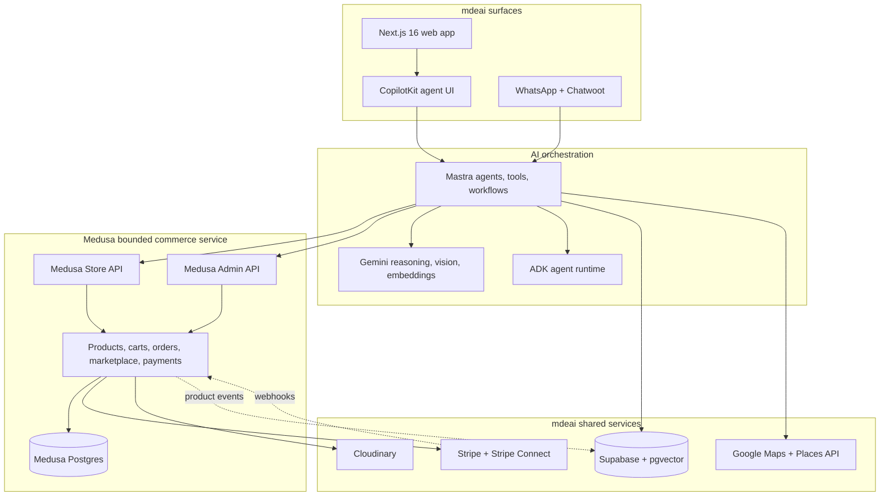

### 5.2 Data Ownership

| Domain | Source of Truth | Notes |
|---|---|---|
| Products, variants, inventory | Medusa | Do not duplicate mutable commerce fields in Supabase. |
| Carts, orders, payments, fulfillment | Medusa | Medusa calls Stripe and handles commerce lifecycle. |
| Vendors and vendor admins | Medusa marketplace module | Supabase may extend profile metadata. |
| Users/auth | Supabase Auth | Link Medusa customer via Supabase user id. |
| Designer profiles | Supabase | Public storytelling layer tied to vendor id. |
| Creator profiles and affiliates | Supabase | Advanced phase unless needed for launch partner. |
| Events, trips, venues | Existing mdeai Supabase domains | Link to Medusa product ids, do not copy products. |
| Product embeddings | Supabase pgvector | Generated from Medusa product events. |
| Media | Cloudinary | Medusa stores references. |
| Payments and payouts | Stripe | Stripe Connect for vendors. |
| Maps/places | Google Maps and Places API | Geospatial discovery and boutique/venue links. |

### 5.3 Source of Truth Rule

```text
Medusa owns commerce facts.
Supabase owns identity, AI memory, cross-vertical links, analytics, and vectors.
Mastra connects them through APIs and events.
CopilotKit and WhatsApp render the buying experience.
```

### 5.4 Product Search Flow

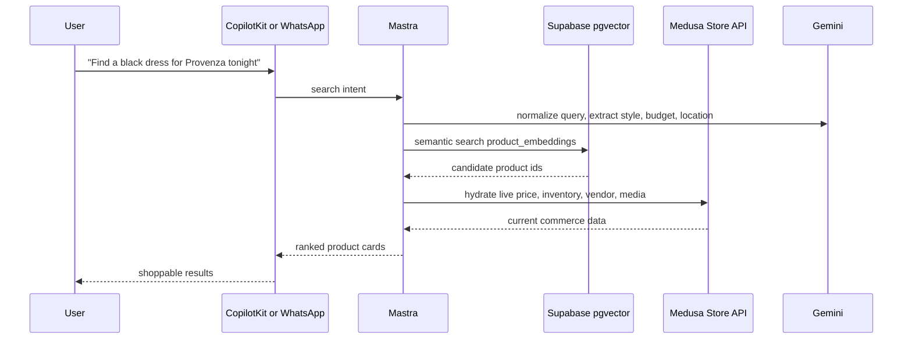

### 5.5 Checkout Flow

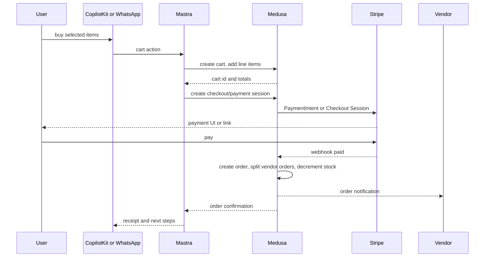

### 5.6 Recommendation Flow

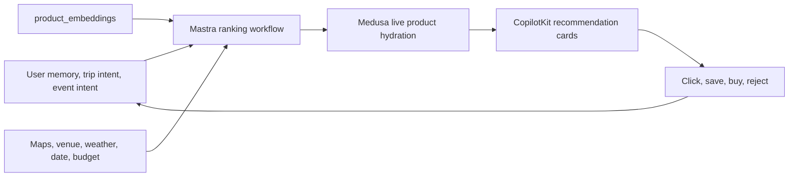

### 5.7 Vendor Onboarding Flow

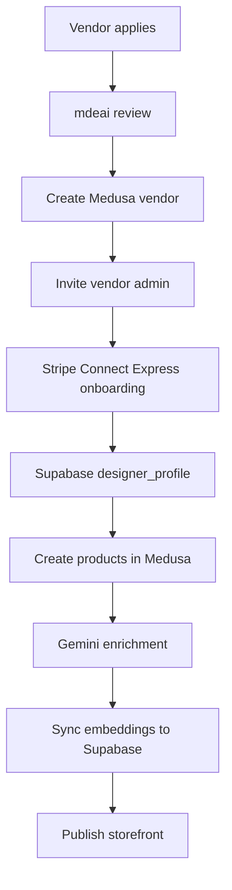

## 6. Marketplace Phases

### 6.1 Core Foundation

| Area | Plan |
|---|---|
| Goals | Run Medusa behind mdeai, prove catalog/search/cart/checkout, onboard first vendor manually. |
| Features | Product catalog, variants, cart, Stripe checkout, Cloudinary, semantic search, CopilotKit cards. |
| Database | Medusa core DB plus Supabase `product_embeddings`, `designer_profiles`, `event_products`, `venue_products`. |
| Workflows | Product creation, AI enrichment, cart creation, checkout, order confirmation. |
| Vendor management | Manual vendor approval and product publishing. |
| Product management | Medusa Admin first, vendor panel later. |
| Checkout | Stripe payment through Medusa; Connect can be configured before self-serve vendor scale. |
| AI integration | Mastra tools call Medusa APIs and Supabase pgvector; Gemini rewrites queries and enriches products. |

### 6.2 MVP

| Area | Plan |
|---|---|
| Goals | Multi-vendor marketplace with AI shopping, WhatsApp checkout, maps, events, and trips links. |
| Features | Vendor module, vendor admins, order splitting, Connect Express, wishlists, reviews, AI stylist, map discovery. |
| User flows | Ask, compare, save, add to cart, pay, track, ask support. |
| Commerce flows | Multi-vendor cart, split order, vendor fulfillment, refund request. |
| AI flows | Shopping assistant, stylist, recommendation, product enrichment, support. |
| Maps integration | Link products to boutiques, venues, and neighborhoods. |
| Trips integration | Add products and experiences to itineraries. |
| Events integration | Link products to events, runway looks, ticket bundles. |

### 6.3 Advanced

| Area | Plan |
|---|---|
| Goals | Build social, creator, and intelligence layers after marketplace liquidity. |
| AI agents | Stylist, vendor assistant, merchandiser, trend analyst, support agent. |
| Automation | Listing optimization, bundle generation, campaign suggestions, inventory alerts. |
| Intelligence | Fashion graph, demand forecasting, trend reports, vendor benchmarks. |
| Creator economy | Creator storefronts, affiliate attribution, commission payouts. |
| Social commerce | Shoppable content, WhatsApp drops, creator campaigns. |
| Recommendations | Personalization using behavior, location, events, trips, and semantic similarity. |

## 7. Marketplace Feature Catalog

Difficulty: S, M, L, XL. Priority: P0 highest to P3 later. Phase: Core, MVP, Advanced.

| # | Feature | Description | User Value | Revenue Value | Difficulty | Priority | Phase |
|---:|---|---|---|---|---|---|---|
| 1 | Multi-vendor marketplace | Multiple vendors sell through mdeai | More selection | Commissions | L | P0 | Core |
| 2 | Designer storefronts | Public vendor profile and catalog | Brand discovery | Subscriptions | M | P0 | Core |
| 3 | Vendor onboarding | Application, approval, setup | Supply growth | Enables revenue | M | P0 | Core |
| 4 | Vendor admins | Vendor team access | Self-service | Lower ops | M | P0 | MVP |
| 5 | Vendor dashboard | Orders, products, payouts, analytics | Control | Vendor subscriptions | M | P1 | MVP |
| 6 | Stripe Connect onboarding | Vendor payout setup | Trust | Commissions | M | P0 | MVP |
| 7 | Vendor verification badges | Trust signals | Confidence | Featured upgrade | S | P2 | MVP |
| 8 | Vendor messaging | Buyer/vendor support through Chatwoot | Trust | Retention | M | P2 | MVP |
| 9 | Vendor subscription tiers | Paid seller plans | Better tools | Recurring revenue | M | P1 | MVP |
| 10 | Vendor payouts dashboard | Transfer status and statements | Trust | Lower support cost | M | P1 | MVP |
| 11 | Product catalog | Products and metadata | Browse inventory | Core commissions | M | P0 | Core |
| 12 | Product variants | Size, color, SKU | Accurate purchase | Conversion | M | P0 | Core |
| 13 | Product collections | Curated groups | Discovery | Featured collections | S | P1 | Core |
| 14 | Cloudinary media pipeline | Optimized images | Faster shopping | Conversion | S | P0 | Core |
| 15 | Inventory tracking | Stock accuracy | Fewer failed orders | Trust | M | P0 | Core |
| 16 | AI product enrichment | Descriptions, tags, categories | Better listings | Conversion | M | P1 | Core |
| 17 | Semantic search | Natural language product search | Easier discovery | Conversion | M | P1 | MVP |
| 18 | Faceted filters | Size, category, price, location | Faster selection | Conversion | S | P1 | MVP |
| 19 | Similar products | Alternatives by vector similarity | Better discovery | Conversion | M | P2 | MVP |
| 20 | Visual search | Search by image | Inspiration shopping | Conversion | L | P2 | Advanced |
| 21 | Lookbooks | Editorial outfit collections | Inspiration | Sponsorship | M | P2 | Advanced |
| 22 | Fashion graph | Style, brand, venue, creator relations | Personalization | Data products | XL | P3 | Advanced |
| 23 | Trend boards | Trending styles and vendors | Inspiration | Featured placements | M | P2 | Advanced |
| 24 | Dynamic merchandising | AI-ranked category pages | Relevance | Sponsored ranking | L | P2 | Advanced |
| 25 | Size and fit guidance | AI fit hints | Lower returns | Conversion | M | P2 | Advanced |
| 26 | Product bundles | Sell outfits and packs | Convenience | Higher AOV | M | P1 | MVP |
| 27 | Drops | Limited launches | Urgency | GMV spike | M | P2 | Advanced |
| 28 | Pre-orders | Sell before stock arrives | Access | Cash flow | M | P3 | Advanced |
| 29 | Digital products | Tickets, vouchers, downloads | Instant fulfillment | Margin | M | P1 | MVP |
| 30 | Product rentals | Rent fashion or gear | Lower cost | Rental commission | L | P3 | Advanced |
| 31 | AI shopping assistant | Conversational product discovery | Easier buying | Conversion | M | P0 | Core |
| 32 | AI stylist | Outfit recommendations | Personalization | AOV | L | P1 | MVP |
| 33 | AI concierge commerce | Shop, book, and plan in one chat | Convenience | Cross-sell | M | P1 | MVP |
| 34 | AI recommendations | Personalized cards/feed | Relevance | Conversion | L | P1 | MVP |
| 35 | AI trip planner commerce | Buy items inside itineraries | Trip utility | Experiences GMV | M | P2 | MVP |
| 36 | AI event assistant | Event-specific shopping | Event prep | Ticket/product attach | M | P2 | MVP |
| 37 | AI bundle builder | Outfit plus event/trip packs | One-click planning | AOV | M | P2 | Advanced |
| 38 | AI gift finder | Occasion-based suggestions | Convenience | Conversion | S | P2 | Advanced |
| 39 | AI vendor assistant | Listing and ops help | Vendor speed | Vendor subscription | M | P2 | Advanced |
| 40 | AI merchandiser | Pricing, restock, trend advice | Vendor insight | SaaS tools | L | P2 | Advanced |
| 41 | AI support assistant | Order and return support | Faster help | Lower ops cost | M | P1 | MVP |
| 42 | Cart | Add/remove items | Buying flow | Core GMV | M | P0 | Core |
| 43 | Multi-vendor cart | One cart across vendors | Convenience | AOV | L | P0 | MVP |
| 44 | Stripe checkout | Card and wallet payments | Trust | Core GMV | M | P0 | Core |
| 45 | Apple Pay/Google Pay | One-tap mobile checkout | Speed | Conversion | S | P1 | Core |
| 46 | Stripe Connect split payouts | Vendor payouts and platform fees | Trust | Commissions | L | P0 | MVP |
| 47 | WhatsApp checkout links | Pay from chat | Local convenience | Conversion | M | P1 | MVP |
| 48 | Guest checkout | Buy without full signup | Lower friction | Conversion | S | P1 | Core |
| 49 | Wishlists | Save products | Return intent | Conversion | S | P1 | MVP |
| 50 | Promo codes | Campaign discounts | Savings | Marketing | S | P1 | MVP |
| 51 | Gift cards | Prepaid balance | Gift option | Float | M | P3 | Advanced |
| 52 | Installments | BNPL or local financing | Affordability | Conversion | L | P3 | Advanced |
| 53 | Refunds | Refund flow | Trust | Retention | M | P1 | MVP |
| 54 | Returns | Return request workflow | Trust | Retention | M | P2 | MVP |
| 55 | Order tracking | Order status and messages | Confidence | Lower support | M | P1 | MVP |
| 56 | Tax and fee handling | Colombia-ready fees/tax setup | Compliance | Lower risk | M | P1 | MVP |
| 57 | Event commerce | Products attached to events | Contextual shopping | Commission | M | P1 | MVP |
| 58 | Ticket and merch bundles | Tickets plus products | Convenience | Higher AOV | M | P2 | Advanced |
| 59 | Runway commerce | Shop looks from fashion shows | Inspiration | Premium GMV | M | P2 | Advanced |
| 60 | Colombiamoda storefront | Event hub for designers | Prestige | Sponsorship | L | P2 | Advanced |
| 61 | Trip commerce | Products linked to itineraries | Practical planning | Experiences GMV | L | P2 | MVP |
| 62 | Tourism experiences | Bookable products | Local access | Commission | M | P1 | MVP |
| 63 | Restaurant products | Vouchers, menus, merch | Discovery | Commission | M | P2 | Advanced |
| 64 | Cafe products | Beans, merch, gift cards | Local commerce | Commission | S | P3 | Advanced |
| 65 | Nightlife packages | VIP, bottles, experiences | Easy booking | Commission | M | P2 | Advanced |
| 66 | Venue products | Venue-linked offers | Contextual buying | Commission | M | P2 | MVP |
| 67 | Boutique maps | Products on Google Maps pins | Nearby discovery | Featured listings | M | P1 | MVP |
| 68 | Near-me products | Location-aware discovery | Convenience | Conversion | M | P1 | MVP |
| 69 | Local brand marketplace | Non-fashion local goods | More selection | Commission | M | P2 | Advanced |
| 70 | Creator profiles | Creator identity and taste | Discovery | Affiliate revenue | M | P2 | Advanced |
| 71 | Creator storefronts | Curated product pages | Trust and taste | Commission | M | P2 | Advanced |
| 72 | Affiliate links | Trackable creator referrals | Easy sharing | Affiliate margin | M | P2 | Advanced |
| 73 | Creator commission payouts | Pay creators | Incentive | Creator flywheel | M | P2 | Advanced |
| 74 | Shoppable content | Product tags in content | Inspiration | Conversion | L | P3 | Advanced |
| 75 | WhatsApp drops | Opt-in launches in chat | Timely access | Campaign GMV | M | P2 | Advanced |
| 76 | Influencer campaigns | Brand/creator marketplace | Reach | Campaign fees | M | P3 | Advanced |
| 77 | Live shopping | Real-time commerce | Entertainment | GMV | XL | P3 | Advanced |
| 78 | Reviews and ratings | Product/vendor social proof | Trust | Conversion | M | P1 | MVP |
| 79 | Verified purchase badges | Review authenticity | Trust | Conversion | S | P2 | MVP |
| 80 | Product Q&A | Buyer questions | Confidence | Conversion | M | P2 | Advanced |
| 81 | Dispute resolution | Issue handling | Buyer protection | Trust | M | P2 | Advanced |
| 82 | Authenticity verification | Fashion trust feature | Confidence | Premium fee | L | P3 | Advanced |
| 83 | Personalized home feed | User-specific marketplace home | Relevance | Conversion | L | P2 | Advanced |
| 84 | Recently viewed | Return to items | Convenience | Conversion | S | P2 | MVP |
| 85 | Trending now | Trending products/vendors | Discovery | Featured placement | S | P2 | MVP |
| 86 | Saved searches | Alerts for matching products | Retention | Conversion | M | P2 | Advanced |
| 87 | Cross-sell in cart | Related add-ons | Convenience | AOV | M | P1 | MVP |
| 88 | Upsell bundles | Upgrade to full look or package | Better outcome | AOV | M | P2 | MVP |
| 89 | Multilingual ES/EN | Spanish-first plus English | Wider reach | Conversion | M | P0 | Core |
| 90 | Vendor analytics | Traffic, sales, conversion | Seller insight | Subscription | M | P1 | MVP |
| 91 | AI listing optimizer | Improve titles, SEO, tags | Seller productivity | Subscription | M | P2 | Advanced |
| 92 | Inventory management | Stock tools | Seller productivity | Subscription | M | P2 | MVP |
| 93 | Promotions manager | Vendor sales/coupons | Seller control | Subscription | M | P2 | Advanced |
| 94 | Bulk import | CSV import for vendors | Faster onboarding | Supply growth | M | P2 | MVP |
| 95 | Multi-location inventory | Store/warehouse support | Accuracy | Subscription | L | P3 | Advanced |
| 96 | Marketing console | Audiences and campaigns | Growth | Subscription | L | P3 | Advanced |
| 97 | Payout scheduling | Scheduled transfers | Vendor trust | Lower support | M | P2 | MVP |
| 98 | Tax reporting | Vendor docs | Compliance | Subscription | M | P3 | Advanced |
| 99 | API access | Enterprise integrations | Extensibility | SaaS revenue | M | P3 | Advanced |
| 100 | Featured listings | Paid ranking/listing | Better exposure | Advertising | S | P1 | MVP |
| 101 | Sponsored placement | Paid product/category placement | Discovery | Ads | M | P2 | Advanced |
| 102 | Premium membership | Buyer perks and concierge | Savings/service | Subscription | M | P2 | Advanced |
| 103 | AI concierge subscription | Premium planning/shopping | Convenience | Subscription | M | P2 | Advanced |
| 104 | Data insights products | Trend and demand reports | Vendor intelligence | SaaS | L | P3 | Advanced |
| 105 | Marketplace SaaS tools | Paid vendor operations suite | Seller productivity | Subscription | L | P3 | Advanced |

## 8. AI Roadmap

| AI Feature | CopilotKit | Mastra | Gemini | Supabase |
|---|---|---|---|---|
| AI shopping assistant | Chat UI, product cards, cart actions | Tools call Medusa Store API | Intent extraction, query rewrite | Product embeddings, memory |
| AI stylist | Outfit boards and swap controls | Bundle and ranking workflow | Style reasoning, visual attributes | User preferences, embeddings |
| AI concierge | Unified web/WhatsApp buying surface | Routes between commerce, trips, events, venues | Multi-step reasoning | Leads, trips, events, venues |
| AI recommendations | Personalized cards | Ranking workflow | Preference inference | Recommendation logs, pgvector |
| AI trip planner | Itinerary UI with buyable items | Trip-commerce workflow | Plan generation | Trips and itinerary data |
| AI bundles | Bundle cards and checkout action | Bundle builder | Product compatibility reasoning | Embeddings and purchase data |
| AI event assistant | Event cards plus product modules | Event-commerce tool routing | Event intent and outfit mapping | Event data and linked products |
| AI vendor assistant | Admin copilot | Listing and product tools | Copy, translation, image tagging | Vendor profiles and analytics |
| AI merchandising assistant | Dashboard recommendations | Demand and merchandising workflows | Trend and pricing analysis | Sales, clicks, search signals |
| AI customer support | Order status UI and handoff | Order, refund, and Chatwoot tools | Natural language responses | Support history and customer context |

## 9. Revenue Strategy

### Monetization Model

| Stream | Model | Expected Margin | Scalability | Phase |
|---|---|---:|---|---|
| Product commissions | 8-20% take rate by category | High after payment fees | High | Core/MVP |
| Vendor subscriptions | $29-$299/month tiers | Very high | High | MVP |
| Featured listings | Flat monthly or campaign fee | Very high | High | MVP |
| Sponsored placement | CPM/CPC/flat sponsorship | Very high | High | Advanced |
| Event commerce | 5-15% merch/experience commission | Medium-high | Medium | MVP |
| Ticket commissions | Existing ticket commission layer | Medium | High | MVP |
| Affiliate programs | Platform share of referred sales | High | High | Advanced |
| Creator commissions | Creator earns, mdeai takes platform share | High | High | Advanced |
| Premium memberships | $5-$29/month buyer plan | High | High | Advanced |
| AI concierge subscriptions | Premium AI planning/shopping | High | High | Advanced |
| Marketplace SaaS tools | Vendor tools and analytics | Very high | High | Advanced |

### Recommended Early Pricing

| Category | Recommended Take Rate |
|---|---:|
| Fashion goods | 12-18% |
| Local brands | 15-20% |
| Experiences | 12-15% |
| Event merch | 10-15% |
| Tickets | Existing event ticket model |
| Creator commerce | Platform share of creator commission |

### Revenue Sequencing

1. Start with vendor subscriptions and featured listings because they do not require high GMV liquidity.
2. Add product commissions as checkout volume grows.
3. Add event and trip commerce once the product catalog is useful.
4. Add creators after products and tracking work.
5. Add AI concierge subscriptions only after the assistant regularly saves users time.

## 10. GitHub Repositories and Templates

Research refreshed on 2026-06-04. Scores reflect fit for mdeai, not general popularity.

### Medusa

| Repo/Resource | Why Use It | What To Copy | What Not To Copy | Score |
|---|---|---|---|---:|
| https://github.com/medusajs/medusa | Core commerce engine | Modules, workflows, API patterns | Do not fork core | 95 |
| https://docs.medusajs.com/resources/recipes/marketplace/examples/vendors | Official marketplace recipe | Vendor module, vendor admins, order splitting | Do not assume it is fully productized marketplace SaaS | 94 |
| https://github.com/medusajs/examples | Official v2 examples | Marketplace, agentic commerce, ticket booking, bundles, reviews, wishlist, subscriptions | Do not install every example | 92 |
| https://github.com/medusajs/nextjs-starter-medusa | Storefront API reference | Cart, checkout, product API usage | Do not adopt storefront as mdeai UI | 70 |
| https://github.com/medusajs/b2b-starter-medusa | B2B account patterns | Company/account concepts if vendors need teams | Do not make MVP B2B-heavy | 68 |
| https://github.com/medusajs/ui | Admin UI primitives | Components for vendor/admin tools | Do not rebuild the whole app shell around it | 72 |
| https://github.com/medusajs/medusa-starter-plugin | Plugin scaffolding | Module/plugin structure | Do not pluginize before stable needs | 76 |
| https://github.com/medusajs/medusa-agent-skills | AI-assisted Medusa development | Agent-facing Medusa task patterns | Do not expose admin-power tools to end users | 74 |

### Marketplace and Vendor References

| Repo/Resource | Why Use It | What To Copy | What Not To Copy | Score |
|---|---|---|---|---:|
| https://github.com/mercurjs/mercur | Medusa-based multi-vendor marketplace | Vendor panel, marketplace concepts, Stripe/Resend integration ideas | Do not replace mdeai with Mercur wholesale | 86 |
| https://github.com/mercurjs/b2c-marketplace-storefront | B2C marketplace storefront reference | Vendor storefront UX and category flows | Do not use as the main storefront | 72 |
| https://github.com/saleor/saleor | Mature GraphQL commerce reference | API and permission ideas | Do not switch stack | 65 |
| https://github.com/vendure-ecommerce/vendure | Headless commerce reference | Marketplace and admin concepts | Do not migrate from Medusa | 66 |
| https://github.com/bagisto/bagisto | Open-source marketplace reference | Seller UX ideas | Wrong stack for mdeai | 50 |
| https://github.com/spree/spree | Open-source commerce reference | Marketplace/payments concepts | Ruby stack mismatch | 55 |

### CopilotKit

| Repo/Resource | Why Use It | What To Copy | What Not To Copy | Score |
|---|---|---|---|---:|
| https://github.com/CopilotKit/CopilotKit | Current agent UI stack; docs mention generative UI, shared state, HITL | Product-card rendering, `useAgent`, actions, generative UI | Do not upgrade from pinned v1.55.2 without testing | 90 |
| https://docs.copilotkit.ai/ | Integration docs for Mastra, Google ADK, and agent frameworks | AG-UI and agent integration patterns | Do not create a separate chat product | 88 |

### Mastra

| Repo/Resource | Why Use It | What To Copy | What Not To Copy | Score |
|---|---|---|---|---:|
| https://github.com/mastra-ai/mastra | TypeScript agent, tools, workflow framework | Graph workflows, tools, memory, observability patterns | Do not make every action an autonomous workflow | 90 |
| Mastra docs/workflow examples | Explicit multi-step workflows | Product enrichment, recommendation, support workflows | Do not over-orchestrate simple API calls | 82 |

### Stripe and Marketplace Payments

| Resource | Why Use It | What To Copy | What Not To Copy | Score |
|---|---|---|---|---:|
| https://docs.stripe.com/connect | Stripe marketplace payout model | Connect Express onboarding, platform fees, transfers | Do not hand-roll payouts | 94 |
| Medusa Stripe payment module examples | Commerce checkout integration | Payment session pattern | Do not create a second checkout stack | 85 |

## 11. Database Design

### Ownership Model

Medusa should have its own Postgres database because Medusa migrations and modules should own commerce tables. Supabase should store mdeai-native extensions and links.

### ERD

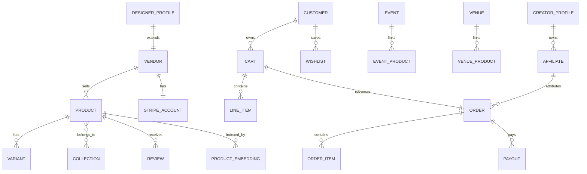

### Logical Tables

| Table | Owner | Purpose |
|---|---|---|
| `vendors` | Medusa marketplace module | Seller account and commission setup |
| `vendor_admins` | Medusa marketplace module | Vendor team access |
| `designer_profiles` | Supabase | Public designer profile linked to vendor |
| `products` | Medusa | Product catalog |
| `variants` | Medusa | Sizes, colors, SKU, inventory |
| `collections` | Medusa | Product groupings |
| `carts` | Medusa | Checkout carts |
| `orders` | Medusa | Commerce orders |
| `order_items` | Medusa | Purchased line items |
| `wishlists` | Supabase | Saved products |
| `recommendations` | Supabase | AI recommendation outputs and feedback |
| `reviews` | Supabase or Medusa custom module | Product/vendor reviews |
| `creator_profiles` | Supabase | Creator commerce profiles |
| `affiliates` | Supabase | Referral code and commission tracking |
| `event_products` | Supabase | Link events to Medusa products |
| `venue_products` | Supabase | Link venues to Medusa products |
| `product_embeddings` | Supabase pgvector | Semantic and visual search index |

### Supabase Extension Schema

This is the initial Supabase-side schema only. Medusa-owned commerce tables should be created by Medusa migrations.

```sql
create table if not exists commerce_designer_profiles (
  id uuid primary key default gen_random_uuid(),
  vendor_id text not null unique,
  display_name text not null,
  slug text not null unique,
  bio text,
  city text default 'Medellin',
  neighborhood text,
  website_url text,
  instagram_url text,
  whatsapp text,
  colombiamoda_participant boolean default false,
  status text not null default 'draft',
  created_at timestamptz not null default now(),
  updated_at timestamptz not null default now()
);

create table if not exists commerce_creator_profiles (
  id uuid primary key default gen_random_uuid(),
  user_id uuid,
  handle text not null unique,
  display_name text not null,
  bio text,
  instagram_url text,
  tiktok_url text,
  status text not null default 'draft',
  created_at timestamptz not null default now()
);

create table if not exists commerce_wishlists (
  id uuid primary key default gen_random_uuid(),
  user_id uuid not null,
  name text not null default 'Saved',
  created_at timestamptz not null default now()
);

create table if not exists commerce_wishlist_items (
  id uuid primary key default gen_random_uuid(),
  wishlist_id uuid not null references commerce_wishlists(id) on delete cascade,
  product_id text not null,
  variant_id text,
  created_at timestamptz not null default now(),
  unique (wishlist_id, product_id, variant_id)
);

create table if not exists commerce_reviews (
  id uuid primary key default gen_random_uuid(),
  user_id uuid not null,
  product_id text not null,
  vendor_id text,
  order_id text,
  rating int not null check (rating between 1 and 5),
  title text,
  body text,
  status text not null default 'pending',
  created_at timestamptz not null default now()
);

create table if not exists commerce_event_products (
  id uuid primary key default gen_random_uuid(),
  event_id uuid not null,
  product_id text not null,
  sort_order int not null default 0,
  label text,
  created_at timestamptz not null default now(),
  unique (event_id, product_id)
);

create table if not exists commerce_venue_products (
  id uuid primary key default gen_random_uuid(),
  venue_id uuid not null,
  product_id text not null,
  sort_order int not null default 0,
  label text,
  created_at timestamptz not null default now(),
  unique (venue_id, product_id)
);

create table if not exists commerce_affiliates (
  id uuid primary key default gen_random_uuid(),
  creator_id uuid not null references commerce_creator_profiles(id) on delete cascade,
  code text not null unique,
  commission_bps int not null default 1000,
  status text not null default 'active',
  created_at timestamptz not null default now()
);

create table if not exists commerce_affiliate_events (
  id uuid primary key default gen_random_uuid(),
  affiliate_id uuid references commerce_affiliates(id),
  user_id uuid,
  product_id text,
  order_id text,
  event_type text not null,
  metadata jsonb not null default '{}',
  created_at timestamptz not null default now()
);

create table if not exists commerce_recommendations (
  id uuid primary key default gen_random_uuid(),
  user_id uuid,
  session_id text,
  product_ids text[] not null default '{}',
  reason text,
  context jsonb not null default '{}',
  accepted_product_id text,
  created_at timestamptz not null default now()
);

create table if not exists commerce_product_embeddings (
  product_id text primary key,
  vendor_id text,
  title text not null,
  description text,
  tags text[] not null default '{}',
  image_url text,
  text_embedding vector(768),
  image_embedding vector(768),
  metadata jsonb not null default '{}',
  synced_at timestamptz not null default now()
);
```

## 12. Workflow Architecture

### 12.1 Vendor Onboarding

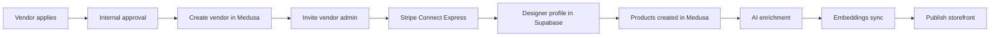

### 12.2 Product Creation and Enrichment

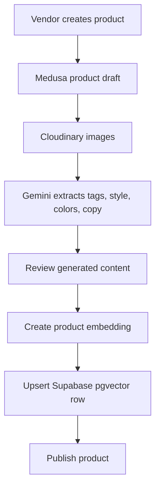

### 12.3 Order Fulfillment

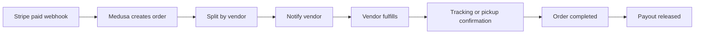

### 12.4 Event Commerce

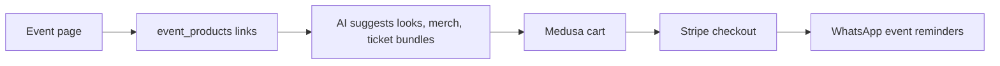

### 12.5 Fashion Commerce

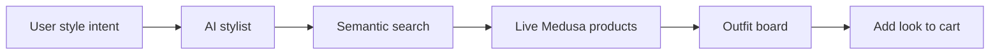

### 12.6 Creator Commerce

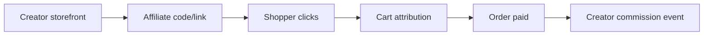

### 12.7 WhatsApp Commerce

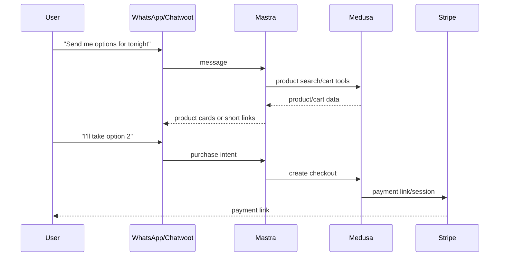

### 12.8 Recommendation Engine

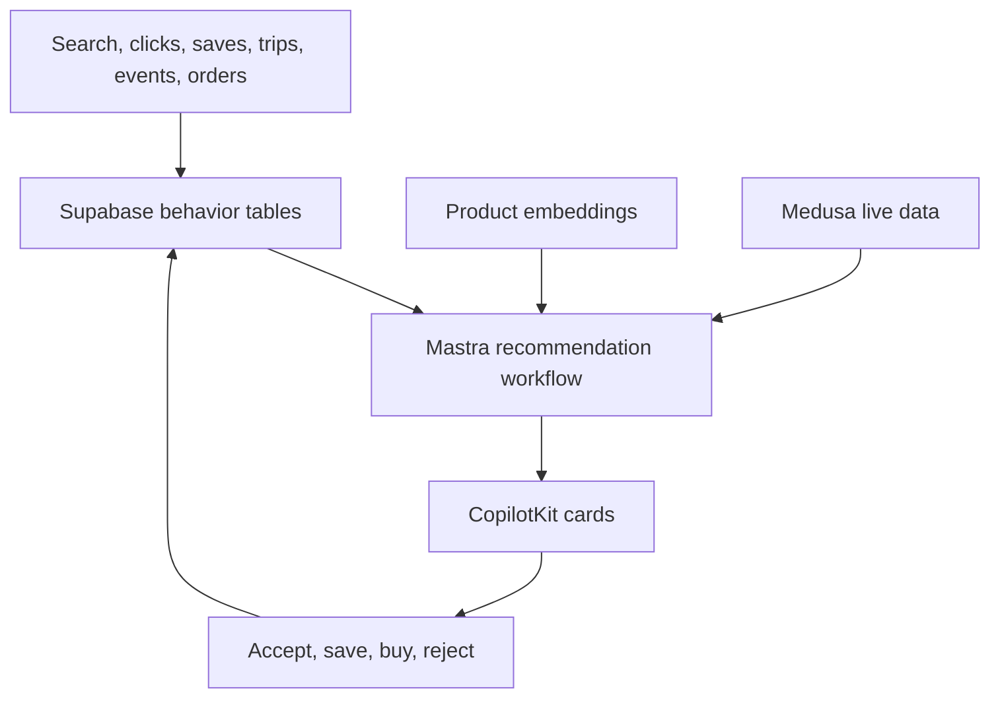

## 13. Roadmap Summary

| Horizon | Goal | Deliverables | Dependencies | Risks | Revenue Impact | Success Metrics |
|---|---|---|---|---|---|---|
| 30 days | Commerce foundation live | Medusa backend, Stripe, Cloudinary, product catalog, search/cart tools, CopilotKit cards | Stripe keys, Cloudinary, deployment | Setup drag, unclear ownership | First test sales | E2E checkout, 1 vendor, 20 products |
| 90 days | Multi-vendor MVP | Vendor module, Connect, vendor dashboard, AI stylist, WhatsApp checkout, wishlists/reviews | 30-day foundation | Vendor onboarding friction | Commissions and subscriptions | 10 vendors, 200 products, first paid GMV |
| 6 months | Cross-vertical commerce | Events/trips/venues links, creator pilot, featured listings, semantic search maturity | MVP liquidity | Scope creep | Take-rate plus featured | 50 vendors, repeat purchases |
| 12 months | Marketplace intelligence | Creator network, visual search, trend tools, AI merchandiser, premium concierge | Data volume | Operational complexity | Multi-stream revenue | 150 vendors, meaningful monthly GMV |

Detailed implementation roadmap lives in `ecom-roadmap.md`.

## 14. Critical Recommendations

### Biggest Opportunities

1. AI shopping for local lifestyle outcomes.
2. WhatsApp commerce for local conversion and support.
3. Fashion plus events as the launch wedge.
4. Creator storefronts after catalog liquidity.
5. Vendor subscriptions before GMV scale.

### Biggest Risks

1. Two product sources of truth.
2. Building a separate ecommerce app.
3. Overbuilding marketplace intelligence before basic checkout.
4. Underestimating vendor onboarding and fulfillment operations.
5. Relying on immature marketplace plugins without understanding the code.

### Build First

1. Medusa backend behind mdeai.
2. Stripe checkout.
3. Product search through Mastra and pgvector.
4. CopilotKit product cards.
5. One vendor, real products, real checkout.
6. Vendor module and Connect payouts.
7. WhatsApp payment links.

### Defer

- Full fashion graph.
- Live shopping.
- AR try-on.
- Complex dynamic pricing.
- Marketplace SaaS suite.
- Creator network at scale.
- Fully automated vendor approval.

### Architecture Mistakes To Avoid

- Do not fork Medusa core.
- Do not adopt the Medusa starter storefront as the mdeai storefront.
- Do not duplicate products in Supabase.
- Do not build a second Stripe checkout outside Medusa for commerce products.
- Do not build custom payouts when Stripe Connect exists.
- Do not make every interaction agentic; simple API calls should stay simple.
- Do not launch with logistics-heavy categories before the operating model is ready.

### Final Prioritized Implementation Order

```text
Core
1. Deploy Medusa as a bounded commerce service.
2. Configure Stripe, Cloudinary, and product catalog.
3. Build Mastra commerce tools for search, product detail, cart, and checkout.
4. Render product cards and cart actions in CopilotKit.
5. Sync product embeddings into Supabase pgvector.
6. Complete single-vendor checkout end to end.

MVP
7. Add marketplace module for vendors and vendor admins.
8. Add Stripe Connect Express and multi-vendor order splitting.
9. Add vendor dashboard v1, subscriptions, and featured listings.
10. Add AI stylist, wishlists, reviews, and WhatsApp checkout links.
11. Add event, venue, and trip product links.

Advanced
12. Add creator storefronts and affiliate attribution.
13. Add visual search, trend analysis, and fashion graph.
14. Add sponsored placement and social commerce drops.
15. Add AI merchandising and marketplace SaaS tools.
```

## 15. Definition of Done

The marketplace is ready for MVP launch when:

- Users can search products through the AI assistant.
- Product cards show current price, media, vendor, and stock.
- Users can add to cart and pay through Stripe.
- Orders are created in Medusa.
- Vendors can see orders.
- Product embeddings are synced from Medusa into Supabase.
- WhatsApp can send a payment link.
- At least 10 vendors and 200 products are ready.
- The team can manually resolve refunds and support issues.
- No product source-of-truth duplication exists.
