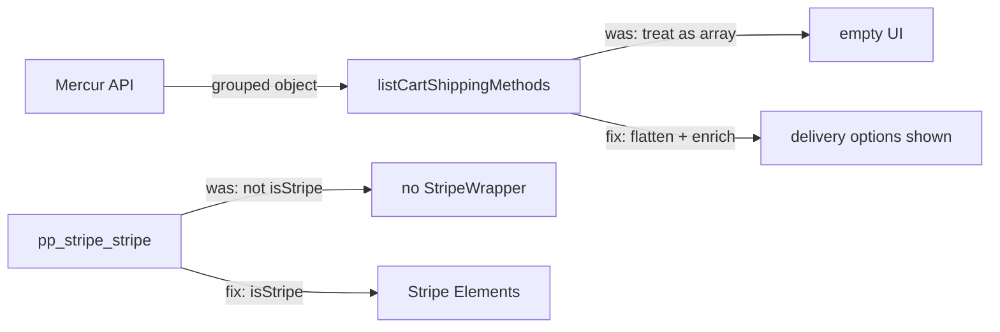

# COM-012 — B2C Checkout Shipping & Stripe Provider Fixes

Follow-up to merged PR #9 (`ipi/com-010c-b2c-storefront`). Scope: `b2c-storefront` only.

## Problems

1. **Delivery step empty** — Mercur `/store/shipping-options` returns options grouped by seller (`{ [seller_id]: ShippingOption[] }`). Storefront treated the payload as a flat array.
2. **Stripe Elements missing** — `isStripe()` only matched `pp_card_stripe-connect`. Local region registers `pp_stripe_stripe`.
3. **API 500 on shipping fields** — Request used typo `fulllment_set` in `fields` query; server returned 500, loader caught and returned `null` (“No shipping options available”).

## Changes

| File | Change |
|------|--------|
| `b2c-storefront/src/lib/data/fulfillment.ts` | `normalizeShippingOptions()`: array passthrough; object → `Object.entries().flatMap()` with `seller_id` / `seller_name` enrichment. Fixed `fields` to `fulfillment_set` + `*seller`. |
| `b2c-storefront/src/lib/constants.tsx` | `isStripe()` accepts `pp_card_stripe-connect` and `pp_stripe_stripe`. `paymentInfoMap` entry for `pp_stripe_stripe`. |
| `b2c-storefront/src/components/.../CartShippingMethodsSection.tsx` | Types: `seller_name`, `seller` on `StoreCardShippingMethod`. |
| `b2c-storefront/src/lib/data/payment.ts` | `listCartPaymentMethods` cache `force-cache` → `no-cache` so payment step reflects current region providers after navigation. |
| `b2c-storefront/.env.example` | `NEXT_PUBLIC_VENDOR_URL=http://localhost:7001` |

## Verification

### Build

```bash
cd b2c-storefront && yarn build
# ✓ Completed successfully (2026-06-15)
```

### Local stack

| Service | Port |
|---------|------|
| Mercur API | 9000 |
| B2C storefront | 3000 |
| Vendor panel | 7001 |

### API (curl)

- `GET /store/shipping-options?cart_id=…&fields=+service_zone.fulfillment_set.type,*service_zone.fulfillment_set.location.address,*seller` → **200**, grouped object with `ipix Standard Shipping` (€5).
- `GET /store/payment-providers?region_id=reg_01KV1VVTSXVBJWXENB7T6GVV91` → `pp_stripe_stripe`, `pp_system_default`.

### Browser smoke (`/de`)

| Step | Result |
|------|--------|
| `/de` | ✓ Homepage loads |
| `/de/categories` | ✓ Categories list |
| `/de/products/sweatshirt` | ✓ PDP (handle `sweatshirt`, not `medusa-sweatshirt`) |
| Cart → Checkout delivery | ✓ Seller **ipix** + **ipix Standard Shipping — €5.00** |
| Checkout payment | ✓ **Credit card** + Manual Payment |
| Select Credit card | ✓ “Enter your card details” + 2 Stripe iframes (`__privateStripeFrame`) |

**Env required for Stripe UI:** `NEXT_PUBLIC_STRIPE_KEY` (test publishable key) in `b2c-storefront/.env.local`.

**Full card capture → order placed:** Not completed in this session (Stripe Elements inside cross-origin iframes; delivery + provider detection + Elements mount verified).

## Root cause summary



## Out of scope

Operator UI, Supabase, Gemini, Mastra, CopilotKit, DNA, `my-marketplace/` code changes.
