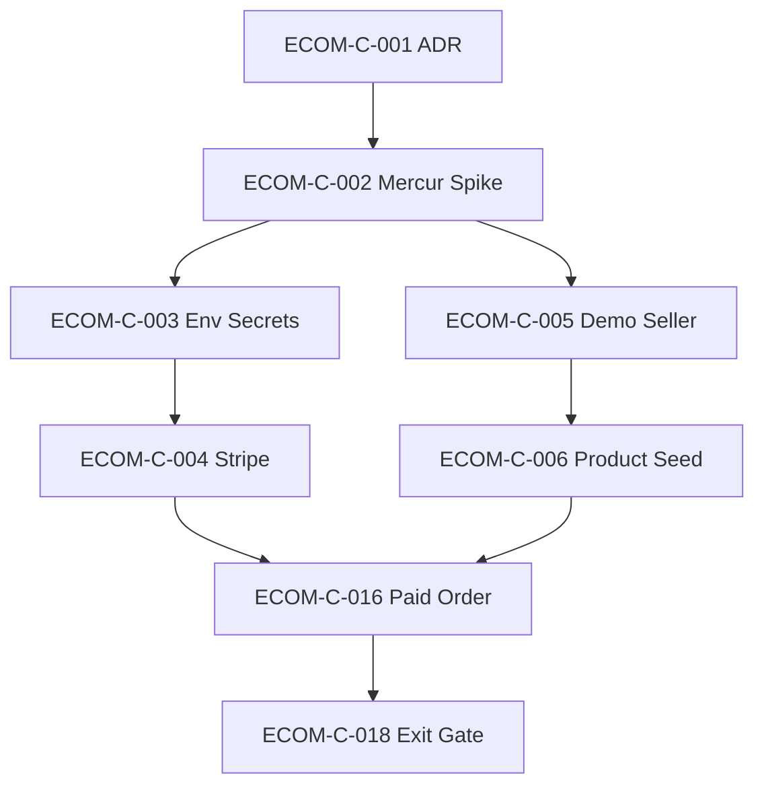

# Phase 1 — Commerce Standalone Proof

**Goal:** Mercur runs standalone → one seller → 20 products → Stripe test checkout → one paid order. **No CopilotKit. No mdeapp bridge. No Supabase product truth.**

---

## Dependency diagram

```text
ECOM-C-001 Commerce ADR
    ↓
ECOM-C-002 Mercur Backend Spike ──────────────┐
    ↓                                         │
ECOM-C-003 Commerce Env & Secrets             │
    ↓                                         ├──→ ECOM-C-005 Demo Seller
ECOM-C-004 Stripe Test Checkout               │         ↓
    │                                         │    ECOM-C-006 Product Catalog Seed
    └─────────────────────────────────────────┴─────────┘
                              ↓
                    ECOM-C-016 Paid Order Proof
                              ↓
                    ECOM-C-018 Core Commerce Exit Gate
```



---

## First 5 Pull Requests

### PR 1 — `docs(commerce): standalone commerce ADR (ECOM-C-001)`

| Field | Value |
|---|---|
| **Tasks** | ECOM-C-001 |
| **Goal** | Lock architecture boundary before code changes |
| **Definition of Done** | ADR merged; states Mercur standalone + data ownership; linked from INDEX |

---

### PR 2 — `feat(commerce): Mercur 2.0 scaffold + boot docs (ECOM-C-002)`

| Field | Value |
|---|---|
| **Tasks** | ECOM-C-002 |
| **Goal** | `commerce/mercur` boots; migrations run; health 200 |
| **Definition of Done** | `curl :9000/health` → 200; `BOOT.md` committed; admin login documented |

**Note:** Partially complete in workspace — PR formalizes + marks task Done.

---

### PR 3 — `chore(commerce): env template, Infisical path, redisUrl (ECOM-C-003)`

| Field | Value |
|---|---|
| **Tasks** | ECOM-C-003 |
| **Goal** | Secrets documented; no `.env` in git; Infisical `/commerce` path defined |
| **Definition of Done** | `.env.template` complete; `git status` clean of secrets; Infisical inject verified |

---

### PR 4 — `feat(commerce): mdeai seller + 20-product seed (ECOM-C-005, ECOM-C-006)`

| Field | Value |
|---|---|
| **Tasks** | ECOM-C-005, ECOM-C-006 |
| **Goal** | One approved seller; Store API returns ≥20 products |
| **Definition of Done** | `GET /store/products` count ≥ 20 with publishable key; seller visible in admin |

---

### PR 5 — `feat(commerce): Stripe checkout + paid order evidence (ECOM-C-004, ECOM-C-016)`

| Field | Value |
|---|---|
| **Tasks** | ECOM-C-004, ECOM-C-016 |
| **Goal** | Test card payment → Mercur order `paid` |
| **Definition of Done** | Evidence file with order id + Stripe payment intent; webhook verified; ECOM-C-018 unblocked |

---

## Stop conditions

Development **must stop** and fix before continuing when:

| # | Condition | Fix |
|---|---|---|
| 1 | Mercur API `/health` ≠ 200 | Fix `commerce/mercur` boot; check Postgres + Redis |
| 2 | `packages/api/.env` tracked in git | Add to gitignore; rotate exposed secrets |
| 3 | Stripe webhook not verified for commerce endpoint | Isolate webhook path from events Stripe; re-run `stripe listen` |
| 4 | Store API returns 0 products after seed | Fix sales channel ↔ publishable key ↔ seller product links |
| 5 | Paid order not created in Mercur admin | Debug payment provider + cart complete flow |
| 6 | Product/price/stock/cart/order duplicated in Supabase | Remove columns; Mercur owns mutable commerce truth |
| 7 | Scope creep: CopilotKit/Mastra/embeddings in Phase 1 PR | Split PR; defer to Phase 2/3 |
| 8 | Stripe Connect configured before single-vendor paid order | Remove Connect; use standard Stripe provider only |
| 9 | Second buyer storefront started (dtc/b2c) | Stop; mdeapp is buyer UI |
| 10 | `npm run floor` red after commerce changes touching mdeapp | Fix before merge (N/A if Phase 1 stays in `commerce/` only) |

---

## Smallest path to paid order (no AI, no marketplace)

```text
1. Mercur API healthy (:9000)
2. One demo seller (admin-created, approved)
3. ≥1 product linked to seller + sales channel (20 for full task)
4. Stripe provider in medusa-config (NOT Connect)
5. Store API: create cart → add line item → payment session → complete
6. Stripe test card 4242 4242 4242 4242
7. Order appears in Mercur admin with payment captured
```

**Explicitly excluded from this path:**

- CopilotKit / Mastra / ProductCards
- Supabase embeddings
- mdeapp `/api/commerce` bridge
- Vendor self-registration
- Stripe Connect / multi-vendor order-groups
- Affiliates, WhatsApp, featured listings
- Mercur `b2c-marketplace-storefront` deploy

**Minimum proof commands:**

```bash
# Health
curl -s -o /dev/null -w '%{http_code}\n' http://localhost:9000/health

# Products (after C-006)
PK=pk_... # from admin → Settings → Publishable API Keys
curl -s -H "x-publishable-api-key: $PK" http://localhost:9000/store/products | jq '.count'

# Cart + checkout — use Medusa Store API sequence or admin test order
# Document order_id in tasks/testing/evidence/YYYY-MM-DD/commerce-paid-order.md
```

---

## Skills & MCP for Phase 1

| Work | Resource |
|---|---|
| Task lifecycle | `ipix-task-lifecycle`, `task-verifier` |
| Mercur CLI / blocks | `mercur-cli`, `mercur-blocks` |
| Medusa modules | `building-with-medusa` |
| Mercur docs | MCP `search_mercur_js_documentation` → https://docs.mercurjs.com/mcp |
| Stripe | `mde-stripe` skill |
| Supabase (DB only, not product truth) | `ipix-supabase` |
