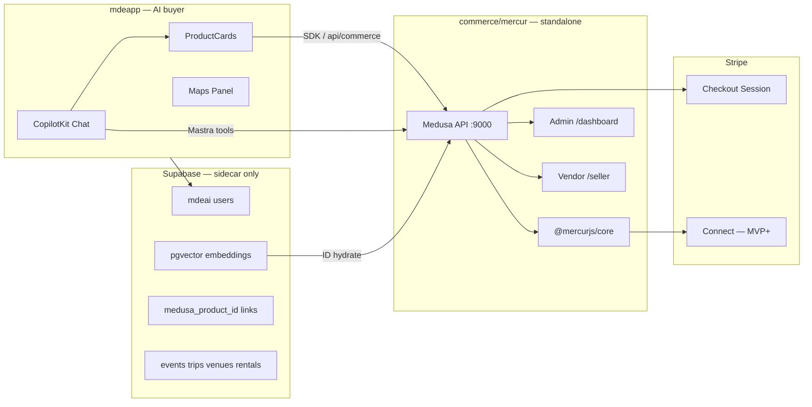
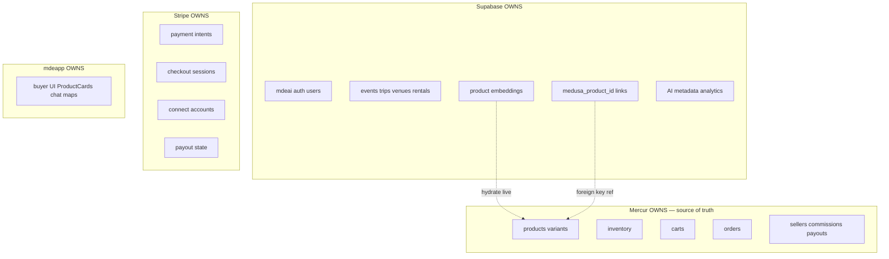
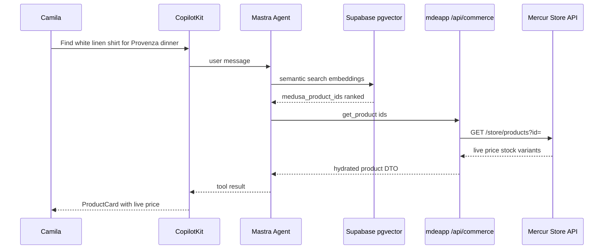
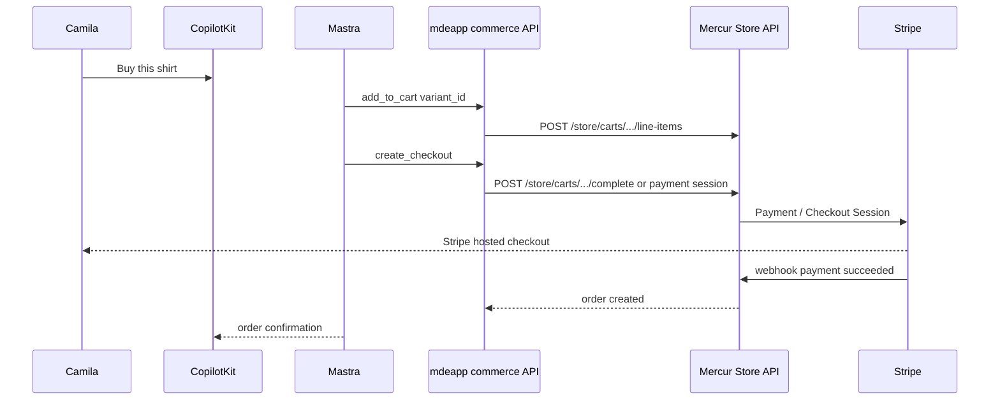
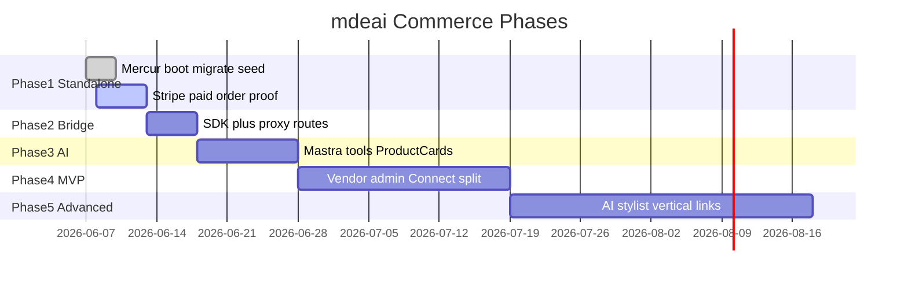

# mdeai Commerce Marketplace — Roadmap & Task Backlog

Executable plan for adding marketplace commerce to mdeai using **[Mercur 2.0](https://www.mercurjs.com/updates/mercur-2-0-release)** on Medusa v2, without merging commerce into `mdeapp/src` and without a second buyer storefront.

---

## 1. Executive recommendation

### Production backend

**Use [`mercurjs/mercur`](https://github.com/mercurjs/mercur) 2.0** at `commerce/mercur/` as the **only production commerce codebase**.

Mercur 2.0 is a ground-up redesign: block-based modules, typed `@mercurjs/client`, CLI lifecycle (`create`, `add`, `diff`, `search`, `codegen`), in-monorepo admin/vendor dashboards, Stripe Connect payouts, and AI-native skills — see [Mercur 2.0 release notes](https://www.mercurjs.com/updates/mercur-2-0-release).

### Reference only

| Repo | Role |
|---|---|
| [`medusajs/examples`](https://github.com/medusajs/examples) | Copy `modules` / `workflows` / `api` patterns (agentic-commerce, restaurant-marketplace, ticket-booking, product-rentals) |
| [`medusajs/medusa`](https://github.com/medusajs/medusa) | Framework docs, upgrade notes, module architecture |
| [`medusajs/dtc-starter`](https://github.com/medusajs/dtc-starter) | Core fallback if Mercur spike fails |
| [`mercurjs/b2c-marketplace-storefront`](https://github.com/mercurjs/b2c-marketplace-storefront) | SDK + cart + seller-page UX patterns for mdeapp ProductCards |
| [`medusajs/medusa-starter-plugin`](https://github.com/medusajs/medusa-starter-plugin) | Advanced custom plugins (event-product links, affiliate) |

### Avoid

| Repo | Reason |
|---|---|
| `medusa-starter-default`, `b2b-starter`, `b2b-starter-medusa` | Deprecated or wrong B2B model |
| `mercurjs/vendor-panel`, `mercurjs/admin-panel` (standalone) | Mercur 1.x drift — use `commerce/mercur/apps/*` |
| `mercurjs/clean-medusa-starter` | Stale bare Medusa; no marketplace path |
| Any second buyer Next storefront | mdeapp owns Camila's AI concierge |

### Why Mercur first (not custom marketplace)

- **Seller, commission, payout, order-group** modules already ship in `@mercurjs/core` — rebuilding = months of risk.
- **Stripe Connect** payout provider is built-in; custom payout = compliance + webhook debt.
- **Mercur 2.0 blocks** copy into your repo (full ownership) — AI agents can extend via `mercur-blocks` skill + MCP.
- **141+ integration tests** in upstream monorepo; Medusa recipe alone lacks vendor admin + Connect.

### Why not a second buyer storefront

- Camila's product is **chat-first** concierge, not catalog-first ecommerce.
- Two Next apps = duplicate cart/auth/session and DESIGN.MD drift.
- Headless Medusa/Mercur **Store API** is designed for exactly one custom frontend (mdeapp).

### How mdeapp and Mercur communicate

```text
mdeapp (buyer)
  → src/lib/commerce/medusa-client.ts (@medusajs/js-sdk)
  → /api/commerce/* (server-only proxy, publishable key never in browser if needed)
  → http://commerce-api:9000/store/* (Mercur Medusa Store API)

Mastra tools (Phase 3)
  → call mdeapp /api/commerce/* or SDK server-side
  → never duplicate cart/order state in Supabase

Supabase (sidecar)
  → pgvector embeddings + medusa_product_id links only
  → hydrate price/stock from Mercur at card render time
```

---

## 2. Repo summary table

| Repo | Score | Grade | Use level | Phase | Use for | Do not use for | Risk |
|---|---:|---|---|---|---|---|---|
| [mercurjs/mercur](https://github.com/mercurjs/mercur) | 91 | A | **FOUNDATION** | Core→MVP | Backend, marketplace logic, vendor/admin apps | mdeapp replacement | Dual DB ops; Bun/Redis |
| [medusajs/examples](https://github.com/medusajs/examples) | 88 | A | **REFERENCE** | Core→Adv | Pattern copy for verticals + AI commerce | Whole-app deploy | Scope creep if copying entire examples |
| [medusajs/medusa](https://github.com/medusajs/medusa) | 85 | A- | **REFERENCE** | Always | Framework understanding | Production deploy target | Low |
| [medusajs/dtc-starter](https://github.com/medusajs/dtc-starter) | 82 | B+ | **FALLBACK** | Core | Single-vendor spike if Mercur blocked | Multi-vendor MVP | Re-work in MVP |
| [mercurjs/b2c-marketplace-storefront](https://github.com/mercurjs/b2c-marketplace-storefront) | 74 | B | **REFERENCE** | Core→MVP | SDK/cart/seller UX | Production storefront | Duplicate frontend |
| [medusajs/medusa-starter-plugin](https://github.com/medusajs/medusa-starter-plugin) | 72 | B | **REFERENCE** | Advanced | Custom mdeai plugins | Core foundation | Low |
| [mercurjs/clean-medusa-starter](https://github.com/mercurjs/clean-medusa-starter) | 68 | C+ | **FALLBACK** | Core | Last-resort bare Medusa | Marketplace | Dead-end |
| [mercurjs/vendor-panel](https://github.com/mercurjs/vendor-panel) | 58 | D+ | **AVOID** | — | UX screenshots | Production | API version drift |
| [mercurjs/admin-panel](https://github.com/mercurjs/admin-panel) | 56 | D+ | **AVOID** | — | UX screenshots | Production | API version drift |
| [medusajs/medusa-starter-default](https://github.com/medusajs/medusa-starter-default) | 55 | D | **AVOID** | — | — | Anything | Deprecated |
| [medusajs/b2b-starter](https://github.com/medusajs/b2b-starter) | 45 | D | **AVOID** | — | — | mdeai lifestyle B2C | Wrong model |
| [medusajs/b2b-starter-medusa](https://github.com/medusajs/b2b-starter-medusa) | 40 | D- | **AVOID** | — | — | Anything | Deprecated + B2B |

---

## 3. Architecture plan

### 3.1 System context



### 3.2 Data boundaries



### 3.3 Product search flow (Phase 3+)



### 3.4 Checkout flow



### 3.5 Phase rollout



---

## 4. Data ownership plan

### Mercur / Medusa owns (mutable commerce truth)

| Domain | Examples | Never mirror in Supabase |
|---|---|---|
| Catalog | products, variants, categories, collections, attributes | price, stock, SKU |
| Inventory | stock levels, reservations | quantity on hand |
| Cart | cart id, line items, promotions | cart contents |
| Orders | order id, status, fulfillments, returns | order line items |
| Marketplace | sellers, members, commissions, payouts, order-groups | seller payout balances |
| Shipping | profiles, options, fulfillment sets | rates |

### Supabase owns (mdeai platform truth)

| Domain | Examples | Commerce link field |
|---|---|---|
| Auth | `auth.users`, profiles | `seller_user_id` optional bridge |
| Verticals | events, trips, venues, rentals | `linked_medusa_product_ids[]` metadata |
| AI search | `product_embeddings` | `medusa_product_id`, `medusa_variant_id` |
| Recommendations | taste profiles, outfit graphs | metadata only |
| Analytics | search clicks, card impressions | event IDs only |

### Stripe owns

| Domain | Phase |
|---|---|
| PaymentIntent / Checkout Session | Core |
| Webhook events (`payment_intent.succeeded`) | Core |
| Connect Express accounts | MVP |
| Transfer / payout objects | MVP |

### mdeapp owns

| Domain | Notes |
|---|---|
| CopilotKit chat shell | existing |
| ProductCard UI | `data-testid="product-card"` |
| Mastra tools orchestration | calls commerce API |
| Maps discovery | boutique pins from seller geo in Mercur |
| Trip/event/venue context | Supabase → enriches AI prompts |

### Hydration rule (hard)

> Every ProductCard **must** call Mercur Store API (or mdeapp commerce proxy) **at render time** for price, stock, and variant availability. pgvector returns **IDs + similarity score only**.

---

## 5. Roadmap by phase

### Phase 1 — Commerce standalone proof (no CopilotKit)

**Goal:** Mercur runs alone → one seller → 20 products → Stripe test checkout → one paid order in Mercur admin.

| Item | Detail |
|---|---|
| **Depends on** | Local Postgres + Redis; Infisical secrets path for Stripe |
| **Proof** | `curl :9000/health` 200 · Stripe test payment · order visible in admin |
| **Risk** | Store products not visible until sales-channel/key linking fixed; separate Stripe webhook namespace from events |
| **Rollback** | Stop `commerce/mercur`; drop `mercur` DB; no mdeapp changes |
| **Done when** | ECOM-C-016 + ECOM-C-018 green |

**Status (2026-06-07):** ECOM-C-002 partial — API :9000 up, migrated, seeded, admin user created. **Remaining:** Stripe, 20 Medellín products, seller, paid order.

---

### Phase 2 — Thin mdeapp bridge (no AI)

**Goal:** mdeapp fetches products, creates cart, creates checkout link via SDK/proxy — zero order truth in Supabase.

| Item | Detail |
|---|---|
| **Depends on** | Phase 1 paid order proof |
| **Proof** | `curl localhost:3001/api/commerce/products` returns live Mercur JSON |
| **Risk** | CORS misconfig; leaking secret API keys client-side |
| **Rollback** | Delete `src/lib/commerce/*` and `/api/commerce/*`; mdeapp unchanged otherwise |
| **Done when** | ECOM-C-007 + ECOM-C-008 acceptance criteria met |

---

### Phase 3 — CopilotKit + Mastra AI commerce

**Goal:** Natural-language product search → ProductCard → checkout through existing chat.

| Item | Detail |
|---|---|
| **Depends on** | Phase 2 bridge + pgvector link table |
| **Proof** | Playwright: prompt → `product-card` ≥1 → checkout URL returned |
| **Risk** | CopilotKit POST storm; stale embedding → wrong product ID |
| **Rollback** | Disable commerce tools in agent; feature flag `COMMERCE_AI_ENABLED=false` |
| **Done when** | ECOM-C-010–C-016 + ECOM-C-018 |

**Pattern source:** [`medusajs/examples/agentic-commerce`](https://github.com/medusajs/examples/tree/main/agentic-commerce)

---

### Phase 4 — Marketplace MVP

**Goal:** Multi-vendor Medellín lifestyle marketplace — designers, Colombiamoda, vendor onboarding, Connect, split orders.

| Item | Detail |
|---|---|
| **Depends on** | Phase 3 Core exit gate |
| **Proof** | Two sellers · split order-group · Connect onboarding · vendor panel live |
| **Risk** | Stripe Connect KYC latency; vendor product moderation backlog |
| **Rollback** | Single-seller mode flag; disable seller registration |
| **Done when** | ECOM-M-001–M-007 + M-013 pilot |

**Mercur 2.0 blocks to evaluate:** `reviews`, `wishlist`, `team-management`, `vendor-notifications` per [release notes](https://www.mercurjs.com/updates/mercur-2-0-release).

---

### Phase 5 — Advanced AI lifestyle marketplace

**Goal:** AI stylist, cross-vertical product links (events/trips/venues), creator storefronts, affiliate commissions.

| Item | Detail |
|---|---|
| **Depends on** | MVP liquidity (real orders, ≥5 active sellers) |
| **Proof** | Event page shows linked products; AI outfit recommendation with live hydration |
| **Risk** | Over-engineering before GMV; affiliate fraud |
| **Rollback** | Feature flags per vertical link module |
| **Done when** | ECOM-A-001–A-006 acceptance criteria |

---

## 6. Linear-ready task backlog

### Phase 1 — Core (ECOM-C-*)

#### ECOM-C-000 — Verification floor

| Field | Value |
|---|---|
| **Phase** | Core |
| **Goal** | Commerce work starts only on green mdeapp floor |
| **Files** | `package.json`, `tasks/testing/evidence/` |
| **Refs** | `ipix-task-lifecycle`, `task-verifier` |
| **Acceptance** | `npm run floor` exits 0 from `mdeapp/` |
| **Proof** | `cd mdeapp && infisical run -- npm run floor` |
| **Rollback** | N/A |
| **Depends on** | — |
| **Priority** | P0 |
| **Risk** | Low |

---

#### ECOM-C-001 — Commerce architecture ADR

| Field | Value |
|---|---|
| **Phase** | Core |
| **Goal** | Document standalone `commerce/mercur` boundary in ADR |
| **Files** | `docs/ecommerce/docs/05-adr-standalone-commerce.md` |
| **Refs** | `04-repos.md`, Mercur 2.0 release |
| **Acceptance** | ADR signed: no merge into mdeapp; data ownership table |
| **Proof** | ADR exists; linked from this roadmap |
| **Rollback** | Delete ADR file |
| **Depends on** | ECOM-C-000 |
| **Priority** | P0 |
| **Risk** | Low |

---

#### ECOM-C-002 — Mercur backend spike

| Field | Value |
|---|---|
| **Phase** | Core |
| **Goal** | `commerce/mercur` boots with migrations |
| **Files** | `commerce/mercur/**`, `commerce/mercur/BOOT.md` |
| **Refs** | [mercur](https://github.com/mercurjs/mercur), `mercur-cli` skill |
| **Acceptance** | `:9000/health` → 200; admin login works |
| **Proof** | `curl -s -o /dev/null -w '%{http_code}' http://localhost:9000/health` → `200` |
| **Rollback** | `rm -rf commerce/mercur`; drop DB `mercur` |
| **Depends on** | ECOM-C-001 |
| **Priority** | P0 |
| **Risk** | Medium |
| **Status** | **Partial — API up, migrations done** |

---

#### ECOM-C-003 — Commerce env and secrets

| Field | Value |
|---|---|
| **Phase** | Core |
| **Goal** | Infisical path for commerce Stripe/DB/Redis; local `.env` documented |
| **Files** | `commerce/mercur/packages/api/.env`, Infisical path `/commerce` |
| **Refs** | `BOOT.md`, `ipix-supabase` skill |
| **Acceptance** | Secrets not committed; dev + staging paths documented |
| **Proof** | `git status` shows no `.env`; Infisical inject works |
| **Rollback** | Revert env template only |
| **Depends on** | ECOM-C-002 |
| **Priority** | P0 |
| **Risk** | Medium |
| **Status** | **Partial — local .env only** |

---

#### ECOM-C-004 — Stripe test checkout

| Field | Value |
|---|---|
| **Phase** | Core |
| **Goal** | Medusa Stripe provider configured; webhooks isolated from event checkout |
| **Files** | `commerce/mercur/packages/api/medusa-config.ts`, Stripe dashboard |
| **Refs** | Mercur Stripe Connect docs, `mde-stripe` skill |
| **Acceptance** | Test card `4242…` completes; webhook `payment_intent.succeeded` received |
| **Proof** | Stripe CLI `stripe listen --forward-to localhost:9000/hooks/payment/...` + test payment |
| **Rollback** | Disable Stripe module in medusa-config |
| **Depends on** | ECOM-C-003 |
| **Priority** | P0 |
| **Risk** | High (webhook collision with events Stripe) |

---

#### ECOM-C-005 — Seed demo seller

| Field | Value |
|---|---|
| **Phase** | Core |
| **Goal** | One internal seller "mdeai-demo" linked to products |
| **Files** | `commerce/mercur/packages/api/src/scripts/seed-mdeai.ts` |
| **Refs** | `@mercurjs/core` seller workflows |
| **Acceptance** | Seller `approved` in admin; products linked |
| **Proof** | Admin → Sellers shows 1 approved seller |
| **Rollback** | Re-run seed reset script |
| **Depends on** | ECOM-C-002 |
| **Priority** | P0 |
| **Risk** | Low |

---

#### ECOM-C-006 — Seed product catalog

| Field | Value |
|---|---|
| **Phase** | Core |
| **Goal** | 20 Medellín lifestyle SKUs (fashion + event merch); store API returns ≥1 |
| **Files** | `commerce/mercur/packages/api/src/scripts/seed-mdeai.ts` |
| **Refs** | `b2c-marketplace-storefront` variant UX; Cloudinary URLs |
| **Acceptance** | `GET /store/products` with publishable key returns ≥20 products |
| **Proof** | `curl -H "x-publishable-api-key: $PK" http://localhost:9000/store/products \| jq '.count'` ≥ 20 |
| **Rollback** | Truncate product tables / re-seed |
| **Depends on** | ECOM-C-005 |
| **Priority** | P0 |
| **Risk** | Medium (sales channel linking) |

---

#### ECOM-C-007 — mdeapp commerce SDK bridge

| Field | Value |
|---|---|
| **Phase** | 2 |
| **Goal** | `@medusajs/js-sdk` wrapper in mdeapp |
| **Files** | `mdeapp/src/lib/commerce/medusa-client.ts`, `mdeapp/package.json` |
| **Refs** | `b2c-marketplace-storefront` config.ts, `building-storefronts` skill |
| **Acceptance** | Server-side SDK returns product JSON from :9000 |
| **Proof** | `node -e "require('./dist/...')"` or vitest `commerce-client.test.ts` |
| **Rollback** | Remove `src/lib/commerce/` |
| **Depends on** | ECOM-C-006, ECOM-C-016 |
| **Priority** | P1 |
| **Risk** | Low |

---

#### ECOM-C-008 — Commerce API proxy routes

| Field | Value |
|---|---|
| **Phase** | 2 |
| **Goal** | `/api/commerce/products`, `/api/commerce/cart`, `/api/commerce/checkout` |
| **Files** | `mdeapp/src/app/api/commerce/**` |
| **Refs** | Medusa Store API docs |
| **Acceptance** | Routes return 200; no service-role abuse; publishable key server-side |
| **Proof** | `curl localhost:3001/api/commerce/products` → JSON array |
| **Rollback** | Delete `src/app/api/commerce/` |
| **Depends on** | ECOM-C-007 |
| **Priority** | P1 |
| **Risk** | Medium |

---

#### ECOM-C-009 — Supabase product embedding links only

| Field | Value |
|---|---|
| **Phase** | 3 |
| **Goal** | `product_embeddings` table: vector + `medusa_product_id` + `medusa_variant_id` only |
| **Files** | `supabase/migrations/*_product_embeddings.sql`, `mdeapp/src/lib/commerce/embeddings.ts` |
| **Refs** | `ipix-supabase`, `supabase-postgres-best-practices` skills |
| **Acceptance** | No price/stock columns; RLS enabled; link FK optional soft ref |
| **Proof** | Supabase MCP: `\d product_embeddings` — no price column |
| **Rollback** | `DROP TABLE product_embeddings` migration down |
| **Depends on** | ECOM-C-006 |
| **Priority** | P1 |
| **Risk** | Low |

---

#### ECOM-C-010 — Mastra product_search tool

| Field | Value |
|---|---|
| **Phase** | 3 |
| **Goal** | Agent tool: semantic search → hydrate from Mercur |
| **Files** | `mdeapp/src/mastra/tools/search-products.ts`, agent `index.ts` |
| **Refs** | `medusajs/examples/agentic-commerce` |
| **Acceptance** | Tool returns ≤10 products with live price |
| **Proof** | `npm run smoke:commerce-search` or mastra studio trace |
| **Rollback** | Remove tool from agent exports |
| **Depends on** | ECOM-C-008, ECOM-C-009 |
| **Priority** | P1 |
| **Risk** | Medium |

---

#### ECOM-C-011 — Mastra product_detail tool

| Field | Value |
|---|---|
| **Phase** | 3 |
| **Goal** | Fetch single product + variants by medusa id |
| **Files** | `mdeapp/src/mastra/tools/get-product.ts` |
| **Acceptance** | Returns variant selectors data for ProductCard |
| **Proof** | Vitest with mocked Store API |
| **Rollback** | Remove tool |
| **Depends on** | ECOM-C-008 |
| **Priority** | P1 |
| **Risk** | Low |

---

#### ECOM-C-012 — Mastra cart tools

| Field | Value |
|---|---|
| **Phase** | 3 |
| **Goal** | `add_to_cart`, `get_cart` tools |
| **Files** | `mdeapp/src/mastra/tools/cart-*.ts` |
| **Acceptance** | Cart id persisted in agent working memory / cookie |
| **Proof** | Integration test: add line item → cart has 1 item |
| **Rollback** | Remove tools |
| **Depends on** | ECOM-C-008 |
| **Priority** | P1 |
| **Risk** | Medium |

---

#### ECOM-C-013 — Mastra checkout tool

| Field | Value |
|---|---|
| **Phase** | 3 |
| **Goal** | `create_checkout` returns Stripe URL |
| **Files** | `mdeapp/src/mastra/tools/create-checkout.ts` |
| **Acceptance** | Returns hosted checkout URL; no card data in chat |
| **Proof** | E2E: tool → Stripe test URL opens |
| **Rollback** | Remove tool |
| **Depends on** | ECOM-C-004, ECOM-C-012 |
| **Priority** | P1 |
| **Risk** | High |

---

#### ECOM-C-014 — CopilotKit ProductCard render

| Field | Value |
|---|---|
| **Phase** | 3 |
| **Goal** | `useCopilotAction` renders `data-testid="product-card"` |
| **Files** | `mdeapp/src/components/commerce/product-card.tsx`, copilot actions |
| **Refs** | `DESIGN.MD`, `copilotkit-develop` skill |
| **Acceptance** | Card shows image, title, price, seller badge, CTA |
| **Proof** | Browser: product tool result → card visible |
| **Rollback** | `available: "disabled"` on action |
| **Depends on** | ECOM-C-010 |
| **Priority** | P1 |
| **Risk** | Medium |

---

#### ECOM-C-015 — ProductCard live hydration

| Field | Value |
|---|---|
| **Phase** | 3 |
| **Goal** | Card re-fetches price/stock on mount; skeleton while loading |
| **Files** | `product-card.tsx`, `use-commerce-hydration.ts` |
| **Acceptance** | Stale embedding id with changed price still shows live price |
| **Proof** | Vitest: mock Store API price change between search and render |
| **Rollback** | Revert hydration hook |
| **Depends on** | ECOM-C-014 |
| **Priority** | P1 |
| **Risk** | Low |

---

#### ECOM-C-016 — Paid order proof

| Field | Value |
|---|---|
| **Phase** | 1 (standalone) + 3 (via AI) |
| **Goal** | One paid Stripe test order creates Mercur order |
| **Files** | evidence `tasks/testing/evidence/YYYY-MM-DD/commerce-paid-order.md` |
| **Acceptance** | Order id in Mercur admin; payment `paid` |
| **Proof** | Screenshot + order id + Stripe payment intent id |
| **Rollback** | Refund in Stripe test mode |
| **Depends on** | ECOM-C-004, ECOM-C-006 |
| **Priority** | P0 |
| **Risk** | High |

---

#### ECOM-C-017 — Manual support/refund playbook

| Field | Value |
|---|---|
| **Phase** | Core |
| **Goal** | Patricia ops doc: refund, cancel, support escalation |
| **Files** | `docs/ecommerce/docs/06-ops-playbook.md` |
| **Acceptance** | Playbook covers test + prod; links Mercur admin |
| **Proof** | Doc review checklist |
| **Rollback** | N/A |
| **Depends on** | ECOM-C-016 |
| **Priority** | P2 |
| **Risk** | Low |

---

#### ECOM-C-018 — Core commerce exit gate

| Field | Value |
|---|---|
| **Phase** | Core |
| **Goal** | Formal gate before MVP work |
| **Files** | `tasks/testing/evidence/YYYY-MM-DD/commerce-core-RESULTS.md` |
| **Acceptance** | All P0 ECOM-C tasks green; user approval for MVP start |
| **Proof** | Evidence file + `npm run verify:task -- ECOM-C-018` |
| **Rollback** | Block ECOM-M-* until green |
| **Depends on** | ECOM-C-016, ECOM-C-015, ECOM-C-017 |
| **Priority** | P0 |
| **Risk** | Low |

---

### Phase 4 — MVP (ECOM-M-*)

| ID | Title | Priority | Depends on | Risk |
|---|---|---|---|---|
| ECOM-M-001 | Vendor onboarding workflow | P1 | ECOM-C-018 | Medium |
| ECOM-M-002 | Vendor dashboard deploy (`apps/vendor`) | P1 | ECOM-M-001 | Medium |
| ECOM-M-003 | Admin commerce dashboard (`apps/admin`) | P1 | ECOM-C-018 | Low |
| ECOM-M-004 | Stripe Connect Express | P0 | ECOM-C-016 | High |
| ECOM-M-005 | Multi-vendor order-group split | P1 | ECOM-M-004 | High |
| ECOM-M-006 | Designer storefronts `/shop/[handle]` in mdeapp | P2 | ECOM-M-001 | Medium |
| ECOM-M-007 | Product moderation queue | P1 | ECOM-M-003 | Medium |
| ECOM-M-008 | WhatsApp payment link via Chatwoot | P2 | ECOM-C-013 | Medium |
| ECOM-M-009 | Event product links (Colombiamoda) | P2 | ECOM-M-007 | Medium |
| ECOM-M-010 | Trip product links | P3 | ECOM-M-009 | Low |
| ECOM-M-011 | Venue/restaurant product links | P2 | ECOM-M-009 | Medium |
| ECOM-M-012 | Commerce analytics in Supabase | P2 | ECOM-C-016 | Low |
| ECOM-M-013 | Featured listings pilot (manual) | P3 | ECOM-M-012 | Low |

**MVP task detail — ECOM-M-004 Stripe Connect**

| Field | Value |
|---|---|
| **Files** | `commerce/mercur/packages/api/medusa-config.ts`, `@mercurjs/payout-stripe-connect` |
| **Refs** | Mercur Stripe Connect docs, `mde-stripe` skill |
| **Acceptance** | Seller completes Express onboarding; test payout record created |
| **Proof** | Stripe Connect test account + Mercur payout admin screenshot |
| **Rollback** | Disable Connect; single-seller direct charges only |

---

### Phase 5 — Advanced (ECOM-A-*)

| ID | Title | Priority | Depends on | Risk |
|---|---|---|---|---|
| ECOM-A-001 | AI stylist agent | P2 | ECOM-M-012, ECOM-C-015 | Medium |
| ECOM-A-002 | AI recommendations (pgvector + rules) | P2 | ECOM-C-009 | Medium |
| ECOM-A-003 | Creator/influencer storefronts | P3 | ECOM-M-006 | Low |
| ECOM-A-004 | Affiliate commission module | P3 | ECOM-M-004, ECOM-M-012 | High |
| ECOM-A-005 | AI vendor assistant (vendor panel) | P3 | ECOM-M-002 | Medium |
| ECOM-A-006 | Fashion knowledge graph | P3 | ECOM-A-001 | Medium |

---

## 7. What not to build yet

| Do not build | Wait until |
|---|---|
| Second buyer storefront (dtc/b2c) | Never for mdeai — mdeapp is storefront |
| Custom marketplace engine | Mercur 2.0 core plugin covers it |
| Custom payout system | ECOM-M-004 Connect proof |
| Custom vendor dashboard | ECOM-M-002 Mercur `apps/vendor` proof |
| Stripe Connect | ECOM-C-016 single-vendor paid order |
| AI stylist | ECOM-C-018 + real catalog |
| Affiliate commissions | ECOM-M-012 order volume |
| Featured listings | Marketplace liquidity |
| WhatsApp checkout automation | ECOM-C-013 web checkout proof |
| Algolia/Meilisearch | pgvector + Mastra default; add only if latency fails |
| Merge Mercur into `mdeapp/src` | Never — bounded service only |
| Duplicate cart/order/inventory in Supabase | Never — hydration rule |

---

## 8. First 10 PRs (exact order)

| PR | Task(s) | Title | Scope |
|---:|---|---|---|
| 1 | ECOM-C-001 | `docs(commerce): ADR standalone commerce boundary` | docs only |
| 2 | ECOM-C-002 | `feat(commerce): Mercur 2.0 scaffold at commerce/mercur` | `commerce/mercur/**` |
| 3 | ECOM-C-003 | `chore(commerce): env template + BOOT.md + Infisical path` | env docs |
| 4 | ECOM-C-005,006 | `feat(commerce): mdeai seller + 20 product seed` | seed script |
| 5 | ECOM-C-004,016 | `feat(commerce): Stripe test checkout + paid order proof` | Stripe + evidence |
| 6 | ECOM-C-007,008 | `feat(mdeapp): commerce SDK + /api/commerce proxy` | mdeapp bridge |
| 7 | ECOM-C-009 | `feat(commerce): Supabase product_embeddings links only` | migration |
| 8 | ECOM-C-010,011 | `feat(agent): Mastra product search + detail tools` | mastra |
| 9 | ECOM-C-012,013,014,015 | `feat(commerce): cart, checkout, ProductCard + hydration` | UI + tools |
| 10 | ECOM-C-017,018 | `docs(test): ops playbook + Core exit gate evidence` | gate |

**Milestone after PR 5:** `Mercur standalone → Stripe paid test order` ✅  
**Milestone after PR 10:** `mdeapp product bridge → ProductCard checkout` ✅

---

## 9. Skills & MCP routing

| Work | Load first |
|---|---|
| Mercur backend / blocks / CLI | `mercur-cli`, `mercur-blocks` (in `commerce/mercur/.claude/skills/` + `mdeapp/.claude/skills/`) |
| Medusa modules / workflows | `building-with-medusa`, Medusa MCP `https://docs.medusajs.com/mcp` |
| Mercur docs search | Mercur MCP `https://docs.mercurjs.com/mcp` |
| mdeapp SDK bridge | `building-storefronts` |
| Vendor/admin UI (MVP) | `dashboard-page-ui`, `dashboard-form-ui`, `building-admin-dashboard-customizations` |
| Supabase embeddings | `ipix-supabase`, `supabase-postgres-best-practices` |
| Task lifecycle / ship | `ipix-task-lifecycle`, `task-verifier` |
| Diagrams in docs | `mermaid-diagrams` |

---

## 10. Final answer

### Recommended repo to use first

**[`mercurjs/mercur`](https://github.com/mercurjs/mercur) 2.0** at `commerce/mercur/`

### Repos to clone locally

```bash
cd /home/sk/mdeai/mdeapp
mkdir -p github/commerce
git clone --depth 1 https://github.com/mercurjs/mercur.git github/commerce/mercur-upstream   # read-only upstream
git clone --depth 1 https://github.com/medusajs/examples.git github/commerce/medusa-examples
git clone --depth 1 https://github.com/mercurjs/b2c-marketplace-storefront.git github/commerce/b2c-storefront-ref
```

Production code already lives at `commerce/mercur/` (from basic template).

### Production code

| Path | Role |
|---|---|
| `commerce/mercur/packages/api` | **Production** Medusa + Mercur marketplace API |
| `commerce/mercur/apps/admin` | **MVP** Patricia commerce admin |
| `commerce/mercur/apps/vendor` | **MVP** designer vendor portal |
| `mdeapp/src/lib/commerce/*` | **Production** SDK bridge (Phase 2+) |
| `mdeapp/src/components/commerce/*` | **Production** ProductCards (Phase 3+) |

### Reference only

`medusajs/examples`, `medusajs/medusa`, `medusajs/dtc-starter`, `mercurjs/b2c-marketplace-storefront`, `medusajs/medusa-starter-plugin`, `github/commerce/*` clones

### Avoid

`medusa-starter-default`, `b2b-starter*`, standalone `vendor-panel` / `admin-panel`, `clean-medusa-starter`, any second buyer storefront

---

## 11. Next immediate command checklist

```bash
# 0. Confirm Mercur API still running (or start it)
cd /home/sk/mdeai/mdeapp/commerce/mercur && bun run dev

# 1. Verify health
curl -s -o /dev/null -w 'health %{http_code}\n' http://localhost:9000/health

# 2. ECOM-C-004 — add Stripe keys to packages/api/.env (or Infisical)
# STRIPE_API_KEY=sk_test_...
# STRIPE_WEBHOOK_SECRET=whsec_...

# 3. ECOM-C-005/006 — create mdeai seed script
# commerce/mercur/packages/api/src/scripts/seed-mdeai.ts

# 4. ECOM-C-016 — complete one paid test order
# Document in tasks/testing/evidence/$(date +%Y-%m-%d)/commerce-paid-order.md

# 5. After Core proof — mdeapp bridge
cd /home/sk/mdeai/mdeapp
npm install @medusajs/js-sdk
# implement src/lib/commerce/medusa-client.ts per ECOM-C-007
```

---

## Appendix — Mercur 2.0 capabilities to leverage (MVP+)

From [Mercur 2.0 release](https://www.mercurjs.com/updates/mercur-2-0-release):

| Capability | mdeai use |
|---|---|
| Block registry CLI | Add `reviews`, `wishlist`, `vendor-notifications` without custom build |
| Typed `@mercurjs/client` | Type-safe mdeapp admin tooling later |
| Order-group workflows | Multi-vendor cart split (ECOM-M-005) |
| Stripe Connect provider | Vendor payouts (ECOM-M-004) |
| Dashboard SDK | Extend vendor/admin without forking |
| AI skills shipped | Already in `commerce/mercur/.claude/skills/` |

---

*Maintained with `ipix-task-lifecycle`. Update `current_progress` in frontmatter when tasks flip status.*
