# Brand Profile Intelligence Platform — Design & Implementation Spec

**Date:** 2026-06-25
**Status:** Design (build-ready). Companion to `docs/audit/2026-06-25-comprehensive-audit-roadmap.md`.
**Goal:** A complete **Brand Profile Intelligence** platform for iPix — paste a brand URL → automatically crawl the whole site (Firecrawl) → discover & analyze every social channel → run a fleet of 12 specialized AI agents → assemble a unified, scored, cited **Brand Profile** → render a rich profile page with insights, opportunities, and creative direction.

> **Design principle: reuse first, build only the delta.** iPix already ships a grounded Gemini brand-intelligence edge function, `brands`/`brand_scores`/`ai_agent_logs` tables, a wired CopilotKit + Mastra runtime, an org/multi-brand layer, and an (unused) pgvector `context_engineering` migration. This spec **extends** those rather than re-implementing them. New capabilities (Firecrawl full-site crawl, the multi-agent fleet, a real product knowledge graph) are clearly marked **[NEW]**; existing assets are marked **[REUSE]**.

---

## 0. Reuse Map — what already exists vs what's new

| Capability | Today (in repo) | This spec |
|---|---|---|
| Single-URL brand analysis | **[REUSE]** `supabase/functions/brand-intelligence` — Gemini 2.5-flash, `urlContext`+`googleSearch`, SSRF guard, RLS, writes `brands.ai_profile`+`brand_scores`+`ai_agent_logs` | Becomes the **Brand Intelligence agent**; upgraded to consume full crawl corpus instead of 3 hand-picked URLs |
| Brand + scores storage | **[REUSE]** `brands`, `brand_scores`, `ai_agent_logs` | Extended with structured profile/sub-domain tables |
| Multi-brand / orgs | **[REUSE]** `organizations`, `org_members`, auto-owner trigger, RLS | All new tables inherit `org_id` + RLS pattern |
| Agent runtime | **[REUSE]** Mastra 1.41 + CopilotKit 1.61 (AG-UI SSE), operator JWT auth | Fleet of 12 agents + workflows registered here; **fills the empty `agentTools` registry** |
| Semantic memory | **[REUSE-then-activate]** `agent_context_snapshots` + HNSW + `search_context_snapshots()` (pgvector, currently **0 consumers**) | Becomes the **Graphify knowledge-graph embedding store** |
| Commerce link | **[REUSE]** `commerce_product_links.medusa_product_id` | Product intelligence agent reconciles crawled products ↔ Mercur |
| Lead capture / chat | **[REUSE]** `capture-lead`, `public-marketing-agent` | Marketing site "instant DNA preview" funnel hook |
| Full-site crawl | **[NEW]** none (Gemini `urlContext` is single-page) | **Firecrawl** crawl/map/extract pipeline |
| Social discovery | **[NEW]** none | Social discovery + per-channel analyzer agents |
| Competitor / persona / visual / content agents | **[NEW]** none | 9 new specialized agents |
| Product knowledge graph | **[NEW]** Graphify is dev-only code-nav tooling | Real `brand_graph_nodes/edges` + pgvector retrieval |

---

## 1. Platform Architecture

```mermaid
graph TD
    subgraph UI["Next.js /app (operator) — CopilotKit"]
        INTAKE["Brand Intake (paste URL)"]
        PROFILE["Brand Profile Page (12 tabs)"]
        COPILOT["Copilot side-panel: ask/act/HITL"]
    end

    subgraph Orchestration["Mastra Workflows (app/src/mastra)"]
        WF["brand-profile-workflow (orchestrator)"]
        WF --> CRAWL_A & SOCIAL_A & BRAND_A & PROD_A & COMP_A & VIS_A & PERS_A & MKT_A & CREATE_A & SCORE_A & KG_A & CONTENT_A
    end

    subgraph Agents["12 Specialized Agents"]
        CRAWL_A["1 Website Crawler"]
        SOCIAL_A["2 Social Discovery"]
        BRAND_A["3 Brand Intelligence*"]
        PROD_A["4 Product Intelligence"]
        COMP_A["5 Competitor Intelligence"]
        VIS_A["6 Visual Identity"]
        PERS_A["7 Customer Persona"]
        MKT_A["8 Marketing Strategist"]
        CREATE_A["9 Creative Director*"]
        SCORE_A["10 Brand Scoring"]
        KG_A["11 Knowledge Graph Mgr"]
        CONTENT_A["12 Content Planner"]
    end

    subgraph Data["Acquisition"]
        FC["Firecrawl: /map /crawl /scrape /extract"]
        SOCIAL["Social APIs + Gemini googleSearch grounding"]
        GEM["Gemini 3.x: function-calling · structured output · vision"]
    end

    subgraph Edge["Supabase Edge Functions (Deno)"]
        E_CRAWL["crawl-orchestrator"]
        E_BI["brand-intelligence (existing, upgraded)"]
        E_SOCIAL["social-analyze"]
        E_SCORE["brand-score"]
        E_KG["graph-upsert / graph-query"]
    end

    subgraph DB["Supabase Postgres (RLS + pgvector)"]
        T_CRAWL["brand_crawls · crawl_pages · crawl_assets"]
        T_PROF["brand_profiles · brand_profile_sections"]
        T_SOCIAL["brand_social_accounts · social_posts"]
        T_COMP["brand_competitors"]
        T_PERS["brand_personas"]
        T_VIS["brand_visual_identity"]
        T_PROD["brand_products"]
        T_REC["brand_recommendations · brand_opportunities"]
        T_SRC["brand_sources (citations)"]
        T_SCORE["brand_scores (existing) · brand_score_history"]
        T_KG["brand_graph_nodes · brand_graph_edges · agent_context_snapshots(pgvector)"]
        T_VER["brand_profile_versions"]
    end

    INTAKE --> WF
    CRAWL_A --> FC --> E_CRAWL --> T_CRAWL
    SOCIAL_A --> SOCIAL --> E_SOCIAL --> T_SOCIAL
    BRAND_A & PROD_A & COMP_A & VIS_A & PERS_A & MKT_A & CREATE_A & CONTENT_A --> GEM
    BRAND_A --> E_BI --> T_PROF
    SCORE_A --> E_SCORE --> T_SCORE
    KG_A --> E_KG --> T_KG
    Agents --> T_SRC
    WF --> PROFILE
    COPILOT -. actions(HITL) .-> WF

    style BRAND_A fill:#2da44e,color:#fff
    style CREATE_A fill:#2da44e,color:#fff
    style FC fill:#1f6feb,color:#fff
    style T_KG fill:#8957e5,color:#fff
```


`*` = upgrade of an agent that already exists in the repo.

**Flow:** Intake → orchestrator fans out crawl + social acquisition → analysis agents read the corpus from Supabase (not raw re-fetch) → each writes its profile section + citations + confidence → scoring agent aggregates → knowledge-graph manager links entities → profile page renders. Everything is org-scoped and versioned; every write that mutates the canonical profile passes a CopilotKit HITL approval card.

---

## 2. The 12 Specialized AI Agents

Each agent is a **Mastra agent** (Gemini model + scoped tools), invoked by the `brand-profile-workflow`, and also individually addressable from the Copilot panel. All emit `{ section, data, confidence, sources[] }` and log to `ai_agent_logs`.

| # | Agent | Epic | Primary inputs | Gemini tools / function calls | Writes (profile section) |
|---|---|---|---|---|---|
| 1 | **Website Crawler** | E1 | URL | `firecrawl_map`, `firecrawl_crawl`, `firecrawl_scrape`, `firecrawl_extract` | `brand_crawls`, `crawl_pages`, `crawl_assets` (raw corpus) |
| 2 | **Social Discovery** | E2 | crawl corpus, brand name | `googleSearch`, `urlContext`, `social_resolve` | `brand_social_accounts` (handles + per-channel metrics) |
| 3 | **Brand Intelligence** `*` | E1 | crawl corpus | structured-output `responseSchema`, `googleSearch` | overview, mission/vision/values, story, positioning, UVP, tone, category |
| 4 | **Product Intelligence** | E2 | crawl product/collection pages, Mercur links | `extract_products`, `commerce_link_lookup` | `brand_products`, collections, pricing position |
| 5 | **Competitor Intelligence** | E2 | brand category, positioning | `googleSearch`, `urlContext` | `brand_competitors` (set, positioning map, share-of-voice) |
| 6 | **Visual Identity** | E2 | crawl images/logos, CSS tokens | Gemini **vision**, `extract_colors`, `extract_fonts` | `brand_visual_identity` (palette, typography, photography style, design language) |
| 7 | **Customer Persona** | E2 | profile + social + reviews | structured-output | `brand_personas` (demographics, psychographics, JTBD) |
| 8 | **Marketing Strategist** | E3 | full profile | `googleSearch`, structured-output | `brand_recommendations` (channel, SEO, messaging, GTM) |
| 9 | **Creative Director** `*` | E3 | visual identity + products + personas | Gemini vision + structured-output | creative direction, moodboard brief, shot-list seed |
| 10 | **Brand Scoring** | E1 | all sections | structured-output (rubric) | `brand_scores` + `brand_score_history` (health + confidence) |
| 11 | **Knowledge Graph Mgr** | E4 | all entities | `graph_upsert`, `embed`, `graph_query` | `brand_graph_nodes/edges`, `agent_context_snapshots` |
| 12 | **Content Planner** | E3 | profile + strategy | structured-output, `calendar_gen` | `brand_opportunities`, 30-day content calendar |

**Agent design rules (best practice):** single-responsibility; deterministic JSON via `responseSchema`; **every claim carries `sources[]`** (URL + snippet) written to `brand_sources`; **confidence 0–1** per field; idempotent (re-runnable, upserts keyed by `brand_id`+`section`); token/cost budgeted and logged; no agent fetches the web directly except Crawler/Social (others read the Supabase corpus — keeps cost and SSRF surface low).

---

## 3. Unified Brand Profile — data model (the 30+ dimensions)

The canonical profile is a row in `brand_profiles` (1:1 with `brands`) plus typed child tables. The dimensions requested map as:

- **`brand_profiles` (JSONB + typed cols):** overview, mission, vision, values, brand_story, positioning, uvp, messaging[], tone_of_voice, fashion_category, sustainability, pricing_position, customer_journey, seo_summary, content_strategy, ai_summary, confidence, completeness.
- **`brand_visual_identity`:** color_palette[], typography[], photography_style, design_language, logo_assets[].
- **`brand_products`:** products[], collections[], services[], price_bands.
- **`brand_personas`:** persona{name, demographics, psychographics, jtbd, channels}.
- **`brand_competitors`:** competitor{name, url, positioning, overlap, differentiators}.
- **`brand_social_accounts`:** {platform, handle, url, followers, engagement, posting_cadence, content_themes}.
- **`brand_recommendations` / `brand_opportunities`:** AI-generated recs & opportunities {type, title, rationale, impact, effort, sources}.
- **`brand_scores` (REUSE) + `brand_score_history`:** brand health scores + per-dimension + confidence.
- **`brand_sources`:** every citation (agent_id, field_path, url, snippet, retrieved_at).

This satisfies all requested fields: brand overview · mission/vision/values · story · positioning · UVP & messaging · products/collections · services · target audience · demographics · psychographics · personas · tone of voice · visual identity · color palette · typography · photography style · design language · content strategy · SEO · social presence · competitor analysis · sustainability · pricing position · customer journey · fashion category · AI recommendations · brand health scores · confidence scores · sources & citations.

---

## 4. Supabase Schema (DDL sketch)

All tables: `org_id uuid not null`, `brand_id uuid references brands`, `created_at/updated_at`, RLS `using (org_id in (select org_id from org_members where user_id = auth.uid()))`, FK indexes. (Following the repo's established 2026-01 RLS + FK-index conventions.)

```sql
-- Acquisition
create table brand_crawls (
  id uuid primary key default gen_random_uuid(),
  org_id uuid not null, brand_id uuid not null references brands(id),
  root_url text not null, firecrawl_job_id text, status text not null default 'queued',
  pages_found int default 0, pages_scraped int default 0,
  sitemap_url text, robots jsonb, structured_data jsonb,
  started_at timestamptz, finished_at timestamptz, cost_usd numeric,
  created_at timestamptz default now());

create table crawl_pages (
  id uuid primary key default gen_random_uuid(),
  crawl_id uuid not null references brand_crawls(id) on delete cascade,
  brand_id uuid not null, url text not null, page_type text, -- home|collection|product|blog|about|contact|legal
  title text, meta jsonb, og jsonb, json_ld jsonb, headings jsonb,
  markdown text, html_hash text, word_count int, links jsonb,
  created_at timestamptz default now(), unique(crawl_id, url));

create table crawl_assets ( -- images/logos pulled during crawl
  id uuid primary key default gen_random_uuid(),
  brand_id uuid not null, page_id uuid references crawl_pages(id),
  url text not null, kind text, -- logo|product|hero|lifestyle
  width int, height int, dominant_colors jsonb, alt text, cloudinary_id text);

-- Profile + sections
create table brand_profiles (
  brand_id uuid primary key references brands(id),
  org_id uuid not null,
  overview text, mission text, vision text, values jsonb, brand_story text,
  positioning text, uvp text, messaging jsonb, tone_of_voice jsonb,
  fashion_category text, sustainability jsonb, pricing_position text,
  customer_journey jsonb, seo_summary jsonb, content_strategy jsonb,
  ai_summary text, completeness numeric, confidence numeric,
  updated_at timestamptz default now());

create table brand_visual_identity (brand_id uuid primary key references brands(id), org_id uuid not null,
  color_palette jsonb, typography jsonb, photography_style jsonb, design_language jsonb, logo_assets jsonb, confidence numeric);
create table brand_products (id uuid primary key default gen_random_uuid(), org_id uuid, brand_id uuid not null,
  name text, kind text, collection text, price numeric, currency text, url text, medusa_product_id text, image_url text, sources jsonb);
create table brand_personas (id uuid primary key default gen_random_uuid(), org_id uuid, brand_id uuid not null,
  name text, demographics jsonb, psychographics jsonb, jtbd jsonb, preferred_channels jsonb, confidence numeric, sources jsonb);
create table brand_competitors (id uuid primary key default gen_random_uuid(), org_id uuid, brand_id uuid not null,
  name text, url text, positioning text, overlap numeric, differentiators jsonb, share_of_voice numeric, sources jsonb);
create table brand_social_accounts (id uuid primary key default gen_random_uuid(), org_id uuid, brand_id uuid not null,
  platform text, handle text, url text, followers int, engagement_rate numeric, posting_cadence text,
  content_themes jsonb, verified boolean, last_synced_at timestamptz, sources jsonb, unique(brand_id, platform));
create table brand_recommendations (id uuid primary key default gen_random_uuid(), org_id uuid, brand_id uuid not null,
  type text, title text, rationale text, impact text, effort text, status text default 'proposed', sources jsonb);
create table brand_opportunities (id uuid primary key default gen_random_uuid(), org_id uuid, brand_id uuid not null,
  title text, description text, channel text, potential text, sources jsonb);
create table brand_sources (id uuid primary key default gen_random_uuid(), org_id uuid, brand_id uuid not null,
  agent text, field_path text, url text, snippet text, retrieved_at timestamptz default now());
create table brand_score_history (id uuid primary key default gen_random_uuid(), org_id uuid, brand_id uuid not null,
  dimension text, score numeric, confidence numeric, captured_at timestamptz default now());
create table brand_profile_versions (id uuid primary key default gen_random_uuid(), org_id uuid, brand_id uuid not null,
  version int, snapshot jsonb, created_by uuid, created_at timestamptz default now());

-- Knowledge graph (relational + vector)
create table brand_graph_nodes (id uuid primary key default gen_random_uuid(), org_id uuid, brand_id uuid not null,
  node_type text, label text, props jsonb, embedding vector(768));   -- reuse pgvector ext
create table brand_graph_edges (id uuid primary key default gen_random_uuid(), org_id uuid, brand_id uuid not null,
  src uuid references brand_graph_nodes(id), dst uuid references brand_graph_nodes(id), rel text, weight numeric, props jsonb);
create index on brand_graph_nodes using hnsw (embedding vector_cosine_ops);
-- agent_context_snapshots(pgvector) already exists from 20260621 context_engineering — REUSE for retrieval
```

---

## 5. Edge Functions (Deno / Supabase)

| Function | Auth | Role |
|---|---|---|
| **`brand-intelligence`** [REUSE, upgrade] | JWT | now reads crawl corpus; emits brand-overview section + structured profile |
| **`crawl-orchestrator`** [NEW] | JWT | kicks off Firecrawl `/crawl` (async job), persists `brand_crawls`, handles webhook callbacks → `crawl_pages` |
| **`firecrawl-webhook`** [NEW] | HMAC secret | receives Firecrawl page/complete events; upserts pages/assets; SSRF/host allowlist |
| **`social-analyze`** [NEW] | JWT | resolves + analyzes social handles; rate-limited; writes `brand_social_accounts` |
| **`brand-score`** [NEW] | JWT | rubric aggregation → `brand_scores` + `brand_score_history` (transactional) |
| **`graph-upsert` / `graph-query`** [NEW] | JWT | embed + upsert nodes/edges; cosine retrieval via `search_context_snapshots()` |

Reuse `_shared/` (`auth`, `cors`, `supabase-client`, `response`, `agent-log`) and the existing **SSRF guard / timeout / payload-cap** patterns from `brand-intelligence`. Tighten CORS off `*` (see audit S3).

---

## 6. Mastra Workflows

`app/src/mastra/workflows/brand-profile-workflow.ts` [NEW] — the orchestrator:

```
brand-profile-workflow(brandUrl, brandId):
  1. crawl.step       → Website Crawler (Firecrawl map→crawl)        [gate: ≥1 page]
  2. parallel:
       social.step    → Social Discovery
       brand.step     → Brand Intelligence (reads corpus)
       product.step   → Product Intelligence
       visual.step    → Visual Identity (vision over crawl_assets)
  3. parallel (depends on 2):
       competitor.step → Competitor Intelligence (needs category)
       persona.step    → Customer Persona (needs brand+social)
  4. strategy.step    → Marketing Strategist (needs full profile)
  5. parallel:
       creative.step  → Creative Director
       content.step   → Content Planner
  6. score.step       → Brand Scoring (aggregates all)
  7. graph.step       → Knowledge Graph Manager (links entities, embeds)
  8. version.step     → snapshot → brand_profile_versions
  → HITL approval before any section is marked canonical
```
Sub-workflows: `refresh-workflow` (incremental re-crawl of changed pages via `html_hash`), `social-sync-workflow` (scheduled). Use Mastra **suspend/resume** for HITL. **Populate the currently-empty `agentTools` registry** with the function-call tools below — this is the concrete fix for the audit's "agents can't act" gap.

---

## 7. CopilotKit Integration

- **Operator actions** [NEW] (the empty registry, filled): `analyzeBrand(url)`, `refreshSection(section)`, `approveSection(section)`, `regenerateRecommendations()`, `compareCompetitor(name)`, `exportProfile(format)`, `addToShoot(brief)`.
- **Readables:** `useCopilotReadable` exposes the active brand profile + scores so the copilot can answer "why is this brand's sustainability score low?" with cited data.
- **Generative UI:** `useCoAgent`/`renderAndWaitForResponse` for the moodboard canvas, persona cards, and competitor map; HITL approval cards before DB writes (the 5-layer pattern in `02-ai-native-dashboards-plan.md`).
- **Public funnel:** reuse `public-marketing-agent` for an "instant DNA preview" (paste URL → teaser score → sign-up to unlock full crawl).

---

## 8. Firecrawl Crawling Workflow [NEW]

```
1. /map {url}                 → full URL inventory + sitemap discovery
2. classify URLs              → home|collection|product|blog|about|contact|legal (rules + Gemini fallback)
3. /crawl {url, limit, includePaths} (async, webhook) → markdown + metadata + links per page
4. /scrape {formats:[markdown,html,json], jsonOptions:{schema}} for product/collection pages → structured extraction
5. /extract {schema} for sitewide entities (products, contact, team, sustainability claims)
6. image harvest → crawl_assets → (optional) Cloudinary mirror for Visual Identity vision pass
7. robots.txt + JSON-LD/structured-data capture → SEO + schema audit
```
**Why Firecrawl over current Gemini `urlContext`:** the existing edge fn analyzes 3 hand-picked URLs; Firecrawl gives the **entire site** (all pages/collections/products/blog/metadata/images/sitemap/structured-data) with JS rendering, async jobs, and schema extraction — the explicit requirement. Keep Gemini `urlContext`/`googleSearch` for **grounded reasoning over the crawled corpus** and off-site facts. Config: respect robots, concurrency/limit caps, per-crawl `cost_usd` budget, incremental refresh via `html_hash`.

---

## 9. Graphify / Knowledge Graph [NEW, on existing pgvector]

- **Substrate:** `brand_graph_nodes/edges` (relational) + `agent_context_snapshots`/node `embedding vector(768)` (semantic) — **activates the dead `20260621 context_engineering` migration** instead of adding a new DB.
- **Nodes:** Brand, Product, Collection, Persona, Competitor, SocialAccount, Value, Color, Font, Campaign, Recommendation. **Edges:** `SELLS`, `TARGETS`, `COMPETES_WITH`, `USES_COLOR`, `POSTS_ON`, `INSPIRED_BY`, `RECOMMENDS`.
- **Knowledge Graph Manager agent** upserts nodes/edges after each run, embeds labels+props, and serves **context retrieval** (`graph_query`) so other agents and the copilot get grounded "brand memory" across sessions.
- This is the real implementation of the brief's "brand knowledge graph / relationship builder / brand memory / context retrieval." (Repo's existing "Graphify" is dev code-nav tooling — unrelated; do not conflate.)

---

## 10. MCP Integrations

- **Commit `.mcp.json`** [NEW] standardizing: **Supabase** (least-privilege role for agent reads), **Linear** (task sync), **GitHub**, **Firecrawl MCP** (if used in dev), **Mercur docs MCP** (existing reference).
- **Expose an iPix Brand-Intelligence MCP server** [NEW, E4] so external agents/partners can query a brand profile (`get_brand_profile`, `get_brand_scores`, `search_brands`) — productizes the platform.
- CopilotKit MCP (docs/code search) wired into dev for building the action registry.

---

## 11. Gemini Models & Function Calling

- **Models:** `gemini-3.5-flash` default (cheap, fast, structured output + grounding); **`gemini-3-pro`** for the synthesis/creative/strategy agents (deeper reasoning); Gemini **vision** for Visual Identity & Creative Director over `crawl_assets`. Unify via `_shared/gemini.ts` model registry (closes audit drift AI-018).
- **Grounding:** `googleSearch` + `urlContext` for off-site facts (competitors, press, social).
- **Structured output:** every analysis agent uses `responseSchema` for deterministic JSON.
- **Function calling (the tool registry):** `firecrawl_map/crawl/scrape/extract`, `social_resolve`, `extract_products/colors/fonts`, `commerce_link_lookup`, `graph_upsert/query`, `embed`, `calendar_gen`, `save_section`, `request_approval`.

---

## 12. Brand Profile Page — UI screens & dashboard widgets

**Route:** `/app/brand/[id]` (extends the shipped Brand Hub page). 12 tabs / sections:

1. **Overview** — hero (logo, palette strip, one-line positioning), completeness ring, brand health gauge.
2. **Brand DNA** — mission/vision/values, story, UVP & messaging.
3. **Visual Identity** — color palette swatches, typography specimens, photography-style board, design language.
4. **Products & Collections** — grid (+ Mercur link badges), price-band chart, services.
5. **Audience & Personas** — persona cards (demographics/psychographics/JTBD), channel mix.
6. **Social Presence** — per-channel cards (followers, engagement, cadence, theme cloud), discovered links.
7. **Competitors** — positioning map (2×2), competitor table, share-of-voice.
8. **SEO & Content** — meta coverage, structured-data audit, content-strategy summary.
9. **Sustainability & Pricing** — claims, pricing position.
10. **Recommendations** — prioritized rec cards (impact/effort), accept→creates shoot/campaign/Linear task.
11. **Opportunities** — AI-generated growth opportunities; 30-day content calendar.
12. **Sources & Confidence** — citation list, per-section confidence, version history/diff.

**Dashboard widgets:** Brand Health score ring · Completeness % · Score-history sparkline · Crawl status/coverage · Top-3 opportunities · Confidence heatmap · "Ask the copilot about this brand" panel.

---

## 13. Automations & Background Jobs

- **Crawl job queue** (Supabase + edge + Firecrawl async webhooks); per-crawl cost ceiling.
- **Scheduled re-analysis** (pg_cron / Supabase scheduled fn): weekly incremental refresh (changed pages via `html_hash`), monthly full social sync.
- **Score drift alerts** → `brand_score_history`; notify on >N-point change.
- **Version snapshots** on every approved profile change; diff view.
- **AI cost governance** (closes audit gap): per-run + per-org token/$ tracking, spend ceiling, kill-switch.
- **Approval workflow:** sections stay `draft` until HITL-approved → `canonical`.

---

## 14. Recommended OSS / APIs (where they add real value)

| Need | Recommendation | Why |
|---|---|---|
| Full-site crawl | **Firecrawl** (cloud or self-host OSS) | Required; JS render, async jobs, schema extract, sitemap/robots |
| Color extraction | `node-vibrant` / `colorthief` | Cheap deterministic palette before vision pass |
| Font detection | `fontkit` + CSS parsing | Typography without LLM cost |
| Structured data | `schema-dts` + JSON-LD parser | SEO/structured-data audit |
| Social data | Official APIs (Instagram Graph, YouTube Data, X) + Gemini `googleSearch` fallback | Compliance-first; grounding fills gaps |
| Screenshots | Firecrawl screenshot / Playwright (already installed) | Visual identity + profile thumbnails |
| Embeddings | Gemini `text-embedding-004` (768-d, matches schema) | Consistent with pgvector(768) |
| Queue/cron | Supabase `pg_cron` + edge | No new infra |
| Knowledge graph | **pgvector (existing)** — *not* a new graph DB | Reuse provisioned migration; avoid sprawl |
| Eval/observability | Mastra evals + Langfuse (optional) | Agent quality + cost tracing |

**Avoid duplication:** do **not** add a separate graph database, a second LLM provider, or a new auth system — reuse Supabase/pgvector/Gemini/CopilotKit already in place.

---

## 15. The Four Epics (MVP → Advanced → Enterprise)

### EPIC 1 — `BPI-CORE` · Brand Discovery & Core Profile *(MVP)*
- **Objectives:** paste URL → full-site crawl → core brand profile + scores → profile page. Honest, cited, single-brand.
- **Features:** Firecrawl crawl, brand overview/DNA, visual palette (cheap-extract), brand health score, profile page (tabs 1–3 + 12), HITL approve, version snapshot.
- **Tech stack:** Next 16/React 19, CopilotKit 1.61, Mastra 1.41, Supabase, Firecrawl, Gemini 3.5-flash.
- **AI agents:** Website Crawler, Brand Intelligence (upgrade existing), Visual Identity (basic), Brand Scoring.
- **Gemini tools:** `firecrawl_*`, `responseSchema`, `googleSearch`, `extract_colors/fonts`.
- **Mastra workflows:** `brand-profile-workflow` steps 1–3 + 6 + 8 (crawl→brand→visual→score→version).
- **CopilotKit:** `analyzeBrand`, `approveSection`; readable profile; HITL cards.
- **Firecrawl workflow:** map→classify→crawl→scrape (products)→image harvest→robots/JSON-LD.
- **Graphify:** none (deferred to E4) — store raw entities only.
- **Supabase schema:** `brand_crawls`, `crawl_pages`, `crawl_assets`, `brand_profiles`, `brand_visual_identity`, `brand_sources`, `brand_score_history`, `brand_profile_versions`.
- **APIs/Edge fns:** `crawl-orchestrator`, `firecrawl-webhook`, `brand-intelligence` (upgraded), `brand-score`.
- **UI screens:** Brand Intake (upgrade), Profile page tabs Overview/DNA/Visual/Sources.
- **Widgets:** health ring, completeness %, crawl status, citations.
- **Automations/jobs:** crawl queue + webhook, per-crawl cost cap, version snapshot.
- **Dependencies:** audit P0 (single canonical frontend = Next; OAuth in Next); Firecrawl key; `_shared/gemini.ts`.
- **Risks:** crawl cost/runaway (mitigate: limits+budget); JS-heavy sites (Firecrawl render); over-claiming (mitigate: confidence+sources).
- **Best practices:** schema-validated JSON, citations mandatory, idempotent upserts, RLS on all tables.
- **Implementation order:** schema → crawl-orchestrator+webhook → crawler agent → upgrade brand-intelligence → scoring → profile page → HITL.

### EPIC 2 — `BPI-INTEL` · Multi-Agent Brand Intelligence *(Advanced)*
- **Objectives:** enrich profile with social, products, competitors, personas — the full unified profile.
- **Features:** social discovery + per-channel analysis; product/collection extraction + Mercur reconcile; competitor set + positioning map; persona generation; advanced visual identity (vision); pricing/sustainability.
- **AI agents:** Social Discovery, Product Intelligence, Competitor Intelligence, Customer Persona, Visual Identity (vision upgrade).
- **Gemini tools:** vision, `googleSearch`, `urlContext`, `extract_products`, `social_resolve`, `commerce_link_lookup`.
- **Mastra workflows:** add steps 2 (parallel) + 3 (competitor/persona) to `brand-profile-workflow`; `social-sync-workflow`.
- **CopilotKit:** `compareCompetitor`, `refreshSection`; persona/competitor generative cards.
- **Firecrawl:** product/collection `/extract` with schema; image harvest for vision.
- **Graphify:** begin node creation (products, personas, competitors, social) — edges deferred.
- **Supabase schema:** `brand_social_accounts`, `social_posts`, `brand_products`, `brand_competitors`, `brand_personas`; extend `brand_profiles` (pricing/sustainability/customer_journey).
- **APIs/Edge fns:** `social-analyze`; extend `brand-intelligence`.
- **UI screens:** tabs Products, Personas, Social, Competitors, SEO/Content, Sustainability/Pricing.
- **Widgets:** positioning map, channel cards, persona cards, confidence heatmap.
- **Automations/jobs:** scheduled social sync; competitor refresh.
- **Dependencies:** E1; social API credentials; Cloudinary (CLD-001/002/003) for image vision.
- **Risks:** social API limits/compliance (use official APIs + grounding fallback); competitor hallucination (require sources).
- **Best practices:** per-platform rate limits, citation discipline, confidence gating.
- **Implementation order:** social → product → visual(vision) → persona → competitor.

### EPIC 3 — `BPI-CREATIVE` · Strategy, Creative & Content *(Advanced)*
- **Objectives:** turn intelligence into action — recommendations, creative direction, content calendar, opportunities.
- **Features:** marketing strategy & SEO recs; creative direction + moodboard brief + shot-list seed (feeds iPix shoots); 30-day content calendar; opportunities; "accept rec → create shoot/campaign/Linear task".
- **AI agents:** Marketing Strategist, Creative Director (upgrade existing), Content Planner.
- **Gemini tools:** vision, structured-output, `calendar_gen`, `googleSearch`.
- **Mastra workflows:** steps 4–5 of `brand-profile-workflow`; `recommendation-workflow`.
- **CopilotKit:** `regenerateRecommendations`, `addToShoot`; moodboard canvas (`useCoAgent`), generative calendar.
- **Firecrawl:** reuse corpus (no new crawl).
- **Graphify:** Campaign/Recommendation nodes + edges (`RECOMMENDS`, `INSPIRED_BY`).
- **Supabase schema:** `brand_recommendations`, `brand_opportunities`; link to existing `shoots`/`campaigns`.
- **APIs/Edge fns:** extend `brand-intelligence` (strategy/creative passes).
- **UI screens:** tabs Recommendations, Opportunities; moodboard canvas; calendar.
- **Widgets:** top-3 opportunities, impact/effort matrix, calendar heatmap.
- **Automations/jobs:** monthly recommendation refresh; rec→shoot/campaign automation.
- **Dependencies:** E1+E2 (needs full profile); shoots/campaigns domain.
- **Risks:** generic advice (mitigate: ground in this brand's data + competitors); creative subjectivity (HITL).
- **Best practices:** every rec cites evidence + impact/effort; tie outputs to real iPix workflows.
- **Implementation order:** strategist → creative director → content planner → rec→action automation.

### EPIC 4 — `BPI-ENTERPRISE` · Knowledge Graph, Automation & Scale *(Enterprise)*
- **Objectives:** persistent brand memory, continuous monitoring, multi-brand at scale, productized access.
- **Features:** full knowledge graph + retrieval; scheduled re-analysis & drift alerts; profile versioning/diff & approval workflow; AI cost governance per org; brand-intelligence **MCP server**; multi-brand portfolio dashboard.
- **AI agents:** Knowledge Graph Manager; supervisor/orchestrator over all 12.
- **Gemini tools:** `embed` (text-embedding-004), `graph_upsert/query`.
- **Mastra workflows:** `refresh-workflow` (incremental), `kg-maintenance-workflow`; supervisor routing.
- **CopilotKit:** cross-brand Q&A grounded in graph; `exportProfile`; portfolio copilot.
- **Firecrawl:** scheduled incremental crawl (changed pages).
- **Graphify:** **full** nodes+edges+embeddings; `graph-query` retrieval feeding all agents (brand memory).
- **Supabase schema:** `brand_graph_nodes/edges` (+ HNSW), activate `agent_context_snapshots`; `brand_profile_versions` diff; org-level cost tables.
- **APIs/Edge fns:** `graph-upsert`, `graph-query`; MCP server endpoints.
- **UI screens:** portfolio/multi-brand dashboard, version diff, graph explorer, cost dashboard.
- **Widgets:** score drift, graph mini-map, cost/budget, refresh status.
- **Automations/jobs:** pg_cron re-analysis, drift alerts, cost ceilings/kill-switch, backup/PITR.
- **Dependencies:** E1–E3; pgvector activation; OPS/security epics from audit.
- **Risks:** graph maintenance cost (incremental + budget); scale RLS perf (indexes); embedding drift (versioned models).
- **Best practices:** reuse pgvector (no new DB), least-privilege MCP, per-org budgets, audit logs.
- **Implementation order:** graph schema+manager → retrieval into agents → scheduled refresh → versioning/approval → cost governance → MCP server → portfolio dashboard.

---

## 16. Cross-Cutting

**Dependencies (global):** ships on the audit's P0 — **one canonical Next.js app + OAuth**, `_shared/gemini.ts` model registry, Cloudinary foundation (CLD-001/002/003) for image vision, Firecrawl + social API credentials, AI cost tracking. E1→E2→E3→E4 are strictly ordered; agents within an epic parallelize.

**Risks (top):** crawl/LLM cost runaway (budgets + caps + kill-switch) · hallucinated facts (mandatory `sources[]` + confidence gating + HITL) · social API compliance (official APIs first) · profile staleness (scheduled refresh + `html_hash`) · scope creep across 12 agents (single-responsibility + schema contracts) · DB sprawl (reuse pgvector, no new stores).

**Best practices (platform):** structured output everywhere · citations + confidence on every field · idempotent, org-scoped, RLS-enforced writes · HITL before canonical · cost/observability from day one · reuse existing edge-fn security patterns (SSRF guard, timeouts, payload caps, tightened CORS) · agents read the Supabase corpus, only Crawler/Social touch the network.

**Global implementation order:** E1 (crawl→core profile→score→page) → E2 (social/product/competitor/persona) → E3 (strategy/creative/content) → E4 (graph/automation/scale). Within each, schema → edge fns → agents/workflows → CopilotKit actions → UI → automations.

---

## 17. Linear Tasks (`IPI-XXX · TASK-ID — Full Task Name`)

> Proposed under a new initiative **IPIX-INIT-005 — Brand Profile Intelligence**, 4 epics. Numbers `IPI-201+` avoid collision with existing IPI2 (≤175). To be created in Linear on approval.

**EPIC IPI-200 · BPI-CORE — Brand Discovery & Core Profile (MVP)**
- `IPI-201 · BPI-C-001 — Supabase schema: crawl + profile + visual + sources + versions`
- `IPI-202 · BPI-C-002 — crawl-orchestrator edge fn + Firecrawl async job`
- `IPI-203 · BPI-C-003 — firecrawl-webhook edge fn (HMAC, SSRF, page upsert)`
- `IPI-204 · BPI-C-004 — Website Crawler agent (map→classify→crawl→extract)`
- `IPI-205 · BPI-C-005 — Upgrade brand-intelligence to corpus-based + structured profile`
- `IPI-206 · BPI-C-006 — Visual Identity agent (palette/typography cheap-extract)`
- `IPI-207 · BPI-C-007 — Brand Scoring agent + brand_score_history`
- `IPI-208 · BPI-C-008 — Brand Profile page tabs: Overview/DNA/Visual/Sources`
- `IPI-209 · BPI-C-009 — CopilotKit actions: analyzeBrand/approveSection + HITL cards`
- `IPI-210 · BPI-C-010 — brand-profile-workflow (steps 1–3,6,8) + version snapshot`
- `IPI-211 · BPI-C-011 — Crawl cost budget + queue + observability`

**EPIC IPI-220 · BPI-INTEL — Multi-Agent Brand Intelligence (Advanced)**
- `IPI-221 · BPI-I-001 — Schema: social/products/competitors/personas + profile extensions`
- `IPI-222 · BPI-I-002 — Social Discovery agent + social-analyze edge fn`
- `IPI-223 · BPI-I-003 — Per-channel analyzers (IG/FB/LinkedIn/Pinterest/TikTok/YouTube/X)`
- `IPI-224 · BPI-I-004 — Product Intelligence agent + Mercur reconcile`
- `IPI-225 · BPI-I-005 — Visual Identity vision upgrade (Cloudinary + Gemini vision)`
- `IPI-226 · BPI-I-006 — Customer Persona agent`
- `IPI-227 · BPI-I-007 — Competitor Intelligence agent + positioning map`
- `IPI-228 · BPI-I-008 — Profile tabs: Products/Personas/Social/Competitors/SEO/Sustainability`
- `IPI-229 · BPI-I-009 — social-sync-workflow (scheduled) + competitor refresh`

**EPIC IPI-240 · BPI-CREATIVE — Strategy, Creative & Content (Advanced)**
- `IPI-241 · BPI-R-001 — Schema: recommendations + opportunities`
- `IPI-242 · BPI-R-002 — Marketing Strategist agent (channel/SEO/GTM recs)`
- `IPI-243 · BPI-R-003 — Creative Director agent + moodboard brief + shot-list seed`
- `IPI-244 · BPI-R-004 — Content Planner agent + 30-day calendar`
- `IPI-245 · BPI-R-005 — Profile tabs: Recommendations/Opportunities + moodboard canvas`
- `IPI-246 · BPI-R-006 — Automation: accept rec → create shoot/campaign/Linear task`

**EPIC IPI-260 · BPI-ENTERPRISE — Knowledge Graph, Automation & Scale (Enterprise)**
- `IPI-261 · BPI-E-001 — Knowledge graph schema (nodes/edges + HNSW) + activate pgvector`
- `IPI-262 · BPI-E-002 — Knowledge Graph Manager agent + graph-upsert/query edge fns`
- `IPI-263 · BPI-E-003 — Graph retrieval into all agents (brand memory/context)`
- `IPI-264 · BPI-E-004 — refresh-workflow (incremental via html_hash) + pg_cron schedule`
- `IPI-265 · BPI-E-005 — Profile versioning/diff + approval workflow`
- `IPI-266 · BPI-E-006 — AI cost governance: per-org budgets + ceiling + kill-switch`
- `IPI-267 · BPI-E-007 — Supervisor agent orchestrating the 12-agent fleet`
- `IPI-268 · BPI-E-008 — Brand-Intelligence MCP server (get_brand_profile/scores/search)`
- `IPI-269 · BPI-E-009 — Multi-brand portfolio dashboard + graph explorer + cost widget`

---

## Appendix — Reuse vs New (one-glance)
- **REUSE:** brand-intelligence edge fn · brands/brand_scores/ai_agent_logs · orgs/org_members + RLS · Mastra+CopilotKit runtime · pgvector context_engineering migration · capture-lead/public-marketing-agent · commerce_product_links · `_shared` edge utils + SSRF/timeout patterns · Playwright (installed).
- **NEW:** Firecrawl pipeline + crawl tables · 9 new agents (+ upgrade 3) · social/product/competitor/persona/visual/recommendation/opportunity/source tables · brand-score/social-analyze/crawl-orchestrator/graph edge fns · brand-profile-workflow + sub-workflows · CopilotKit action registry (fills the empty `agentTools`) · knowledge-graph nodes/edges · `.mcp.json` + Brand-Intelligence MCP server · scheduled refresh/versioning/cost-governance.
