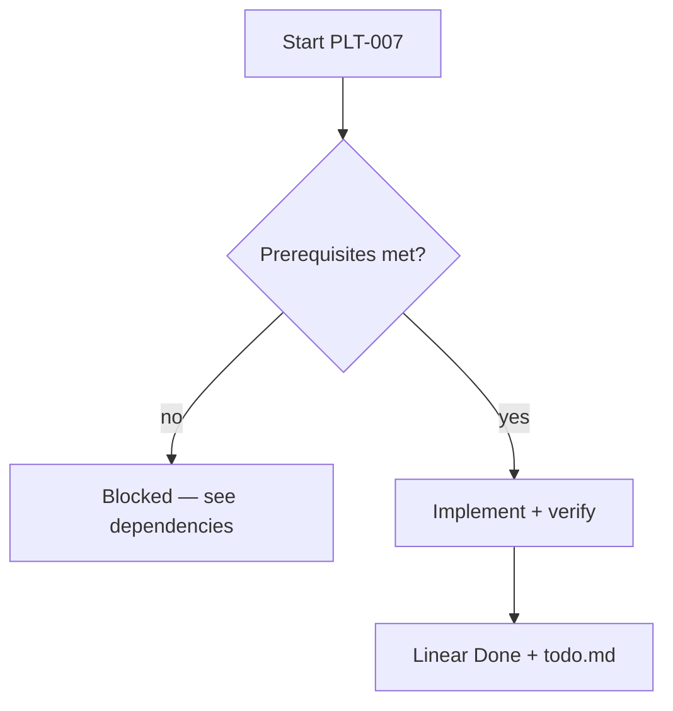
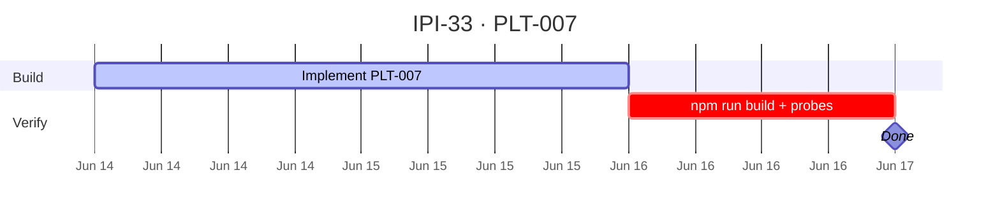

## PLT-007 — Database Performance Review

**In plain terms:** Legacy FashionOS + iPix tables — advisor pass before scale.

**Blocked by:** [PLT-001](https://linear.app/ipix/issue/IPI-14)

**Unblocks:** —

**MVP priority:** **P2 pre-launch**

### Skills (load in order)

| # | Skill | Path |
|---|--------|------|
| 1 | ipix-task-lifecycle | `.claude/skills/ipix-task-lifecycle/SKILL.md` or repo rule |
| 2 | supabase-postgres-best-practices | `.claude/skills/ipix-supabase/supabase-postgres-best-practices/SKILL.md` or repo rule |

---

### Flow — PLT-007

---

### Completion steps

#### A. Implement
- [ ] **A1** Run Supabase advisors; file P0 findings
- [ ] **A2** Document hot paths and indexes
- [ ] **A3** Fix RLS `(select auth.uid())` where needed
- [ ] **A4** EXPLAIN samples on iPix queries

#### B. Verify + ship
- [ ] **B1** `npm run build` passes
- [ ] **B2** `npm run supabase:verify` (if Supabase touched)
- [ ] **B3** Linear **Done** · `todo.md` updated

**Spec score:** 84/100 — lifecycle-ready

---

### Gantt — IPI-33

_Source: `docs/linear/issues/IPI-33-PLT-007.md` · push via `node scripts/linear-update-issue.mjs IPI-33`_
