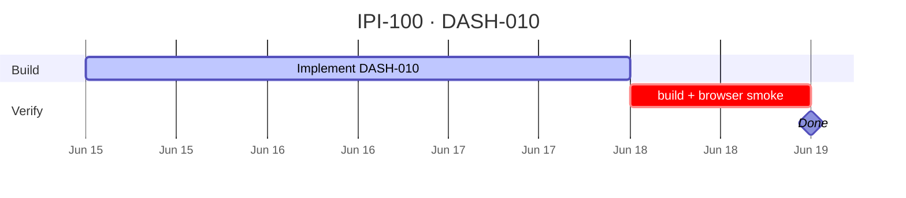

## IPI-100 · DASH-010 — D5 Shoots Grid

**In plain terms:** **Operator** sees all shoots with status, date, and brand on `/app/shoots` and drills into shoot detail.

**Dashboard:** D5 Shoots

**Blocked by:** [UI-001](https://linear.app/ipix/issue/IPI-22)

**Unblocks:** D6 shoot detail, production-planner agent context

**MVP priority:** **P1 Should Have**

**Estimate:** 5 points

**Source:** [docs/intelligence/02-ai-native-dashboards-plan.md](../../intelligence/02-ai-native-dashboards-plan.md) · [docs/intelligence/README.md](../../intelligence/README.md)

### Skills (load in order)

| # | Skill | Path |
|---|--------|------|
| 1 | ipix-task-lifecycle | `.claude/skills/ipix-task-lifecycle/SKILL.md` |
| 2 | dashboards | `.claude/skills/dashboards/SKILL.md` |

---

### Flow — DASH-010

```mermaid
flowchart TD
  SH[/app/shoots] --> GR[Shoot grid]
  GR --> DT[/app/shoots/:id]
```

---

### Completion steps

#### A. Implement
- [ ] **A1** Route `/app/shoots` + nested detail stub
- [ ] **A2** Grid: status, date, brand, shot count
- [ ] **A3** Filters: status, brand
- [ ] **A4** Empty state + create shoot CTA
- [ ] **A5** Wireframe `02-shoots-grid.md` alignment

#### B. Verify + ship
- [ ] **B1** `npm run build` passes
- [ ] **B2** Browser smoke on target route documented
- [ ] **B3** Right panel + center panel behave per wireframe
- [ ] **B4** Linear **Done** · `todo.md` updated

**Spec score:** 84/100 — lifecycle-ready

---

### Corrections Applied

- Corrected AI-native dashboard source path to `docs/intelligence/02-ai-native-dashboards-plan.md`.
- Kept D5 Shoots as deferred/post-MVP dashboard work; no MVP route expansion implied.

---

### Gantt — IPI-100



_Source: `docs/linear/issues/IPI-100-DASH-010.md` · push via `node scripts/linear-update-issue.mjs IPI-100`_
