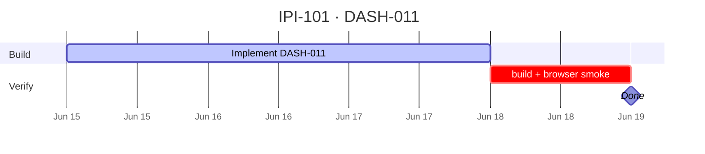

## IPI-101 · DASH-011 — D10 Analytics Scaffold

**In plain terms:** **Operator** opens `/app/analytics` with channel ROI placeholders ready for generative charts.

**Dashboard:** D10 Analytics

**Blocked by:** [ANA-001](https://linear.app/ipix/issue/IPI-47) · [DASH-004](https://linear.app/ipix/issue/IPI-94)

**Unblocks:** DASH-012 generative charts HITL

**MVP priority:** **P2 Nice To Have**

**Estimate:** 5 points

**Source:** [docs/intelligence/02-ai-native-dashboards-plan.md](../../intelligence/02-ai-native-dashboards-plan.md) · [docs/intelligence/README.md](../../intelligence/README.md)

### Skills (load in order)

| # | Skill | Path |
|---|--------|------|
| 1 | ipix-task-lifecycle | `.claude/skills/ipix-task-lifecycle/SKILL.md` |
| 2 | dashboards | `.claude/skills/dashboards/SKILL.md` |
| 3 | copilotkit-develop | `.claude/skills/copilotkit/copilotkit-develop/SKILL.md` |

---

### Flow — DASH-011

```mermaid
flowchart TD
  P[/app/analytics] --> CH[Chart placeholders]
  CH --> FIL[Channel + date filters]
```

---

### Completion steps

#### A. Implement
- [ ] **A1** Route `/app/analytics`; treat the legacy performance alias as non-active
- [ ] **A2** Static chart shells (Recharts or similar)
- [ ] **A3** Channel filter + date range
- [ ] **A4** `useAgentContext` for visible series
- [ ] **A5** Wireframe `06-performance.md` layout

#### B. Verify + ship
- [ ] **B1** `npm run build` passes
- [ ] **B2** Browser smoke on target route documented
- [ ] **B3** Right panel + center panel behave per wireframe
- [ ] **B4** Linear **Done** · `todo.md` updated

**Spec score:** 84/100 — lifecycle-ready

---

### Corrections Applied

- Corrected AI-native dashboard source path to `docs/intelligence/02-ai-native-dashboards-plan.md`.
- Replaced the active performance route alias with canonical `/app/analytics`.
- Documented the performance alias as legacy-only without defining it as an active route.

---

### Gantt — IPI-101



_Source: `docs/linear/issues/IPI-101-DASH-011.md` · push via `node scripts/linear-update-issue.mjs IPI-101`_
