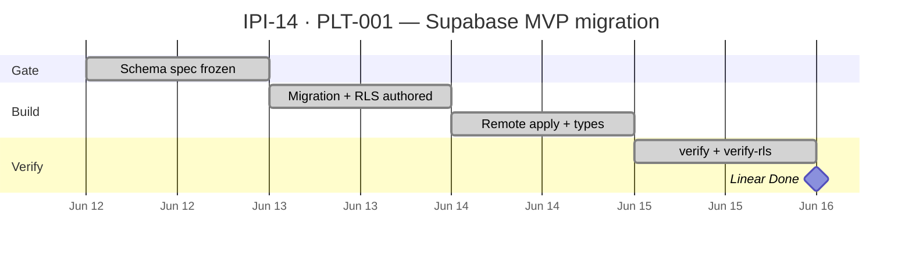

## PLT-001 — Supabase MVP Migration

**In plain terms:** The **Engineer** has a remote Supabase schema for brand intelligence (brands, scores, Mercur product links, AI logs) so the **Operator** app can store profiles and assets — commerce catalog stays on Mercur, not Supabase.

**Blocked by:** —

**Unblocks:** [IPI-15](https://linear.app/ipix/issue/IPI-15) PLT-002 Auth + RLS · [IPI-16](https://linear.app/ipix/issue/IPI-16) PLT-003 Edge scaffold · [IPI-18](https://linear.app/ipix/issue/IPI-18) AI-001 · [IPI-19](https://linear.app/ipix/issue/IPI-19) DNA-001

**Skills:** `ipix-task-lifecycle` · `supabase` · `supabase-postgres-best-practices`

**Proof gate:** MVP proofs **#6–#8** (foundation for brand profile, DNA asset, product links)

**Remote project:** `nvdlhrodvevgwdsneplk` · [Dashboard](https://supabase.com/dashboard/project/nvdlhrodvevgwdsneplk)

---

### Scope (in)

| Object | Purpose |
|--------|---------|
| `public.brands` | Operator brand profiles (`user_id`, `ai_profile`, `brand_url`) |
| `public.brand_scores` | DNA / readiness scores per brand |
| `public.commerce_product_links` | Supabase ↔ Mercur `product.id` bridge |
| `public.ai_agent_logs` | Agent I/O observability |
| `public.assets` extensions | `brand_id`, `dna_score`, `dna_status`, `dna_pillars` |
| RLS on iPix tables | User-scoped via `auth.uid()` / brand ownership |

### Scope (out)

- Mercur product/order tables (ADR: commerce on Mercur Postgres)
- Local `supabase start` / migration replay squash (**PLT-010** / [IPI-29](https://linear.app/ipix/issue/IPI-29))
- Edge functions (**PLT-003**)
- Full operator UI (**UI-001+**)

---

### Completion steps (check in order)

#### A. Schema design + migration
- [x] **A1** Migration `20260614000000_ipix_platform_mvp.sql` defines brands, brand_scores, commerce_product_links, ai_agent_logs, assets columns — proof: file in `supabase/migrations/`
- [x] **A2** RLS policies on brands, brand_scores, commerce_product_links, ai_agent_logs — proof: migration § RLS
- [x] **A3** Remote-only policy documented — proof: `supabase/README.md`

#### B. Apply to remote
- [x] **B1** Migration applied on `nvdlhrodvevgwdsneplk` — proof: `npm run supabase:migrations` shows `20260614000000` applied
- [x] **B2** Types regenerated — proof: `npm run supabase:types` → `src/types/supabase.ts`
- [x] **B3** REST smoke — proof: `npm run supabase:verify` passes (tasks, profiles, assets, shoots)

#### C. Follow-on (PLT-002 — separate issue)
- [x] **C1** Profiles INSERT/SELECT RLS + `handle_new_user` fix — proof: `20260614000001_plt002_profiles_rls_and_trigger.sql` applied + repaired in migration history
- [x] **C2** Automated RLS smoke — proof: `npm run supabase:verify-rls` passes

#### D. Evidence
- [x] **D1** [todo.md](https://github.com/) platform row updated
- [x] **D2** Do **not** push orphan local migration `20251129062152` without review

#### E. Verify + ship
- [x] **E1** `npm run build` passes
- [x] **E2** No Mercur tables created in Supabase
- [x] **E3** Linear **Done** · unblocks PLT-002/003/AI-001

---

### Gantt — IPI-14 step sequence

---

### Key files

- `supabase/migrations/20260614000000_ipix_platform_mvp.sql`
- `supabase/migrations/20260614000001_plt002_profiles_rls_and_trigger.sql`
- `supabase/README.md`
- `scripts/verify-supabase.mjs` · `scripts/verify-rls.mjs`
