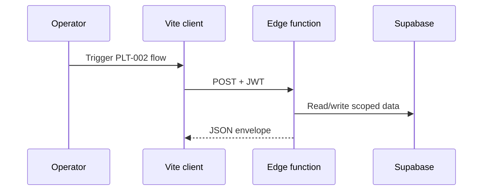
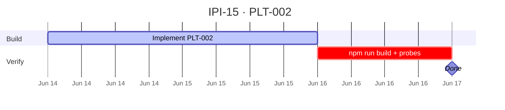

## PLT-002 — Supabase Auth + RLS

**In plain terms:** **Operator** signs in via Supabase Auth; profile row exists; RLS prevents cross-tenant reads.

**Blocked by:** [PLT-001](https://linear.app/ipix/issue/IPI-14)

**Unblocks:** [PLT-003](https://linear.app/ipix/issue/IPI-16) · [UI-001](https://linear.app/ipix/issue/IPI-22)

**Proof gate:** Enables proofs **#6–#8**

### Skills (load in order)

| # | Skill | Path |
|---|--------|------|
| 1 | ipix-task-lifecycle | `.claude/skills/ipix-task-lifecycle/SKILL.md` or repo rule |
| 2 | supabase | `.claude/skills/supabase/SKILL.md` or repo rule |
| 3 | task-verifier | `.claude/skills/task-verifier/SKILL.md` or repo rule |

---

### Flow — PLT-002

---

### Completion steps

#### A. Auth UI
- [x] **A1** `/login` magic link or OAuth flow works
- [x] **A2** `/dashboard` redirects unauthenticated users to login
- [x] **A3** Session persists on refresh

#### B. Profiles + RLS
- [x] **B1** Migration `20260614000001_plt002_profiles_rls_and_trigger.sql` applied
- [x] **B2** `handle_new_user` trigger creates profile
- [x] **B3** `npm run supabase:verify-rls` passes profiles policies

#### C. Verify + ship
- [x] **C1** Browser smoke: sign-in → dashboard → sign-out
- [x] **C2** Linear **Done**

### Verifier probes (before Done)

| Probe | Command / check | Pass |
|-------|-----------------|------|
| RLS smoke | npm run supabase:verify-rls | pass |
| Build | npm run build | exit 0 |

**Spec score:** 88/100 — lifecycle-ready

---

### Gantt — IPI-15

_Source: `docs/linear/issues/IPI-15-PLT-002.md` · push via `node scripts/linear-update-issue.mjs IPI-15`_
