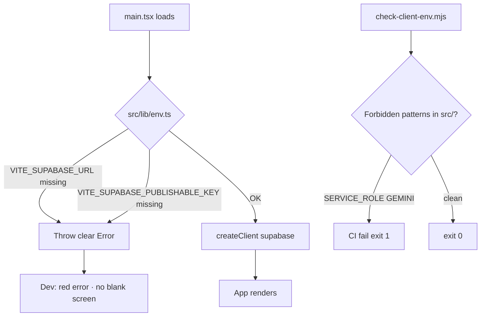

## PLT-004 — Vite Env Validation

**In plain terms:** App **fails fast** if Supabase env is missing; **Operator** never gets secret keys in the browser bundle.

**Blocked by:** —

**Unblocks:** Safe client wiring for AI/UI · staging deploy

### Skills (load in order)

| # | Skill | Path |
|---|--------|------|
| 1 | ipix-task-lifecycle | `.claude/skills/ipix-task-lifecycle/SKILL.md` |
| 2 | vercel-react-best-practices | `.claude/skills/vercel-react-best-practices/SKILL.md` |
| 3 | task-verifier | `.claude/skills/task-verifier/SKILL.md` |
| 4 | mermaid-diagrams | `.claude/skills/mermaid-diagrams/SKILL.md` |

### Official docs verified

| Topic | Source |
|-------|--------|
| Vite env | [Env and Mode](https://vite.dev/guide/env-and-mode) — `import.meta.env`, `VITE_` prefix |
| React entry | `src/main.tsx` validates before render |

**Proof gate:** Security prerequisite for proofs **#6–#8**

---

### Flow — bootstrap validation



---

### Completion steps

#### A. Env module
- [x] **A1** Create `src/lib/env.ts` — validated `env` object
- [x] **A2** Refactor `src/lib/supabase.ts` to use `env`
- [x] **A3** Update `src/vite-env.d.ts` comments (required vs optional)

#### B. Leak guards
- [x] **B1** No `VITE_GEMINI_API_KEY` usage in `src/`
- [x] **B2** `scripts/check-client-env.mjs` + `"check:env"` npm script
- [x] **B3** Update `.env.example` (Client / Server-only sections)

#### C. Verify + ship
- [x] **C1** `npm run build` + `npm run check:env`
- [x] **C2** Dev without keys shows descriptive error
- [x] **C3** Linear **Done** · todo.md updated

### Verifier probes (before Done)

| Probe | Command | Pass |
|-------|---------|------|
| Client leak scan | `rg 'SERVICE_ROLE|GEMINI_API_KEY|VITE_GEMINI' src/` | 0 forbidden |
| check script | `npm run check:env` | exit 0 |
| Missing env UX | unset `VITE_SUPABASE_URL` → dev boot | throws readable error |
| `.env.example` | documents Client vs Server-only | ✅ |

**Spec score:** 92/100 — ready now

---

### Gantt — IPI-17

```mermaid
gantt
    title IPI-17 · PLT-004 — Vite env validation
    dateFormat YYYY-MM-DD
    axisFormat %b %d
    section Build
    env.ts + supabase refactor     :active, g1, 2026-06-14, 1d
    check-client-env script        :g2, after g1, 1d
    section Verify
    build + check:env              :crit, g3, after g2, 1d
    Done                           :milestone, gdone, after g3, 0d
```
