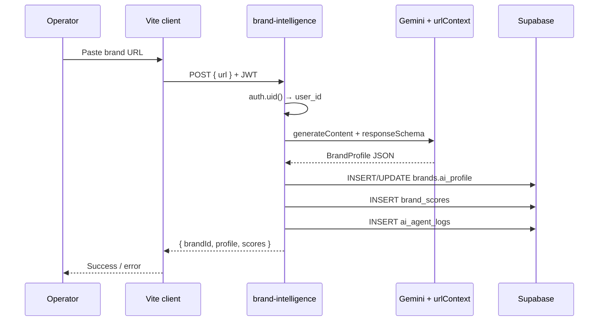
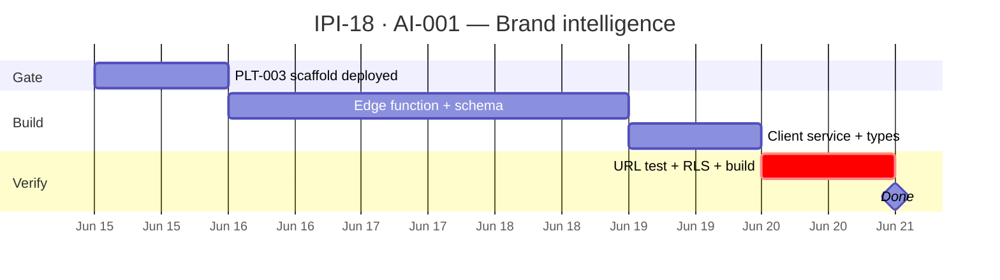

## AI-001 — Brand Intelligence Agent

**In plain terms:** **Operator** pastes a brand URL; edge function returns a minimal AI profile saved to `brands.ai_profile` + scores in `brand_scores` — MVP proof **#6**.

**Blocked by:** [IPI-16](https://linear.app/ipix/issue/IPI-16) PLT-003 · [IPI-15](https://linear.app/ipix/issue/IPI-15) PLT-002

**Unblocks:** [IPI-20](https://linear.app/ipix/issue/IPI-20) AI-002 · [IPI-23](https://linear.app/ipix/issue/IPI-23) UI-002

### Skills (load in order)

| # | Skill | Path |
|---|--------|------|
| 1 | ipix-task-lifecycle | `.claude/skills/ipix-task-lifecycle/SKILL.md` |
| 2 | edge-functions | `.cursor/skills/edge-functions/SKILL.md` |
| 3 | gemini | `.claude/skills/gemini/SKILL.md` |
| 4 | task-verifier | `.claude/skills/task-verifier/SKILL.md` |
| 5 | mermaid-diagrams | `.claude/skills/mermaid-diagrams/SKILL.md` |

**Cursor rules (structured + URL):** `.cursor/rules/gemeni/structured-output.mdc` · `.cursor/rules/gemeni/url-context.mdc`

**Proof gate:** MVP proof **#6** (one brand profile from URL)

---

### Scope (MVP minimal — not full 18-field north star)

| In | Out |
|----|-----|
| `POST brand-intelligence` `{ url, brandId? }` | Lean Canvas / production package |
| `gemini-2.5-flash` + `{ urlContext: {} }` + `responseSchema` | Full suggestion engine UI |
| Structured JSON → `brands.ai_profile` | Auto-create Mercur products |
| 3–5 `brand_scores` rows | Google Search grounding (P1) |
| `ai_agent_logs` row per call | |

**MVP profile fields (minimum):** `name`, `tagline`, `category`, `visualIdentity` (colors, mood), `targetAudience`, `sourceUrl`

---

### Flow — brand intelligence



---

### Completion steps

#### A. Edge function
- [x] **A1** Create `supabase/functions/brand-intelligence/index.ts` — CORS, JWT, validate `url`
- [x] **A2** Gemini: **two-step** flow (urlContext fetch, then structured JSON — cannot combine in one call)
- [x] **A3** Upsert `brands` row for `auth.uid()` — set `brand_url`, `ai_profile`
- [x] **A4** Insert `brand_scores` — `visual`, `audience`, `consistency`, `commerce_readiness`
- [x] **A5** Log to `ai_agent_logs` — `agent_name: brand-intelligence`, **`duration_ms`**

#### B. Types + service
- [x] **B1** `src/types/brand-intelligence.ts` — request/response interfaces
- [x] **B2** `src/services/brandIntelligenceService.ts` — `edgeFunctionService.invoke('brand-intelligence', body)`
- [x] **B3** Handle 401/422/500 with user-safe messages

#### C. Deploy + verify
- [x] **C1** Deployed `brand-intelligence` → `nvdlhrodvevgwdsneplk`
- [x] **C2** `npm run supabase:verify-brand-intelligence` — Glossier URL → `brands` + 4 scores + log row ✅ 2026-06-14
- [x] **C3** RLS enforced via JWT + user-scoped upsert
- [x] **C4** `npm run build` ✅

#### D. Ship
- [x] **D1** Invoke contract in `supabase/README.md` + `scripts/verify-brand-intelligence.mjs`
- [x] **D2** Linear **Done** — MVP proof **#6** (URL → Supabase). Operator UI → [IPI-22](https://linear.app/ipix/issue/IPI-22) UI-001

### Official docs verified (MCP)

| Topic | Source |
|-------|--------|
| URL Context | `user-gemini-api-docs-mcp` → [url-context](https://ai.google.dev/gemini-api/docs/url-context) — check `urlContextMetadata` |
| Structured output | [structured-output](https://ai.google.dev/gemini-api/docs/structured-output) — `responseSchema` + Type enums |
| Edge invoke | `@supabase` client `functions.invoke` with session JWT |

### Verifier probes (before Done)

| Probe | Pass |
|-------|------|
| Real brand URL → `brands.ai_profile` populated | ✅ verify script |
| `brand_scores` rows use `score` + `score_type` | ✅ 4 rows |
| `ai_agent_logs.duration_ms` set | ✅ non-null |
| Cross-user brand read | ✅ RLS + JWT |
| No `GEMINI_API_KEY` in `dist/` bundle | ✅ grep clean |

**Spec score:** 86/100 — ready after PLT-003

---

### Gantt — IPI-18



---

### Key files

```
supabase/functions/brand-intelligence/index.ts
src/services/brandIntelligenceService.ts
src/types/brand-intelligence.ts
```
