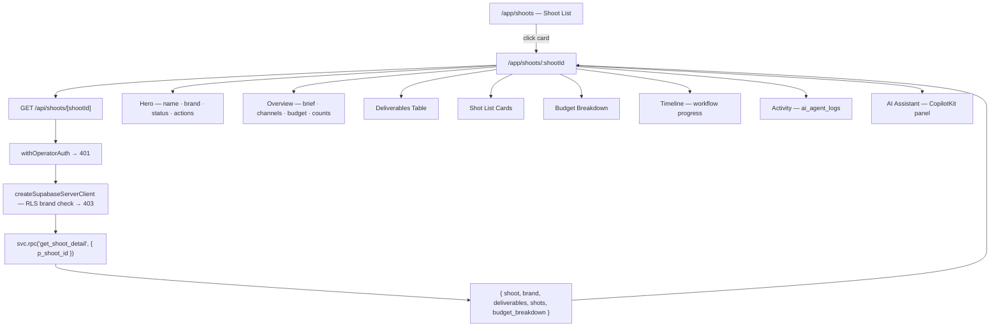
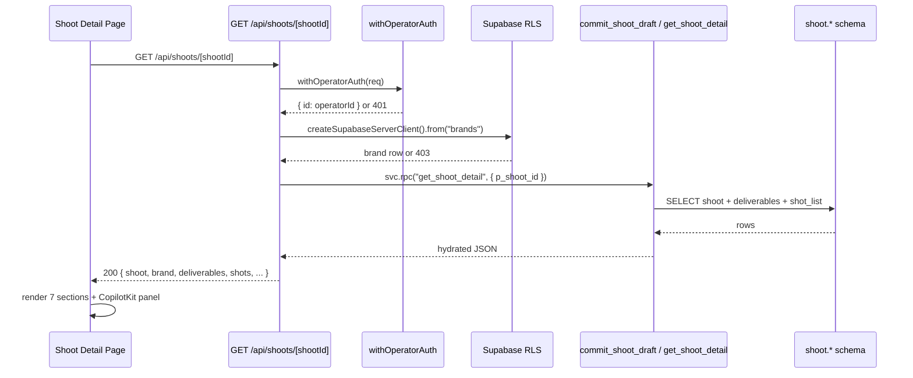

# IPI-209 · SHOOT-DETAIL-001 — Shoot Detail Page

**Linear:** https://linear.app/amo100/issue/IPI-209
**Status:** In Progress
**Priority:** High
**Labels:** SHOOT · UX · DESIGN
**Branch:** `ipi/209-shoot-detail-page`

---

## Problem

Clicking a shoot card on `/app/shoots` navigates to `/app/shoots/:id` which returns **404 on main** — the dynamic route `app/src/app/(operator)/app/shoots/[id]/page.tsx` does not exist on main (work in `wt-ipi-209`).

Confirmed live: `http://localhost:3002/app/shoots/0cdb8bf1-cc44-40fa-81b5-418c72a27716` → 404.

---

## Goal

Build the Shoot Detail page and its backing API route. Fix the 404, show all shoot data, wire up the CopilotKit assistant with shoot context.

---

## Files to create

| File | Purpose |
|---|---|
| `app/src/app/(operator)/app/shoots/[shootId]/page.tsx` | Shoot Detail page (Next.js server component + client sections) |
| `app/src/app/api/shoots/[shootId]/route.ts` | `GET /api/shoots/[shootId]` — hydrated shoot data |

## Files to verify

| File | Check |
|---|---|
| `app/src/app/(operator)/app/shoots/page.tsx` | Card `href` points to `/app/shoots/${shoot.id}` |

---

## Architecture



---

## Data flow



---

## Page layout (wireframe)

```
┌─────────────────────────────────────────────────────────┐
│ ← Shoots          [Commit Verify Run]        [Planning] │
│ Spring Campaign · brand: Acme         Updated: 2h ago   │
│ ID: 0cdb8bf1                  [Edit] [Duplicate] [⋯]   │
├────────────────────────────┬────────────────────────────┤
│  OVERVIEW                  │  AI ASSISTANT              │
│  Brief: ...                │  ┌──────────────────────┐  │
│  Channels: IG, TikTok      │  │ 👋 I know this shoot │  │
│  Budget: $4,200            │  │ • Improve shot list  │  │
│  3 deliverables · 8 shots  │  │ • Add IG shots       │  │
├────────────────────────────┤  │ • Reduce budget      │  │
│  DELIVERABLES              │  └──────────────────────┘  │
│  ┌────────┬────────┬─────┐ │                            │
│  │Channel │Format  │ Qty │ │                            │
│  │IG Feed │1:1 JPG │  4  │ │                            │
│  │TikTok  │9:16 MP4│  2  │ │                            │
│  └────────┴────────┴─────┘ │                            │
├────────────────────────────┤                            │
│  SHOT LIST                 │                            │
│  [1] Hero product — white  │                            │
│      bg, overhead [Edit][✓]│                            │
│  [2] Lifestyle — model     │                            │
├────────────────────────────┤                            │
│  BUDGET                    │                            │
│  Crew ........... $1,200   │                            │
│  Equipment ......   $800   │                            │
│  Total .......... $4,200   │                            │
├────────────────────────────┤                            │
│  TIMELINE                  │                            │
│  ✓ Brief  ✓ Deliverables   │                            │
│  ✓ Shot List  ✓ Budget     │                            │
│  ✓ Approved  ○ Production  │                            │
├────────────────────────────┘                            │
│  ACTIVITY                                               │
│  AI generated brief — 2h ago                           │
│  Shot list approved — 1h ago                           │
└─────────────────────────────────────────────────────────┘
```

---

## API contract

### `GET /api/shoots/[shootId]`

**Auth:** `withOperatorAuth` → 401 if missing/invalid

**RLS check:** `createSupabaseServerClient().from("brands").select("id").eq("id", shoot.brand_id).single()` → 403 if not owned

**RPC:** `svc.rpc("get_shoot_detail", { p_shoot_id: shootId })`

**Response 200:**
```ts
{
  shoot: {
    id: string
    name: string
    status: string
    brief: string | null
    target_channels: string[]
    estimated_budget: number
    budget_breakdown: Record<string, number> | null
    created_at: string
    updated_at: string
  }
  brand: { id: string; name: string }
  deliverables: { id: string; channel: string; format: string | null; quantity: number }[]
  shots: { id: string; shot_number: number; description: string; style_notes: string | null }[]
}
```

**Error responses:** 400 · 401 · 403 · 404 · 500

---

## Acceptance criteria

- [ ] A. `/app/shoots/:shootId` renders — no 404
- [ ] B. `GET /api/shoots/[shootId]` returns hydrated data with auth + RLS
- [ ] C. All 7 sections render with real DB data
- [ ] D. Loading state shown while fetch in progress
- [ ] E. 404 page for unknown shoot ID
- [ ] F. Error state for unauthorized access
- [ ] G. CopilotKit panel pre-loaded with shoot context
- [ ] H. Browser console + network tab clean
- [ ] I. Playwright + Chrome DevTools MCP verification report produced

---

## Constraints

- No `NEXT_PUBLIC_*` AI keys
- No direct browser writes to `shoot.*` schema
- Service role only in Next.js API route
- `withOperatorAuth` + RLS brand ownership check required
- Use existing design system — no new UI library

---

## Execution contract

Full YAML: [`IPI-209-contract.yaml`](../../../tasks/design-docs/plan/examples/IPI-209-contract.yaml) · Template: [`TASK-CONTRACT.yaml`](../../../tasks/design-docs/plan/TASK-CONTRACT.yaml)

**Pipeline:** build → browser (manual) → design review → Playwright → task-verifier

---

## Skills (load before implement)

| Skill | Why |
|-------|-----|
| `ipix-task-lifecycle` | Branch · PR · Linear sync |
| `design-md` | `design.md` + 3-panel + 9-tab handoff §6 |
| `fashion-production` | Shoot domain |
| `feature-dev` | Multi-file page + API |
| `copilotkit` | Shoot context in panel |
| `ipix-supabase` | RPC + RLS |
| **`task-verifier`** | Gate before Done |

Wireframe: below (align tabs to handoff 9-tab spec in follow-up — MVP may ship subset first).

---

## Completion steps

#### A. Scaffold
- [ ] **A1** Create `[shootId]/page.tsx` — proof: route resolves (no 404)
- [ ] **A2** Create `GET /api/shoots/[shootId]/route.ts` — proof: 200 with seeded shoot

#### B. Core UI
- [ ] **B1** Hero + Overview + Deliverables + Shot list + Budget — proof: real RPC data
- [ ] **B2** Timeline + Activity sections — proof: workflow + ai_agent_logs
- [ ] **B3** CopilotKit shoot context via `useAgentContext` — proof: agent greeting references shoot name

#### C. States
- [ ] **C1** Loading skeleton — proof: slow 3G throttle
- [ ] **C2** 404 unknown id · 403 wrong brand — proof: curl + browser

#### D. Tests
- [ ] **D1** `cd app && npm test` — route/API unit tests
- [ ] **D2** `cd app && npm run lint && npm run build`

#### E. Verify + ship
- [ ] **E1** `@task-verifier` report pasted in PR
- [ ] **E2** Playwright or browser screenshots vs wireframe
- [ ] **E3** `tasks/plan/todo.md` DESIGN-054 + mirror `tasks/todo.md` → 🟡/🟢
- [ ] **E4** Linear IPI-209 → Done

---

## Related

- IPI-150 SHOOT-AI-003 — Gate 3 commit route (PR #126 ✅ merged)
- IPI-84 SHOOT-UX-001 — Shoot system design review ✅
- Tables: `shoot.shoots` · `shoot.shoot_deliverables` · `shoot.shot_list`
- Audit log: `public.ai_agent_logs`
