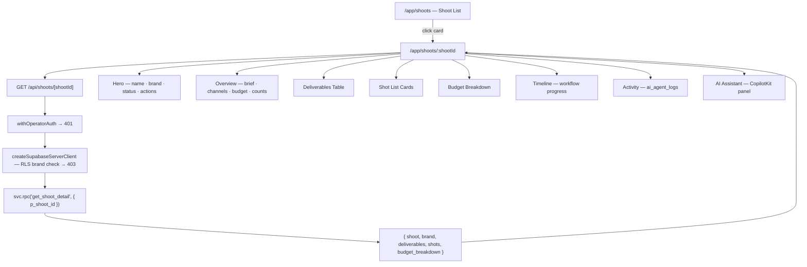
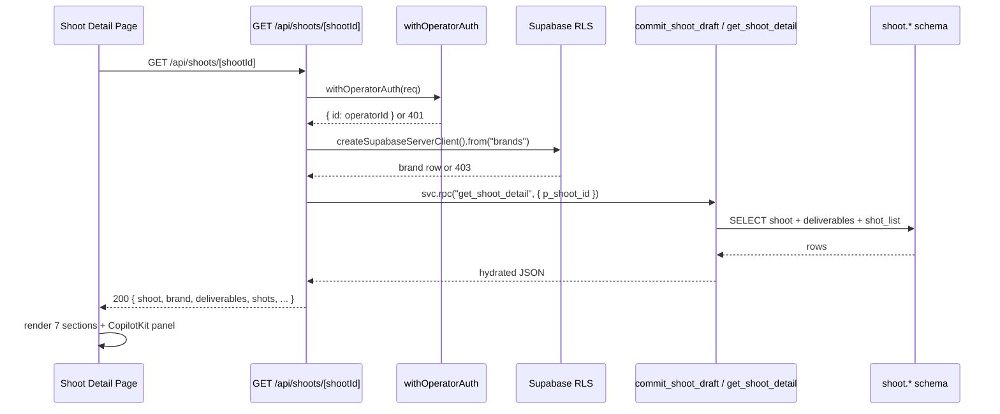

<<<<<<< HEAD
# IPI-209 · SHOOT-DETAIL-001 — Shoot Detail Page

**Linear:** https://linear.app/amo100/issue/IPI-209
**Status:** In Progress
**Priority:** High
**Labels:** SHOOT · UX · DESIGN
**Branch:** `ipi/209-shoot-detail-page`

---

## Problem

Clicking a shoot card on `/app/shoots` navigates to `/app/shoots/:id` which returns **404 on main** — the dynamic route `app/src/app/(operator)/app/shoots/[id]/page.tsx` does not exist on main (work in `wt-ipi-209`).

Confirmed live: `http://localhost:3002/app/shoots/0cdb8bf1-cc44-40fa-81b5-418c72a27716` → 404.

---

## Goal

Build the Shoot Detail page and its backing API route. Fix the 404, show all shoot data, wire up the CopilotKit assistant with shoot context.

---

## Files to create

| File | Purpose |
|---|---|
| `app/src/app/(operator)/app/shoots/[shootId]/page.tsx` | Shoot Detail page (Next.js server component + client sections) |
| `app/src/app/api/shoots/[shootId]/route.ts` | `GET /api/shoots/[shootId]` — hydrated shoot data |

## Files to verify

| File | Check |
|---|---|
| `app/src/app/(operator)/app/shoots/page.tsx` | Card `href` points to `/app/shoots/${shoot.id}` |

---

## Architecture


```mermaid
flowchart TD
    A["/app/shoots — Shoot List"] -->|click card| B["/app/shoots/:shootId"]
    B --> C["GET /api/shoots/[shootId]"]
    C --> D[withOperatorAuth → 401]
    D --> E[createSupabaseServerClient — RLS brand check → 403]
    E --> F["svc.rpc('get_shoot_detail', { p_shoot_id })"]
    F --> G["{ shoot, brand, deliverables, shots, budget_breakdown }"]
    G --> B
    B --> H[Hero — name · brand · status · actions]
    B --> I[Overview — brief · channels · budget · counts]
    B --> J[Deliverables Table]
    B --> K[Shot List Cards]
    B --> L[Budget Breakdown]
    B --> M[Timeline — workflow progress]
    B --> N[Activity — ai_agent_logs]
    B --> O[AI Assistant — CopilotKit panel]
```

---

## Data flow


```mermaid
sequenceDiagram
    participant UI as Shoot Detail Page
    participant API as GET /api/shoots/[shootId]
    participant Auth as withOperatorAuth
    participant RLS as Supabase RLS
    participant RPC as commit_shoot_draft / get_shoot_detail
    participant DB as shoot.* schema

    UI->>API: GET /api/shoots/[shootId]
    API->>Auth: withOperatorAuth(req)
    Auth-->>API: { id: operatorId } or 401
    API->>RLS: createSupabaseServerClient().from("brands")
    RLS-->>API: brand row or 403
    API->>RPC: svc.rpc("get_shoot_detail", { p_shoot_id })
    RPC->>DB: SELECT shoot + deliverables + shot_list
    DB-->>RPC: rows
    RPC-->>API: hydrated JSON
    API-->>UI: 200 { shoot, brand, deliverables, shots, ... }
    UI->>UI: render 7 sections + CopilotKit panel
```

---

## Page layout (wireframe)

```
┌─────────────────────────────────────────────────────────┐
│ ← Shoots          [Commit Verify Run]        [Planning] │
│ Spring Campaign · brand: Acme         Updated: 2h ago   │
│ ID: 0cdb8bf1                  [Edit] [Duplicate] [⋯]   │
├────────────────────────────┬────────────────────────────┤
│  OVERVIEW                  │  AI ASSISTANT              │
│  Brief: ...                │  ┌──────────────────────┐  │
│  Channels: IG, TikTok      │  │ 👋 I know this shoot │  │
│  Budget: $4,200            │  │ • Improve shot list  │  │
│  3 deliverables · 8 shots  │  │ • Add IG shots       │  │
├────────────────────────────┤  │ • Reduce budget      │  │
│  DELIVERABLES              │  └──────────────────────┘  │
│  ┌────────┬────────┬─────┐ │                            │
│  │Channel │Format  │ Qty │ │                            │
│  │IG Feed │1:1 JPG │  4  │ │                            │
│  │TikTok  │9:16 MP4│  2  │ │                            │
│  └────────┴────────┴─────┘ │                            │
├────────────────────────────┤                            │
│  SHOT LIST                 │                            │
│  [1] Hero product — white  │                            │
│      bg, overhead [Edit][✓]│                            │
│  [2] Lifestyle — model     │                            │
├────────────────────────────┤                            │
│  BUDGET                    │                            │
│  Crew ........... $1,200   │                            │
│  Equipment ......   $800   │                            │
│  Total .......... $4,200   │                            │
├────────────────────────────┤                            │
│  TIMELINE                  │                            │
│  ✓ Brief  ✓ Deliverables   │                            │
│  ✓ Shot List  ✓ Budget     │                            │
│  ✓ Approved  ○ Production  │                            │
├────────────────────────────┘                            │
│  ACTIVITY                                               │
│  AI generated brief — 2h ago                           │
│  Shot list approved — 1h ago                           │
└─────────────────────────────────────────────────────────┘
```

---

## API contract

### `GET /api/shoots/[shootId]`

**Auth:** `withOperatorAuth` → 401 if missing/invalid

**RLS check:** `createSupabaseServerClient().from("brands").select("id").eq("id", shoot.brand_id).single()` → 403 if not owned

**RPC:** `svc.rpc("get_shoot_detail", { p_shoot_id: shootId })`

**Response 200:**
```ts
{
  shoot: {
    id: string
    name: string
    status: string
    brief: string | null
    target_channels: string[]
    estimated_budget: number
    budget_breakdown: Record<string, number> | null
    created_at: string
    updated_at: string
  }
  brand: { id: string; name: string }
  deliverables: { id: string; channel: string; format: string | null; quantity: number }[]
  shots: { id: string; shot_number: number; description: string; style_notes: string | null }[]
}
```

**Error responses:** 400 · 401 · 403 · 404 · 500

---

## Acceptance criteria

- [ ] A. `/app/shoots/:shootId` renders — no 404
- [ ] B. `GET /api/shoots/[shootId]` returns hydrated data with auth + RLS
- [ ] C. All 7 sections render with real DB data
- [ ] D. Loading state shown while fetch in progress
- [ ] E. 404 page for unknown shoot ID
- [ ] F. Error state for unauthorized access
- [ ] G. CopilotKit panel pre-loaded with shoot context
- [ ] H. Browser console + network tab clean
- [ ] I. Playwright + Chrome DevTools MCP verification report produced

---

## Constraints

- No `NEXT_PUBLIC_*` AI keys
- No direct browser writes to `shoot.*` schema
- Service role only in Next.js API route
- `withOperatorAuth` + RLS brand ownership check required
- Use existing design system — no new UI library

---

## Execution contract

Full YAML: [`IPI-209-contract.yaml`](../../../tasks/design-docs/plan/examples/IPI-209-contract.yaml) · Template: [`TASK-CONTRACT.yaml`](../../../tasks/design-docs/plan/TASK-CONTRACT.yaml)

**Pipeline:** build → browser (manual) → design review → Playwright → task-verifier

---

## Skills (load before implement)

| Skill | Why |
|-------|-----|
| `ipix-task-lifecycle` | Branch · PR · Linear sync |
| `design-md` | `design.md` + 3-panel + 9-tab handoff §6 |
| `fashion-production` | Shoot domain |
| `feature-dev` | Multi-file page + API |
| `copilotkit` | Shoot context in panel |
| `ipix-supabase` | RPC + RLS |
| **`task-verifier`** | Gate before Done |

Wireframe: below (align tabs to handoff 9-tab spec in follow-up — MVP may ship subset first).

---

## Completion steps

#### A. Scaffold
- [ ] **A1** Create `[shootId]/page.tsx` — proof: route resolves (no 404)
- [ ] **A2** Create `GET /api/shoots/[shootId]/route.ts` — proof: 200 with seeded shoot

#### B. Core UI
- [ ] **B1** Hero + Overview + Deliverables + Shot list + Budget — proof: real RPC data
- [ ] **B2** Timeline + Activity sections — proof: workflow + ai_agent_logs
- [ ] **B3** CopilotKit shoot context via `useAgentContext` — proof: agent greeting references shoot name

#### C. States
- [ ] **C1** Loading skeleton — proof: slow 3G throttle
- [ ] **C2** 404 unknown id · 403 wrong brand — proof: curl + browser

#### D. Tests
- [ ] **D1** `cd app && npm test` — route/API unit tests
- [ ] **D2** `cd app && npm run lint && npm run build`

#### E. Verify + ship
- [ ] **E1** `@task-verifier` report pasted in PR
- [ ] **E2** Playwright or browser screenshots vs wireframe
- [ ] **E3** `tasks/plan/todo.md` DESIGN-054 + mirror `tasks/todo.md` → 🟡/🟢
- [ ] **E4** Linear IPI-209 → Done

---

## Related

- IPI-150 SHOOT-AI-003 — Gate 3 commit route (PR #126 ✅ merged)
- IPI-84 SHOOT-UX-001 — Shoot system design review ✅
- Tables: `shoot.shoots` · `shoot.shoot_deliverables` · `shoot.shot_list`
- Audit log: `public.ai_agent_logs`
=======
# IPI-209 · SHOOT-DETAIL-001 — Open a shoot and see brief, shots, and next actions

**Role:** iPix engineer. One concern per PR. Research before custom code.

**Plain English:** From `/app/shoots`, an Operator opens a shoot and sees real brief, deliverables, shots, and agent context — not a 404 or empty shell.

| Field | Value |
|-------|--------|
| **MVP stage** | Core · Launch Blocker |
| **Parallel** | OK with **IPI-151 · SHOOT-AI-004 — Auto-tag shoot photos + AI gallery** after shell stable; wait on auth/RLS-only PRs touching same RPC |
| **Blocked by** | — |
| **Unblocks** | Tab-fill follow-ups, DNA gallery, shoot edit actions |
| **Track** | UI · Platform |
| **Skills** | `ipix-task-lifecycle` · `nextjs-developer` · `copilotkit` · `ipix-supabase` · `worktrees` · `pr-workflow` |
| **Agents / hooks / commands** | `/task` · `/verify-task` · Stop typecheck hook |
| **Stack** | Next.js `app/` · Supabase (`get_shoot_detail`) · CopilotKit (shoot context) |

**Quality scores (1–5):** P5 · C3 · R3 · UV5 · LV5  
**Linear:** https://linear.app/amo100/issue/IPI-209

---

## 1. Purpose

Finish Shoot Detail so Operators can run a shoot from list → detail without broken tabs or missing agent context.

## 2. Real-world iPix example

- **Persona:** Operator  
- **Surface:** `/app/shoots` → `/app/shoots/[shootId]`  
- **Today:** Route exists (`ShootDetailWorkspace`) but tab depth / agent assist may still be incomplete vs design  
- **After:** Overview + key tabs load; empty/error/loading clear; assistant knows the active shoot

## 3. User journey impact

| Before | During | After |
|--------|--------|-------|
| Clicks shoot, unsure what is live | Opens detail, scans brief/shots | Picks next action (DNA, edit, book) |

## 4. Business value

Shoot ops is a Core MVP path — list→detail is how brands run production in iPix.

## 5. Quality checks (pre-impl)

- [x] Required for launch  
- [x] Moves Core / Launch Blocker  
- [x] Not a duplicate of Brand Hub work  
- [x] Reuse `getShootDetail` + `ShootDetailWorkspace` — no new page stack  
- [x] Parallel OK with unrelated UI  

**Verdict:** Ship remaining gaps only (tabs / agent / proofs) — do not rebuild the page.

---

## 6. Research checklist

- [ ] Confirm current `app/src/app/(operator)/app/shoots/[shootId]/page.tsx` + workspace components  
- [ ] Official Next.js App Router dynamic params  
- [ ] Reuse existing RPC/types — Dashboard N/A  
- [ ] Design: shoot detail wireframes / DC if still open gaps  
- [ ] Recommend smallest delta vs full redesign  

## 7. Platform-first plan

| Step | Choice |
|------|--------|
| Dashboard | N/A |
| CLI | N/A |
| Existing iPix code | `get-shoot-detail`, `ShootDetailWorkspace` |
| Official docs | Next.js dynamic routes |
| Custom | Only missing tabs / agent readable context |
| Tests → browser → PR | Below |

**Do NOT:** Rebuild Vite shoot pages · mix DNA gallery into this PR  
**Out of scope:** Full **IPI-151 · SHOOT-AI-004 — Auto-tag shoot photos + AI gallery** · booking wizard · Vite `src/`

---

## 8. Multi-step implementation prompt

```xml
<role>Implement IPI-209 · SHOOT-DETAIL-001. One concern. Reuse existing shoot detail shell.</role>
<context>Stack: Next.js app/, Supabase get_shoot_detail, CopilotKit. Spec: this file.</context>
<task>
1. Diff live page vs AC; list only missing pieces.
2. Implement A→E with proofs; no docs in same PR as code.
3. Real-world: localhost:3002 list→detail with QA user.
4. Open one-concern PR with screenshots.
</task>
<constraints>Custom last. No client AI keys. Surgical diff.</constraints>
```

### Completion steps (A→E)

#### A. Research / setup
- [ ] **A1** Inventory live tabs vs design — proof: checklist in PR  
- [ ] **A2** Confirm `get_shoot_detail` / types — proof: typecheck  

#### B. Core
- [ ] **B1** Fill highest-value missing tab/section only — proof: vitest or screenshot  
- [ ] **B2** Agent/page context includes shoot id + name when panel open — proof: manual agent prompt  

#### C. Edges
- [ ] **C1** 404 / no access / loading states — proof: browser  

#### D. Automated tests
- [ ] **D1** `cd app && npx vitest run` on shoot detail tests — proof: N passed  
- [ ] **D2** `cd app && npm run typecheck && npm run lint` — proof: green  

#### E. Real-world + ship
- [ ] **E1** Playwright or MCP Chrome: list → open shoot — proof: pass/screenshot  
- [ ] **E2** localhost:3002 as `qa@ipix.test` — proof: notes  
- [ ] **E3** Production-safe smoke on ipix.co/app/shoots (read-only) — proof: notes  
- [ ] **E4** PR evidence · CI · Linear Done — proof: PR #  

---

## 9. Acceptance criteria

- **A — Open shoot:** Card on `/app/shoots` opens detail (not 404)  
- **B — Data:** Brief/status/brand visible when Operator has access  
- **C — States:** loading · empty · error · success each clear  
- **D — Agent:** Assistant can reference the open shoot without re-asking id  
- **E — Regression:** Shoot list still works  

## 10. Tests & real-world validation

| Layer | Method |
|-------|--------|
| Unit | vitest shoot components |
| Local | `:3002` QA login |
| Browser | Playwright / MCP Chrome journey |
| Prod-safe | ipix.co read-only list/detail if logged in |
| Agent | 2 prompts on open shoot |

## 11. Risks & rollback

| Risk | Failure | Rollback |
|------|---------|----------|
| RPC shape drift | Empty sections | Revert PR; keep list |
| Agent id mismatch | Panel error | Disable context injection |

## 12. PR evidence required

- [ ] One UI concern  
- [ ] Title format  
- [ ] Screenshots of states  
- [ ] Proof commands  
- [ ] CI green  
>>>>>>> origin/main
