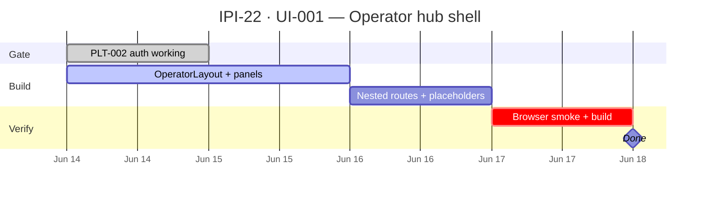

## UI-001 — Operator Hub Shell

**In plain terms:** **Operator** lands on a 3-panel dashboard (nav · work · AI stub) after login — foundation for intake, assets, and links screens.

**Blocked by:** [IPI-15](https://linear.app/ipix/issue/IPI-15) PLT-002 Auth + RLS

**Unblocks:** [IPI-23](https://linear.app/ipix/issue/IPI-23) UI-002 · [IPI-24](https://linear.app/ipix/issue/IPI-24) UI-003 · [IPI-25](https://linear.app/ipix/issue/IPI-25) UI-004

## Purpose

Create the main iPix workspace where operators manage brands, assets, products, and AI insights.

## Goals

- Create dashboard foundation
- Create navigation structure
- Create workspace layout
- Create AI insights panel

## User Story

As an operator, I want a single workspace to manage brands, assets, and products so that I can run content production workflows efficiently.

## User Journey

Login
→ Dashboard
→ Brands
→ Assets
→ Products
→ AI Insights

## MVP Deliverables

- Left navigation
- Center workspace
- Right AI panel
- Protected routes
- Dashboard shell

## Success Criteria

User can navigate between Brand, Asset, Product, and Dashboard pages.

---

### Skills (load in order)

| # | Skill | Path |
|---|--------|------|
| 1 | ipix-task-lifecycle | `.claude/skills/ipix-task-lifecycle/SKILL.md` |
| 2 | dashboards | `.cursor/skills/dashboards/SKILL.md` |
| 3 | frontend-design | `.claude/skills/frontend-design/SKILL.md` |
| 4 | task-verifier | `.claude/skills/task-verifier/SKILL.md` |
| 5 | mermaid-diagrams | `.claude/skills/mermaid-diagrams/SKILL.md` |

**Proof gate:** Enables proofs **#6–#8** UI surfaces

---

### PR split (required)

Ship as **PR A** only. Brand form is **PR B** → [IPI-23](https://linear.app/ipix/issue/IPI-23) UI-002.

| | PR A (this issue) | PR B (IPI-23) |
|---|-------------------|---------------|
| **Branch** | `ipi/ui-001-operator-shell` | `ipi/ui-002-brand-setup` |
| **Linear** | IPI-22 → In Review / Done | IPI-23 |
| **Includes** | `OperatorLayout`, `LeftNav`, `RightIntelligencePanel`, nested routes, placeholder pages | Brand URL form, `brandIntelligenceService`, loading/error states |
| **Excludes** | Any `brandIntelligenceService` call, Gemini/edge wiring, brand save UX | Layout shell changes (unless bugfix) |
| **Verify** | `npm run build` + login → hub → each nav route + refresh | + `supabase:verify-brand-intelligence` after edge invoke |

**PR A `/dashboard/brand`:** empty state only — e.g. “Connect brand URL — coming in UI-002” (see step C2).

---

### Layout spec (3-panel)

| Panel | Width | MVP content |
|-------|-------|-------------|
| Left — Context | 240px | Nav: Hub, Brand, Assets, Links, Settings stub |
| Main — Work | flex | `<Outlet />` placeholder routes |
| Right — Intelligence | 320px | Static “AI Coach” stub + next-action placeholders |

Mobile: collapse left to drawer; hide right below `lg`.

---

### Flow — operator navigation

```mermaid
flowchart LR
    subgraph Auth
        L[/login] --> D[/dashboard]
    end
    subgraph Shell
        D --> H[Hub home]
        D --> B[Brand route]
        D --> A[Assets route]
        D --> P[Links route]
    end
    H --> M[Main panel Outlet]
    B --> M
    A --> M
    P --> M
```

---

### Completion steps

#### A. Layout components
- [x] **A1** `src/layouts/OperatorLayout.tsx` — 3-column grid, responsive
- [x] **A2** `src/components/dashboard/LeftNav.tsx` — links + active state
- [x] **A3** `src/components/dashboard/RightIntelligencePanel.tsx` — stub copy
- [x] **A4** Replace flat `Dashboard.tsx` with layout + nested routes

#### B. Routing
- [x] **B1** Routes under `/dashboard`: `index`, `brand`, `assets`, `links` (placeholders OK)
- [x] **B2** `ProtectedRoute` wraps layout (existing auth)
- [x] **B3** 404 within dashboard → redirect hub

#### C. Polish
- [x] **C1** Match Lumina tokens (Cormorant + Outfit, `#E87C4D` accent)
- [x] **C2** Empty states per route (“Connect brand URL — UI-002”)
- [x] **C3** a11y: nav landmarks, skip link optional

#### D. Verify + ship
- [x] **D1** `npm run build`
- [ ] **D2** Browser: login → hub → each nav item → refresh persists
- [ ] **D3** Mobile width: nav collapses without horizontal scroll
- [ ] **D4** Linear **Done** · todo.md updated

### Verifier probes (before Done)

| Probe | Pass |
|-------|------|
| Login → `/dashboard` 3-panel layout | browser |
| Refresh on `/dashboard/brand` | no 404 (SPA) |
| `npm run build` | exit 0 |
| Left nav landmarks / keyboard | basic a11y |
| No duplicate `BrowserRouter` | single router in App |

**Spec score:** 90/100 — ready after PLT-002 Done

---

### Gantt — IPI-22



---

### Key files

```
src/layouts/OperatorLayout.tsx
src/components/dashboard/LeftNav.tsx
src/components/dashboard/RightIntelligencePanel.tsx
src/App.tsx (nested dashboard routes)
```
