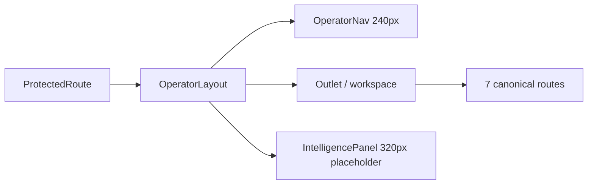
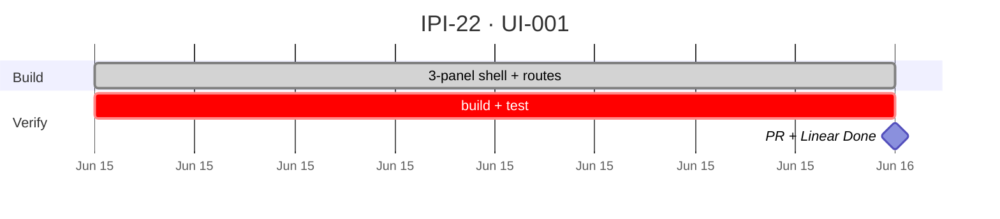

## UI-001 — Operator Hub Shell

**In plain terms:** **Operator** gets a 3-panel dashboard with left navigation, center workspace, and right intelligence placeholder — all canonical `/dashboard/*` routes, no AI runtime.

**Blocked by:** [PLT-002](https://linear.app/ipix/issue/IPI-15) · [PLT-004](https://linear.app/ipix/issue/IPI-17) — both Done

**Unblocks:** [UI-002](https://linear.app/ipix/issue/IPI-23) · [UI-003](https://linear.app/ipix/issue/IPI-24) · [UI-004](https://linear.app/ipix/issue/IPI-25) · [DASH-001](https://linear.app/ipix/issue/IPI-91)

**Proof gate:** Enabler for proofs **#6–#8** operator UX

**Branch:** `ipi/ui-001-operator-shell`

### Skills (load in order)

| # | Skill | Path |
|---|--------|------|
| 1 | ipix-task-lifecycle | `.claude/skills/ipix-task-lifecycle/SKILL.md` |
| 2 | dashboards | `.cursor/skills/dashboards/SKILL.md` |
| 3 | vercel-react-best-practices | `.claude/skills/vercel-react-best-practices/SKILL.md` |

**Out of scope:** CopilotKit · Mastra · `@copilotkit/*` · `services/agent/` · edge changes

---

### Flow — UI-001



---

### Completion steps

#### A. Layout + navigation
- [x] **A1** `src/layouts/OperatorLayout.tsx` — 3-panel shell
- [x] **A2** `src/components/operator/OperatorNav.tsx` — left nav + auth footer
- [x] **A3** `src/components/operator/IntelligencePanel.tsx` — right placeholder (no CopilotKit)
- [x] **A4** `src/components/operator/PlaceholderScreen.tsx` — center placeholders

#### B. Routes (nested under `/dashboard`)
- [x] **B1** `/dashboard` — Command Center
- [x] **B2** `/dashboard/brand`
- [x] **B3** `/dashboard/brand/intake`
- [x] **B4** `/dashboard/assets`
- [x] **B5** `/dashboard/products`
- [x] **B6** `/dashboard/analytics`
- [x] **B7** `/dashboard/settings`

#### C. Docs + evidence
- [x] **C1** `docs/intelligence/README.md` — platform sections
- [x] **C2** `docs/intelligence/status.md` — task matrix
- [x] **C3** Evidence: `docs/ecommerce/evidence/2026-06-15/ui-001-operator-shell.md`

#### D. Verify + ship
- [x] **D1** `npm run build`
- [x] **D2** `npm run test`
- [ ] **D3** Cursor PR Review / Bugbot
- [ ] **D4** Linear **In Review** → **Done** on merge

**Spec score:** 90/100 — ready for PR

---

### PR checklist

```text
[ ] Branch ipi/ui-001-operator-shell
[ ] Title: [IPI-22] UI-001 — Operator Hub Shell
[ ] npm run build ✅
[ ] npm run test ✅
[ ] No CopilotKit / Mastra / AI runtime in diff
[ ] Evidence doc linked
[ ] todo.md UI-001 → 🟡/🟢
[ ] progress-tracker.md updated
[ ] Linear In Review
```

---

### Gantt — IPI-22



_Source: `docs/linear/issues/IPI-22-UI-001.md` · push via `node scripts/linear-update-issue.mjs IPI-22`_
