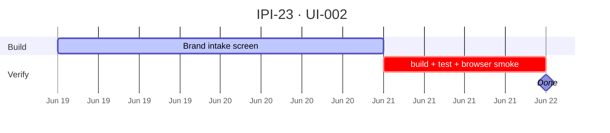

## IPI-23 · UI-002 — Brand Intake Screen

**In plain terms:** **Operator** opens `/app/brand/intake`, pastes a brand URL, receives a draft from the `brand-intelligence` edge function, reviews the draft, then approves or rejects before final brand data is saved.

**Route:** `/app/brand/intake`

**Dashboard:** D1b Brand Intake

**Blocked by:** [UI-001](https://linear.app/ipix/issue/IPI-22) · [AI-001](https://linear.app/ipix/issue/IPI-18)

**Unblocks:** Proof #6 Brand profile HITL path · [AIOR-003](https://linear.app/ipix/issue/IPI-83) · [DASH-006](https://linear.app/ipix/issue/IPI-96)

**MVP priority:** **P0 Must Have**

**Estimate:** 5 points

**Source:** [docs/intelligence/02-ai-native-dashboards-plan.md](../../intelligence/02-ai-native-dashboards-plan.md) · [docs/intelligence/10-brand-intake.md](../../intelligence/10-brand-intake.md)

### Skills (load in order)

| # | Skill | Path |
|---|--------|------|
| 1 | ipix-task-lifecycle | `.claude/skills/ipix-task-lifecycle/SKILL.md` |
| 2 | dashboards | `.claude/skills/dashboards/SKILL.md` |
| 3 | gemini | `.claude/skills/gemini/SKILL.md` |

---

### AI-Native Contract

| Layer | This screen |
|-------|-------------|
| L1 Context injection | URL form state, current draft id, active brand id if present |
| L2 Right-panel intelligence | Analysis status, citations, score explanations, next action chips |
| L3 Route agents | Default agent: `brand-intelligence` |
| L4 Generative artifacts | Draft profile and score cards returned by edge function |
| L5 HITL before writes | Operator must approve before final `brands` + `brand_scores` writes |

---

### Flow — UI-002

```mermaid
sequenceDiagram
  participant O as Operator
  participant UI as BrandIntakePage
  participant EF as brand-intelligence edge
  participant DB as Supabase

  O->>UI: Paste brand URL
  UI->>EF: POST analyze + JWT
  EF->>DB: Create pending brand_intake_draft
  EF-->>UI: Draft profile, scores, citations
  O->>UI: Review / edit draft
  alt Approve
    UI->>EF: POST commit approve
    EF->>DB: Upsert brands + brand_scores
  else Reject
    UI->>EF: POST commit reject
    EF->>DB: Mark draft rejected; no final profile write
  end
```

---

### Completion steps

#### A. Implement
- [ ] **A1** Route `/app/brand/intake` renders the Brand Intake screen.
- [ ] **A2** URL form validates URL format before calling `brand-intelligence`.
- [ ] **A3** Analyze action creates or returns a pending draft; it must not silently commit final brand data.
- [ ] **A4** Draft review shows proposed brand profile, scores, URL retrieval metadata, and citations when available.
- [ ] **A5** Approve action commits final `brands` + `brand_scores` writes.
- [ ] **A6** Reject action marks the draft rejected and does not write final profile/scores.
- [ ] **A7** Empty, loading, success, rejected, and error states are documented and visible.

#### B. Verify + ship
- [ ] **B1** `npm run build` passes.
- [ ] **B2** `npm run test` passes.
- [ ] **B3** Browser smoke verifies `/app/brand/intake`.
- [ ] **B4** HITL proof: final brand profile is saved only after approve.
- [ ] **B5** Linear **Done** · `todo.md` updated.

**Spec score:** 86/100 — lifecycle-ready

---

### Corrections Applied

- Created missing local mirror issue for `IPI-23 · UI-002 — Brand Intake Screen`.
- Set canonical route to `/app/brand/intake`.
- Added explicit HITL rule: operator approval is required before final brand profile and score writes.
- Linked the active AI-native dashboard source path: `docs/intelligence/02-ai-native-dashboards-plan.md`.

---

### Gantt — IPI-23



_Source: `docs/linear/issues/IPI-23-UI-002.md` · push via `node scripts/linear-update-issue.mjs IPI-23`_
