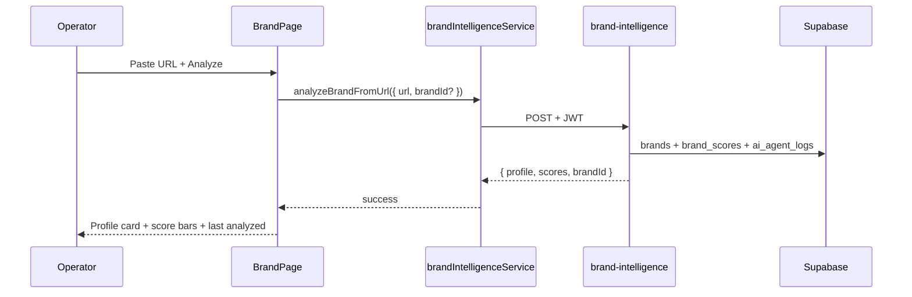

## UI-002 — Brand Intake Screen

**In plain terms:** **Operator** pastes a brand URL on `/dashboard/brand`, clicks Analyze, and sees AI profile + DNA scores — MVP proof **#6** in the UI.

**Blocked by:** [IPI-22](https://linear.app/ipix/issue/IPI-22) UI-001 · [IPI-18](https://linear.app/ipix/issue/IPI-18) AI-001

**Unblocks:** [IPI-19](https://linear.app/ipix/issue/IPI-19) DNA-001 · [IPI-24](https://linear.app/ipix/issue/IPI-24) UI-003

**Proof gate:** MVP proof **#6** (brand profile + scores visible after URL analyze)

---

### PR split (required)

| | PR A (IPI-22) | PR B (this issue) |
|---|----------------|-------------------|
| **Branch** | `ipi/ui-001-operator-shell` | `ipi/ui-002-brand-intake` |
| **Includes** | Shell, placeholder Brand page | URL form, analyze flow, result card |
| **Excludes** | `brandIntelligenceService` calls | Layout shell changes (unless bugfix) |

---

### Flow

---

### Completion steps

#### A. Implement
- [x] **A1** Brand URL input + Analyze button
- [x] **A2** Loading / error / success states
- [x] **A3** `brandIntelligenceService` → `brand-intelligence` edge
- [x] **A4** Display profile, scores, last analyzed date
- [x] **A5** Reload latest brand from Supabase on page load

#### B. Verify + ship
- [ ] **B1** `npm run build` passes
- [ ] **B2** `npm run test` passes
- [ ] **B3** Manual: login → `/dashboard/brand` → analyze URL → scores visible
- [ ] **B4** Linear **Done** · after PR merge

**Verify:** `npm run build` · `npm run test` · `infisical run -- npm run supabase:verify-brand-intelligence`

---

### Rollback

Revert PR #5 (UI-002). Brand page returns to empty state; `brands` / `brand_scores` rows remain in DB (no data loss).
