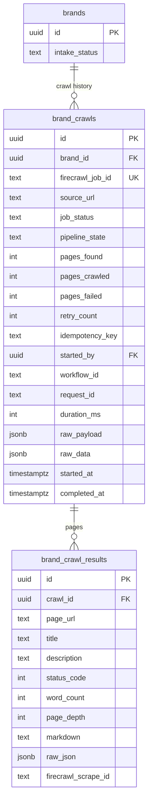
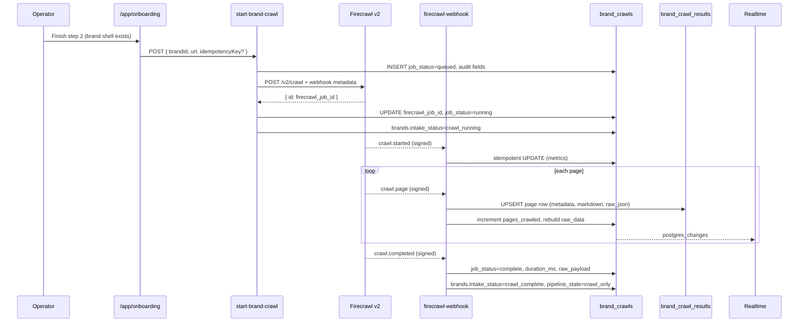
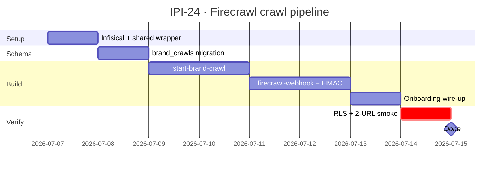

## IPI-24 · IPI-BI-001 — Brand Intelligence: Firecrawl Integration

**Team:** iPix1 · **Project:** BRAND · **Epic:** [IPI-20](https://linear.app/amo100/issue/IPI-20)  
**Milestone:** BI-M1: Schema + Firecrawl  
**Linear:** [IPI-24](https://linear.app/amo100/issue/IPI-24/ipi-bi-001-brand-intelligence-firecrawl-integration)

**In plain terms:** After onboarding creates one org-linked brand, Firecrawl v2 crawls the brand website (≤50 pages), saves **job history + per-page markdown/JSON** in Postgres, and the operator sees crawl progress in real time. Gemini (IPI-25) reads the crawl job — not URL guesses alone.

**Blocked by:** [IPI-46](https://linear.app/amo100/issue/IPI-46) ✅ · [IPI-26](https://linear.app/amo100/issue/IPI-26) (base tables + Realtime)

**Unblocks:** [IPI-25](https://linear.app/amo100/issue/IPI-25) · [IPI-27](https://linear.app/amo100/issue/IPI-27) · [IPI-28](https://linear.app/amo100/issue/IPI-28) · [IPI-31](https://linear.app/amo100/issue/IPI-31) · [IPI-32](https://linear.app/amo100/issue/IPI-32)

**Lifecycle steps:** 3 → 4 ([`docs/plan/19-brand-lifecycle.md`](../../plan/19-brand-lifecycle.md))  
**Brand `intake_status`:** `brand_created` → `crawl_running` → `crawl_complete` | `failed` *(unchanged — MVP)*

**MVP priority:** P0 · **Estimate:** 5 points · **Branch:** `ipi/ipi-24-firecrawl`

### Skills

`ipix-task-lifecycle` · `firecrawl-build-onboarding` · `firecrawl-build-interact` · `firecrawl-build-search` · `mermaid-diagrams`

| Skill | When to use in this task |
|-------|--------------------------|
| **firecrawl-build-onboarding** | `FIRECRAWL_API_KEY` + `FIRECRAWL_WEBHOOK_SECRET` via Infisical; edge-only |
| **firecrawl-build-interact** | Escalate subset of pages when `/crawl` misses JS-only content |
| **firecrawl-build-search** | Optional competitor URL discovery (IPI-28 — out of MVP scope) |

### Official Firecrawl alignment (v2)

| Topic | Official reference | iPix rule |
|-------|-------------------|-----------|
| Start crawl | `POST https://api.firecrawl.dev/v2/crawl` | [`crawl-post`](https://docs.firecrawl.dev/api-reference/endpoint/crawl-post) |
| Webhook events | `crawl.started`, `crawl.page`, `crawl.completed` | [`webhooks/events`](https://docs.firecrawl.dev/webhooks/events) |
| Signature | `X-Firecrawl-Signature: sha256=…` HMAC raw body | [`webhooks/security`](https://docs.firecrawl.dev/webhooks/security) |
| Retries | 3 retries (1m, 5m, 15m); respond **2xx within 10s** | [`webhooks/overview`](https://docs.firecrawl.dev/webhooks/overview) |
| Page metadata | `title`, `description`, `statusCode`, `url`, `scrapeId` in `data[].metadata` | `crawl.page` payload |
| Formats | `formats: ['markdown']` on crawl/scrape | No client SDK in browser |

---

### What “done” looks like (success criteria) — MVP unchanged

- [x] Operator submits onboarding → crawl starts on the **existing** `brand_id` (no new brand row)
- [x] `brand_crawls` job row: metrics, audit fields, `firecrawl_job_id` UNIQUE, idempotent start
- [x] `brand_crawl_results` **per-page** rows with metadata + `markdown` + `raw_json`
- [x] **Backward compat:** `brand_crawls.raw_data` denormalized aggregate (same shape IPI-25 reads today)
- [x] Webhook verifies HMAC; upserts by `firecrawl_job_id` + event idempotency
- [x] `brands.intake_status` → `crawl_running` → `crawl_complete`
- [x] Realtime on **`brand_crawls`** (job progress) — IPI-31 subscribes
- [x] All Firecrawl HTTP via `_shared/firecrawl.ts` only
- [x] `npm run supabase:verify-rls` green · `verify-brand-intelligence` IPI-24 probes green (Gemini 503 on authed `brand-intelligence` smoke — transient)

---

### Data model — job history + page results



**Why two tables (no MVP scope creep):**

| Table | Role | MVP writes |
|-------|------|------------|
| `brand_crawls` | One row per crawl **attempt** (history, metrics, audit) | `start-brand-crawl`, webhook job events |
| `brand_crawl_results` | One row per **page** (`crawl.page` events) | `firecrawl-webhook` only |

**Backward compatibility (IPI-25):**

- `crawlResultId` continues to mean **`brand_crawls.id`** (job id).
- `brand_crawls.raw_data` = denormalized `{ pages: [{ markdown, metadata }] }` rebuilt on each `crawl.page` and finalized on `crawl.completed` — same JSON shape as pre-split design.
- IPI-25 may later read normalized pages via `crawl_id` join; not required for IPI-24 MVP.

**Future-ready `pipeline_state`** (enum exists; only `crawl_only` set in IPI-24):

`crawl_only` → `pending_analysis` → `analysis_running` → `analysis_complete` → `scoring_running` → `scoring_complete` | `pipeline_failed`  
*(IPI-25 / IPI-29 write later states — no extra edge work in IPI-24)*

---

### Flow — async crawl pipeline (v2 webhooks)



### Idempotency & retries

| Layer | Key | Behavior |
|-------|-----|----------|
| **Start crawl** | `(brand_id, idempotency_key)` UNIQUE partial | Same key within 24h → return existing `brand_crawls.id` if not `failed` |
| **Firecrawl job** | `firecrawl_job_id` UNIQUE | One job row per Firecrawl `id` |
| **Webhook event** | `(firecrawl_job_id, event_type, scrape_id?)` | `crawl.page` upsert by `(crawl_id, firecrawl_scrape_id)`; ignore duplicate deliveries |
| **Firecrawl retry** | Their 3× webhook retry | We always `200` within 10s; `retry_count` on job tracks **our** re-start attempts only |
| **Page row** | `UNIQUE (crawl_id, page_url)` | Last write wins on replay |

Pass `webhook.metadata` from start: `{ brand_id, crawl_id, request_id, workflow_id }` per [Firecrawl webhook config](https://docs.firecrawl.dev/webhooks/overview).

---

### SQL plan (additive migration on IPI-26)

**File:** `supabase/migrations/20260627000000_brand_crawls_job_pages.sql`  
**Policy:** Additive only — does not drop IPI-26 objects. Repurpose `brand_crawl_results` from job-blob to page rows via new `brand_crawls` parent.

```sql
-- Enums (job = Firecrawl mirror; pipeline = Gemini/scoring — future states)
DO $$ BEGIN
  CREATE TYPE public.brand_crawl_job_status AS ENUM (
    'queued', 'running', 'complete', 'failed', 'cancelled'
  );
EXCEPTION WHEN duplicate_object THEN NULL; END $$;

DO $$ BEGIN
  CREATE TYPE public.brand_crawl_pipeline_state AS ENUM (
    'crawl_only',
    'pending_analysis',
    'analysis_running',
    'analysis_complete',
    'scoring_running',
    'scoring_complete',
    'pipeline_failed'
  );
EXCEPTION WHEN duplicate_object THEN NULL; END $$;

-- 1) Job / history table
CREATE TABLE IF NOT EXISTS public.brand_crawls (
  id                  uuid PRIMARY KEY DEFAULT gen_random_uuid(),
  brand_id            uuid NOT NULL REFERENCES public.brands(id) ON DELETE CASCADE,
  firecrawl_job_id    text UNIQUE,
  source_url          text NOT NULL,
  job_status          public.brand_crawl_job_status NOT NULL DEFAULT 'queued',
  pipeline_state      public.brand_crawl_pipeline_state DEFAULT 'crawl_only',
  pages_found         int NOT NULL DEFAULT 0,
  pages_crawled       int NOT NULL DEFAULT 0,
  pages_failed        int NOT NULL DEFAULT 0,
  retry_count         int NOT NULL DEFAULT 0,
  idempotency_key     text,
  started_by          uuid REFERENCES auth.users(id) ON DELETE SET NULL,
  workflow_id         text,
  request_id          text,
  duration_ms         int,
  raw_payload         jsonb NOT NULL DEFAULT '{}',  -- full Firecrawl job / completed snapshot
  raw_data            jsonb NOT NULL DEFAULT '{}',  -- legacy aggregate for IPI-25
  started_at          timestamptz,
  completed_at        timestamptz,
  created_at          timestamptz NOT NULL DEFAULT now(),
  updated_at          timestamptz NOT NULL DEFAULT now()
);

CREATE INDEX IF NOT EXISTS brand_crawls_brand_id_idx
  ON public.brand_crawls (brand_id, created_at DESC);
CREATE UNIQUE INDEX IF NOT EXISTS brand_crawls_idempotency_active_uidx
  ON public.brand_crawls (brand_id, idempotency_key)
  WHERE idempotency_key IS NOT NULL AND job_status NOT IN ('failed', 'cancelled');

-- 2) Evolve brand_crawl_results → per-page (IPI-26 table may exist as job blob)
ALTER TABLE public.brand_crawl_results
  ADD COLUMN IF NOT EXISTS crawl_id uuid REFERENCES public.brand_crawls(id) ON DELETE CASCADE,
  ADD COLUMN IF NOT EXISTS page_url text,
  ADD COLUMN IF NOT EXISTS title text,
  ADD COLUMN IF NOT EXISTS description text,
  ADD COLUMN IF NOT EXISTS status_code int,
  ADD COLUMN IF NOT EXISTS word_count int,
  ADD COLUMN IF NOT EXISTS page_depth int,
  ADD COLUMN IF NOT EXISTS markdown text,
  ADD COLUMN IF NOT EXISTS raw_json jsonb NOT NULL DEFAULT '{}',
  ADD COLUMN IF NOT EXISTS firecrawl_scrape_id text;

CREATE UNIQUE INDEX IF NOT EXISTS brand_crawl_results_crawl_page_uidx
  ON public.brand_crawl_results (crawl_id, page_url)
  WHERE crawl_id IS NOT NULL AND page_url IS NOT NULL;
CREATE UNIQUE INDEX IF NOT EXISTS brand_crawl_results_crawl_scrape_uidx
  ON public.brand_crawl_results (crawl_id, firecrawl_scrape_id)
  WHERE crawl_id IS NOT NULL AND firecrawl_scrape_id IS NOT NULL;

-- 3) RLS (org-member SELECT; edge service_role writes)
ALTER TABLE public.brand_crawls ENABLE ROW LEVEL SECURITY;
CREATE POLICY "brand_crawls_select_org_member"
  ON public.brand_crawls FOR SELECT TO authenticated
  USING (EXISTS (
    SELECT 1 FROM public.brands b
    WHERE b.id = brand_crawls.brand_id AND public.is_org_member(b.org_id)
  ));

-- Extend existing brand_crawl_results SELECT policy scope (page rows via crawl join)
-- Realtime: ADD brand_crawls to publication (keep brand_crawl_results optional)
-- ALTER PUBLICATION supabase_realtime ADD TABLE public.brand_crawls;
```

**Migration note:** If IPI-26 shipped job-level rows in `brand_crawl_results`, run one-time backfill: insert `brand_crawls` from legacy rows, set `crawl_id`, split `raw_data.pages[]` into page rows. New code path only after backfill.

---

### `_shared/firecrawl.ts` (single HTTP gateway)

All edge functions import from here — **no** `@mendable/firecrawl-js`, **no** client bundle.

```typescript
// supabase/functions/_shared/firecrawl.ts — contract (implement in IPI-24)

const FIRECRAWL_BASE = "https://api.firecrawl.dev/v2";

export type FirecrawlCrawlStart = {
  url: string;
  limit?: number;                    // default 50 (MVP cap)
  maxDiscoveryDepth?: number;
  formats?: ("markdown")[];
  webhook: {
    url: string;
    metadata: Record<string, string>;
    events?: ("started" | "page" | "completed" | "failed")[];
  };
};

export async function firecrawlStartCrawl(body: FirecrawlCrawlStart): Promise<{ id: string }>;
export async function firecrawlScrape(url: string): Promise<unknown>;  // escalation / smoke
export function verifyFirecrawlSignature(rawBody: string, header: string | null): boolean;
export function parseCrawlPageEvent(event: unknown): {
  jobId: string;
  type: string;
  pages: Array<{
    markdown?: string;
    metadata: {
      title?: string;
      description?: string;
      statusCode?: number;
      url?: string;
      sourceURL?: string;
      scrapeId?: string;
    };
  }>;
};
export function wordCountFromMarkdown(md: string): number;
```

**Production practices:**

- `Authorization: Bearer ${FIRECRAWL_API_KEY}` from `getOptionalSecret`
- Webhook handler: read **raw body** before JSON parse for HMAC ([security doc](https://docs.firecrawl.dev/webhooks/security))
- Return `200` + `"ok"` within 10s; defer heavy DB work via `EdgeRuntime.waitUntil` if needed
- Log `request_id` + `workflow_id` to `ai_agent_logs` on failure

---

### Completion steps

#### A. Secrets & onboarding

- [ ] **A1** Infisical `/ipix/edge`: `FIRECRAWL_API_KEY`, `FIRECRAWL_WEBHOOK_SECRET`
- [ ] **A2** `.env.example` — edge-only, no `VITE_` prefix
- [ ] **A3** Smoke: `_shared/firecrawl.ts` → `firecrawlScrape` one fashion URL

#### B. Schema (additive migration § SQL plan)

- [ ] **B1** `brand_crawls` + enum types + RLS
- [ ] **B2** Alter `brand_crawl_results` for page columns + `crawl_id` FK
- [ ] **B3** Realtime publication on `brand_crawls`
- [ ] **B4** `npm run supabase:types` committed

#### C. Edge functions

- [x] **C1** `start-brand-crawl` — auth, idempotency_key, insert `brand_crawls`, call `firecrawlStartCrawl`, set audit fields (`started_by`, `request_id`, optional `workflow_id`)
- [x] **C2** `firecrawl-webhook` — HMAC verify, handle `crawl.started|page|completed`, upsert pages + job metrics, rebuild `raw_data`, set `duration_ms`
- [x] **C3** `_shared/firecrawl.ts` — only Firecrawl HTTP entrypoint

#### D. Operator app (unchanged scope)

- [x] **D1** Onboarding calls `start-brand-crawl` with `brandId` + `websiteUrl` + optional idempotency key
- [x] **D2** Failure UI — crawl start non-fatal; brand-intelligence still runs; Hub redirect only on intelligence failure

#### E. Verify + ship

- [x] **E1** `verify-rls.mjs` — `brand_crawls` + page-level `brand_crawl_results` probes
- [x] **E2** `verify-brand-intelligence.mjs` — crawl table existence + optional start smoke
- [ ] **E3** Manual: 2 fashion URLs → job `pages_crawled > 0`, pages have `title` + `markdown`
- [ ] **E4** `rg firecrawl app/src` → **0** client imports

---

### Verifier probes

```bash
# Edge inventory
rg "start-brand-crawl|firecrawl-webhook" supabase/functions
test -f supabase/functions/_shared/firecrawl.ts

# No client SDK
rg "@mendable/firecrawl|firecrawl-js" app/src src/   # expect: 0

# Schema (remote)
# brand_crawls + page columns on brand_crawl_results
npm run supabase:migrations | rg brand_crawls

# RLS + intelligence
npm run supabase:verify-rls
npm run supabase:verify-brand-intelligence

# Realtime job table
# SQL: pg_publication_tables WHERE tablename = 'brand_crawls'

# Idempotency index
# SQL: pg_indexes WHERE indexname = 'brand_crawls_idempotency_active_uidx'
```

---

### Gantt



---

### Risks & mitigations

| Risk | Mitigation |
|------|------------|
| IPI-26 job-blob rows exist | One-time backfill migration; dual `raw_data` on `brand_crawls` |
| Webhook timeout (>10s) | Ack fast; `waitUntil` for DB; idempotent upserts |
| Firecrawl 3× retry storms | Unique page keys; monotonic `pages_crawled` |
| Large markdown | Cap 50 pages; `word_count` for observability only |
| IPI-25 reads old shape | Keep `brand_crawls.raw_data` aggregate |

_Refs: [Firecrawl v2 crawl](https://docs.firecrawl.dev/api-reference/endpoint/crawl-post) · [Webhook events](https://docs.firecrawl.dev/webhooks/events) · [Webhook security](https://docs.firecrawl.dev/webhooks/security)_  
_Source: `docs/linear/issues/IPI-24-IPI-BI-001.md` · push: `node scripts/linear-update-issue.mjs IPI-24`_
