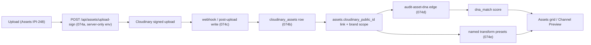
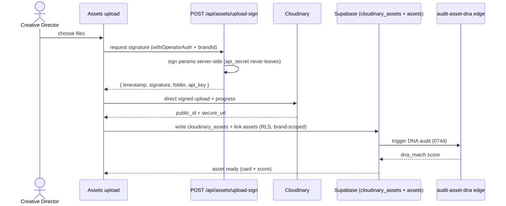
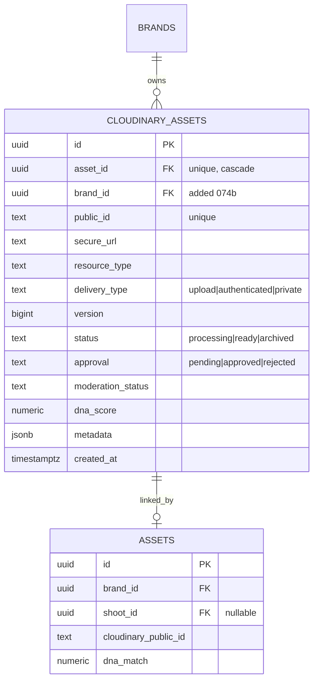

# IPI-257 · DESIGN-074 — Cloudinary Media Pipeline — Upload to Delivery

**Linear:** https://linear.app/amo100/issue/IPI-257
**Status:** In Progress · Synced from Linear 2026-07-02 (074b merged PR #154; epic reopened for 074a–f)

> Mirrors the Linear issue — one implementation contract in both places. **Split PRs 074a–f** (migration-only first).

---

## Progress (mirrors Linear)

| Sub | Status | PR |
|-----|--------|-----|
| **074b** cloudinary_assets columns + brand RLS | ✅ Done | [#154](https://github.com/amo-tech-ai/lumina-studio/pull/154) |
| **074a** Signed upload API | ⬜ Todo | — |
| **074c** Post-upload link + webhook | ⬜ Todo | — |
| **074d** DNA audit trigger | ⬜ Todo | — |
| **074e** Named transform presets | ⬜ Todo | — |
| **074f** Bulk tag/replace | ⬜ Todo | — |

> Epic reopened 2026-07-02 — 074b merged; **074a–f remain** before IPI-248 upload UX.

---

## Overview

**Epic:** End-to-end Cloudinary media pipeline for operator assets — upload through delivery URLs.

**Tracker:** DESIGN-074 · MEDIA-MAP.md · runs parallel after Batch 1 spine (does not require IPI-255 live panel data).

## Sub-deliverables (074a–f) — one concern per PR

- [x] **074b** `cloudinary_assets` column extension + **brand-scoped RLS** migration *(PR #154 merged)*
- [ ] **074a** Signed upload API
- [ ] **074c** Link uploads to `assets` + brand scope
- [ ] **074d** DNA audit trigger (`audit-asset-dna`)
- [ ] **074e** Channel readiness transforms
- [ ] **074f** Bulk tag / replace in Assets panel

## Design reference (verified on disk)

| Source | Path |
|--------|------|
| Pipeline SSOT (DESIGN-018) | `tasks/design-docs/plan/MEDIA-MAP.md` |
| Stack plan (canonical) | `tasks/cloudinary/cloudinary-plan.md` |
| Feature map | `tasks/design-docs/handoff/05-feature-map.md` |
| Skill / preset naming | `.claude/skills/cloudinary/SKILL.md` |
| Upload surface (074a/f) | `Universal design prompt/Assets.v2.image-first.dc.html` · `components/AssetCard.dc.html` |

---

# Implementation Prompt Pack (2026-06-30, rev2)

**Worktree:** `ipi/257-cloudinary-pipeline` · `../wt-ipi-257-cloudinary-pipeline` · **split PRs 074a–f** (migration-only first; never UI + migration in one PR)
**Skills to run:** cloudinary (+ references/react signed-uploads, references/transformations) · ipix-supabase · create-migration · migration-reviewer · gemini · mastra · mermaid-diagrams
**MCP:** Cloudinary plugin servers (`cloudinary-asset-mgmt`, `cloudinary-analysis`, `cloudinary-env-config`) · Supabase MCP (migration + RLS)

## Existing on disk (do NOT recreate)

* `cloudinary_assets` table — schema present (migration `20251129063729_create_cloudinary_assets_table_20250128.sql`), **0 rows**
* `assets.cloudinary_public_id` column — present
* `uploadToCloudinary()` — in Mastra `visual-identity` agent (env-gated, partial)
* `GET /api/media/specs` · `GET /api/brands/[id]/assets` (hardcoded transform) — partial
* `audit-asset-dna` edge — deployed; pipeline not end-to-end
* Supabase Storage — 0 buckets (intentional: Cloudinary is the media path)
* npm `cloudinary` SDK — **not yet in** `app/package.json` (add server-side only)
* Env (server-only): `CLOUDINARY_CLOUD_NAME` · `CLOUDINARY_API_KEY` · `CLOUDINARY_API_SECRET` — **never** `NEXT_PUBLIC_*`

## User stories

* As a **creative director**, I upload assets and they appear in the library within seconds with a real delivery URL — never a broken thumbnail.
* As a **creative director**, each uploaded asset is auto-scored for DNA so I see fit without a manual step.
* As a **producer**, channel-ready crops (IG/TikTok/Amazon) are generated from one master so I publish without re-exporting.
* As a **platform engineer**, uploads are signed server-side and `cloudinary_assets` is brand-scoped via RLS — no client secret, no cross-tenant leak.
* As a **developer**, I consume named transform presets (`brand-cover`, `asset-tile`, `asset-masonry`, `channel-ig`) — never hand-built transform strings in components.

## Upload surface (lives in Assets / IPI-248)

```
+------------------------------------------+
| Assets                       [+ Upload]  |  <- triggers signed-upload flow
| +--------------------------------------+ |
| | drag + drop / file picker            | |
| | uploading: [#####-----] 52%  (no     | |  <- progress, never blank spinner
| | blank spinner; per-file rows)        | |
| +--------------------------------------+ |
| uploaded -> AssetCard appears w/ DNA chip |
+------------------------------------------+
```

## Mermaid — data flow (upload to delivery)



## Mermaid — signed-upload sequence (074a + 074c)



## Schema (074b — extend/verify existing table)



## Frontend <-> backend wiring

| Route | Sub | Auth | Returns |
| -- | -- | -- | -- |
| `POST /api/assets/upload-sign` | 074a | withOperatorAuth | signed params (timestamp, signature, `asset_folder=ipix/brands/{brandId}/...`, api_key) |
| `POST /api/assets/link` (or webhook) | 074c | withOperatorAuth / signed hook | writes `cloudinary_assets` + links `assets`, brand-scoped |
| `audit-asset-dna` edge | 074d | service-role (edge) | `dna_match` score back to `assets` |
| `GET /api/media/specs` | 074e | withOperatorAuth | per-channel crop specs (exists, partial) |

## Signed upload handling (074a — required)

* Signature computed **server-side only** with `CLOUDINARY_API_SECRET`; secret never sent to client.
* Return only `{ timestamp, signature, api_key, folder }`; client uploads direct to Cloudinary.
* Constrain at sign time: `asset_folder=ipix/brands/{brandId}/...` (canonical tree, dynamic-folder mode — see [cloudinary-architecture §2](../../../tasks/cloudinary/cloudinary-architecture.md)), `allowed_formats=jpg,png,webp,mp4,mov`, max size (image ≤10MB/25MP, video ≤100MB — live limits), `unique_filename=true`, optional `eager` presets for channel crops.
* Short-lived signature; reject if `brandId` not in caller's org (RLS-aligned).
* Prefer **authenticated/signed delivery** for any private/pre-approval asset (`type=authenticated`, signed URL); public delivery only after approval.

## Security requirements

- [ ] No `NEXT_PUBLIC_CLOUDINARY*`; `CLOUDINARY_API_SECRET`/`API_KEY` only in server routes / edge / Mastra (server)
- [ ] `cloudinary` SDK imported in server code only — never a client component
- [ ] Signed uploads only (no unsigned upload preset that allows arbitrary writes)
- [ ] Webhook (if used) verifies Cloudinary signature before DB write
- [ ] Optional: AI moderation add-on gate before public delivery (flag NSFW)
- [ ] Secret-guard grep clean in CI (see verification)

## RLS requirements (074b)

- [ ] `cloudinary_assets` RLS **enabled**
- [ ] `select/insert/update` policies brand/org-scoped (caller must own `brand_id`)
- [ ] Cross-brand read/write blocked (test with second brand)
- [ ] Edge writes (`audit-asset-dna`) use service-role, not user JWT
- [ ] `infisical run -- npm run supabase:verify-rls` green

## Cloudinary transformation notes (074e — named presets, per MEDIA-MAP)

| Preset | Use | Params (draft) |
| -- | -- | -- |
| `brand-cover` | BrandCard / list rows | `c_fill,w_400,h_300,g_auto,f_auto,q_auto` |
| `asset-tile` | Brand Detail / grid | `c_thumb,w_120,h_120,g_auto,f_auto,q_auto` |
| `asset-masonry` | Assets library | `c_limit,w_600,f_auto,q_auto` |
| `channel-ig` | Channel Preview | safe-zone from `/api/media/specs`, `f_auto,q_auto` |
| `channel-tiktok` | Channel Preview | `c_fill,ar_9:16,g_auto` |
| `hitl-diff` | Approval before/after | side-by-side derivative URLs |

Rules: always `f_auto,q_auto`; responsive via srcset/`w_auto,dpr_auto`; define as **named transformations** (one source of truth) — no inline transform strings in components; video uses `f_auto,q_auto` + adaptive streaming where applicable.

---

# Implementation Contracts (rev3 — implementation-ready, 2026-06-30)

> Grounded in the **live** schema + Cloudinary MCP (Free plan, dynamic-folder mode, limits image ≤10 MB/25 MP · video ≤100 MB · raw ≤10 MB) and the official notifications doc. Canonical mirror: [`cloudinary-architecture.md`](../../../tasks/cloudinary/cloudinary-architecture.md).

## 1. `cloudinary_assets` schema contract (074b)

### 1a. Existing columns (do NOT recreate — table exists)

`id` uuid PK · `asset_id` uuid FK→`assets` (cascade, **unique**) · `public_id` text **unique** not null · `secure_url` text not null · `resource_type` text not null · `width` int · `height` int · `folder` text · `created_at` · `updated_at`.
Indexes: `idx_cloudinary_assets_asset(asset_id)`, `_public_id(public_id)`, `_folder(folder) where folder is not null`.

### 1b. Reality gap (must fix in 074b)

- Table has **no `brand_id`, `metadata`, `delivery_type`, `version`, `approval`, `moderation_status`, `dna_status`, `format`, `bytes`, `duration`, `created_by`** — the spec ERD was aspirational.
- **RLS is stale/broken:** current policies scope via `assets.shoot_id → shoots.designer_id`, but `assets.shoot_id` is **nullable** (event/product/brand assets) → those rows become invisible/un-insertable. Canonical scoping is `assets.brand_id → brands.user_id` (per `20260618090000_assets_brand_rls.sql`).

### 1c. Forward migration (`supabase/migrations/<ts>_cloudinary_assets_brand_rls_and_columns.sql`) — migration-only PR

```sql
-- 074b: extend cloudinary_assets + re-scope RLS to brand owner (additive, idempotent)
alter table public.cloudinary_assets
  add column if not exists brand_id        uuid references public.brands(id) on delete cascade,
  add column if not exists delivery_type   text not null default 'authenticated',  -- upload|authenticated|private
  add column if not exists version         bigint,
  add column if not exists format          text,
  add column if not exists bytes           bigint,
  add column if not exists duration        numeric,
  add column if not exists status          text not null default 'processing',     -- processing|ready|archived
  add column if not exists approval         text not null default 'pending',        -- pending|approved|rejected
  add column if not exists moderation_status text not null default 'pending',       -- pending|approved|rejected|skipped
  add column if not exists dna_status       text,
  add column if not exists dna_score        numeric,
  add column if not exists metadata         jsonb not null default '{}'::jsonb,
  add column if not exists created_by       uuid references auth.users(id);

create index if not exists idx_cloudinary_assets_brand    on public.cloudinary_assets(brand_id) where brand_id is not null;
create index if not exists idx_cloudinary_assets_approval on public.cloudinary_assets(approval);
create index if not exists idx_cloudinary_assets_status   on public.cloudinary_assets(status);

-- Replace stale shoot-scoped policies with brand-owner scoping (mirrors assets_*_via_brand)
drop policy if exists "authenticated_select_cloudinary_assets" on public.cloudinary_assets;
drop policy if exists "authenticated_insert_cloudinary_assets" on public.cloudinary_assets;
drop policy if exists "authenticated_update_cloudinary_assets" on public.cloudinary_assets;
drop policy if exists "authenticated_delete_cloudinary_assets" on public.cloudinary_assets;

create policy "ca_select_via_brand" on public.cloudinary_assets for select to authenticated
  using (exists (select 1 from public.brands b where b.id = cloudinary_assets.brand_id and b.user_id = auth.uid()));
create policy "ca_insert_via_brand" on public.cloudinary_assets for insert to authenticated
  with check (exists (select 1 from public.brands b where b.id = cloudinary_assets.brand_id and b.user_id = auth.uid()));
create policy "ca_update_via_brand" on public.cloudinary_assets for update to authenticated
  using (exists (select 1 from public.brands b where b.id = cloudinary_assets.brand_id and b.user_id = auth.uid()))
  with check (exists (select 1 from public.brands b where b.id = cloudinary_assets.brand_id and b.user_id = auth.uid()));
create policy "ca_delete_via_brand" on public.cloudinary_assets for delete to authenticated
  using (exists (select 1 from public.brands b where b.id = cloudinary_assets.brand_id and b.user_id = auth.uid()));
-- anon stays deny-all (keep existing "anon_select_cloudinary_assets ... using(false)")
-- edge/service-role bypasses RLS (audit-asset-dna writes dna_status/dna_score)
```

### 1d. Rollback (down migration)

```sql
drop policy if exists "ca_select_via_brand" on public.cloudinary_assets;
drop policy if exists "ca_insert_via_brand" on public.cloudinary_assets;
drop policy if exists "ca_update_via_brand" on public.cloudinary_assets;
drop policy if exists "ca_delete_via_brand" on public.cloudinary_assets;
alter table public.cloudinary_assets
  drop column if exists brand_id, drop column if exists delivery_type, drop column if exists version,
  drop column if exists format, drop column if exists bytes, drop column if exists duration,
  drop column if exists status, drop column if exists approval, drop column if exists moderation_status,
  drop column if exists dna_status, drop column if exists dna_score, drop column if exists metadata,
  drop column if exists created_by;
-- NOTE: do not drop the table (pre-existed). Restoring old shoot-scoped policies is optional (they were broken).
```

Rollback rule: **additive-only forward** (no data loss); down migration is safe because added columns have defaults and no backfill is destructive. `cloudinary_assets` has **0 rows** today, so rollback risk is nil.

## 2. Signed Upload API contract (074a)

**Route:** `POST /api/assets/upload-sign` · **Auth:** `withOperatorAuth` (Supabase session → user); reject if `brandId` not owned by caller (RLS-aligned).

**Request**
```json
{ "brandId": "uuid", "resourceType": "image|video", "filename": "hero.jpg",
  "context": { "shootId": "uuid?", "campaignId": "uuid?" } }
```

**Response (200)** — secret never leaves server:
```json
{ "cloudName": "...", "apiKey": "...", "timestamp": 1751260800,
  "signature": "<sha1 hex>", "assetFolder": "ipix/brands/{brandId}/products",
  "uploadUrl": "https://api.cloudinary.com/v1_1/<cloud>/<resourceType>/upload",
  "params": { "asset_folder": "...", "type": "authenticated",
              "allowed_formats": "jpg,png,webp,mp4,mov", "unique_filename": "true",
              "eager": "t_asset-tile|t_asset-masonry", "context": "brand_id=..." },
  "expiresAt": 1751261100 }
```

- **Signature algo:** `cloudinary.utils.api_sign_request(paramsToSign, api_secret)` = SHA-1 hex of sorted `key=value&…` (exclude `file`, `api_key`, `cloud_name`, `resource_type`) + `api_secret`. **All** non-excluded params sent to Cloudinary MUST be signed or upload is rejected.
- **Expiry:** include our `expiresAt` = `timestamp + 300s`; route rejects re-use server-side via short window. Cloudinary itself tolerates ~1h timestamp skew — our 5-min window is tighter.
- **Folder rules:** `asset_folder` set server-side from canonical tree (§2 architecture); client cannot override (dynamic-folder mode).
- **File limits (enforced at sign + client pre-check):** image ≤ 10 MB / 25 MP; video ≤ 100 MB; raw ≤ 10 MB (live MCP values).
- **Validation:** `resourceType ∈ {image,video}`; `allowed_formats` whitelist; `brandId` owned; filename sanitized.
- **Errors:** `401` no session · `403` brand not owned · `400` bad resourceType/format · `413` over size (client pre-check) · `429` rate-limited (per-user sign quota) · `500` env/secret missing.

## 3. Webhook Contract (074c/h)

**Route:** `POST /api/assets/cloudinary/webhook` · **Auth:** signature only (no session).

- **Verify:** headers `X-Cld-Timestamp` + `X-Cld-Signature` (legacy **HMAC-SHA1**, verified with `CLOUDINARY_API_SECRET`). Use `cloudinary.utils.verify_notification_signature(rawBody, timestamp, signature, valid_for=300)`. (SDK default `valid_for` = **7200s/2h**; we tighten to **300s**.) Support `X-Cld-Signature_v2` (EdDSA) later if `auth_scheme=eddsa_v2`.
- **Timestamp tolerance:** reject if `now - X-Cld-Timestamp > 300s` (replay window).
- **Idempotency:** dedupe on `notification_id` (payload) — persist processed IDs (table or `metadata`); fall back to `public_id + version`. Re-delivery must be a no-op.
- **Retries:** respond **2xx within ~3s** or Cloudinary retries (and disables webhook after repeated failures). Do heavy work async; ACK fast.
- **Supported events:** `upload`, `eager` (derived ready), `moderation` (add-on verdict), async analysis (`google_tagging`/`categorization`), `delete`. Ignore unknown `notification_type` with 200.
- **Failure handling:** invalid signature → `401` (no write); valid but processing error → log to `agent_log`, return `2xx` (avoid retry storms) and enqueue to a reconcile job; never partial-write.

## 4. Environment & Security contract

`.env.example` (server-only — add, never commit real values):
```bash
# Cloudinary (server-only — NEVER NEXT_PUBLIC_*)
CLOUDINARY_CLOUD_NAME=
CLOUDINARY_API_KEY=
CLOUDINARY_API_SECRET=
# optional: dedicated webhook-signing key
CLOUDINARY_WEBHOOK_API_KEY=
```

- **Infisical:** stored under `/app` (operator) scope; injected via `infisical run -- …`. Edge-function copies live in Supabase Edge secrets, **not** `.env`.
- **Server-only:** SDK imported only in `app/src/app/api/**`, `app/src/mastra/**`, `supabase/functions/**`. Never a client component / never `NEXT_PUBLIC_CLOUDINARY*`.
- **CI secret guard** (fails build on violation):
```bash
rg -n 'NEXT_PUBLIC_CLOUDINARY' app/src && exit 1 || true
rg -n "from ['\"]cloudinary['\"]" app/src/components app/src/app/\(marketing\) && exit 1 || true   # no SDK in client trees
```

## 5. Asset Approval & Delivery contract

| State | Cloudinary delivery | App behavior |
|-------|--------------------|--------------|
| **draft / pending** | upload as `type=authenticated` | operator-only via **signed URL** (auth_token), short TTL; no public URL |
| **approved** | `update_access_mode` → `type=upload` (public) **+ `invalidate:true`** | public delivery + channel exports allowed |
| **rejected** | stays `authenticated` / archived | not deliverable publicly |

- **Signed/authenticated delivery:** pre-approval previews use `cloudinary.url(public_id, { type:'authenticated', sign_url:true, auth_token:{ expires_at: now+600 } })`.
- **URL TTL:** preview tokens **600 s**; never embed long-lived authenticated URLs in shared/public surfaces.
- **Preview rules:** only operators who own `brand_id` get signed preview URLs (enforced in the route that mints them).
- **Publish flow:** approve (HITL, IPI-244) → set `approval='approved'` → `update_access_mode` public + `invalidate` → generate channel derivatives (074e) → `status='ready'`. Reversible: revoke = set authenticated + invalidate public cache.

## 6. Transformation Contract (074e/f)

- **Named transforms:** create/maintain via Admin API / `cloudinary-env-config` MCP (`create_transformation` name=`asset-tile` …). Consume as `t_asset-tile`; **no inline strings** in components. Presets per the table above; always end `…/f_auto/q_auto`.
- **Responsive presets:** deliver via srcset + `w_auto,dpr_auto,c_limit`; AssetCard picks `t_asset-tile` (grid) vs `t_asset-masonry` (library).
- **Video presets:** `f_auto,q_auto` + adaptive streaming profile (`sp_auto` / `sp_hd`), poster via `so_auto`; served through Cloudinary Video Player. Respect 100 MB upload limit.
- **Versioning:** store `version` in `cloudinary_assets`; build **version-pinned** URLs (`/v{version}/`) for cache-stable immutable delivery. Replace = upload `overwrite:true,invalidate:true` → new version → update row.
- **Caching:** CDN caches derived assets; bust via version pin or `invalidate:true` on overwrite/approval transition. Eager-generate channel derivatives at publish, not on request path.

## 7. Failure & Recovery contract

- **Retry strategy:** client upload retries with exponential backoff (3 tries) on network/5xx; sign route is idempotent (re-sign cheap). Webhook handler idempotent (§3).
- **Orphan cleanup:** nightly reconcile job lists Cloudinary `ipix/**` (Admin API / asset-mgmt MCP `search-assets`) vs `cloudinary_assets`; assets with no row → re-link or delete; `ipix/temp/**` older than 24 h → delete (lifecycle). Rows with missing Cloudinary asset → mark `status='archived'`.
- **Rollback:** every migration ships a down (see §1d); edge/route changes revert by redeploy; no destructive data ops.
- **Monitoring:** structured logs on sign / upload-link / webhook failures; track Cloudinary credits/bandwidth via `get-usage-details` MCP; alert at 80% of Free-plan 25-credit limit; dashboard counts of `processing` rows stuck >10 min.
- **Audit logging:** write `agent_log` (via `insertAgentLog`) for sign issued, link written, approval transition, webhook processed, moderation verdict — actor + brand_id + public_id, for HITL traceability.

## Implementation steps (split PR + Test block each)

| Step | Sub | Prompt | Test / proof |
| -- | -- | -- | -- |
| **A** | 074b | Add **RLS** (enable + brand-scoped select/insert/update) to existing `cloudinary_assets`; verify columns match ERD | `supabase:verify-rls` green; cross-brand blocked |
| **B** | 074a | Add server `cloudinary` SDK + signed-upload route (server-only env); reject unauth + foreign brand | returns signed params; 401 unauth; no secret in client bundle |
| **C** | 074c | Post-upload write: `cloudinary_assets` row + link `assets.cloudinary_public_id`, brand-scoped (verify webhook signature if used) | row persists; asset linked; RLS blocks cross-brand |
| **D** | 074d | Trigger `audit-asset-dna` after link (service-role edge); persist `dna_match` | score populated on uploaded asset |
| **E** | 074e/f | Named transform presets (`brand-cover`/`asset-tile`/`asset-masonry`/`channel-ig`) + bulk tag/replace API | preset URLs 200 with `f_auto,q_auto`; bulk action updates rows |

## Out of scope

Assets grid UI (IPI-248) · EvidenceBlock on DNA (IPI-246) · onboarding upload funnel · Channel Preview UI (IPI-269) · Mercur catalog images (separate folder prefix). **Pipeline + API + migration only**; upload UI consumes 074a from IPI-248.

## Verification

```bash
infisical run -- npm run supabase:verify-rls    # 074b
infisical run -- npm run supabase:verify-edge   # 074d audit-asset-dna
infisical run -- npm run supabase:verify-dna    # DNA pipeline if edge touched
cd app && npm run lint && npx tsc --noEmit && npm run build
# secret guard:
rg -n 'CLOUDINARY_(API_SECRET|API_KEY)' app/src | rg -v 'process.env'   # expect 0 client refs
rg -n 'NEXT_PUBLIC_CLOUDINARY' app/src                                   # expect 0
# manual: upload test asset -> cloudinary_assets row -> thumb URL -> DNA score
```

## Evidence required (Done gate, per sub-PR)

- [ ] `supabase:verify-rls` + `verify-edge` output pasted
- [ ] migration-reviewer sign-off (074b)
- [ ] Upload demo: file -> `cloudinary_assets` row -> `dna_match` score (screenshot/log)
- [ ] Secret-guard grep clean (0 client refs); no `NEXT_PUBLIC_CLOUDINARY`
- [ ] PR link (one sub-deliverable per PR) · Linear -> Done when 074a–f all merged

## task-verifier checklist

- [ ] No client-side Cloudinary secret / no `NEXT_PUBLIC_CLOUDINARY*`; SDK server-only
- [ ] `cloudinary_assets` RLS brand-scoped (cross-brand blocked, proven)
- [ ] Signed upload only; signature server-computed; folder/format constrained
- [ ] Upload -> row -> DNA score proven end-to-end
- [ ] Transforms are named presets with `f_auto,q_auto` (no inline strings)
- [ ] Each sub-deliverable shipped as its own PR (074a–f); migration-only first
